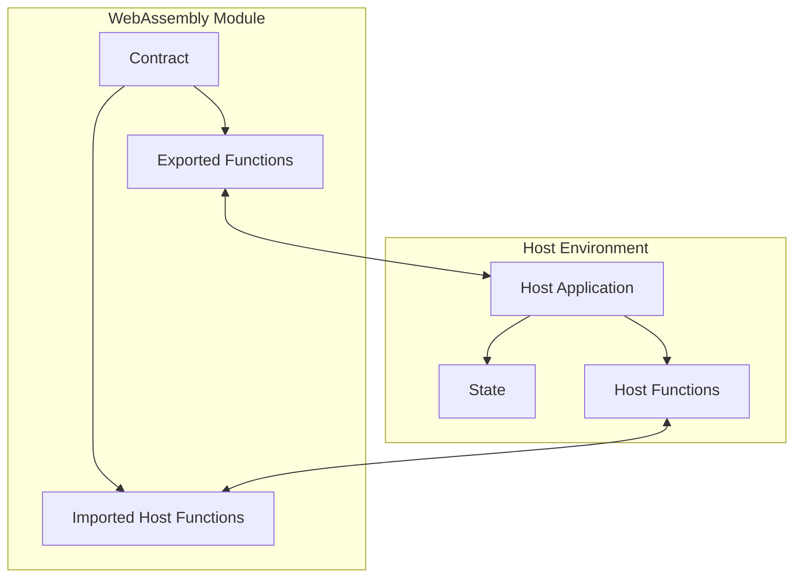
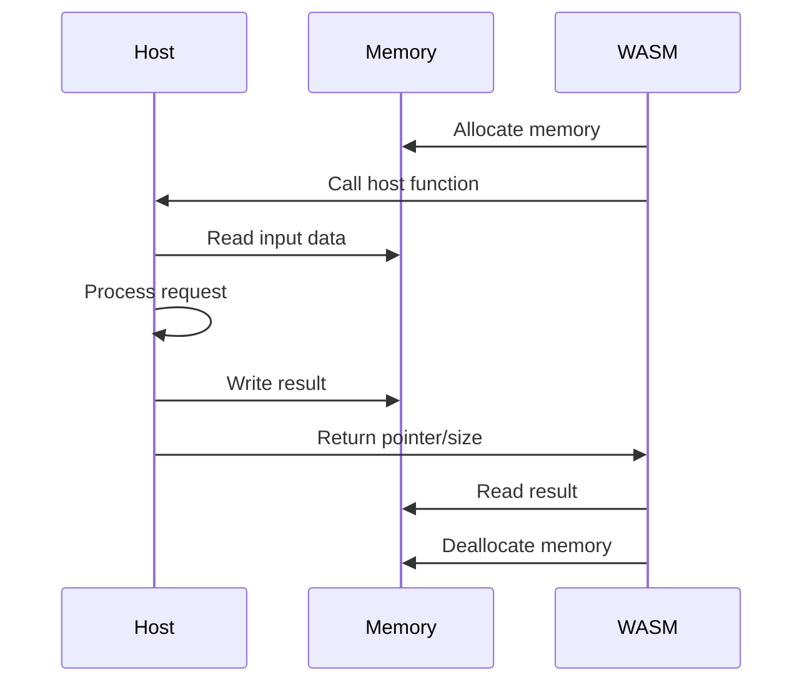

# WebAssembly Smart Contract Example

This project demonstrates how to implement a WebAssembly-based smart contract system using Go and TinyGo. It shows the interaction between a host environment and a WebAssembly module that implements a contract interface.

## Project Structure

```
.
├── wasm/
│   └── contract.go    # WebAssembly contract implementation
├── host/
│   └── main.go        # Host environment implementation
├── go.mod             # Go module file
└── README.md          # This file
```

## Architecture



## Features

- Implementation of core contract interface
- Memory management between host and WebAssembly
- State management in host environment
- Blockchain-like features (addresses, balances, etc.)
- Object storage system

## Prerequisites

- Go 1.19 or later
- TinyGo (for compiling WebAssembly module)
- Wasmer Go SDK

## Building

1. Build the WebAssembly module:
```bash
cd wasm
tinygo build -o contract.wasm -target wasi ./contract.go
```

2. Build the host application:
```bash
cd host
go build -o host
```

## Running

1. Start the host application:
```bash
cd host
./host
```

The host application will:
1. Load the WebAssembly module
2. Set up the execution environment
3. Register host functions
4. Run test calls to demonstrate the functionality

## Interface

The contract implements the following interface:

- `get_sender() -> Address`
- `get_block_height() -> uint64`
- `get_block_time() -> int64`
- `get_contract_address() -> Address`
- `get_balance(addr: Address) -> uint64`
- `transfer(to: Address, amount: uint64) -> bool`
- `get_object(id: ObjectID) -> Object`
- `create_object() -> Object`
- `delete_object(id: ObjectID) -> bool`

## Memory Management



## License

MIT
