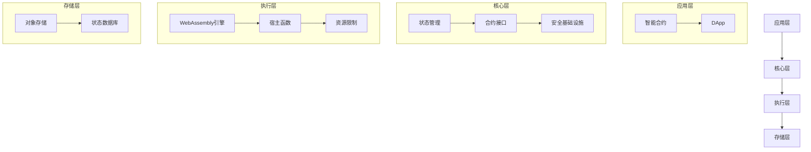

# GoVM - 基于WebAssembly的智能合约虚拟机

本项目是一个轻量级的、基于WebAssembly的智能合约虚拟机实现，允许用Go语言编写智能合约，并编译为WebAssembly运行。

## 项目结构

```
/
├── cmd/                      # 命令行工具
├── core/                     # 核心接口定义
├── examples/                 # 示例代码
│   ├── simple_contract/     # 简单的计数器合约示例
│   ├── simple_demo/         # 演示如何使用MiniVM
│   ├── counter/             # 计数器合约示例
│   ├── token/               # 代币合约示例
│   └── nft/                 # NFT合约示例
├── vm/                       # 虚拟机实现
│   ├── mini_vm.go           # 简化版虚拟机实现
│   └── types.go             # 类型定义
└── README.md                # 本文件
```

## 特点

- 使用Go语言编写的WebAssembly虚拟机
- 支持Go语言编写的智能合约
- 基于WebAssembly的安全沙箱执行环境
- 简单易用的合约API
- 轻量级设计

## 依赖

- Go 1.23+
- TinyGo 0.37.0+（用于编译合约）
- wazero（WebAssembly运行时）

## 安装

```bash
go get github.com/govm-net/vm
```

## 快速开始

### 编写一个简单的计数器合约

```go
// 简单计数器合约示例
package main

import (
	"fmt"
)

// 全局计数器
var counter uint64

// 入口函数：初始化合约
//export Initialize
func Initialize() {
	counter = 0
	fmt.Println("Counter initialized to 0")
}

// 增加计数器值
//export Increment
func Increment(value uint64) uint64 {
	counter += value
	fmt.Printf("Counter incremented by %d to %d\n", value, counter)
	return counter
}

// 获取当前计数器值
//export GetCounter
func GetCounter() uint64 {
	return counter
}

// 重置计数器
//export Reset
func Reset() {
	counter = 0
	fmt.Println("Counter reset to 0")
}

// WebAssembly要求main函数
func main() {
	// 此函数在WebAssembly中不会被执行
}
```

### 编译合约为WebAssembly

```bash
tinygo build -o contract.wasm -target wasi contract.go
```

### 使用MiniVM执行合约

```go
package main

import (
	"fmt"
	"io/ioutil"
	"os"
	"path/filepath"

	"github.com/govm-net/vm/vm" // 引入vm包
)

func main() {
	// 创建临时目录用于存储合约
	tempDir, err := ioutil.TempDir("", "govm-demo")
	if err != nil {
		fmt.Printf("创建临时目录失败: %v\n", err)
		os.Exit(1)
	}
	defer os.RemoveAll(tempDir) // 程序结束时清理

	// 初始化虚拟机
	miniVM, err := vm.NewMiniVM(tempDir)
	if err != nil {
		fmt.Printf("初始化虚拟机失败: %v\n", err)
		os.Exit(1)
	}

	// 设置区块信息
	miniVM.SetBlockInfo(100, 1624553600) // 区块高度100，时间戳

	// 读取合约WASM文件
	wasmPath := "contract.wasm"
	wasmCode, err := ioutil.ReadFile(wasmPath)
	if err != nil {
		fmt.Printf("读取WASM文件失败: %v\n", err)
		os.Exit(1)
	}

	// 部署合约
	contractAddr, err := miniVM.DeployContract(wasmCode)
	if err != nil {
		fmt.Printf("部署合约失败: %v\n", err)
		os.Exit(1)
	}
	fmt.Printf("合约已部署，地址: %s\n", contractAddr)

	// 初始化合约
	_, err = miniVM.ExecuteContract(contractAddr, "user1", "Initialize")
	if err != nil {
		fmt.Printf("初始化合约失败: %v\n", err)
		os.Exit(1)
	}

	// 增加计数器
	result, err := miniVM.ExecuteContract(contractAddr, "user1", "Increment", uint64(5))
	if err != nil {
		fmt.Printf("调用Increment失败: %v\n", err)
		os.Exit(1)
	}
	fmt.Printf("当前计数器值: %v\n", result)
}
```

## 虚拟机架构

GoVM虚拟机的架构如下图所示：



## 系统组件

### MiniVM

`MiniVM` 是一个简化的虚拟机实现，用于演示和学习目的。它支持：

- 部署WebAssembly合约
- 执行合约函数
- 管理账户余额
- 提供区块信息

### 状态管理

VM提供了简单的状态管理功能：

- 账户余额跟踪
- 合约存储
- 区块信息访问

### WebAssembly执行环境

基于wazero实现的WebAssembly执行环境，支持：

- 加载并实例化WebAssembly模块
- 提供宿主函数给合约调用
- 资源限制（内存、执行时间）

## 合约开发指南

### 导出函数

使用`//export FunctionName`标记要导出的函数：

```go
//export Initialize
func Initialize() {
    // 初始化逻辑
}
```

### 数据类型支持

WebAssembly支持的基本类型：

- 整数：`int32`, `int64`, `uint32`, `uint64`
- 浮点数：`float32`, `float64`
- 内存访问：通过指针和长度

### 宿主环境交互

合约可以通过导入函数与宿主环境交互：

- 获取区块信息：高度、时间戳
- 账户操作：查询余额、转账
- 存储操作：读写数据
- 日志和事件：记录合约执行事件

## 贡献指南

欢迎贡献代码、报告问题或提出改进建议！请提交Pull Request或创建Issue。

## 许可证

本项目基于MIT许可证开源。

## Function ID Constants

To ensure consistency between the host environment and WebAssembly contract code, all function ID constants are defined in a single location in the `types` package. This helps prevent inconsistencies that could arise from separately defining these constants in different parts of the codebase.

### Usage from Host Code

```go
import (
    "github.com/govm-net/vm/types"
)

// Convert to int32 for compatibility with existing code
const (
    FuncGetSender = int32(types.FuncGetSender)
    // ... other constants
)
```

### Usage from Contract Code

```go
import (
    "github.com/govm-net/vm/types"
)

// Convert to int32 for use in contract code
const (
    FuncGetSender = int32(types.FuncGetSender)
    // ... other constants
)
```

This approach ensures that if a function ID needs to be added or modified, the change only needs to be made in one place, and all components of the system will automatically use the updated value.
