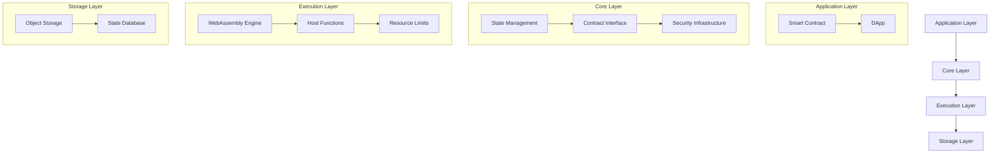

# VM - WebAssembly-based Smart Contract Virtual Machine

This project is a lightweight, WebAssembly-based smart contract virtual machine implementation that allows writing smart contracts in Go and compiling them to WebAssembly for execution.

## Project Structure

```
/
├── abi/                      # ABI (Application Binary Interface) related code
├── api/                      # Public API definitions
├── compiler/                 # Contract compiler implementation
│   ├── maker.go             # Contract maker implementation
│   ├── testdata/            # Test data and examples
│   └── wasm/                # WebAssembly related code
├── context/                  # Execution context implementations
│   ├── db/                  # Database-backed context
│   └── memory/              # In-memory context
├── core/                     # Core types and interfaces
├── mock/                     # Mock implementations for testing
├── repository/               # Code repository management
├── types/                    # Type definitions
├── vm/                       # Virtual machine implementation
│   ├── engine.go            # Main engine implementation
│   └── types.go             # Type definitions
└── wasi/                     # WASI (WebAssembly System Interface) implementation
```

## Features

- WebAssembly virtual machine written in Go
- Support for smart contracts written in Go
- Secure sandbox execution environment based on WebAssembly
- Simple and easy-to-use contract API
- Multiple execution contexts (in-memory and database-backed)
- Gas consumption tracking and management
- Contract code repository with versioning
- ABI support for contract interfaces

## Dependencies

- Go 1.23+
- TinyGo 0.37.0+ (for contract compilation)
- wazero (WebAssembly runtime)

## Installation

```bash
go get github.com/govm-net/vm
```

## Quick Start

### Writing a Simple Counter Contract

```go
// Simple counter contract example
package counter

import (
	"github.com/govm-net/vm/core"
)

// State key for the counter contract
const (
	CounterKey = "counter_value"
)

// Initialize the contract
func Initialize() int32 {
	// Get the contract's default Object
	defaultObj, err := core.GetObject(core.ObjectID{})
	core.Assert(err)

	// Initialize counter value to 0
	err = defaultObj.Set(CounterKey, uint64(0))
	core.Assert(err)

	core.Log("initialize", "contract_address", core.ContractAddress())
	return 0
}

// Increment counter value
func Increment(value uint64) uint64 {
	// Get default Object
	defaultObj, err := core.GetObject(core.ObjectID{})
	core.Assert(err)

	// Get current counter value
	var currentValue uint64
	err = defaultObj.Get(CounterKey, &currentValue)
	core.Assert(err)

	// Increment counter value
	newValue := currentValue + value

	// Update counter value
	err = defaultObj.Set(CounterKey, newValue)
	core.Assert(err)

	// Log event
	core.Log("increment",
		"from", currentValue,
		"add", value,
		"to", newValue,
		"sender", core.Sender())

	return newValue
}

// Get current counter value
func GetCounter() uint64 {
	// Get default Object
	defaultObj, err := core.GetObject(core.ObjectID{})
	core.Assert(err)

	// Get current counter value
	var currentValue uint64
	err = defaultObj.Get(CounterKey, &currentValue)
	core.Assert(err)

	return currentValue
}

// Reset counter
func Reset() {
	// Get default Object
	defaultObj, err := core.GetObject(core.ObjectID{})
	core.Assert(err)

	// Reset counter value to 0
	err = defaultObj.Set(CounterKey, uint64(0))
	core.Assert(err)

	// Log event
	core.Log("reset", "sender", core.Sender())
}
```

### Using the VM Engine

```go
package main

import (
	"fmt"
	"os"
	"path/filepath"

	"github.com/govm-net/vm/core"
	"github.com/govm-net/vm/vm"
)

func main() {
	// Create configuration
	config := &vm.Config{
		MaxContractSize:  1024 * 1024, // 1MB
		WASIContractsDir: "./contracts",
		CodeManagerDir:   "./code",
		ContextType:      "memory",
		ContextParams:    make(map[string]any),
	}

	// Create VM engine
	engine, err := vm.NewEngine(config)
	if err != nil {
		fmt.Printf("Failed to create engine: %v\n", err)
		os.Exit(1)
	}
	defer engine.Close()

	// Read contract source code
	contractPath := "counter.go"
	contractCode, err := os.ReadFile(contractPath)
	if err != nil {
		fmt.Printf("Failed to read contract file: %v\n", err)
		os.Exit(1)
	}

	// Deploy contract
	contractAddr, err := engine.DeployContract(contractCode)
	if err != nil {
		fmt.Printf("Failed to deploy contract: %v\n", err)
		os.Exit(1)
	}
	fmt.Printf("Contract deployed, address: %s\n", contractAddr)

	// Initialize contract
	_, err = engine.ExecuteContract(contractAddr, "Initialize")
	if err != nil {
		fmt.Printf("Failed to initialize contract: %v\n", err)
		os.Exit(1)
	}

	// Increment counter
	result, err := engine.ExecuteContract(contractAddr, "Increment", uint64(5))
	if err != nil {
		fmt.Printf("Failed to call Increment: %v\n", err)
		os.Exit(1)
	}
	fmt.Printf("Current counter value: %v\n", result)
}
```

## Virtual Machine Architecture

The VM architecture consists of several key components:



## System Components

### Engine

The main VM engine (`vm.Engine`) provides:

- Contract deployment and management
- Contract execution
- State management
- Gas tracking
- Multiple execution contexts

### Context

Two types of execution contexts are supported:

1. Memory Context (`context/memory`):
   - In-memory state storage
   - Fast execution
   - Suitable for testing and development

2. Database Context (`context/db`):
   - Persistent state storage
   - Transaction support
   - Suitable for production use

### Contract Compiler

The contract compiler (`compiler/maker`) handles:

- Contract validation
- Code compilation to WebAssembly
- ABI extraction
- Gas injection

### Repository

The code repository (`repository`) manages:

- Contract code storage
- Version control
- Code retrieval
- Metadata management

## Contract Development Guide

### Package Structure

Each contract should be defined in its own Go package. The package name will be used as the contract name. All public functions in the package will be automatically exported as contract functions.

```go
// counter.go
package counter

// Initialize will be exported as a contract function
func Initialize() int32 {
    // ...
}

// Increment will be exported as a contract function
func Increment(value uint64) uint64 {
    // ...
}
```

### Function Export

Contract functions are automatically exported based on their visibility:
- Public functions (capitalized) are exported as contract functions
- Private functions (lowercase) are not exported

```go
// This function will be exported as a contract function
func PublicFunction() {
    // ...
}

// This function will not be exported
func privateFunction() {
    // ...
}
```

## Contribution Guide

Contributions of code, bug reports, or improvement suggestions are welcome! Please submit a Pull Request or create an Issue.

## License

This project is open source under the MIT license.
