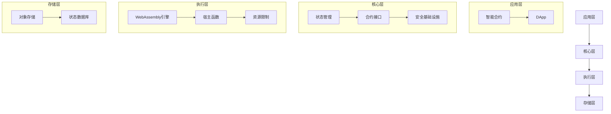

# VM - 基于WebAssembly的智能合约虚拟机

本项目是一个轻量级的、基于WebAssembly的智能合约虚拟机实现，允许使用Go语言编写智能合约并编译为WebAssembly执行。

## 项目结构

```
/
├── abi/                      # ABI（应用二进制接口）相关代码
├── api/                      # 公共API定义
├── compiler/                 # 合约编译器实现
│   ├── maker.go             # 合约生成器实现
│   ├── testdata/            # 测试数据和示例
│   └── wasm/                # WebAssembly相关代码
├── context/                  # 执行上下文实现
│   ├── db/                  # 数据库支持的上下文
│   └── memory/              # 内存上下文
├── core/                     # 核心类型和接口
├── mock/                     # 测试用的模拟实现
├── repository/               # 代码仓库管理
├── types/                    # 类型定义
├── vm/                       # 虚拟机实现
│   ├── engine.go            # 主引擎实现
│   └── types.go             # 类型定义
└── wasi/                     # WASI（WebAssembly系统接口）实现
```

## 特性

- 使用Go语言实现的WebAssembly虚拟机
- 支持使用Go语言编写智能合约
- 基于WebAssembly的安全沙箱执行环境
- 简单易用的合约API
- 多种执行上下文（内存和数据库支持）
- Gas消耗跟踪和管理
- 合约代码仓库和版本控制
- 合约接口的ABI支持

## 依赖

- Go 1.23+
- TinyGo 0.37.0+（用于合约编译）
- wazero（WebAssembly运行时）

## 安装

```bash
go get github.com/govm-net/vm
```

## 快速开始

### 编写简单的计数器合约

```go
// 简单的计数器合约示例
package counter

import (
	"github.com/govm-net/vm/core"
)

// 计数器合约的状态键
const (
	CounterKey = "counter_value"
)

// 初始化合约
func Initialize() int32 {
	// 获取合约的默认Object
	defaultObj, err := core.GetObject(core.ObjectID{})
	core.Assert(err)

	// 初始化计数器值为0
	err = defaultObj.Set(CounterKey, uint64(0))
	core.Assert(err)

	core.Log("initialize", "contract_address", core.ContractAddress())
	return 0
}

// 增加计数器值
func Increment(value uint64) uint64 {
	// 获取默认Object
	defaultObj, err := core.GetObject(core.ObjectID{})
	core.Assert(err)

	// 获取当前计数器值
	var currentValue uint64
	err = defaultObj.Get(CounterKey, &currentValue)
	core.Assert(err)

	// 增加计数器值
	newValue := currentValue + value

	// 更新计数器值
	err = defaultObj.Set(CounterKey, newValue)
	core.Assert(err)

	// 记录事件
	core.Log("increment",
		"from", currentValue,
		"add", value,
		"to", newValue,
		"sender", core.Sender())

	return newValue
}

// 获取当前计数器值
func GetCounter() uint64 {
	// 获取默认Object
	defaultObj, err := core.GetObject(core.ObjectID{})
	core.Assert(err)

	// 获取当前计数器值
	var currentValue uint64
	err = defaultObj.Get(CounterKey, &currentValue)
	core.Assert(err)

	return currentValue
}

// 重置计数器
func Reset() {
	// 获取默认Object
	defaultObj, err := core.GetObject(core.ObjectID{})
	core.Assert(err)

	// 重置计数器值为0
	err = defaultObj.Set(CounterKey, uint64(0))
	core.Assert(err)

	// 记录事件
	core.Log("reset", "sender", core.Sender())
}
```

### 使用虚拟机引擎

```go
package main

import (
	"fmt"
	"os"
	"path/filepath"

	"github.com/govm-net/vm/core"
	"github.com/govm-net/vm/vm"
)

func main() {
	// 创建配置
	config := &vm.Config{
		MaxContractSize:  1024 * 1024, // 1MB
		WASIContractsDir: "./contracts",
		CodeManagerDir:   "./code",
		ContextType:      "memory",
		ContextParams:    make(map[string]any),
	}

	// 创建虚拟机引擎
	engine, err := vm.NewEngine(config)
	if err != nil {
		fmt.Printf("创建引擎失败: %v\n", err)
		os.Exit(1)
	}
	defer engine.Close()

	// 读取合约源代码
	contractPath := "counter.go"
	contractCode, err := os.ReadFile(contractPath)
	if err != nil {
		fmt.Printf("读取合约文件失败: %v\n", err)
		os.Exit(1)
	}

	// 部署合约
	contractAddr, err := engine.DeployContract(contractCode)
	if err != nil {
		fmt.Printf("部署合约失败: %v\n", err)
		os.Exit(1)
	}
	fmt.Printf("合约已部署，地址: %s\n", contractAddr)

	// 初始化合约
	_, err = engine.ExecuteContract(contractAddr, "Initialize")
	if err != nil {
		fmt.Printf("初始化合约失败: %v\n", err)
		os.Exit(1)
	}

	// 增加计数器
	result, err := engine.ExecuteContract(contractAddr, "Increment", uint64(5))
	if err != nil {
		fmt.Printf("调用Increment失败: %v\n", err)
		os.Exit(1)
	}
	fmt.Printf("当前计数器值: %v\n", result)
}
```

## 虚拟机架构

虚拟机架构由以下几个关键组件组成：



## 系统组件

### 引擎

主虚拟机引擎（`vm.Engine`）提供：

- 合约部署和管理
- 合约执行
- 状态管理
- Gas跟踪
- 多种执行上下文

### 上下文

支持两种类型的执行上下文：

1. 内存上下文（`context/memory`）：
   - 内存状态存储
   - 快速执行
   - 适用于测试和开发

2. 数据库上下文（`context/db`）：
   - 持久化状态存储
   - 事务支持
   - 适用于生产环境

### 合约编译器

合约编译器（`compiler/maker`）处理：

- 合约验证
- 代码编译为WebAssembly
- ABI提取
- Gas注入

### 仓库

代码仓库（`repository`）管理：

- 合约代码存储
- 版本控制
- 代码检索
- 元数据管理

## 合约开发指南

### 包结构

每个合约应该定义在自己的Go包中。包名将用作合约名。包中的所有公共函数将自动导出为合约函数。

```go
// counter.go
package counter

// Initialize将被导出为合约函数
func Initialize() int32 {
    // ...
}

// Increment将被导出为合约函数
func Increment(value uint64) uint64 {
    // ...
}
```

### 函数导出

合约函数基于可见性自动导出：
- 公共函数（首字母大写）被导出为合约函数
- 私有函数（首字母小写）不被导出

```go
// 这个函数将被导出为合约函数
func PublicFunction() {
    // ...
}

// 这个函数不会被导出
func privateFunction() {
    // ...
}
```

## 贡献指南

欢迎贡献代码、报告bug或提出改进建议！请提交Pull Request或创建Issue。

## 许可证

本项目采用MIT开源许可证。 