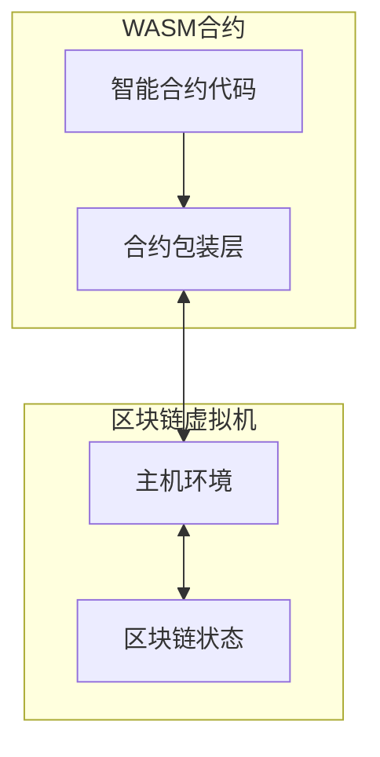

# WebAssembly 智能合约包装层

本目录包含用于开发基于WebAssembly的智能合约的包装层代码。该包装层提供了合约代码与主机环境（区块链虚拟机）之间的通信桥梁，使开发者能够方便地编写、测试和部署智能合约。

## 目录结构

```
wasm/
├── contract.go           # 核心包装层，提供与主机环境的通信接口
├── counter_contract.go   # 计数器合约示例
└── README.md             # 使用说明文档
```

## 包装层架构

包装层实现了区块链智能合约的标准接口，并提供了与主机环境通信的机制：



## 核心组件

包装层的核心组件包括：

1. **基本类型定义**：
   - `Address`: 区块链地址类型
   - `ObjectID`: 对象唯一标识符
   - `ZeroAddress`: 空地址常量

2. **Context 接口实现**：
   - `Sender()`: 获取调用合约的账户地址
   - `BlockHeight()`: 获取当前区块高度
   - `BlockTime()`: 获取当前区块时间戳
   - `ContractAddress()`: 获取当前合约地址
   - `Balance(addr)`: 查询账户余额
   - `Transfer(to, amount)`: 转账操作
   - `Call(contract, function, args...)`: 跨合约调用
   - `Log(event, keyValues...)`: 记录事件日志

3. **Object 接口实现**：
   - `ID()`: 获取对象ID
   - `Owner()`: 获取对象所有者
   - `SetOwner(owner)`: 设置对象所有者
   - `Get(field, value)`: 获取对象字段值
   - `Set(field, value)`: 设置对象字段值
   - `Contract()`: 获取对象所属合约地址

4. **内存管理**：
   - `allocate(size)`: 分配内存
   - `deallocate(ptr, size)`: 释放内存
   - `readMemory(ptr, size)`: 读取内存数据
   - `writeToMemory(data)`: 写入内存数据

5. **主机函数调用**：
   - `callHost(funcID, data)`: 与主机环境通信的核心函数
   - `call_host_set/get_buffer`: WebAssembly导入函数

## 智能合约开发指南

### 1. 创建新合约

合约代码必须使用 `package main`，并包含一个空的 `main()` 函数：

```go
package main

import (
    "github.com/govm-net/vm/core"
)

// WebAssembly要求的main函数
func main() {
    // 此函数在WebAssembly中不会被执行
}
```

### 2. 定义导出函数

所有大写字母开头的函数将被自动导出，可以在区块链上调用：

```go
// 初始化函数 - 需要用户主动调用以初始化合约状态
// 建议在部署合约后立即调用此函数
func Initialize(ctx core.Context) error {
    // 初始化合约状态
    return nil
}

// 公开的业务函数
func Transfer(ctx core.Context, to core.Address, amount uint64) error {
    // 实现转账逻辑
    return ctx.Transfer(to, amount)
}
```

### 3. 使用Context接口

所有合约函数都通过 `Context` 接口访问区块链环境：

```go
func MyFunction(ctx core.Context) {
    // 获取区块链信息
    height := ctx.BlockHeight()
    sender := ctx.Sender()
    
    // 记录日志
    ctx.Log("my_event", "height", height, "sender", sender)
}
```

### 4. 管理状态对象

使用 `Object` 接口管理状态数据：

```go
func StoreData(ctx core.Context, key string, value uint64) error {
    // 创建对象，默认 owner 为合约地址
    obj := ctx.CreateObject()
    
    // 存储数据
    return obj.Set(key, value)
}
```

### 5. 跨合约调用

使用 `Call` 方法调用其他合约的函数：

```go
func CallOtherContract(ctx core.Context, contractAddr core.Address) error {
    // 调用其他合约的函数
    result, err := ctx.Call(contractAddr, "SomeFunction", arg1, arg2)
    if err != nil {
        return err
    }
    
    // 处理结果
    return nil
}
```

## 编译与部署

### 编译合约

使用TinyGo编译合约为WebAssembly模块：

```bash
tinygo build -o contract.wasm -target=wasi -opt=z -no-debug ./
```

编译选项说明：
- `-target=wasi`: 指定编译目标为WebAssembly系统接口
- `-opt=z`: 优化输出大小
- `-no-debug`: 移除调试信息

### 部署合约

通过区块链的接口部署编译好的WebAssembly合约。

## 示例合约

### 计数器合约

`counter_contract.go` 实现了一个简单的计数器合约，包括：
- 初始化计数器
- 增加计数器值
- 获取当前计数器值
- 重置计数器

### 其他示例

请参考examples/contracts里面的例子

## 最佳实践

1. **内存管理**：
   - 避免过多的内存分配，尽量重用缓冲区

2. **错误处理**：
   - 总是检查返回的错误
   - 提供有意义的错误信息
   - 使用 `Log` 记录重要操作

3. **安全检查**：
   - 验证调用权限
   - 检查参数有效性
   - 验证对象所有权

4. **性能优化**：
   - 使用缓存减少主机调用
   - 批量处理数据
   - 避免频繁的内存分配

5. **类型安全**：
   - 使用明确的类型转换
   - 验证参数类型
   - 处理边界情况

## 参考资料

- [WebAssembly官方文档](https://webassembly.org/)
- [TinyGo文档](https://tinygo.org/)
- [智能合约设计模式](https://ethereum.org/en/developers/docs/smart-contracts/anatomy/) 
