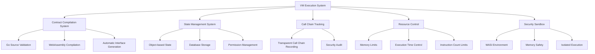
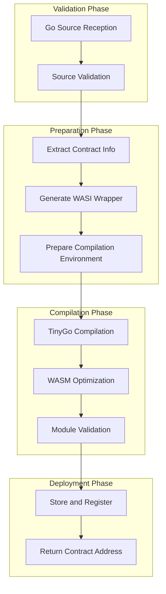
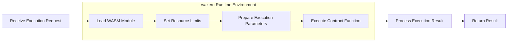
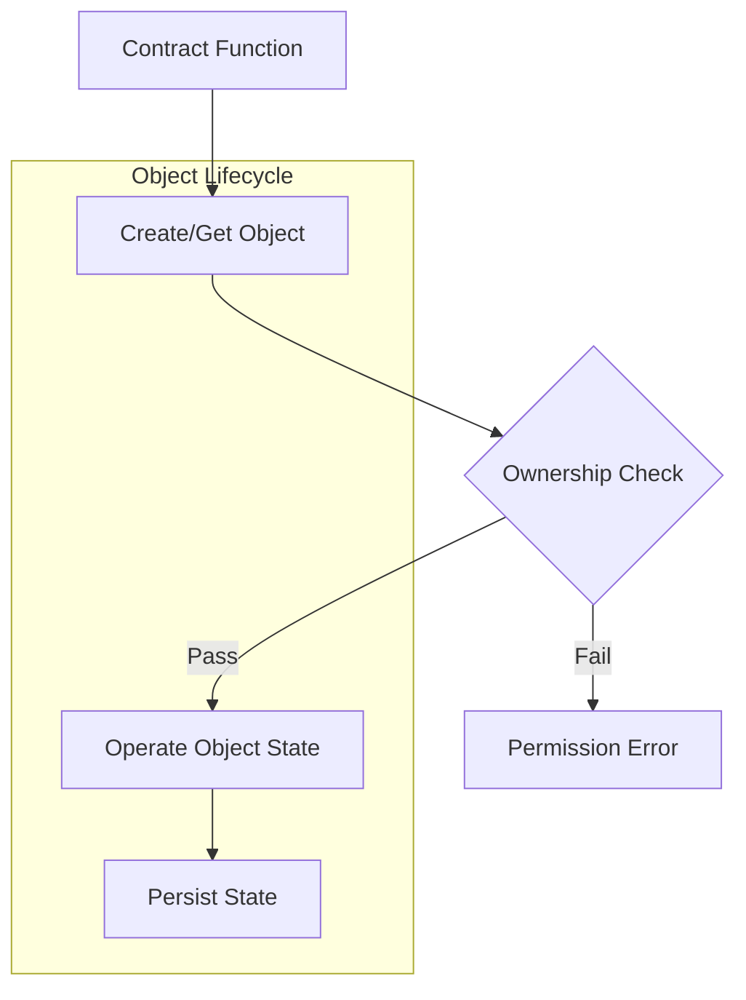

# VM Architecture Documentation: WebAssembly-based Blockchain Smart Contract Execution System

## 1. System Overview

The VM system is a novel execution environment designed for blockchain smart contracts, implemented in Go, which compiles smart contracts into WebAssembly modules and executes them through the wazero runtime. Unlike traditional blockchain virtual machines, this system allows developers to write smart contracts in Go while enjoying the security, cross-platform compatibility, and performance benefits of WebAssembly.

### 1.1 Core Design Principles

- **Go Smart Contracts + WebAssembly Execution**: Combining Go's security with WebAssembly's efficient execution
- **State and Logic Separation**: Stateless contract design, separating logic from data to improve system resilience
- **Object-based State Model**: All states are represented as objects, each with a unique identifier and owner
- **Transparent Security Infrastructure**: Security mechanisms like call chain tracking and permission control are transparent to developers
- **Fine-grained Resource Control**: Strict limits on memory, execution time, and computational resources

### 1.2 Key Features



## 2. System Architecture

The VM system architecture uses a layered design, with each layer having clear responsibilities and interfaces:

### 2.1 Overall Architecture Layers

```
┌───────────────────────────────────────────────────────────┐
│                   Application Layer                        │
│                                                           │
│  ┌─────────────┐  ┌─────────────┐  ┌─────────────────┐    │
│  │  Smart Contract │  │ CLI Tools   │  │ Blockchain Integration│    │
│  │  Examples      │  │             │  │ Interface      │    │
│  └─────────────┘  └─────────────┘  └─────────────────┘    │
└───────────────────────────────────────────────────────────┘
                            ▲
                            │
                            ▼
┌───────────────────────────────────────────────────────────┐
│                   Core Layer                               │
│                                                           │
│  ┌─────────────┐  ┌─────────────┐  ┌─────────────────┐    │
│  │  API Interface │  │ VM Engine   │  │ State Management │    │
│  └─────────────┘  └─────────────┘  └─────────────────┘    │
└───────────────────────────────────────────────────────────┘
                            ▲
                            │
                            ▼
┌───────────────────────────────────────────────────────────┐
│                Execution Layer                            │
│                                                           │
│  ┌─────────────┐  ┌─────────────┐  ┌─────────────────┐    │
│  │  WASM Compiler │  │ wazero Runtime│  │ WASI System Interface│    │
│  └─────────────┘  └─────────────┘  └─────────────────┘    │
└───────────────────────────────────────────────────────────┘
                            ▲
                            │
                            ▼
┌───────────────────────────────────────────────────────────┐
│                Storage Layer                              │
│                                                           │
│  ┌─────────────┐  ┌─────────────┐  ┌─────────────────┐    │
│  │  Database    │  │ File System  │  │ Resource Monitoring│    │
│  └─────────────┘  └─────────────┘  └─────────────────┘    │
└───────────────────────────────────────────────────────────┘
```

### 2.2 Detailed Code Structure

The new directory structure clearly reflects the system's components and their relationships, while hiding unnecessary complexity from contract developers:

```
/
├── abi/                        # ABI Processing System
│   ├── abi.go                  # ABI Definition and Parsing
│   ├── abi_handler.go          # ABI Handling Logic
│   ├── abi_test.go             # ABI Testing
│   └── testdata/               # Test Data
│
├── api/                        # API Interface Definition (for Platform Integrators)
│   └── vm.go                   # VM System API Interface
│
├── cmd/                        # Command Line Tools
│   └── vm-cli/                 # VM Management CLI
│       ├── deploy.go           # Contract Deployment Command
│       ├── execute.go          # Contract Execution Command
│       └── main.go             # Main Program Entry
│
├── compiler/                   # Contract Compilation System
│   ├── maker.go                # Contract Compilation Core Logic
│   ├── maker_test.go           # Compilation Testing
│   ├── testdata/               # Test Data
│   └── wasm/                   # WebAssembly Tools
│
├── context/                    # Context Management System
│   ├── db/                     # Database Context Implementation
│   ├── memory/                 # Memory Context Implementation
│   └── registry.go             # Context Registration Mechanism
│
├── core/                       # Core Interface Definition (for Contract Developers)
│   └── interface.go            # Core Interface Definition (Context, Object)
│
├── examples/                   # Example Contracts
│   └── contracts/              # Contract Examples
│       ├── counter/            # Counter Example
│       ├── counter_factory/    # Factory Pattern Example
│       ├── nft1/               # NFT Contract Example
│       ├── token1/             # Token Contract Example
│       └── token2/             # Advanced Token Contract Example
│
├── mock/                       # Testing and Mocking Tools
│   ├── cover.go                # Code Coverage Tools
│   ├── edit.go                 # Code Editing Tools
│   ├── gas.go                  # Gas Consumption Simulation
│   └── mock.go                 # General Mocking Tools
│
├── repository/                 # Contract Repository Management
│   ├── manager.go              # Repository Manager
│   └── manager_test.go         # Repository Management Testing
│
├── types/                      # Basic Type Definitions
│   └── contract_functions.go   # Contract Function Type Definitions
│
├── vm/                         # Virtual Machine Implementation
│   ├── engine.go               # VM Engine Main Implementation
│   ├── engine_test.go          # Engine Testing
│   └── testdata/               # Test Data
│
└── wasi/                       # WebAssembly System Interface
    ├── wazero_engine.go        # wazero Execution Engine
    └── wazero_engine_test.go   # Engine Testing
```

## 3. Core Components

### 3.1 Contract Interface System

The VM system provides a streamlined interface system, exposing core functionality needed by contract developers through package functions, preventing Context forgery:

#### 3.1.1 Core Interface Design Principles

For contract developers, the VM system follows the "minimum interface surface area" principle, exposing only necessary functions in the `core` package:

1. **Package Functions**: All blockchain environment interactions are provided through package functions, not interfaces
2. **Object Interface**: Provides contract developers with the ability to manipulate state objects

This design significantly simplifies the learning curve for contract developers, allowing them to focus on business logic rather than system details. Developers only need to import the single `github.com/govm-net/vm/core` package to access all functionality needed for contract development. All system complexity is encapsulated behind these concise functions, making contract development straightforward and intuitive.

```go
import "github.com/govm-net/vm/core"

// Using package functions in contracts
func MyContractFunction(param string) (core.ObjectID, error) {
    // Implement contract logic using package functions
}
```

#### 3.1.2 Package Function System

Package functions are the primary way contracts interact with the blockchain environment:

```go
// Blockchain information
func BlockHeight() uint64          // Get current block height
func BlockTime() int64             // Get current block timestamp
func ContractAddress() Address     // Get current contract address

// Account operations
func Sender() Address              // Get transaction sender or contract caller
func Balance(addr Address) uint64  // Get account balance

// Object storage - basic state operations use panic instead of returning error
func CreateObject() Object                      // Create new object, panic on failure
func GetObject(id ObjectID) (Object, error)     // Get specified object, may return error
func GetObjectWithOwner(owner Address) (Object, error) // Get object by owner, may return error
func DeleteObject(id ObjectID)                  // Delete object, panic on failure

// Cross-contract calls
func Call(contract Address, function string, args ...any) ([]byte, error)

// Logging and events
func Log(eventName string, keyValues ...interface{}) // Log event

// Helper functions
func Assert(condition any)                        // Assertion function, panic if false
func Error(msg string) error                      // Create error
func GetHash(data []byte) Hash                    // Calculate data hash
func AddressFromString(str string) Address        // Create address from string
func ObjectIDFromString(str string) ObjectID      // Create object ID from string
func HashFromString(str string) Hash              // Create hash from string
```

#### 3.1.3 Object Interface

The Object interface is used to manage blockchain state objects:

```go
// Object interface definition
type Object interface {
    ID() ObjectID           // Get object ID
    Owner() Address         // Get object owner
    SetOwner(addr Address)  // Set object owner, panic on failure
    
    // Field operations
    Get(field string, value any) error  // Get field value
    Set(field string, value any) error  // Set field value
}
```

#### 3.1.4 Context Management

The system internally sets the current execution context through the `SetContext` function, transparent to contract developers:

```go
// Internal use, invisible to contract developers
var ctx types.Context

func SetContext(c types.Context) {
    if ctx != nil {
        panic("context already set")
    }
    ctx = c
}
```

This design ensures contracts cannot forge or modify the execution context, improving system security.

### 3.2 WebAssembly Execution Environment

The VM system uses wazero as the WebAssembly runtime, ensuring security, efficiency, and cross-platform compatibility. All these details are transparent to contract developers, who only need to focus on core package functions without understanding WebAssembly's internal workings:

#### 3.2.1 Contract Compilation Process

The process of converting Go source code to WebAssembly modules:



#### 3.2.2 Execution Process

WebAssembly contract execution process:



#### 3.2.3 wazero Runtime

The VM system uses wazero as the WebAssembly runtime, providing the following advantages:

1. **Pure Go Implementation**: No external WebAssembly runtime dependencies, simplifying deployment
2. **High Performance**: Near-native execution speed
3. **Security**: Built-in memory safety guarantees
4. **Cross-platform**: Runs in any Go-supported environment

The wazero runtime is implemented through the `WazeroVM` struct, responsible for contract deployment and execution:

```go
// WazeroVM virtual machine using wazero implementation
type WazeroVM struct {
    // Contract storage directory
    contractDir string
    
    // wazero runtime
    ctx context.Context
    
    // env module
    envModule api.Module
}
```

#### 3.2.4 Contract Storage

Contract code is managed through `repository.Manager`, providing the following functionality:

1. **Code Registration**: Register contract code in the system
2. **Code Retrieval**: Get registered contract code
3. **Code Injection**: Inject gas consumption information into contract code
4. **Metadata Management**: Manage contract metadata information

```go
// Manager code manager
type Manager struct {
    rootDir string // Code root directory
}

// ContractCode contract code information
type ContractCode struct {
    Address      core.Address // Contract address
    OriginalCode []byte       // Original code
    InjectedCode []byte       // Code with injected gas information
    Dependencies []string     // Dependencies on other contract addresses
    UpdateTime   time.Time    // Last update time
    Hash         [32]byte     // Code hash
}
```

### 3.3 Call Chain Tracking Mechanism

Call chain tracking is a transparent underlying infrastructure that provides critical security guarantees for the smart contract system, without developer awareness:

```mermaid
flowchart TD
    A[User] --> B[Contract A]
    B --> C[Contract B]
    C --> D[Contract C]
    
    subgraph Call Chain Tracking (Underlying Mechanism)
        B1[Automatic Recording] --- B
        C1[Automatic Recording] --- C
        D1[Automatic Recording] --- D
    end
    
    style A fill:#f9f,stroke:#333
    style B fill:#bbf,stroke:#333
    style C fill:#bbf,stroke:#333
    style D fill:#bbf,stroke:#333
```

#### 3.3.1 Automatic Instrumentation

The system automatically injects call chain tracking code during compilation, completely transparent to developers:

```go
// Original contract code (developer view)
func Transfer(to Address, amount uint64) error {
    // Business logic...
}

// System-automatically instrumented code (system internal implementation, invisible to developers)
func Transfer(to Address, amount uint64) error {
    // Automatically inserted call chain recording code
    // Completely transparent to developers
    
    // Original business logic...
}
```

### 3.4 Resource Control System

The WebAssembly execution environment provides fine-grained resource control mechanisms:

```go
// WebAssembly resource limit options
type WASIOptions struct {
    MemoryLimit     uint64    // Memory limit (bytes)
    TableSize       uint64    // Function table size
    Timeout         uint64    // Execution timeout (milliseconds)
    FuelLimit       uint64    // Instruction count limit
    StackSize       uint64    // Stack size (bytes)
    EnableSIMD      bool      // Whether to enable SIMD instructions
    EnableThreads   bool      // Whether to enable threads
    EnableBulkMemory bool     // Whether to enable bulk memory operations
}
```

### 3.5 Interface Visibility Design

The VM system uses a carefully designed interface visibility strategy, providing appropriate abstraction levels for different user groups:

| User Group | Visible Interfaces | Hidden Content | Design Purpose |
|------------|-------------------|----------------|----------------|
| Contract Developers | core/interface.go | Internal implementation, type definitions, API details | Lower learning curve, focus on business logic |
| Platform Integrators | api/ directory interfaces | Internal implementation details | Provide flexible integration options |
| System Developers | All code | None | Allow system-level extensions and customization |

This layered interface visibility design ensures each user group only needs to focus on their required complexity level, significantly improving development efficiency and system usability. For contract developers, they only need to understand the two interfaces defined in core/interface.go to start writing fully functional smart contracts.

### 3.6 Resource Control and Gas Billing

The VM system implements a complete resource control mechanism, with Gas billing as a core component:

#### 3.6.1 Gas Billing Principles

The Gas billing system implements resource control from two dimensions:

1. **Code Line Billing**:
   - During contract compilation, automatically injects Gas consumption points through the `AddGasConsumption` function
   - Injects Gas consumption code at the start of each code block
   - Each line of code execution consumes 1 gas
   - Supports complex control flow structures like conditional statements and loops

2. **Interface Operation Billing**:
   - All package function calls have fixed gas consumption
   - Basic operations (like querying block information) consume less gas
   - Storage operations (like creating objects, modifying fields) consume more gas
   - Advanced operations like contract calls have additional gas reservation mechanisms

#### 3.6.2 Gas Consumption Implementation

Gas consumption is implemented through the `mock` package, providing the following functionality:

```go
// ConsumeGas consumes gas
func ConsumeGas(amount int64) {
    mu.Lock()
    defer mu.Unlock()

    if amount <= 0 {
        return
    }

    if gas < amount {
        panic(fmt.Sprintf("out of gas: gas=%d, need=%d", gas, amount))
    }

    gas -= amount
    used += amount
}

// RefundGas refunds gas
func RefundGas(amount int64) {
    mu.Lock()
    defer mu.Unlock()

    if amount <= 0 {
        return
    }

    if used < amount {
        panic(fmt.Sprintf("invalid refund: used=%d, refund=%d", used, amount))
    }

    gas += amount
    used -= amount
}
```

#### 3.6.3 Gas Consumption Values

| Operation | Gas Cost |
|-----------|----------|
| **Basic Operations** | |
| BlockHeight() | 10 gas |
| BlockTime() | 10 gas |
| ContractAddress() | 10 gas |
| Sender() | 10 gas |
| Balance(addr) | 50 gas |
| **Storage Operations** | |
| CreateObject() | 50 gas |
| GetObject(id) | 50 gas |
| GetObjectWithOwner(owner) | 50 gas |
| DeleteObject(id) | 500 gas - 800 gas(refund) |
| **Advanced Operations** | |
| Call(contract, function, args...) | 10000 gas + called contract consumption |
| Log(event, keyValues...) | 100 gas + data length |
| **Object Operations** | |
| ID() | 10 gas |
| Owner() | 100 gas |
| SetOwner(owner) | 500 gas |
| Get(field, value) | 100 gas + result data size |
| Set(field, value) | 1000 gas + data size * 100 gas |

#### 3.6.4 Gas Control Mechanisms

The VM system's Gas control has the following characteristics:

1. **Concurrency Safety**: Ensures Gas counting safety in concurrent environments through mutex locks
2. **Automatic Injection**: Automatically injects Gas consumption code during compilation, no manual addition needed
3. **Reservation Mechanism**: Reserves sufficient Gas for called contracts during contract calls
4. **Dynamic Billing**: Some operations (like storage) calculate Gas consumption dynamically based on data size
5. **Resource Limits**: Automatically terminates contract execution when Gas is exhausted, preventing resource abuse
6. **Gas Refund**: Some operations (like object deletion) refund part of the Gas

## 4. State Management System

### 4.1 Object-based State Model

The VM system uses an object-based state model, where all states are represented as objects:



### 4.2 Database Storage Model

Persistent state storage uses a key-value database model:

```
Object Metadata: 'o' + ObjectID -> Object Metadata(ID, Owner)
Field Value: 'f' + ObjectID + Field Name -> Field Value
Owner Index: 'w' + Owner Address + ObjectID -> Empty Value (for quick queries)
```

## 5. Security Mechanisms

The VM system implements multiple layers of security mechanisms:

### 5.1 Code Security

- **Source Validation**: Checks for prohibited imports, dangerous keywords, and contract size
- **Automatic Instrumentation**: Automatically injects security check code during compilation
- **Type Safety**: Leverages Go's type system and strict parameter checking

### 5.2 Execution Security

- **WebAssembly Sandbox**: Contracts execute in an isolated environment, unable to directly access the host system
- **Memory Isolation**: Memory safety guarantees provided by WebAssembly
- **Permission Control**: All sensitive operations have permission checks

### 5.3 Resource Control

- **Memory Limits**: Controls maximum memory available to contracts
- **Execution Time Limits**: Prevents infinite loops
- **Instruction Count Limits**: Controls execution cost through the fuel system
- **Depth Limits**: Limits call stack depth to prevent stack overflow

## 6. WebAssembly Advantages

### 6.1 Performance Advantages

- **Near-native Speed**: Execution speed close to native code, far exceeding interpreted execution
- **Efficient Memory Model**: Linear memory model reduces indirect access overhead
- **Compilation Optimization**: Supports JIT and AOT compilation
- **Low Call Overhead**: Small function call and parameter passing overhead

### 6.2 Security Advantages

- **Memory Safety**: Built-in memory boundary checking
- **Sandbox Execution**: Completely isolated execution environment
- **Determinism**: Same input produces same result
- **Resource Control**: Precise control over contract resource usage

### 6.3 Compatibility Advantages

- **Cross-platform**: Executes in any WebAssembly-supported environment
- **Environment Independent**: No dependency on specific OS or hardware
- **Version Stability**: WebAssembly specification stability ensures long-term compatibility

## 7. Contract Development Best Practices

### 7.1 Contract Design Principles

- **Focus on Core Package Functions**: Only depend on functions defined in the `core` package, not any implementation details
- **Stateless Design**: Contract logic doesn't store state, but operates on external objects
- **Ownership Checks**: Verify transaction sender's permission to perform operations
- **Error Handling**: Provide clear error messages, distinguishing system errors from business errors
- **Event Logging**: Record key state changes for auditing and tracking

### 7.2 Simplified Contract Development Process

The VM system design follows the "simple is better than complex" principle, providing an extremely simple development process for contract developers:

1. **Single Package Import**: Contract development only requires importing the `core` package
   ```go
   import "github.com/govm-net/vm/core"
   ```

2. **Package Function Calls**: All contract functionality is accessed through package functions
   ```go
   func Initialize() (core.ObjectID, error) {
       obj := core.CreateObject()
       // ... Business logic ...
       return obj.ID(), nil
   }
   ```

3. **Focus on Business Logic**: Developers only need to focus on business logic implementation, without understanding underlying WebAssembly details
   ```go
   func Transfer(to core.Address, amount uint64) error {
       // Focus only on business logic, underlying details handled by VM system
       // ...
   }
   ```

### 7.3 Performance Optimization

- **Reduce Memory Allocation**: Reuse buffers, avoid frequent allocation
- **Reduce Cross-contract Calls**: Combine related operations, reduce call frequency
- **Batch Operations**: Use batch operations instead of multiple individual operations
- **Optimize Data Structures**: Choose appropriate data structures to reduce operation complexity

### 7.4 TinyGo Compatibility Considerations

- **Standard Library Limitations**: Note TinyGo's limitations on standard library support
- **Memory Management**: Design reasonable object lifecycles
- **Simplify Types**: Avoid complex generics and interface type assertions

### 7.5 Concise Contract Example

Here's a concise contract example following best practices, demonstrating how to develop using only functions from the `core` package:

```go
package simpletoken

import "github.com/govm-net/vm/core"

// Initialize creates a simple token contract
func Initialize(name string, totalSupply uint64) (core.ObjectID, error) {
    // Create token info object
    infoObj := core.CreateObject()
    infoObj.Set("name", name)
    infoObj.Set("total_supply", totalSupply)
    
    // Create issuer balance object
    balanceObj := core.CreateObject()
    balanceObj.Set("balance", totalSupply)
    balanceObj.SetOwner(core.Sender())
    
    // Log initialization event
    core.Log("TokenInitialized", "name", name, "total_supply", totalSupply)
    
    return infoObj.ID(), nil
}

// Transfer transfers tokens between accounts
func Transfer(to core.Address, amount uint64) error {
    // Get sender balance object
    senderObj, err := core.GetObjectWithOwner(core.Sender())
    if err != nil {
        return err
    }
    
    // Check balance
    var balance uint64
    if err := senderObj.Get("balance", &balance); err != nil {
        return err
    }
    
    if balance < amount {
        return fmt.Errorf("insufficient balance")
    }
    
    // Update sender balance
    if err := senderObj.Set("balance", balance - amount); err != nil {
        return err
    }
    
    // Handle receiver balance
    receiverObj, err := core.GetObjectWithOwner(to)
    if err != nil {
        // Receiver has no balance object, create one
        receiverObj = core.CreateObject()
        receiverObj.SetOwner(to)
        receiverObj.Set("balance", amount)
    } else {
        // Update receiver balance
        var rcvBalance uint64
        if err := receiverObj.Get("balance", &rcvBalance); err != nil {
            return err
        }
        if err := receiverObj.Set("balance", rcvBalance + amount); err != nil {
            return err
        }
    }
    
    // Log transfer event
    core.Log("Transfer", "from", core.Sender(), "to", to, "amount", amount)
    
    return nil
}
```

This example demonstrates how to implement complete token contract functionality using only functions from the `core` package, without introducing other dependencies or understanding system internal implementation details.

## 8. Future Development Directions

1. **Enhanced Resource Billing System**: Implement more granular resource usage metering and limits
2. **More Predefined Contract Templates**: Provide templates for more common contract types
3. **Improved Deployment Process**: Enhance contract code validation and security checks
4. **Support for Complex Data Types**: Expand parameter encoding/decoding system capabilities
5. **State Management Optimization**: Improve database indexing and query efficiency
6. **WebAssembly Optimization**: Continuously improve WASM module performance and size
7. **Cross-platform Toolchain**: Provide more complete development, testing, and deployment tools
8. **Formal Verification**: Introduce formal verification tools for smart contracts

## 9. Summary

The VM system combines Go's security with WebAssembly's execution efficiency to build a high-performance, secure, and cross-platform smart contract execution environment. Transparent call chain tracking, strict resource control, and object-based state management make the system both secure and flexible, suitable for building various complex blockchain applications.

The system's modular design and clear interface definitions make it easy to extend and integrate into different blockchain platforms, while the WebAssembly execution model ensures long-term maintainability and cross-platform compatibility of contracts. Through continuous optimization and feature expansion, the VM system will become an ideal infrastructure for next-generation blockchain applications.

## 10. Development Process Comparison

To demonstrate the VM system's simplified contract development experience, here's a comparison of developing smart contracts on different blockchain platforms:

| Platform | Development Language | Concepts to Learn | Interface Complexity | Debugging Difficulty | Main Advantages |
|----------|---------------------|-------------------|----------------------|---------------------|-----------------|
| VM System | Go | Context and Object interfaces | Low | Low | Simple, familiar Go language, no new concepts to learn |
| Ethereum | Solidity | Account model, Gas, ABI, etc. | Medium | High | Mature ecosystem, rich tools |
| Cosmos | Go | Keeper, SDK, modules, etc. | High | Medium | Flexible app chain customization |
| Solana | Rust | Accounts, instructions, programs, etc. | High | High | High performance, high concurrency |

The VM system significantly lowers the barrier to contract development through its minimal interface design, allowing developers to focus on business logic rather than platform details. This design philosophy is reflected throughout the development process, from writing contracts to testing and deployment, maintaining simplicity and clarity at every step. 