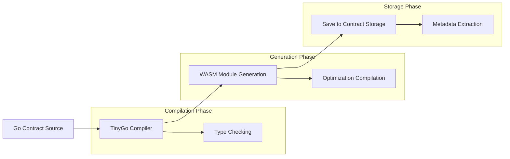
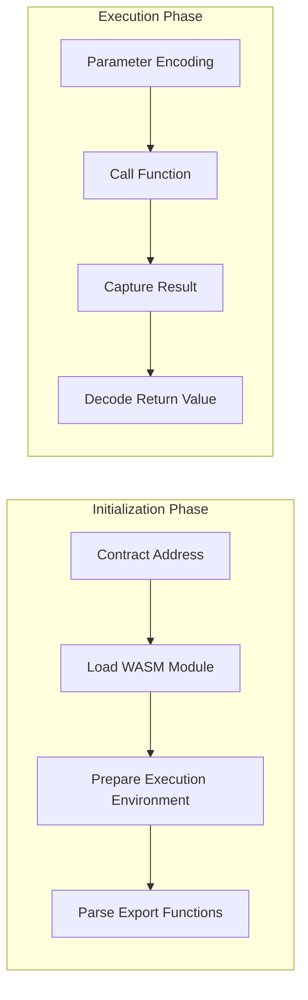
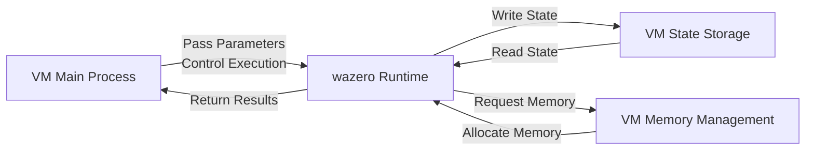
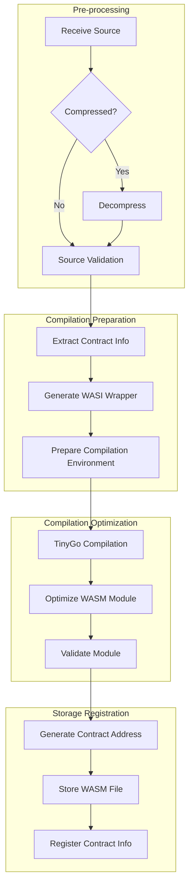
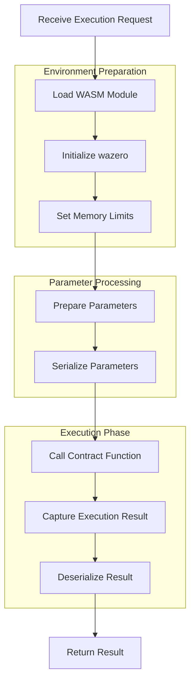

# WebAssembly Smart Contracts

This document details the WebAssembly (WASI) contract execution mode in the VM project, which compiles Go code into WebAssembly modules using TinyGo and executes them through the wazero runtime.

## WebAssembly Execution Mode Overview

The VM project uses WebAssembly as the core technology for contract execution, implemented through the following steps:

1. Compile Go contract code into WebAssembly modules compliant with WASI specifications using TinyGo
2. Load and execute these WebAssembly modules through the wazero runtime
3. Implement secure communication between contracts and the VM environment through WASI interfaces
4. Ensure contract execution in a sandbox environment with precise resource control

## Contract Example

Below is a simple token contract example demonstrating how to write standard smart contracts:

```go
package token

import (
    "fmt"
    "github.com/govm-net/vm"
)

// Initialize initializes the token contract and creates initial supply
func Initialize(name string, totalSupply uint64) (core.ObjectID, error) {
    // Create info object - basic state operation, panics on failure
    infoObj := core.CreateObject()
    infoObj.Set("name",name)

    // Create token issuer's balance object - basic state operation, panics on failure
    balanceObj := core.CreateObject()

    balanceObj.Set("type", infoObj.ID())
    balanceObj.Set("amount", totalSupply)

    // Set object owner as contract deployer - basic state operation, panics on failure
    balanceObj.SetOwner(core.Sender())

    // Record initialization event
    core.Log("Initialize", "total_supply", totalSupply, "owner", core.Sender())

    return balanceObj.ID(), nil
}

// Transfer transfers tokens between accounts
func Transfer(to core.Address, amount uint64) error {
    // Get sender's balance object
    fromBalance, err := core.GetObjectWithOwner(core.Sender())
    if err != nil {
        return fmt.Errorf("failed to get sender balance: %w", err)
    }

    // Read current balance
    var fromAmount uint64
    if err := fromBalance.Get("amount", &fromAmount); err != nil {
        return fmt.Errorf("failed to get sender amount: %w", err)
    }

    // Check if balance is sufficient
    if fromAmount < amount {
        return fmt.Errorf("insufficient balance: %d < %d", fromAmount, amount)
    }

    // Update sender's balance
    if err := fromBalance.Set("amount", fromAmount-amount); err != nil {
        return fmt.Errorf("failed to update sender balance: %w", err)
    }

    // Create receiver's balance object - basic state operation, panics on failure
    toBalance := core.CreateObject()
    
    var tokenType core.ObjectID
    fromBalance.Get("type",&tokenType)
    toBalance.Set("type",tokenType)
    toBalance.Set("amount", amount)
    // Set object owner - basic state operation, panics on failure
    toBalance.SetOwner(to)

    // Record transfer event
    core.Log("Transfer", 
        "from", core.Sender(),
        "to", to,
        "amount", amount)

    return nil
}

// GetBalance queries account balance
func GetBalance(owner core.Address) (uint64, error) {
    // Get balance object
    balanceObj, err := core.GetObjectWithOwner(owner)
    if err != nil {
        return 0, fmt.Errorf("no balance for address: %w", err)
    }

    // Read balance
    var amount uint64
    if err := balanceObj.Get("amount", &amount); err != nil {
        return 0, fmt.Errorf("failed to get amount: %w", err)
    }

    return amount, nil
}
```

This example demonstrates a basic token contract with the following features:

1. **Package-level Functions**: All functions are package-level, no struct definitions needed
2. **Automatic Export**: Functions starting with capital letters are automatically exported, no special markers needed
3. **Stateless Design**: All state is stored in external objects
4. **Ownership Control**: Access control through object ownership
5. **Event Logging**: Use `core.Log` to record important operations
6. **Error Handling**: Provide clear error messages
7. **Type Safety**: Use strong typing to ensure data safety
8. **Public Interface**: All public functions start with capital letters, automatically exported as WebAssembly functions

Usage example:

```go
// Deploy contract
code, _ := os.ReadFile("token.go")
contractAddr, _ := engine.DeployWithOptions(code, deployOptions)

// Initialize contract, issue 1000000 tokens
initResult, _ := engine.ExecuteWithArgs(contractAddr, "Initialize", uint64(1000000))
ownerBalanceID := initResult.(core.ObjectID)

// Transfer 1000 tokens to Alice
_ = engine.ExecuteWithArgs(contractAddr, "Transfer", aliceAddr, uint64(1000))

// Query Alice's balance
balance, _ := engine.ExecuteWithArgs(contractAddr, "GetBalance", aliceAddr)
fmt.Printf("Alice's balance: %d\n", balance.(uint64))
```

## Implementation Principles

The VM implements WebAssembly contract execution through the following components and processes:

### Contract Compilation Process

1. **Contract Analysis**: Parse Go source code, check contract structure and imports
2. **TinyGo Compilation**: Use TinyGo to compile Go code into WASI-compatible WebAssembly modules
3. **Metadata Generation**: Extract public function information, create function mapping table
4. **Module Optimization**: Apply WebAssembly optimizations to reduce module size
5. **Sandbox Configuration**: Set WASI environment parameters and access permissions

### Execution Mechanism

1. **Module Loading**: wazero runtime loads WebAssembly module
2. **Environment Preparation**: Set WASI environment variables and directory mapping
3. **Function Resolution**: Map contract export functions with corresponding parameters
4. **Parameter Encoding**: Encode Go type parameters into WebAssembly-compatible format
5. **Function Call**: Call specified function and capture return value
6. **Result Decoding**: Decode WebAssembly return value into Go type
7. **Resource Release**: Reclaim temporary resources and memory

## Configuration and Usage

To use WebAssembly contract functionality, the following setup is required:

### Basic Configuration

```go
// Create configuration supporting WASI contracts
config := api.DefaultContractConfig()
config.EnableWASIContracts = true                     // Enable WASI contract support
config.WASIContractsDir = filepath.Join(".", "wasi_modules") // Directory for storing WASM modules
config.TinyGoPath = "/usr/local/bin/tinygo"           // TinyGo executable path (adjust based on actual installation path)

// Ensure directory exists
os.MkdirAll(config.WASIContractsDir, 0755)

// Create VM instance
engine := vm.NewEngine(config)
```

### Deploying WebAssembly Contracts

```go
// Read contract code
code, err := os.ReadFile("mycontract.go")
if err != nil {
    return err
}

// Deploy as WASI contract
deployOptions := vm.DeployOptions{
    AsWASI: true,
    WASIOptions: vm.WASIOptions{
        MemoryLimit: 64 * 1024 * 1024, // 64MB memory limit
        Timeout:     5000,             // 5 second timeout
        TableSize:   1024,             // Function table size
        StackSize:   65536,            // Stack size (64KB)
    },
}
contractAddr, err := engine.DeployWithOptions(code, deployOptions)
if err != nil {
    return err
}
fmt.Printf("WebAssembly contract deployed at: %s\n", contractAddr.String())
```

### Executing WebAssembly Contract Functions

```go
// Execute initialization function
result, err := engine.ExecuteWithArgs(contractAddr, "Initialize", "param1", 123)
if err != nil {
    return err
}

// Decode result
var myResult MyType
if err := vm.DecodeResult(result, &myResult); err != nil {
    return err
}
```

## Resource Control Details

The WebAssembly execution mode provides fine-grained resource control mechanisms:

### Memory Limits

```go
// Set memory limit
WASIOptions: vm.WASIOptions{
    MemoryLimit: 64 * 1024 * 1024, // 64MB memory limit
}
```

### Execution Time Limits

```go
// Set execution timeout
WASIOptions: vm.WASIOptions{
    Timeout: 5000, // 5 second timeout (milliseconds)
}
```

## TinyGo Compatibility Notes

When compiling WebAssembly contracts with TinyGo, note the following compatibility issues:

### Memory Management Limitations

- Avoid large numbers of small memory allocations
- Design reasonable object lifecycles

### Code Optimization Suggestions

- Use simple data structures
- Avoid complex generics and reflection
- Reduce string operations and memory allocations

## Best Practices

### Contract Design

- **Follow Stateless Pattern**: Contract logic doesn't depend on internal state, but operates on external state objects
- **Use Basic Types**: Prefer basic types and simple structs
- **Reduce Memory Allocation**: Reuse buffers where possible
- **Avoid Complex Iteration**: Simplify loops and recursive operations
- **Split Large Contracts**: Break complex contracts into smaller ones

### Resource Control

- **Set Appropriate Memory Limits Based on Contract Complexity**
- **Allocate Sufficient Timeout for Heavy Operations**
- **Disable Unnecessary Features in Production** (SIMD, threads, etc.)
- **Regularly Monitor Resource Usage, Adjust Limit Parameters**

### Security Considerations

- **Validate All Input**: Don't trust external input
- **Check Object Permissions**: Ensure caller has permission to operate on objects
- **Log Important Operations**: Use logging for critical operations
- **Implement Access Control**: Restrict access to sensitive functions

## Summary

The WebAssembly contract execution mode is a core feature of the VM project, compiling Go-written smart contracts into WASI-compatible WebAssembly modules and executing them through the wazero runtime. This mode provides security isolation, near-native performance, cross-platform compatibility, and precise resource control.

WebAssembly contracts are particularly suitable for:

- High-security requirement scenarios
- Cross-platform deployment environments
- Systems with strict performance and resource control requirements
- Blockchain and distributed system environments

## Appendix: WebAssembly Contract Deployment and Execution Flowcharts

### Deployment Process



### Execution Process



### Memory and State Interaction Process



### Contract Deployment Detailed Process



### WebAssembly Execution Detailed Process

