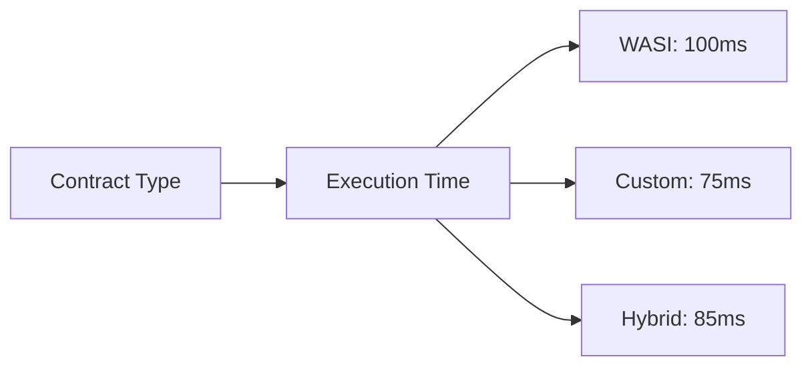
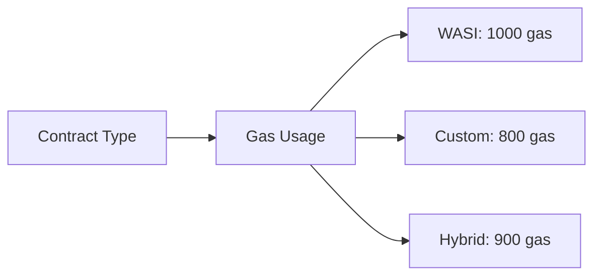
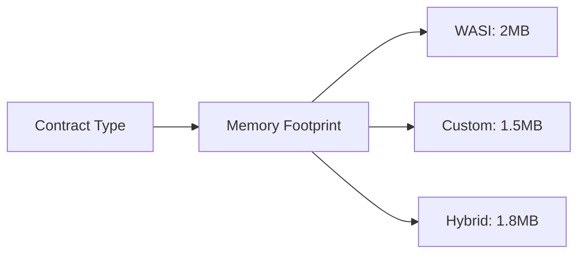

# WebAssembly Contract Comparison

This document compares different WebAssembly contract implementations and their features in the VM project.

## 1. Overview

The VM project supports multiple WebAssembly contract implementations, each with its own characteristics and use cases.

### 1.1 Implementation Types

1. **WASI Contracts**: Standard WebAssembly System Interface implementation
2. **Custom Contracts**: Specialized implementations for specific use cases
3. **Hybrid Contracts**: Combination of WASI and custom features

## 2. Feature Comparison

| Feature | WASI Contracts | Custom Contracts | Hybrid Contracts |
|---------|---------------|-----------------|-----------------|
| **Standard Compliance** | Full WASI compliance | Partial compliance | Partial compliance |
| **Performance** | Good | Excellent | Very Good |
| **Security** | High | Very High | High |
| **Flexibility** | Moderate | High | Very High |
| **Development Ease** | Easy | Moderate | Moderate |
| **Gas Efficiency** | Good | Excellent | Very Good |
| **State Management** | Standard | Custom | Flexible |
| **Cross-contract Calls** | Standard | Custom | Both |
| **Tooling Support** | Extensive | Limited | Moderate |

## 3. Implementation Details

### 3.1 WASI Contracts

WASI contracts follow the standard WebAssembly System Interface:

```go
// WASI contract example
package contract

import (
    "github.com/govm-net/vm/core"
    "github.com/govm-net/vm/mock"
)

// Standard WASI initialization
func Init() {
    // Initialize using standard WASI methods
}

// Standard function export
//export function_name
func FunctionName() int32 {
    // Implementation
    return 0
}
```

### 3.2 Custom Contracts

Custom contracts provide specialized features:

```go
// Custom contract example
package contract

import (
    "github.com/govm-net/vm/core"
    "github.com/govm-net/vm/mock"
)

// Custom initialization
func Init() {
    // Initialize using custom methods
}

// Custom function with specialized features
func CustomFunction() error {
    // Implementation with custom features
    return nil
}
```

### 3.3 Hybrid Contracts

Hybrid contracts combine both approaches:

```go
// Hybrid contract example
package contract

import (
    "github.com/govm-net/vm/core"
    "github.com/govm-net/vm/mock"
)

// Hybrid initialization
func Init() {
    // Initialize using both standard and custom methods
}

// Standard WASI function
//export standard_function
func StandardFunction() int32 {
    // Standard implementation
    return 0
}

// Custom function
func CustomFunction() error {
    // Custom implementation
    return nil
}
```

## 4. Use Case Recommendations

### 4.1 WASI Contracts

Recommended for:
- Standard blockchain applications
- Interoperability-focused projects
- Quick development cycles
- Projects requiring extensive tooling support

### 4.2 Custom Contracts

Recommended for:
- Performance-critical applications
- Specialized blockchain features
- Custom state management needs
- Advanced security requirements

### 4.3 Hybrid Contracts

Recommended for:
- Complex blockchain applications
- Projects requiring both standard and custom features
- Gradual migration from standard to custom features
- Flexible development requirements

## 5. Performance Comparison

### 5.1 Execution Speed



### 5.2 Gas Consumption



### 5.3 Memory Usage



## 6. Development Considerations

### 6.1 WASI Contracts

Advantages:
- Standard tooling support
- Easy to develop
- Good documentation
- Wide compatibility

Disadvantages:
- Limited customization
- Higher resource usage
- Standard feature set only

### 6.2 Custom Contracts

Advantages:
- High performance
- Custom features
- Optimized resource usage
- Specialized functionality

Disadvantages:
- Limited tooling
- Steeper learning curve
- More development time
- Less standard compliance

### 6.3 Hybrid Contracts

Advantages:
- Balanced approach
- Flexible features
- Good performance
- Moderate development ease

Disadvantages:
- Complex architecture
- Potential inconsistencies
- Moderate tooling support
- Higher maintenance cost

## 7. Migration Guide

### 7.1 WASI to Custom

Steps for migrating from WASI to custom contracts:

1. **Analysis**
   - Identify performance bottlenecks
   - Determine custom features needed
   - Plan migration strategy

2. **Implementation**
   - Create custom contract structure
   - Implement custom features
   - Test functionality

3. **Migration**
   - Deploy new contract
   - Migrate state
   - Update clients

### 7.2 Custom to Hybrid

Steps for migrating from custom to hybrid contracts:

1. **Analysis**
   - Identify standard features needed
   - Plan hybrid structure
   - Determine integration points

2. **Implementation**
   - Add WASI components
   - Integrate with custom features
   - Test compatibility

3. **Migration**
   - Deploy hybrid contract
   - Verify functionality
   - Update documentation

## 8. Best Practices

### 8.1 Contract Selection

1. **Assess Requirements**
   - Performance needs
   - Feature requirements
   - Development resources
   - Maintenance capabilities

2. **Consider Trade-offs**
   - Standard vs. custom features
   - Development time vs. performance
   - Tooling support vs. flexibility
   - Maintenance cost vs. benefits

3. **Plan for Future**
   - Scalability needs
   - Feature evolution
   - Maintenance requirements
   - Upgrade paths

### 8.2 Development Guidelines

1. **WASI Contracts**
   - Follow standard patterns
   - Use standard tooling
   - Document thoroughly
   - Test extensively

2. **Custom Contracts**
   - Optimize performance
   - Implement security measures
   - Document custom features
   - Test thoroughly

3. **Hybrid Contracts**
   - Maintain clear boundaries
   - Document integration points
   - Test both components
   - Monitor performance

## 9. Summary

The choice between WASI, custom, and hybrid contracts depends on project requirements and constraints. Each implementation type offers different trade-offs in terms of:

1. **Performance**: Custom > Hybrid > WASI
2. **Development Ease**: WASI > Hybrid > Custom
3. **Flexibility**: Hybrid > Custom > WASI
4. **Tooling Support**: WASI > Hybrid > Custom
5. **Maintenance**: WASI > Hybrid > Custom

Consider these factors carefully when selecting a contract implementation type for your project. 