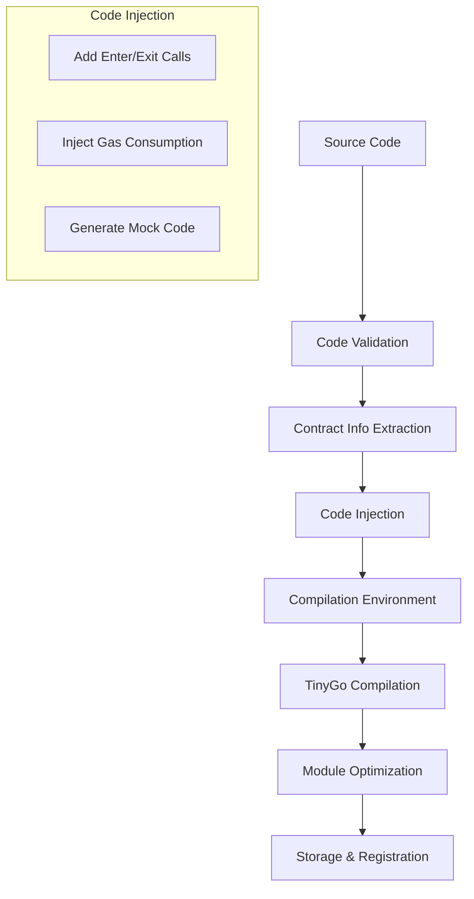
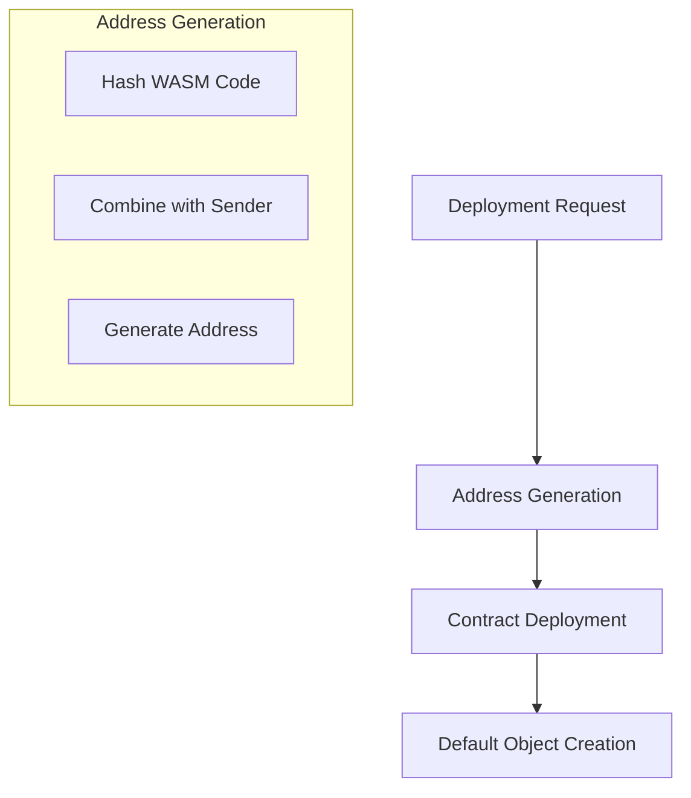
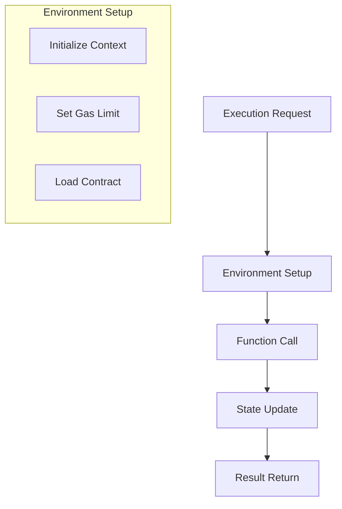

# WebAssembly Smart Contract Execution Process

This document details the execution process of WebAssembly smart contracts in the VM project, including contract compilation, deployment, and execution phases.

## 1. Contract Compilation Process

The contract compilation process converts Go source code into WebAssembly bytecode through several steps:



### 1.1 Source Code Validation

The system validates the contract source code to ensure security and compatibility:

```go
// Validate source code
func validateSourceCode(code string) error {
    // Check for allowed import packages
    allowedImports := []string{
        "github.com/govm-net/vm/core",
        "github.com/govm-net/vm/mock",
    }
    
    // Check for prohibited Go keywords
    prohibitedKeywords := []string{
        "go", "select", "range", "chan", "recover",
    }
    
    // Check for malicious commands in comments
    maliciousPatterns := []string{
        "go build", "+build", "//export",
    }
    
    // Check code size limit (default 1MB)
    if len(code) > 1024*1024 {
        return errors.New("code size exceeds limit")
    }
    
    return nil
}
```

### 1.2 Contract Information Extraction

The system extracts contract information using the ABI extractor:

```go
// Extract contract information
func extractContractInfo(code string) (*abi.ContractInfo, error) {
    info, err := abi.ExtractABI(code)
    if err != nil {
        return nil, err
    }
    
    // Extract function names, parameter lists, and return types
    for _, fn := range info.Functions {
        // Process function information
    }
    
    return info, nil
}
```

### 1.3 Code Injection and Wrapping

The system injects necessary code and wraps the contract:

```go
// Generate handler functions
func generateHandlerFunctions(info *abi.ContractInfo) string {
    generator := abi.NewHandlerGenerator(info)
    return generator.Generate()
}

// Modify package name
func modifyPackageName(code string) string {
    return strings.Replace(code, "package contract", "package main", 1)
}
```

### 1.4 Compilation Environment Preparation

The system prepares the compilation environment:

```go
// Create temporary directory
tempDir, err := os.MkdirTemp("", "contract-compile-*")
if err != nil {
    return err
}
defer os.RemoveAll(tempDir)

// Create go.mod file
goModContent := `module contract
go 1.21
require github.com/govm-net/vm v0.1.0`
err = os.WriteFile(filepath.Join(tempDir, "go.mod"), []byte(goModContent), 0644)
if err != nil {
    return err
}
```

### 1.5 TinyGo Compilation

The system compiles the contract using TinyGo:

```go
// Compile contract
func compileContract(code string) ([]byte, error) {
    builder := api.NewBuilder()
    params := api.BuildParams{
        Target: "wasi",
        Opt:    "z",
        Debug:  false,
    }
    
    cmd := exec.Command("tinygo", "build", "-o", "contract.wasm", "-target=wasi", "-opt=z", "-no-debug", "./")
    output, err := cmd.CombinedOutput()
    if err != nil {
        return nil, fmt.Errorf("compilation failed: %s", string(output))
    }
    
    return os.ReadFile("contract.wasm")
}
```

### 1.6 Module Optimization and Validation

The system optimizes and validates the compiled module:

```go
// Optimize and validate module
func optimizeModule(wasmCode []byte) error {
    // Read WASM module
    module, err := wasm.ReadModule(bytes.NewReader(wasmCode), nil)
    if err != nil {
        return err
    }
    
    // Validate exports
    if err := validateExports(module.Export); err != nil {
        return err
    }
    
    return nil
}
```

### 1.7 Storage and Registration

The system stores and registers the compiled contract:

```go
// Deploy contract
func deployContract(wasmCode []byte, abiInfo *abi.ContractInfo) error {
    // Deploy contract with address
    address, err := wazero_engine.DeployContractWithAddress(wasmCode)
    if err != nil {
        return err
    }
    
    // Save ABI file
    abiData, err := json.Marshal(abiInfo)
    if err != nil {
        return err
    }
    
    return os.WriteFile(fmt.Sprintf("contracts/%s.abi", address), abiData, 0644)
}
```

## 2. Contract Deployment Process

The contract deployment process registers the contract on the blockchain:



### 2.1 Deployment Request Processing

The system processes deployment requests:

```go
// Process deployment request
func processDeploymentRequest(wasmCode []byte, options *DeployOptions) error {
    // Validate deployment options
    if err := validateDeployOptions(options); err != nil {
        return err
    }
    
    // Select appropriate handling method
    if options.UseCustomAddress {
        return deployWithCustomAddress(wasmCode, options)
    }
    return deployWithDefaultAddress(wasmCode, options)
}
```

### 2.2 Contract Address Generation

The system generates a contract address:

```go
// Generate contract address
func generateContractAddress(wasmCode []byte, sender core.Address) core.Address {
    return api1.DefaultContractAddressGenerator(wasmCode, sender)
}
```

### 2.3 Contract Deployment

The system deploys the contract:

```go
// Deploy contract with address
func deployContractWithAddress(wasmCode []byte, address core.Address) error {
    // Validate WASM code
    if err := validateWasmCode(wasmCode); err != nil {
        return err
    }
    
    // Create contract object
    contract := &Contract{
        Address: address,
        Code:    wasmCode,
    }
    
    // Store contract files if directory specified
    if contractDir != "" {
        if err := storeContractFiles(contractDir, contract); err != nil {
            return err
        }
    }
    
    return nil
}
```

### 2.4 Default Object Creation

The system creates a default storage object:

```go
// Create default object
func createDefaultObject(contract core.Address) error {
    object, err := ctx.CreateObject(contract)
    if err != nil {
        return err
    }
    
    // Set initial state
    if err := object.Set(contract, contract, "initialized", true); err != nil {
        return err
    }
    
    return nil
}
```

## 3. Contract Execution Process

The contract execution process runs the deployed contract:



### 3.1 Execution Request Processing

The system processes execution requests:

```go
// Process execution request
func processExecutionRequest(contract core.Address, function string, args []byte) error {
    // Validate execution parameters
    if err := validateExecutionParams(contract, function, args); err != nil {
        return err
    }
    
    // Initialize execution environment
    env, err := initExecutionEnvironment(contract)
    if err != nil {
        return err
    }
    
    // Execute contract function
    result, err := env.Execute(function, args)
    if err != nil {
        return err
    }
    
    return nil
}
```

### 3.2 Environment Setup

The system sets up the execution environment:

```go
// Initialize execution environment
func initExecutionEnvironment(contract core.Address) (*ExecutionEnvironment, error) {
    // Create context
    ctx := context.NewContext()
    
    // Set gas limit
    ctx.SetGasLimit(1000000)
    
    // Load contract
    wasmCode, err := loadContractCode(contract)
    if err != nil {
        return nil, err
    }
    
    return &ExecutionEnvironment{
        Context:  ctx,
        Contract: contract,
        Code:     wasmCode,
    }, nil
}
```

### 3.3 Function Call

The system calls the contract function:

```go
// Execute contract function
func (env *ExecutionEnvironment) Execute(function string, args []byte) ([]byte, error) {
    // Prepare function call
    callData := types.HandleContractCallParams{
        Contract: env.Contract,
        Function: function,
        Args:     args,
    }
    
    // Call function
    result, err := env.Context.Call(env.Contract, function, args)
    if err != nil {
        return nil, err
    }
    
    return result, nil
}
```

### 3.4 State Update

The system updates the contract state:

```go
// Update contract state
func updateContractState(contract core.Address, updates []StateUpdate) error {
    for _, update := range updates {
        // Get object
        object, err := ctx.GetObject(contract, update.ObjectID)
        if err != nil {
            return err
        }
        
        // Update field
        if err := object.Set(contract, contract, update.Field, update.Value); err != nil {
            return err
        }
    }
    
    return nil
}
```

### 3.5 Result Return

The system returns the execution result:

```go
// Return execution result
func returnExecutionResult(result []byte, gasUsed int64) *types.ExecutionResult {
    return &types.ExecutionResult{
        Success: true,
        Data:    result,
        GasUsed: gasUsed,
    }
}
```

## 4. Error Handling

The system handles various types of errors:

```go
// Handle execution errors
func handleExecutionError(err error) *types.ExecutionResult {
    switch e := err.(type) {
    case *GasExhaustedError:
        return &types.ExecutionResult{
            Success: false,
            Error:   "gas exhausted",
            GasUsed: e.GasUsed,
        }
    case *MemoryError:
        return &types.ExecutionResult{
            Success: false,
            Error:   "memory error: " + e.Message,
        }
    case *StateError:
        return &types.ExecutionResult{
            Success: false,
            Error:   "state error: " + e.Message,
        }
    default:
        return &types.ExecutionResult{
            Success: false,
            Error:   err.Error(),
        }
    }
}
```

## 5. Summary

The WebAssembly smart contract execution process provides a secure and efficient environment for running smart contracts. Through careful design and implementation, the system ensures:

1. **Security**: Code validation and sandbox execution prevent malicious behavior
2. **Efficiency**: Optimized compilation and execution minimize resource usage
3. **Reliability**: Comprehensive error handling ensures stable operation
4. **Flexibility**: Support for various contract types and use cases
5. **Maintainability**: Clear process flow and modular design

The system's architecture allows for easy extension and adaptation to different blockchain environments while maintaining core functionality and security guarantees. 