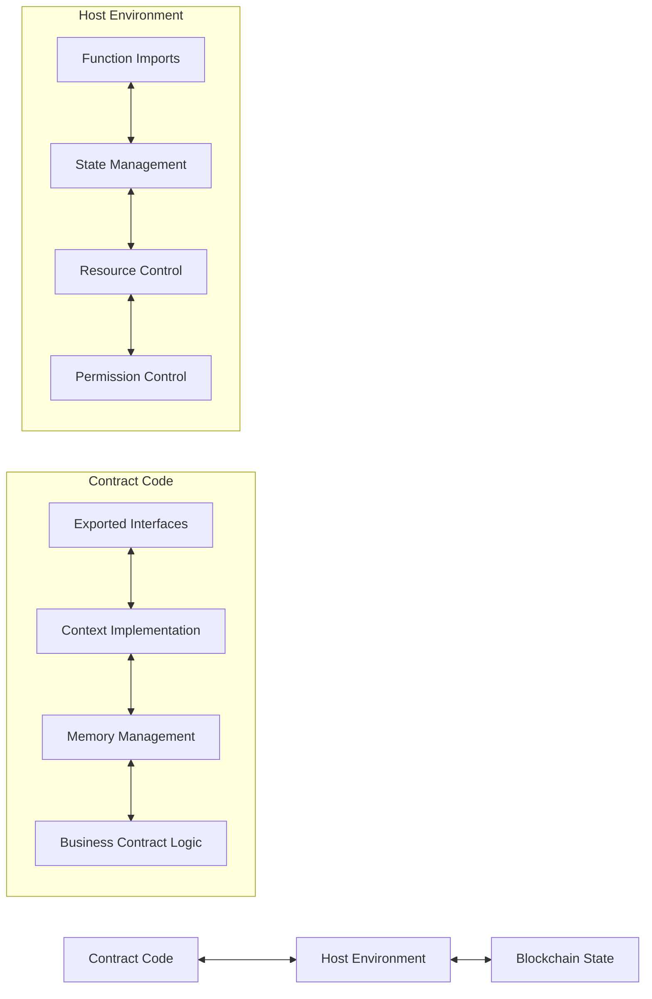
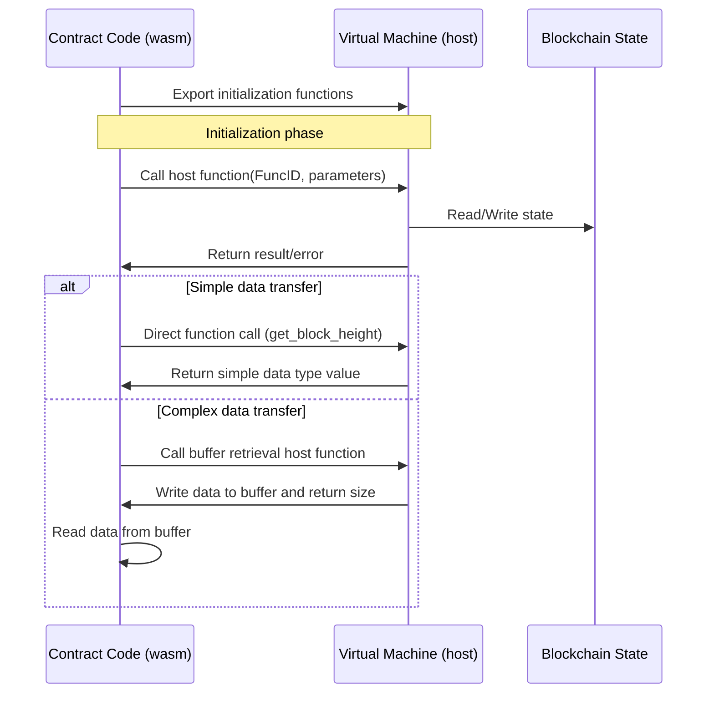

# WebAssembly Smart Contract Interface System

This document details the design and implementation of the WebAssembly smart contract interface system in the VM project. The system implements a communication bridge between contract code and the blockchain environment through the `wasm/contract.go` and `host/main.go` components.

## 1. System Architecture Overview

The WebAssembly smart contract interface system adopts a bidirectional communication architecture with two main components:



- **Contract-side Interface (compiler/wasm/contract.go)**: Provides developer-facing APIs, implementing Context and Object interfaces
- **Host-side Interface (wasi/wazero_engine.go)**: Implements host functions for contract calls, managing state and resources

## 2. Contract-side Interface Details

The contract-side interface is implemented in `compiler/wasm/contract.go`, serving as a bridge between contract code and the host environment.

### 2.1 Exported Functions

WebAssembly contracts have two types of functions that are exported:

#### 2.1.1 Basic Required Exported Functions

These functions are essential for interacting with the WebAssembly runtime and must be implemented by every wasi, provided by the framework:

```go
//export allocate
func allocate(size int32) int32 {
    // Memory allocation function - used when the host environment requests memory allocation
    buffer := make([]byte, size)
    return int32(uintptr(unsafe.Pointer(&buffer[0])))
}

//export deallocate
func deallocate(ptr int32, size int32) {
    // Memory deallocation function (managed by Go garbage collector)
    // In WebAssembly, this function might be empty
}

//export handle_contract_call
func handle_contract_call(funcNamePtr, funcNameLen, paramsPtr, paramsLen int32) int32{
}
```

Note: These system functions still need to be marked with `//export` comments as they are special functions used internally by the framework.

#### 2.1.2 Custom Contract Functions

These functions are the business logic functions defined by developers according to their needs:

```go
// Public function - automatically exported
func Hello() int32 {
    core.Log("hello", "world")
    return 1
}

// Public function - automatically exported
func ProcessData(dataPtr int32, dataLen int32) int32 {
    // Business logic processing
    return 1
}

// Public function - automatically exported
func TransferToken(to core.Address, amount int64) int32 {
    // Transfer example function
    // ...
}

// Private function - not exported
func verifyTransaction(from, to Address, amount int64) bool {
    // Verification logic
    return true
}
```

Contract public functions are defined by developers and constitute the contract's public API that can be called by blockchain transactions. The system automatically recognizes all functions starting with capital letters as exported functions, without requiring manual `//export` markers. The export rules follow Go's public/private conventions:
- Functions starting with capital letters are automatically treated as public functions and are exported for external calls
- Functions starting with lowercase letters are private functions and can only be used within the contract

### 2.2 Core Constants and Host Functions

Contracts use a series of predefined function IDs to communicate with the host environment:

```go
// Function ID constant definitions
const (
    FuncGetSender          int32 = iota + 1 // 1
    FuncGetBlockHeight                      // 2
    FuncGetBlockTime                        // 3
    FuncGetContractAddress                  // 4
    FuncGetBalance                          // 5
    FuncTransfer                            // 6
    FuncCreateObject                        // 7
    FuncCall                                // 8
    FuncGetObject                           // 9
    // ... other function IDs
)
```

Communication with the host environment is achieved through two main host function call patterns:

```go
//export call_host_set
func call_host_set(funcID, argPtr, argLen int32) int64

//export call_host_get_buffer
func call_host_get_buffer(funcID, argPtr, argLen int32) int32

//export get_block_height
func get_block_height() int64

//export get_block_time
func get_block_time() int64

//export get_balance
func get_balance(addrPtr int32) uint64
```

### 2.3 Memory Management Mechanism

Contract code uses a unified buffer management scheme:

Main memory operation functions:

```go
// Read data from memory
func readMemory(ptr, size int32) []byte {
    // Safely read data from specified memory location
}

// Write data to memory
func writeToMemory(data interface{}) (ptr int32, size int32) {
    // Serialize and write data to memory
}
```

### 2.4 Context Interface Implementation

The Context interface provides standard methods for accessing blockchain state and functionality:

```go
// Context interface definition
type Context interface {
    // Blockchain information related
    BlockHeight() uint64         // Get current block height
    BlockTime() int64            // Get current block timestamp
    ContractAddress() Address    // Get current contract address
    
    // Account operations related
    Sender() Address             // Get transaction sender or contract caller
    Balance(addr Address) uint64 // Get account balance
    Transfer(from, to Address, amount uint64) error // Transfer operation
    
    // Object storage related - Basic state operations use panic instead of returning error
    CreateObject() Object                     // Create new object, panic on failure
    GetObject(id ObjectID) (Object, error)    // Get specified object, may return error
    GetObjectWithOwner(owner Address) (Object, error) // Get object by owner, may return error
    DeleteObject(id ObjectID)                 // Delete object, panic on failure
    
    // Cross-contract calls
    Call(contract Address, function string, args ...any) ([]byte, error)
    
    // Logs and events
    Log(eventName string, keyValues ...interface{}) // Log event
}
```

In contract code, developers can access these functions through the global functions provided by the `core` package:

```go
// Blockchain information related
func BlockHeight() uint64 {
    return ctx.BlockHeight()
}

func BlockTime() int64 {
    return ctx.BlockTime()
}

func ContractAddress() Address {
    return ctx.ContractAddress()
}

// Account operations related
func Sender() Address {
    return ctx.Sender()
}

func Balance(addr Address) uint64 {
    return ctx.Balance(addr)
}

// Transfer operations
func Receive(amount uint64) error {
    return ctx.Transfer(ctx.Sender(), ctx.ContractAddress(), amount)
}

func TransferTo(to Address, amount uint64) error {
    return ctx.Transfer(ctx.ContractAddress(), to, amount)
}

// Object storage related
func CreateObject() Object {
    return ctx.CreateObject()
}

func GetObject(id ObjectID) (Object, error) {
    return ctx.GetObject(id)
}

func GetObjectWithOwner(owner Address) (Object, error) {
    return ctx.GetObjectWithOwner(owner)
}

func DeleteObject(id ObjectID) {
    ctx.DeleteObject(id)
}

// Cross-contract calls
func Call(contract Address, function string, args ...any) ([]byte, error) {
    return ctx.Call(contract, function, args...)
}

// Logs and events
func Log(eventName string, keyValues ...interface{}) {
    ctx.Log(eventName, keyValues...)
}
```

### 2.5 Object Interface Implementation

The Object interface provides unified object state management capabilities:

```go
// Object interface definition
type Object interface {
    // Metadata methods
    ID() ObjectID                    // Get object unique ID
    Owner() Address                  // Get owner address
    Contract() Address               // Get contract address
    SetOwner(addr Address)           // Set owner address, panic on failure
    
    // State access methods
    Get(field string, value any) error    // Get specified field value
    Set(field string, value any) error    // Set specified field value
}
```

## 3. Host-side Interface Details

The host-side interface is implemented in `context/memory/context.go` and `context/db/context.go`, responsible for handling contract requests and providing resource control.

### 3.1 State Management

The host environment maintains a structure containing blockchain state:

```go
// Context implements blockchain context
type Context struct {
    // Block information
    blockHeight uint64
    blockTime   int64
    blockHash   core.Hash

    // Transaction information
    txHash core.Hash
    sender core.Address
    to     core.Address
    value  uint64
    nonce  uint64

    // Contract information
    contractAddr core.Address
    gasLimit     int64
    usedGas      int64

    // State storage
    objects map[core.ObjectID]*Object
    balances map[core.Address]uint64
}
```

### 3.2 BlockchainContext Interface

The host environment implements the BlockchainContext interface, providing blockchain state management functionality:

```go
// BlockchainContext interface definition
type BlockchainContext interface {
    // Set block and transaction information
    SetBlockInfo(height uint64, time int64, hash core.Hash)
    SetTransactionInfo(hash core.Hash, from, to core.Address, value uint64, nonce uint64)
    
    // Blockchain information related
    BlockHeight() uint64      // Get current block height
    BlockTime() int64         // Get current block timestamp
    ContractAddress() core.Address // Get current contract address
    TransactionHash() core.Hash    // Get current transaction hash
    SetGasLimit(limit int64)  // Set gas limit
    GetGas() int64            // Get used gas
    
    // Account operations related
    Sender() core.Address                                          // Get transaction sender
    Balance(addr core.Address) uint64                              // Get account balance
    Transfer(contract, from, to core.Address, amount uint64) error // Transfer operation

    // Object storage related
    CreateObject(contract core.Address) (core.Object, error)                      // Create new object
    CreateObjectWithID(contract core.Address, id core.ObjectID) (core.Object, error)   // Create new object
    GetObject(contract core.Address, id core.ObjectID) (core.Object, error)            // Get specified object
    GetObjectWithOwner(contract core.Address, owner core.Address) (core.Object, error) // Get object by owner
    DeleteObject(contract core.Address, id core.ObjectID) error                     // Delete object

    // Cross-contract calls
    Call(caller core.Address, contract core.Address, function string, args ...any) ([]byte, error)

    // Logs and events
    Log(contract core.Address, eventName string, keyValues ...any) // Log event
}
```

### 3.3 Object Interface

The host environment implements the Object interface, providing object state management functionality:

```go
// Object interface definition
type Object interface {
    ID() core.ObjectID                                  // Get object ID
    Owner() core.Address                                // Get object owner
    Contract() core.Address                             // Get object's contract
    SetOwner(contract, sender, addr core.Address) error // Set object owner

    // Field operations
    Get(contract core.Address, field string) ([]byte, error)             // Get field value
    Set(contract, sender core.Address, field string, value []byte) error // Set field value
}
```

### 3.4 Import Function Implementation

The host environment provides two main import function handlers for contracts:

```go
// Function for handling set operations
func (vm *WazeroVM) handleHostSet(ctx types.BlockchainContext, m api.Module, funcID uint32, argData []byte, bufferPtr uint32) int32 {
    // Handle operations that don't return complex data
    switch types.WasmFunctionID(funcID) {
    case types.FuncTransfer:
        // Handle transfer
    case types.FuncCall:
        // Handle contract call
    case types.FuncDeleteObject:
        // Handle object deletion
    case types.FuncLog:
        // Handle logging
    case types.FuncSetObjectOwner:
        // Handle setting object owner
    case types.FuncSetObjectField:
        // Handle setting object field
    }
}

// Function for handling buffer data retrieval
func (vm *WazeroVM) handleHostGetBuffer(ctx types.BlockchainContext, m api.Module, funcID uint32, argData []byte, offset uint32) int32 {
    // Handle operations that return complex data
    switch types.WasmFunctionID(funcID) {
    case types.FuncGetSender:
        // Get sender
    case types.FuncGetContractAddress:
        // Get contract address
    case types.FuncCreateObject:
        // Create object
    case types.FuncGetObjectField:
        // Get object field
    case types.FuncGetObject:
        // Get object
    case types.FuncGetObjectWithOwner:
        // Get owner's object
    case types.FuncGetObjectOwner:
        // Get object owner
    }
}
```

## 4. Communication Flow

The communication between contract code and the host environment follows this flow:



### 4.1 Parameter Passing

Parameter passing between contracts and the host environment uses the following methods:

1. **Simple type parameters**: Passed directly through function parameters
2. **Complex type parameters**:
   - Serialized into binary data
   - Passed through memory pointer and length

### 4.2 Error Handling

The error handling mechanism includes:

- Return value status codes indicating success/failure
- Detailed error information returned through buffers
- Host function parameter validation and memory safety checks

### 4.3 Function ID Constants

The system uses predefined function ID constants to identify different operations:

```go
// WasmFunctionID defines function ID constants used in host-contract communication
type WasmFunctionID int32

const (
    // FuncGetSender returns the sender address of the current transaction
    FuncGetSender WasmFunctionID = iota + 1 // 1
    // FuncGetContractAddress returns the current contract address
    FuncGetContractAddress // 2
    // FuncTransfer transfers tokens from contract to recipient
    FuncTransfer // 3
    // FuncCreateObject creates a new state object
    FuncCreateObject // 4
    // FuncCall calls a function on another contract
    FuncCall // 5
    // FuncGetObject retrieves a state object by ID
    FuncGetObject // 6
    // FuncGetObjectWithOwner retrieves objects owned by a specific address
    FuncGetObjectWithOwner // 7
    // FuncDeleteObject removes a state object
    FuncDeleteObject // 8
    // FuncLog logs a message to the blockchain's event system
    FuncLog // 9
    // FuncGetObjectOwner gets the owner of a state object
    FuncGetObjectOwner // 10
    // FuncSetObjectOwner changes the owner of a state object
    FuncSetObjectOwner // 11
    // FuncGetObjectField retrieves a specific field from a state object
    FuncGetObjectField // 12
    // FuncSetObjectField updates a specific field in a state object
    FuncSetObjectField // 13
    // FuncGetObjectContract gets the contract of a state object
    FuncGetObjectContract // 14
)
```

### 4.4 Parameter Structures

The system uses predefined structures to pass complex parameters:

```go
// TransferParams transfer parameters
type TransferParams struct {
    Contract Address `json:"contract,omitempty"`
    From     Address `json:"from,omitempty"`
    To       Address `json:"to,omitempty"`
    Amount   uint64  `json:"amount,omitempty"`
}

// CallParams contract call parameters
type CallParams struct {
    Caller   Address `json:"caller,omitempty"`
    Contract Address `json:"contract,omitempty"`
    Function string  `json:"function,omitempty"`
    Args     []any   `json:"args,omitempty"`
    GasLimit int64   `json:"gas_limit,omitempty"`
}

// CallResult contract call result
type CallResult struct {
    Data    []byte `json:"data,omitempty"`
    GasUsed int64  `json:"gas_used,omitempty"`
}

// GetObjectParams get object parameters
type GetObjectParams struct {
    Contract Address  `json:"contract,omitempty"`
    ID       ObjectID `json:"id,omitempty"`
}

// GetObjectWithOwnerParams get object by owner parameters
type GetObjectWithOwnerParams struct {
    Contract Address `json:"contract,omitempty"`
    Owner    Address `json:"owner,omitempty"`
}

// GetObjectFieldParams get object field parameters
type GetObjectFieldParams struct {
    Contract Address  `json:"contract,omitempty"`
    ID       ObjectID `json:"id,omitempty"`
    Field    string   `json:"field,omitempty"`
}

// DeleteObjectParams delete object parameters
type DeleteObjectParams struct {
    Contract Address  `json:"contract,omitempty"`
    ID       ObjectID `json:"id,omitempty"`
}

// SetOwnerParams set owner parameters
type SetOwnerParams struct {
    Contract Address  `json:"contract,omitempty"`
    Sender   Address  `json:"sender,omitempty"`
    ID       ObjectID `json:"id,omitempty"`
    Owner    Address  `json:"owner,omitempty"`
}

// SetObjectFieldParams set object field parameters
type SetObjectFieldParams struct {
    Contract Address  `json:"contract,omitempty"`
    Sender   Address  `json:"sender,omitempty"`
    ID       ObjectID `json:"id,omitempty"`
    Field    string   `json:"field,omitempty"`
    Value    any      `json:"value,omitempty"`
}

// ExecutionResult execution result
type ExecutionResult struct {
    Success bool   `json:"success"`
    Data    any    `json:"data,omitempty"`
    Error   string `json:"error,omitempty"`
}

// LogParams log parameters
type LogParams struct {
    Contract  Address `json:"contract,omitempty"`
    Event     string  `json:"event,omitempty"`
    KeyValues []any   `json:"key_values,omitempty"`
}

// HandleContractCallParams handle contract call parameters
type HandleContractCallParams struct {
    Contract Address `json:"contract,omitempty"`
    Sender   Address `json:"sender,omitempty"`
    Function string  `json:"function,omitempty"`
    Args     []byte  `json:"args,omitempty"`
    GasLimit int64   `json:"gas_limit,omitempty"`
}
```

### 4.5 Buffer Size

The system uses a fixed-size buffer for data exchange:

```go
// HostBufferSize defines the buffer size for data exchange between host and contract
const HostBufferSize int32 = 2048
```

### 4.6 Type Definitions

The system uses the following basic types:

```go
// Address represents a blockchain address
type Address [20]byte

// ObjectID represents a unique identifier for a state object
type ObjectID [32]byte

// Hash represents a hash value
type Hash [32]byte
```

These types provide string conversion methods:

```go
func (id ObjectID) String() string {
    return hex.EncodeToString(id[:])
}

func (addr Address) String() string {
    return hex.EncodeToString(addr[:])
}

func (h Hash) String() string {
    return hex.EncodeToString(h[:])
}

func HashFromString(str string) Hash {
    str = strings.TrimPrefix(str, "0x")
    h, err := hex.DecodeString(str)
    if err != nil {
        return Hash{}
    }
    var out Hash
    copy(out[:], h)
    return out
}
```

## 5. Gas Billing Mechanism

WebAssembly smart contracts use a precise gas billing mechanism to control resource consumption, ensuring safe and predictable contract execution.

### 5.1 Billing Principles

The gas billing system uses a dual billing strategy:

#### 5.1.1 Code Line Billing

During contract compilation, the system automatically analyzes the Go code's control flow structure and injects gas consumption code at appropriate locations:

```go
// Original contract code
func TransferToken(to Address, amount uint64) error {
    if amount <= 0 {
        return errors.New("amount must be positive")
    }
    
    sender := core.Sender()
    return core.TransferTo(to, amount)
}

// Code with injected gas billing
func TransferToken(to Address, amount uint64) error {
    mock.ConsumeGas(1)  // Consume gas for current statement
    if amount <= 0 {
        mock.ConsumeGas(1)  // Consume gas for if block statements
        return errors.New("amount must be positive")
    }
    
    mock.ConsumeGas(2)  // Consume gas for following two lines
    sender := core.Sender()
    return core.TransferTo(to, amount)
}
```

The system identifies basic code blocks and injects corresponding gas consumption code at the beginning of each block.

#### 5.1.2 Interface Call Billing

In addition to basic code line billing, all Context and Object interface calls consume additional gas:

```go
// Context interface billing example
func (c *Context) Sender() Address {
    mock.ConsumeGas(10)  // Sender operation consumes 10 gas
    // ... actual logic ...
}

func (c *Context) Transfer(from, to Address, amount uint64) error {
    mock.ConsumeGas(500)  // Transfer operation consumes 500 gas
    // ... actual logic ...
}

// Object interface billing example
func (o *Object) Set(field string, value any) error {
    mock.ConsumeGas(1000)  // Set basic operation consumes 1000 gas
    // ... serialization ...
    bytes, err := any2bytes(request)
    // ... 
    mock.ConsumeGas(int64(len(bytes)) * 100)  // Additional billing based on data size
    // ... actual logic ...
}
```

### 5.2 Gas Consumption Values

Standard gas consumption values for Context and Object interfaces:

| Interface | Operation | Gas Consumption |
|-----------|-----------|-----------------|
| **Context** | Sender() | 10 gas |
| | BlockHeight() | 10 gas |
| | BlockTime() | 10 gas |
| | ContractAddress() | 10 gas |
| | Balance(addr) | 50 gas |
| | Transfer(from, to, amount) | 500 gas |
| | Call(contract, function, args...) | 10000 gas + called contract consumption |
| | CreateObject() | 50 gas |
| | GetObject(id) | 50 gas |
| | GetObjectWithOwner(owner) | 50 gas |
| | DeleteObject(id) | 500 gas |
| | Log(event, keyValues...) | 100 gas + data length |
| **Object** | ID() | 10 gas |
| | Contract() | 100 gas |
| | Owner() | 100 gas |
| | SetOwner(addr) | 500 gas |
| | Get(field, value) | 100 gas + result data size |
| | Set(field, value) | 1000 gas + data size * 100 gas |

### 5.3 Special Billing Rules

Certain operations have special billing rules:

#### 5.3.1 Contract Call Gas Reservation

When using the `Call` method to call another contract, the system reserves 10000 gas as the basic call fee and allocates the remaining gas to the called contract:

```go
// Gas handling in Call method
func (c *Context) Call(contract Address, function string, args ...any) ([]byte, error) {
    // Reserve basic call fee
    mock.ConsumeGas(10000)
    
    // Construct call parameters, allocate remaining gas to called contract
    callData := types.CallParams{
        Contract: contract,
        Function: function,
        Args:     args,
        Caller:   c.ContractAddress(),
        GasLimit: mock.GetGas(), // Allocate remaining gas
    }
    
    // ... call logic ...
    
    // Actual consumption = 10000 (basic fee) + called contract actual consumption
    return result, nil
}
```

#### 5.3.2 Data Size Related Billing

For operations involving data processing, additional gas consumption is related to data size:

- **Object.Set()**: Base consumption 1000 gas + data size * 100 gas
- **Object.Get()**: Base consumption 100 gas + result data size gas
- **Context.Log()**: Base consumption 100 gas + log data length gas

### 5.4 Gas Control API

Contracts can manage gas through the Gas control API provided by the mock package:

```go
import "github.com/govm-net/vm/mock"

// Initialize gas (usually called automatically by the system)
mock.InitGas(1000000)

// Get current remaining gas
remainingGas := mock.GetGas()

// Get used gas
usedGas := mock.GetUsedGas()

// Manually consume gas (usually called by automatically injected code)
mock.ConsumeGas(100)

// Refund gas (used in specific scenarios like storage deletion)
mock.RefundGas(50)

// Reset gas count (usually called by the system at contract call start)
mock.ResetGas(500000)
```

## 8. Interface Extensions

The system provides various extension interfaces to meet different business needs:

### 8.1 Logs and Events

The system provides logging and event interfaces for recording key events during contract execution:

```go
// Logger interface definition
type Logger interface {
    Log(eventName string, keyValues ...interface{})
}

// Logger implementation
func (c *Context) Log(eventName string, keyValues ...interface{}) {
    // Call logging interface to record event
}
```

### 8.2 Cross-contract Calls

The system provides cross-contract call interfaces, allowing safe interaction between contracts:

```go
// Cross-contract caller interface definition
type Caller interface {
    Call(contract Address, function string, args ...any) ([]byte, error)
}

// Cross-contract call implementation
func (c *Context) Call(contract Address, function string, args ...any) ([]byte, error) {
    // Call cross-contract call interface
}
```

## 9. Best Practices

Best practices for using the WebAssembly smart contract interface system:

1. **Minimize cross-boundary calls**: Reduce the number of calls between contracts and the host environment
2. **Optimize data serialization**: Reduce unnecessary data conversion and serialization
3. **Use buffers appropriately**: Use buffers for large data, pass small data directly
4. **Pay attention to memory safety**: Always validate memory pointers and lengths
5. **Error handling**: Handle all error cases properly, don't assume calls always succeed
6. **Resource limits**: Set reasonable memory and execution time limits
7. **Reuse buffers**: To reduce memory pressure, contract code should try to reuse buffers rather than frequently allocating memory
8. **Type-safe serialization**: Use serialization methods with type information to avoid numeric type conversion issues

## 10. Summary

The WebAssembly smart contract interface system provides an efficient and secure execution environment for smart contracts written in Go. Through carefully designed communication interfaces, contract code can safely access blockchain state and functionality while the host environment maintains strict control over resource usage.

This design achieves the following goals:
- Secure contract execution environment
- Efficient state access and operations
- Flexible object model
- Controlled resource usage
- Powerful cross-contract call capabilities

The system's modular design makes it easy to extend and adapt to different blockchain environments while maintaining core interface stability, providing developers with a consistent development experience. 