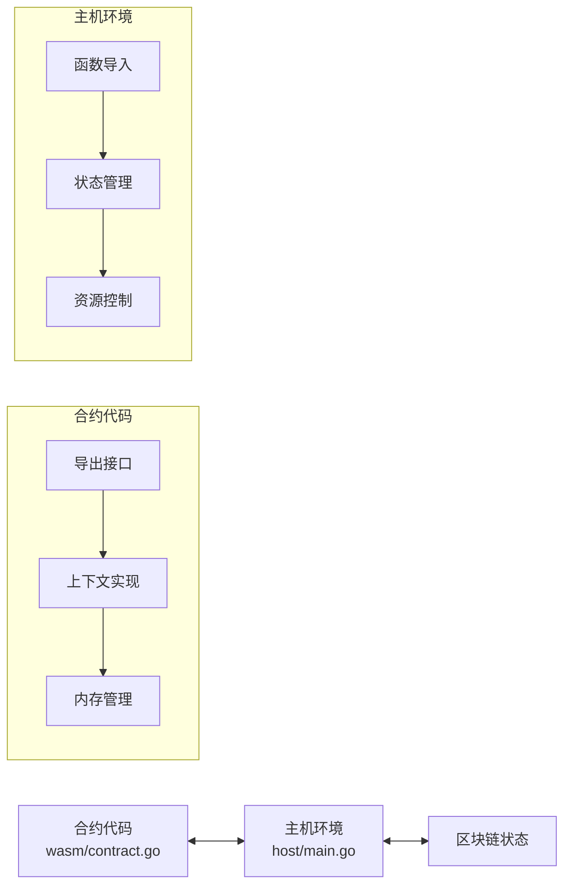
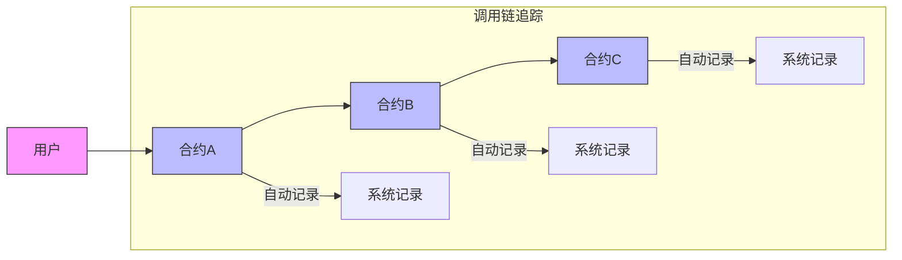
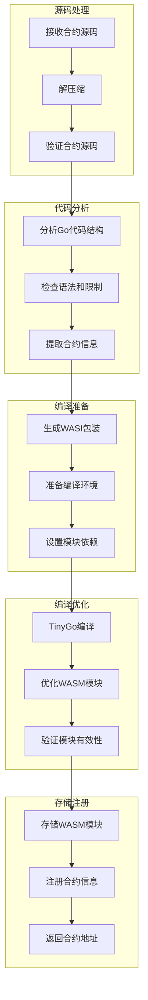

# 入门指南：使用 VM 构建你的第一个智能合约

本指南将帮助您开始使用 VM 编写、部署和测试基于 Go 语言的智能合约，这些合约将被编译为 WebAssembly 模块并通过 Wasmer 运行时执行。

## 安装要求

在开始之前，确保您的系统满足以下要求：

- 安装 Go 1.18 或更高版本
- 安装 TinyGo (用于将 Go 代码编译为 WebAssembly)
  ```bash
  go install tinygo.org/x/tinygo@latest
  ```
- 安装 Wasmer 运行时
  ```bash
  curl https://get.wasmer.io -sSfL | sh
  ```
- 安装 Go Wasmer 模块
  ```bash
  go get github.com/wasmerio/wasmer-go
  ```
- 熟悉基本的 Go 语言概念
- 了解基本的区块链和智能合约概念

## 1. 设置项目

首先，我们需要创建一个新的 Go 模块并添加虚拟机依赖：

```bash
# 创建项目目录
mkdir mycontract
cd mycontract

# 初始化 Go 模块
go mod init mycontract

# 添加 VM 依赖
go get -u github.com/govm-net/vm
```

## 2. 智能合约开发模型

VM 项目支持两种主要的合约开发模型：

### 2.1 包级函数模型（推荐）

这是一种更简洁的模型，所有合约函数都是包级别的，无需定义结构体：

```go
package counter

import (
	"github.com/govm-net/vm/core"
)

// Initialize 创建一个新的计数器对象
func Initialize(ctx core.Context) (core.ObjectID, error) {
	// 创建一个新的状态对象 - 基础状态操作，失败时会panic
	obj := ctx.CreateObject()

	// 设置初始计数为 0
	err := obj.Set("count", uint64(0))
	if err != nil {
		return core.ObjectID{}, err
	}

	// 设置对象所有者为合约创建者 - 基础状态操作，失败时会panic
	obj.SetOwner(ctx.Sender())

	// 记录创建事件
	ctx.Log("CounterCreated", obj.ID())

	return obj.ID(), nil
}

// Increment 增加计数器的值
func Increment(ctx core.Context, counterID core.ObjectID) (uint64, error) {
	// 获取计数器对象
	obj, err := ctx.GetObject(counterID)
	if err != nil {
		return 0, err
	}

	// 只有所有者可以操作
	if obj.Owner() != ctx.Sender() {
		return 0, core.ErrUnauthorized
	}

	// 获取当前计数
	var count uint64
	err = obj.Get("count", &count)
	if err != nil {
		return 0, err
	}

	// 增加计数
	count++

	// 更新计数
	err = obj.Set("count", count)
	if err != nil {
		return 0, err
	}

	// 记录更新事件
	ctx.Log("CounterIncremented", counterID, count)

	return count, nil
}

// GetCount 获取当前计数
func GetCount(ctx core.Context, counterID core.ObjectID) (uint64, error) {
	// 获取计数器对象
	obj, err := ctx.GetObject(counterID)
	if err != nil {
		return 0, err
	}

	// 获取当前计数
	var count uint64
	err = obj.Get("count", &count)
	if err != nil {
		return 0, err
	}

	return count, nil
}
```

### 2.2 结构体方法模型

这种模型使用结构体方法来组织合约代码：

```go
package counter

import (
	"github.com/govm-net/vm/core"
)

// Counter 是一个简单的计数器合约
type Counter struct{}

// Initialize 创建一个新的计数器对象
func (c *Counter) Initialize(ctx core.Context) (core.ObjectID, error) {
	// 创建一个新的状态对象 - 基础状态操作，失败时会panic
	obj := ctx.CreateObject()

	// 设置初始计数为 0
	err := obj.Set("count", uint64(0))
	if err != nil {
		return core.ObjectID{}, err
	}

	// 设置对象所有者为合约创建者 - 基础状态操作，失败时会panic
	obj.SetOwner(ctx.Sender())

	// 记录创建事件
	ctx.Log("CounterCreated", obj.ID())

	return obj.ID(), nil
}

// Increment 增加计数器的值
func (c *Counter) Increment(ctx core.Context, counterID core.ObjectID) (uint64, error) {
	// 获取计数器对象
	obj, err := ctx.GetObject(counterID)
	if err != nil {
		return 0, err
	}

	// 只有所有者可以操作
	if obj.Owner() != ctx.Sender() {
		return 0, core.ErrUnauthorized
	}

	// 获取当前计数
	var count uint64
	err = obj.Get("count", &count)
	if err != nil {
		return 0, err
	}

	// 增加计数
	count++

	// 更新计数
	err = obj.Set("count", count)
	if err != nil {
		return 0, err
	}

	// 记录更新事件
	ctx.Log("CounterIncremented", counterID, count)

	return count, nil
}

// GetCount 获取当前计数
func (c *Counter) GetCount(ctx core.Context, counterID core.ObjectID) (uint64, error) {
	// 获取计数器对象
	obj, err := ctx.GetObject(counterID)
	if err != nil {
		return 0, err
	}

	// 获取当前计数
	var count uint64
	err = obj.Get("count", &count)
	if err != nil {
		return 0, err
	}

	return count, nil
}
```

## 3. 理解合约接口系统

VM项目提供了一个强大的WebAssembly智能合约接口系统，它在合约代码与区块链环境之间建立通信桥梁。这个系统的核心由两个主要组件组成：



### 3.1 Context 接口

Context是智能合约与区块链环境交互的主要接口，提供以下功能：

```go
// Context 接口定义
type Context interface {
    // 区块链信息相关
    BlockHeight() uint64         // 获取当前区块高度
    BlockTime() int64            // 获取当前区块时间戳
    ContractAddress() Address    // 获取当前合约地址
    
    // 账户操作相关
    Sender() Address             // 获取交易发送者或调用合约
    Balance(addr Address) uint64 // 获取账户余额
    Transfer(to Address, amount uint64) error // 转账操作
    
    // 对象存储相关 - 基础状态操作使用panic而非返回error
    CreateObject() Object                     // 创建新对象，失败时panic
    GetObject(id ObjectID) (Object, error)    // 获取指定对象，可能返回error
    GetObjectWithOwner(owner Address) (Object, error) // 按所有者获取对象，可能返回error
    DeleteObject(id ObjectID)                 // 删除对象，失败时panic
    
    // 跨合约调用
    Call(contract Address, function string, args ...any) ([]byte, error)
    
    // 日志与事件
    Log(eventName string, keyValues ...interface{}) // 记录事件
}
```

### 3.2 Object 接口

Object接口提供对区块链状态对象的操作：

```go
// Object 接口定义
type Object interface {
    ID() ObjectID           // 获取对象ID
    Owner() Address         // 获取对象所有者
    SetOwner(addr Address)  // 设置对象所有者，失败时panic
    
    // 字段操作
    Get(field string, value any) error  // 获取字段值
    Set(field string, value any) error  // 设置字段值
}
```

### 3.3 基础状态操作与错误处理

基础状态操作（如`CreateObject`、`DeleteObject`和`SetOwner`）在失败时会触发panic而不是返回error，这是一种设计选择，旨在区分基本操作失败（通常表示系统问题）与业务逻辑错误。

```go
// 正确的错误处理方式
func Initialize(ctx core.Context) (core.ObjectID, error) {
    // CreateObject是基础状态操作，失败时会panic
    obj := ctx.CreateObject()
    
    // Set是常规操作，返回error需要处理
    err := obj.Set("count", uint64(0))
    if err != nil {
        return core.ObjectID{}, err
    }
    
    // SetOwner是基础状态操作，失败时会panic
    obj.SetOwner(ctx.Sender())
    
    return obj.ID(), nil
}
```

## 4. 调用链追踪机制

VM项目实现了WebAssembly智能合约的调用链追踪机制，这是一个完全透明的底层基础设施，为智能合约系统提供关键的安全保障，而无需开发者感知或主动使用。



### 4.1 调用链追踪工作原理

在编译Go合约代码为WebAssembly时，系统会自动在所有跨合约调用点插入额外代码，以便：

1. 记录当前合约地址和函数名
2. 维护完整的调用链路径
3. 在跨合约调用时传递这些信息

对合约开发者而言，这一过程是完全透明的，无需手动编写任何附加代码，也不需要感知其存在。系统会自动处理所有调用链相关的记录和验证工作。

### 4.2 调用链追踪的价值

尽管开发者不需要直接与调用链追踪机制交互，但这一底层基础设施为智能合约系统提供了重要的安全保障：

1. **透明的安全基础设施**：系统自动记录和验证所有合约调用，无需开发者编写额外代码。
2. **准确的调用者识别**：系统能准确识别每个函数调用的来源，防止身份伪造。
3. **完整的调用链追踪**：记录合约间的调用关系，便于审计和问题排查。
4. **减轻开发者负担**：开发者可以专注于业务逻辑，无需处理复杂的安全验证。

在系统内部，这一机制通过以下方式提供保障：

1. **权限验证**：系统自动验证调用者权限，无需开发者手动检查。
2. **调用链一致性**：确保跨合约调用的调用链信息一致性。
3. **安全审计**：为系统管理员提供完整的调用链记录，便于安全审计。
4. **异常检测**：可以检测异常的调用模式，防止恶意行为。

## 5. 测试智能合约

创建一个名为 `counter_test.go` 的测试文件：

```go
package counter

import (
	"testing"

	"github.com/govm-net/vm/core"
	"github.com/govm-net/vm/vm"
	"github.com/govm-net/vm/vm/api"
)

func TestCounter(t *testing.T) {
	// 创建一个新的虚拟机实例，使用内存数据库
	config := api.DefaultContractConfig()
	config.EnableWASIContracts = true // 启用 WebAssembly 支持
	engine := vm.NewEngine(config)

	// 创建一个测试地址
	testAddress := core.Address{1, 2, 3, 4, 5}
	engine.SetSender(testAddress)

	// 加载合约代码
	code := []byte(`
package counter

import "github.com/govm-net/vm/core"

// 使用包级函数模型
// Initialize 创建一个新的计数器对象
func Initialize(ctx core.Context) (core.ObjectID, error) {
	// ... 合约代码 ...
}

// Increment 增加计数器的值
func Increment(ctx core.Context, counterID core.ObjectID) (uint64, error) {
	// ... 合约代码 ...
}

// GetCount 获取当前计数
func GetCount(ctx core.Context, counterID core.ObjectID) (uint64, error) {
	// ... 合约代码 ...
}`)

	// 部署为 WebAssembly 合约
	deployOptions := vm.DeployOptions{
		AsWASI: true,
		WASIOptions: vm.WASIOptions{
			MemoryLimit: 64 * 1024 * 1024, // 64MB 内存限制
		},
	}
	contractAddr, err := engine.DeployWithOptions(code, deployOptions)
	if err != nil {
		t.Fatalf("Failed to deploy WebAssembly contract: %v", err)
	}

	// 初始化计数器
	result, err := engine.ExecuteWithArgs(contractAddr, "Initialize")
	if err != nil {
		t.Fatalf("Failed to initialize counter: %v", err)
	}

	// 解析对象ID
	var objectID core.ObjectID
	if err := vm.DecodeResult(result, &objectID); err != nil {
		t.Fatalf("Failed to decode objectID: %v", err)
	}

	// 验证初始计数是 0
	countResult, err := engine.ExecuteWithArgs(contractAddr, "GetCount", objectID)
	if err != nil {
		t.Fatalf("Failed to get count: %v", err)
	}
	
	var count uint64
	if err := vm.DecodeResult(countResult, &count); err != nil {
		t.Fatalf("Failed to decode count: %v", err)
	}
	
	if count != 0 {
		t.Errorf("Expected initial count to be 0, got %d", count)
	}

	// 增加计数
	incrementResult, err := engine.ExecuteWithArgs(contractAddr, "Increment", objectID)
	if err != nil {
		t.Fatalf("Failed to increment counter: %v", err)
	}
	
	if err := vm.DecodeResult(incrementResult, &count); err != nil {
		t.Fatalf("Failed to decode incremented count: %v", err)
	}
	
	if count != 1 {
		t.Errorf("Expected count to be 1, got %d", count)
	}
}
```

运行测试：

```bash
go test -v
```

## 6. 部署和执行 WebAssembly 合约

创建一个名为 `deploy.go` 的程序，用于部署和执行您的 WebAssembly 合约：

```go
package main

import (
	"fmt"
	"os"
	"path/filepath"

	"github.com/govm-net/vm/core"
	"github.com/govm-net/vm/vm"
	"github.com/govm-net/vm/vm/api"
)

func main() {
	// 创建虚拟机实例，配置 WebAssembly 支持
	config := api.DefaultContractConfig()
	config.EnableWASIContracts = true
	config.WASIContractsDir = filepath.Join(".", "wasi_modules")
	config.TinyGoPath = "/usr/local/bin/tinygo" // TinyGo 可执行文件路径

	// 确保存储目录存在
	os.MkdirAll(config.WASIContractsDir, 0755)

	// 创建虚拟机实例
	engine := vm.NewEngine(config)

	// 设置发送方地址（在实际区块链环境中，这将从交易中获取）
	sender := core.Address{1, 2, 3, 4, 5}
	engine.SetSender(sender)

	// 读取合约代码
	code, err := os.ReadFile("counter.go")
	if err != nil {
		fmt.Printf("Failed to read contract code: %v\n", err)
		os.Exit(1)
	}

	// 部署为 WebAssembly 合约
	deployOptions := vm.DeployOptions{
		AsWASI: true,
		WASIOptions: vm.WASIOptions{
			MemoryLimit: 64 * 1024 * 1024, // 64MB 内存限制
			Timeout:     5000,              // 5秒超时
			TableSize:   1024,              // 函数表大小
			StackSize:   65536,             // 栈大小 (64KB)
		},
	}
	contractAddr, err := engine.DeployWithOptions(code, deployOptions)
	if err != nil {
		fmt.Printf("Failed to deploy WebAssembly contract: %v\n", err)
		os.Exit(1)
	}
	fmt.Printf("WebAssembly contract deployed at: %s\n", contractAddr.String())

	// 初始化计数器
	result, err := engine.ExecuteWithArgs(contractAddr, "Initialize")
	if err != nil {
		fmt.Printf("Failed to initialize counter: %v\n", err)
		os.Exit(1)
	}

	// 从结果中解析对象ID
	var objectID core.ObjectID
	if err := vm.DecodeResult(result, &objectID); err != nil {
		fmt.Printf("Failed to decode objectID: %v\n", err)
		os.Exit(1)
	}
	fmt.Printf("Counter created with ID: %s\n", objectID.String())

	// 递增计数器
	incrementResult, err := engine.ExecuteWithArgs(contractAddr, "Increment", objectID)
	if err != nil {
		fmt.Printf("Failed to increment counter: %v\n", err)
		os.Exit(1)
	}
	
	var count uint64
	if err := vm.DecodeResult(incrementResult, &count); err != nil {
		fmt.Printf("Failed to decode incremented count: %v\n", err)
		os.Exit(1)
	}
	fmt.Printf("Counter incremented, new value: %d\n", count)

	// 获取计数
	countResult, err := engine.ExecuteWithArgs(contractAddr, "GetCount", objectID)
	if err != nil {
		fmt.Printf("Failed to get counter value: %v\n", err)
		os.Exit(1)
	}
	
	if err := vm.DecodeResult(countResult, &count); err != nil {
		fmt.Printf("Failed to decode count: %v\n", err)
		os.Exit(1)
	}
	fmt.Printf("Current counter value: %d\n", count)
}
```

运行部署程序：

```bash
go run deploy.go
```

## 7. Go 智能合约编译为 WebAssembly 的内部流程

在`engine.DeployWithOptions`调用中，VM系统将Go源码转换为WebAssembly模块的过程涉及以下步骤：



### 7.1 源码验证

合约源码必须通过严格的验证流程，以确保其安全性和与平台的兼容性：

```go
func ValidateContract(code []byte) error {
    // 检查导入包是否在允许列表中
    // 禁止使用可能导致非确定性行为的关键字
    // 检查合约大小限制
    // 验证至少有一个导出（公开）函数
    // 确保Go代码语法正确
}
```

### 7.2 自动插桩机制

在编译前，系统自动在代码中插入必要的调用链追踪代码。这一过程对开发者完全透明，无需任何手动干预：

```go
// 原始合约代码
func Transfer(to Address, amount uint64) error {
    // 业务逻辑...
}

// 编译期间自动插桩后的代码（开发者不可见）
func Transfer(to Address, amount uint64) error {
    // 系统自动插入的调用链记录代码
    // 这部分对开发者完全透明，无需感知
    
    // 原始业务逻辑...
}
```

### 7.3 WASI包装代码生成

系统生成包装代码，使合约能与WebAssembly系统接口通信：

```go
// 生成的包装代码框架
package main

import (
    "encoding/binary"
    "unsafe"
    
    "original_package" // 原始合约包
)

// 与VM通信的接口函数
//export vm_alloc
func vm_alloc(size uint32) uint32

//export vm_free
func vm_free(ptr uint32)

// 导出原始合约的所有公开函数
//export Initialize
func Initialize(/* 参数 */) (/* 返回值 */) {
    // 调用原始合约函数
    return original_package.Initialize(/* 参数 */)
}

//export Transfer
func Transfer(/* 参数 */) (/* 返回值 */) {
    // 调用原始合约函数
    return original_package.Transfer(/* 参数 */)
}

func main() {
    // WASI模块需要main函数
}
```

### 7.4 TinyGo编译过程

系统使用TinyGo编译器将Go代码转换为WebAssembly模块：

```go
// TinyGo编译命令
tinygoPath := config.TinyGoPath
args := []string{
    "build",
    "-o", outputPath,
    "-target=wasi",
    "-opt=z",        // 优化大小
    "-no-debug",     // 移除调试信息
    "-gc=leaking",   // 简化垃圾收集
    "./main.go",
}

cmd := exec.Command(tinygoPath, args...)
```

## 8. WebAssembly 合约的优势

### 8.1 安全性

- **内存安全**：WebAssembly提供内置的内存安全保障，防止访问未授权内存区域
- **沙箱隔离**：合约在隔离环境中执行，无法直接访问主机系统
- **权限控制**：通过WASI精确控制合约可访问的系统资源
- **确定性执行**：保证相同输入产生相同结果，避免不确定性行为

### 8.2 性能

- **接近原生速度**：WebAssembly执行速度接近原生代码，远超解释执行
- **高效内存模型**：线性内存模型减少间接访问开销
- **优化编译**：支持多级优化，包括JIT编译和AOT编译
- **低开销调用**：函数调用和参数传递开销小

### 8.3 可移植性

- **跨平台兼容**：在任何支持WebAssembly的环境中执行，无需重新编译
- **环境独立**：不依赖特定操作系统或硬件架构
- **版本稳定**：WebAssembly规范稳定，避免兼容性问题

### 8.4 资源控制

- **内存限制**：精确限制合约可使用的内存量
- **执行时间控制**：设置最大执行时间，防止无限循环
- **指令计数限制**：通过燃料（fuel）系统限制执行指令数量

## 9. 资源控制与限制

WebAssembly执行模式提供精细的资源控制机制：

```go
// 设置WebAssembly资源限制
WASIOptions: vm.WASIOptions{
    MemoryLimit:   64 * 1024 * 1024, // 内存限制 (64MB)
    TableSize:     1024,             // 函数表大小
    Timeout:       5000,             // 执行超时 (毫秒)
    FuelLimit:     10000000,         // 指令计数限制
    StackSize:     65536,            // 栈大小 (64KB)
    EnableSIMD:    false,            // 禁用SIMD指令
    EnableThreads: false,            // 禁用线程
    EnableBulkMemory: false,         // a禁用批量内存操作
}
```

资源监控也包括：

1. **内存使用监控**：
   ```go
   // 获取当前内存使用
   memoryPages := module.Memory().Size()
   memoryBytes := memoryPages * wasmer.WasmPageSize // 每页64KB
   ```

2. **执行时间监控**：
   ```go
   // 设置执行超时
   ctx, cancel := context.WithTimeout(context.Background(), time.Duration(timeout)*time.Millisecond)
   defer cancel()
   
   // 在goroutine中执行，并监控超时
   done := make(chan bool)
   go func() {
       result, err = instance.Exports.Call("execute", params...)
       done <- true
   }()
   
   select {
   case <-done:
       // 正常完成
   case <-ctx.Done():
       // 执行超时
       return nil, fmt.Errorf("execution timeout after %d ms", timeout)
   }
   ```

3. **指令计数（燃料系统）**：
   ```go
   // 设置燃料限制
   instance.SetFuel(fuelLimit)
   
   // 执行函数
   result, err := instance.Call("execute", params...)
   
   // 检查剩余燃料
   remainingFuel, _ := instance.GetFuel()
   usedFuel := fuelLimit - remainingFuel
   ```

## 10. 调试 WebAssembly 合约

调试WebAssembly合约时，可以使用以下工具和技术：

### 10.1 日志调试

在合约中添加详细日志：

```go
func Transfer(ctx core.Context, to core.Address, amount uint64) error {
    ctx.Log("Debug", "Processing transfer", "to", to.String(), "amount", amount)
    // ... 其余代码 ...
}
```

### 10.2 检查生成的WASM模块

```bash
# 列出WASM模块目录
ls -la wasi_modules/

# 使用Wasmer运行和调试WASM模块
wasmer run --mapdir=/tmp:/tmp wasi_modules/your_contract.wasm -- -debug

# 检查WASM模块的内部结构
wasm-objdump -x wasi_modules/your_contract.wasm
```

### 10.3 模拟调用链追踪

使用系统的mock模块记录函数调用过程：

```
[ENTER] Contract: 0x1234... Function: Transfer Time: 1630000000000
  [ENTER] Contract: 0x5678... Function: GetBalance Time: 1630000000100
  [EXIT]  Contract: 0x5678... Function: GetBalance Time: 1630000000150 Duration: 50ms
  [ENTER] Contract: 0x5678... Function: UpdateBalance Time: 1630000000200
  [EXIT]  Contract: 0x5678... Function: UpdateBalance Time: 1630000000300 Duration: 100ms
[EXIT]  Contract: 0x1234... Function: Transfer Time: 1630000000350 Duration: 350ms
```

## 11. TinyGo 兼容性考虑

在编写智能合约时，需要注意 TinyGo 对标准库的支持有限，编写 WebAssembly 兼容的合约需要遵循以下规则：

### 11.1 不支持的标准库包

- 大型标准库包（如 `image`, `net`, `database`）
- 反射包（`reflect`）
- 不安全包（`unsafe`）
- 并发相关包（`sync`）

### 11.2 内存管理

- 避免大量小内存分配
- 合理设计对象生命周期
- 重用缓冲区

```go
// 不推荐：重复分配
for i := 0; i < 1000; i++ {
    data := make([]byte, 1024)
    // 使用data...
}

// 推荐：重用缓冲区
buffer := make([]byte, 1024)
for i := 0; i < 1000; i++ {
    // 使用buffer...
}
```

### 11.3 类型限制

- 使用简单的数据结构
- 避免复杂的泛型和接口类型断言
- 减少字符串操作

## 12. 创建更复杂的合约

一旦您掌握了基础知识，可以尝试编写更复杂的合约，如代币合约：

```go
package token

import (
    "fmt"
    "github.com/govm-net/vm/core"
)

// Initialize 初始化代币合约，创建初始供应量
func Initialize(ctx core.Context, name string, totalSupply uint64) (core.ObjectID, error) {
    // 创建信息对象 - 基础状态操作，失败时会panic
    infoObj := ctx.CreateObject()
    infoObj.Set("name", name)

    // 创建代币发行者的余额对象 - 基础状态操作，失败时会panic
    balanceObj := ctx.CreateObject()

    balanceObj.Set("type", infoObj.ID())
    balanceObj.Set("amount", totalSupply)

    // 设置对象所有者为合约部署者 - 基础状态操作，失败时会panic
    balanceObj.SetOwner(ctx.Sender())

    // 记录初始化事件
    ctx.Log("Initialize", "total_supply", totalSupply, "owner", ctx.Sender())

    return balanceObj.ID(), nil
}

// Transfer 在账户之间转移代币
func Transfer(ctx core.Context, to core.Address, amount uint64) error {
    // 获取发送方余额对象
    fromBalance, err := ctx.GetObjectWithOwner(ctx.Sender())
    if err != nil {
        return fmt.Errorf("failed to get sender balance: %w", err)
    }

    // 读取当前余额
    var fromAmount uint64
    if err := fromBalance.Get("amount", &fromAmount); err != nil {
        return fmt.Errorf("failed to get sender amount: %w", err)
    }

    // 检查余额是否充足
    if fromAmount < amount {
        return fmt.Errorf("insufficient balance: %d < %d", fromAmount, amount)
    }

    // 更新发送方余额
    if err := fromBalance.Set("amount", fromAmount-amount); err != nil {
        return fmt.Errorf("failed to update sender balance: %w", err)
    }

    // 获取接收方余额对象，如果不存在则创建
    toBalance, err := ctx.GetObjectWithOwner(to)
    if err != nil {
        // 创建接收方余额对象 - 基础状态操作，失败时会panic
        toBalance = ctx.CreateObject()
        
        var tokenType core.ObjectID
        fromBalance.Get("type", &tokenType)
        toBalance.Set("type", tokenType)
        toBalance.Set("amount", amount)
        // 设置对象所有者 - 基础状态操作，失败时会panic
        toBalance.SetOwner(to)
    } else {
        // 读取当前余额并增加
        var toAmount uint64
        if err := toBalance.Get("amount", &toAmount); err != nil {
            return fmt.Errorf("failed to get recipient amount: %w", err)
        }
        
        // 更新接收方余额
        if err := toBalance.Set("amount", toAmount+amount); err != nil {
            return fmt.Errorf("failed to update recipient balance: %w", err)
        }
    }

    // 记录转账事件
    ctx.Log("Transfer", 
        "from", ctx.Sender(),
        "to", to,
        "amount", amount)

    return nil
}

// GetBalance 查询账户余额
func GetBalance(ctx core.Context, owner core.Address) (uint64, error) {
    // 获取余额对象
    balanceObj, err := ctx.GetObjectWithOwner(owner)
    if err != nil {
        return 0, fmt.Errorf("no balance for address: %w", err)
    }

    // 读取余额
    var amount uint64
    if err := balanceObj.Get("amount", &amount); err != nil {
        return 0, fmt.Errorf("failed to get amount: %w", err)
    }

    return amount, nil
}
```

## 13. 最佳实践总结

### 13.1 合约设计

- **遵循无状态模式**：合约逻辑不依赖内部状态，而是操作外部状态对象
- **使用包级函数模型**：简化代码结构，提高可维护性
- **查看所有权**：确保只有对象所有者能修改关键状态
- **使用标准错误处理**：为业务逻辑错误返回明确的错误消息
- **事件记录**：记录所有重要的状态变更，便于审计和调试

### 13.2 安全考虑

- **实现多层安全检查**：不仅依赖于系统提供的安全机制
- **查看所有权**：确保只有对象所有者能修改关键状态
- **防止越权操作**：在敏感操作前验证权限
- **权限分级**：实现细粒度的权限控制
- **记录异常行为**：记录所有异常或可疑操作

### 13.3 性能优化

- **减少内存分配**：重用缓冲区，避免频繁分配
- **减少跨合约调用**：合并相关操作，减少调用次数
- **使用批量操作**：将多个小操作合并为一个批量操作
- **合理设置资源限制**：根据合约复杂度设置合理的内存和时间限制

## 14. 故障排除

### 常见问题

1. **"TinyGo not found"**：确保TinyGo已正确安装并且路径配置正确。

2. **"WebAssembly compilation failed"**：检查合约代码是否兼容TinyGo，避免使用不支持的包和功能。

3. **"Memory limit exceeded"**：合约尝试使用超过限制的内存，优化内存使用或增加限制。

4. **"Execution timeout"**：合约执行时间超过限制，检查是否有无限循环或优化复杂操作。

5. **"Permission denied"**：尝试执行没有权限的操作，检查对象所有权。

6. **"DB provider not set"**：在使用数据库对象前设置数据库提供程序。

### 获取帮助

如果遇到问题，请查阅项目文档或提交GitHub issue。

## 下一步

- 探索VM的完整API文档
- 学习如何处理复杂的数据类型
- 了解如何优化合约以提高性能和降低资源消耗
- 探索如何将合约集成到区块链节点
- 阅读更多关于WebAssembly合约和调用链追踪的详细文档 