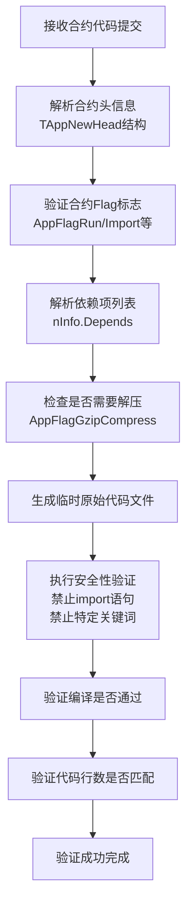
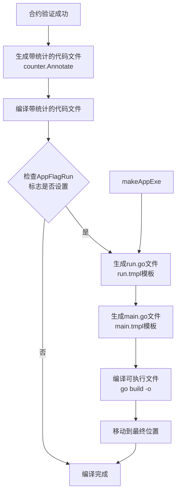
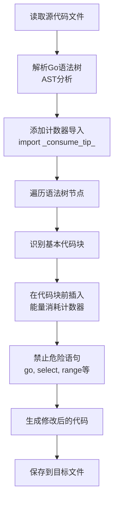
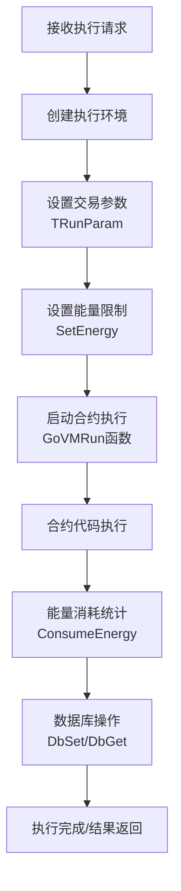

# GoVM 智能合约处理流程

本文档详细分析了GoVM如何验证、编译和执行智能合约的完整流程。

## 合约验证流程

GoVM在部署智能合约时会进行一系列的验证，确保合约代码符合安全标准和执行要求。

### 验证流程图



### 验证过程详解

1. **接收合约代码提交**
   - 客户端提交合约代码，包含头信息和代码内容

2. **解析合约头信息**
   - 解析`TAppNewHead`结构，获取行数、类型、标志和依赖数量
   ```go
   nInfo := TAppNewInfo{}
   n := Decode(code, &nInfo.TAppNewHead)
   ```

3. **验证合约Flag标志**
   - 检查标志是否合法，标志决定合约的权限
   ```go
   if nInfo.Flag >= AppFlagEnd {
      log.Panicf("error flag,%x", nInfo.Flag)
   }
   ```

4. **解析依赖项列表**
   - 解析合约依赖的其他应用
   ```go
   for i := 0; i < int(nInfo.DependNum); i++ {
      item := TDependItem{}
      n := Decode(code, &item)
      code = code[n:]
      nInfo.Depends = append(nInfo.Depends, item)
   }
   ```

5. **检查是否需要解压**
   - 如果使用了Gzip压缩，则解压代码
   ```go
   if nInfo.Flag&AppFlagGzipCompress != 0 {
      // 解压代码
      buf := bytes.NewBuffer(code)
      var out bytes.Buffer
      zr, err := gzip.NewReader(buf)
      // ...
   }
   ```

6. **执行安全性验证**
   - 检查代码不包含禁止的导入语句和关键词
   ```go
   if bytes.Index(code, []byte("import")) != -1 {
      log.Panic("code include 'import'")
   }
   
   if bytes.Index(code, []byte("_consume_tip_")) != -1 {
      log.Panic("code include '_consume_tip_'")
   }
   ```

7. **验证编译是否通过**
   - 编译原始代码，确保语法正确性
   ```go
   cmd := exec.Command("go", "build", srcFilePath)
   // ...
   err = cmd.Run()
   if err != nil {
      log.Panic("fail to build source file:", srcFilePath, err)
   }
   ```

8. **验证代码行数是否匹配**
   - 确保代码行数与声明一致，防止恶意代码注入
   ```go
   lineNum := counter.Annotate(srcRelFN, dstRelFN)
   if lineNum != uint64(nInfo.LineNum) {
      log.Panic("error line number:", lineNum, ",hope:", nInfo.LineNum)
   }
   ```

## 合约编译流程

GoVM采用了一种独特的方式来编译和部署智能合约，直接使用Go原生的编译工具链。

### 编译流程图



### 编译过程详解

1. **生成带统计的代码文件**
   - 使用`counter.Annotate`对源代码进行修改，添加能量消耗统计代码
   ```go
   lineNum := counter.Annotate(srcRelFN, dstRelFN)
   ```

2. **编译带统计的代码文件**
   - 确保带统计代码的文件能正确编译
   ```go
   cmd = exec.Command("go", "build", dstFileName)
   // ...
   err = cmd.Run()
   ```

3. **检查是否需要生成可执行文件**
   - 如果设置了`AppFlagRun`标志，则需要创建可执行文件
   ```go
   if nInfo.Flag&AppFlagRun != 0 {
      makeAppExe(chain, name)
   }
   ```

4. **生成run.go文件**
   - 使用`run.tmpl`模板创建运行接口
   ```go
   s1, err := template.ParseFiles(path.Join(BuildDir, "run.tmpl"))
   // ...
   err = s1.Execute(f, info)
   ```

5. **生成main.go文件**
   - 使用`main.tmpl`模板创建主程序
   ```go
   s2, _ := template.ParseFiles(path.Join(BuildDir, "main.tmpl"))
   s2.Execute(fm, info)
   ```

6. **编译可执行文件**
   - 将main.go编译为可执行文件
   ```go
   cmd := exec.Command("go", "build", "-o", exeFile, fn)
   // ...
   err = cmd.Run()
   ```

7. **移动到最终位置**
   - 将编译好的可执行文件移动到应用目录
   ```go
   binFile := path.Join(BuildDir, realPath, execName)
   os.Remove(binFile)
   os.Rename(path.Join(BuildDir, exeFile), binFile)
   ```

## 合约能量统计注入

GoVM使用AST (抽象语法树) 分析来注入能量消耗统计代码。

### 代码注入流程图



### 代码注入详解

1. **读取源代码文件**
   ```go
   content, err := ioutil.ReadFile(name)
   ```

2. **解析Go语法树**
   ```go
   parsedFile, err := parser.ParseFile(fset, name, content, parser.ParseComments)
   ```

3. **添加计数器导入**
   ```go
   file.edit.Insert(file.offset(file.astFile.Name.End()),
      fmt.Sprintf("\n\nimport %s %q", atomicPackageName, atomicPackagePath))
   ```

4. **遍历语法树节点**
   ```go
   ast.Walk(file, file.astFile)
   ```

5. **识别基本代码块**
   - 在控制流语句（if, for, switch等）前后添加计数器

6. **插入能量消耗计数器**
   ```go
   stmt := fmt.Sprintf("%s.ConsumeEnergy(%d)", atomicPackageName, numStmt)
   ```

7. **禁止危险语句**
   ```go
   case *ast.GoStmt:
      log.Panic("not support 'go'")
   case *ast.SelectStmt:
      log.Panic("not support 'select'")
   case *ast.RangeStmt:
      log.Panic("not support 'range'")
   ```

## 合约执行流程

GoVM通过创建独立的进程来执行智能合约，确保隔离性和资源控制。

### 执行流程图



### 执行过程详解

1. **接收执行请求**
   - 接收包含用户地址、数据和能量限制的执行请求

2. **创建执行环境**
   - 设置数据库连接和运行环境
   ```go
   dbc := client.New(addrType, address, 1)
   ```

3. **设置交易参数**
   - 解析交易哈希和交易参数
   ```go
   d = dbc.Get({{.ChainID}}, []byte(tbOfRunParam), paramKey)
   // ...
   err = dec.Decode(&args)
   ```

4. **设置能量限制**
   - 配置合约可用的能量上限
   ```go
   counter.SetEnergy(args.Energy)
   ```

5. **启动合约执行**
   - 调用合约的入口函数
   ```go
   app.GoVMRun(args.User, args.Data, args.Cost)
   ```

6. **合约代码执行**
   - 合约代码在隔离环境中执行

7. **能量消耗统计**
   - 每个基本代码块执行时会消耗能量
   ```go
   _consume_tip_.ConsumeEnergy(n)
   ```

8. **数据库操作**
   - 合约可以通过Runtime接口进行状态读写
   ```go
   DbSet(owner interface{}, key, value []byte, life uint64)
   DbGet(owner interface{}, key []byte) ([]byte, uint64)
   ```

9. **执行完成/结果返回**
   - 执行结果写入数据库
   ```go
   dbc.Set({{.ChainID}}, []byte(tbOfRunResult), paramKey, []byte(rst))
   ```

## 总结

GoVM的合约处理流程充分利用了Go语言的原生编译器和运行时，通过以下步骤实现了安全高效的合约执行：

1. **验证阶段**: 确保合约代码符合安全规范和执行限制
2. **编译阶段**: 使用Go原生编译工具链，同时注入能量统计代码
3. **执行阶段**: 在隔离环境中运行合约，控制资源使用

这种基于原生语言的虚拟机实现方式，相比基于解释器的虚拟机(如EVM)，具有更好的性能和更丰富的语言特性支持，但同时也对运行环境有更高的要求。 