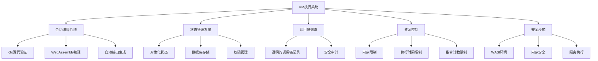
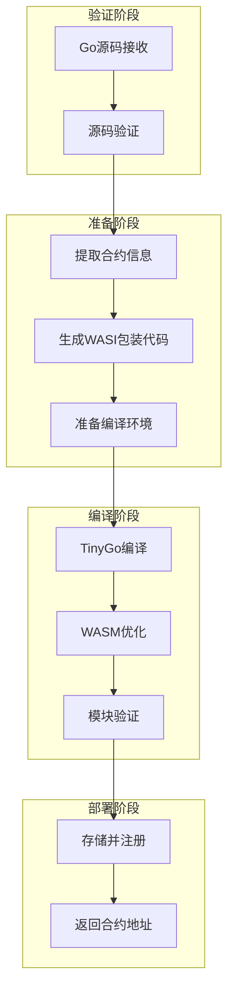
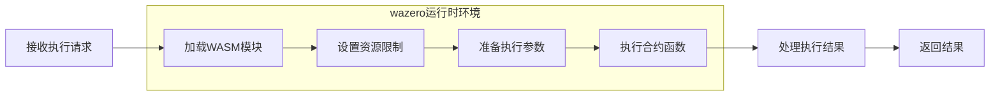
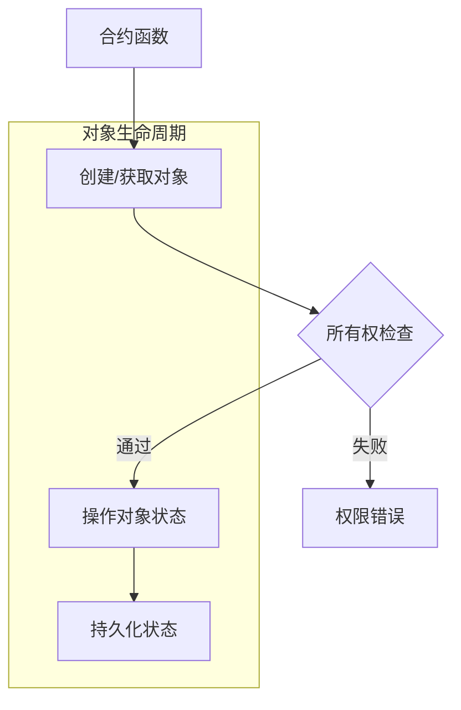

# VM 架构文档：基于 WebAssembly 的区块链智能合约执行系统

## 1. 系统概述

VM 系统是一个专为区块链智能合约设计的新型执行环境，采用 Go 语言实现，将智能合约编译为 WebAssembly 模块并通过 wazero 运行时执行。与传统的区块链虚拟机不同，该系统让开发者能够使用 Go 语言编写智能合约，同时享受 WebAssembly 带来的安全性、跨平台性和性能优势。

### 1.1 核心设计理念

- **Go 智能合约 + WebAssembly 执行**：结合 Go 语言的安全性与 WebAssembly 的高效执行
- **状态与逻辑分离**：采用无状态合约设计，逻辑与数据分离，提高系统弹性
- **对象化状态模型**：所有状态通过对象表示，每个对象有唯一标识符和所有者
- **透明的安全基础设施**：调用链追踪、权限控制等安全机制对开发者透明
- **精细的资源控制**：对内存、执行时间和计算资源实施严格限制

### 1.2 主要功能特性



## 2. 系统架构

VM 系统架构采用分层设计，每一层都有明确的职责和接口：

### 2.1 整体架构层次

```
┌───────────────────────────────────────────────────────────┐
│                  应用层 (Application Layer)                 │
│                                                           │
│  ┌─────────────┐  ┌─────────────┐  ┌─────────────────┐    │
│  │  智能合约示例  │  │ CLI工具     │  │ 区块链集成接口    │    │
│  └─────────────┘  └─────────────┘  └─────────────────┘    │
└───────────────────────────────────────────────────────────┘
                            ▲
                            │
                            ▼
┌───────────────────────────────────────────────────────────┐
│                  核心层 (Core Layer)                        │
│                                                           │
│  ┌─────────────┐  ┌─────────────┐  ┌─────────────────┐    │
│  │   API接口    │  │  虚拟机引擎  │  │   状态管理系统   │    │
│  └─────────────┘  └─────────────┘  └─────────────────┘    │
└───────────────────────────────────────────────────────────┘
                            ▲
                            │
                            ▼
┌───────────────────────────────────────────────────────────┐
│               执行环境层 (Execution Layer)                  │
│                                                           │
│  ┌─────────────┐  ┌─────────────┐  ┌─────────────────┐    │
│  │  WASM编译器  │  │ wazero运行时 │  │ WASI系统接口    │    │
│  └─────────────┘  └─────────────┘  └─────────────────┘    │
└───────────────────────────────────────────────────────────┘
                            ▲
                            │
                            ▼
┌───────────────────────────────────────────────────────────┐
│               存储与基础设施层 (Storage Layer)               │
│                                                           │
│  ┌─────────────┐  ┌─────────────┐  ┌─────────────────┐    │
│  │  数据库存储   │  │  文件系统   │  │   资源监控      │    │
│  └─────────────┘  └─────────────┘  └─────────────────┘    │
└───────────────────────────────────────────────────────────┘
```

### 2.2 详细代码结构

新的目录结构更加清晰地反映了系统的各个组件及其关系，并且对合约开发者隐藏了不必要的复杂性：

```
/
├── cmd/                        # 命令行工具
│   ├── vm-cli/                 # VM管理命令行工具
│   └── contract-compiler/      # 合约编译工具
│
├── core/                       # 核心接口定义（面向合约开发者）
│   └── interface.go            # 合约所需的核心接口定义(Context, Object)
│
├── types/                      # 基础类型定义（内部使用）
│   ├── common.go               # 通用类型定义
│   └── errors.go               # 错误类型定义
│
├── api/                        # API接口定义（面向平台集成者）
│   ├── system_api.go           # 系统API接口
│   └── config.go               # 配置接口
│
├── compiler/                   # 合约编译系统
│   ├── validator.go            # 源码验证
│   ├── tinygo.go               # TinyGo编译集成
│   ├── wasm_optimizer.go       # WASM优化工具
│   └── wrapper_generator.go    # WASI包装代码生成
│
├── vm/                         # 虚拟机实现
│   ├── engine.go               # VM引擎主实现
│   └── execution_context.go    # 执行上下文实现
│
├── state/                      # 状态管理系统
│   ├── object.go               # 对象接口实现
│   ├── db_object.go            # 数据库对象实现
│   ├── memory_object.go        # 内存对象实现
│   └── state_manager.go        # 状态管理器
│
├── wasi/                       # WebAssembly系统接口
│   ├── wasm_engine.go          # WebAssembly执行引擎
│   ├── env.go                  # WASI环境变量
│   ├── filesystem.go           # 文件系统接口
│   ├── memory.go               # 内存管理
│   └── imports.go              # 导入函数实现
│
├── security/                   # 安全系统
│   ├── call_tracer.go          # 调用链追踪
│   ├── permissions.go          # 权限控制
│   └── resource_limiter.go     # 资源限制器
│
├── utils/                      # 工具库
│   ├── serialization.go        # 参数序列化
│   ├── wasm_utils.go           # WASM辅助工具
│   └── crypto.go               # 加密工具
│
└── examples/                   # 示例合约
    ├── token/                  # 代币合约
    ├── counter/                # 计数器示例
    └── nft/                    # NFT合约示例
```

## 3. 核心组件详解

### 3.1 合约接口系统

VM系统提供了精简的接口系统，仅暴露合约开发者需要的核心接口，隐藏内部实现细节：

#### 3.1.1 核心接口设计理念

对合约开发者而言，VM系统采取了"最小接口表面积"原则，只在`core/interface.go`中暴露必要的两个接口：

1. **Context接口**：为合约提供与区块链环境交互的能力
2. **Object接口**：为合约提供操作状态对象的能力

这种设计大大简化了合约开发者的学习曲线，使他们能够专注于业务逻辑而不是系统细节。开发者只需导入单一的`github.com/govm-net/vm/core`包，即可获得编写合约所需的全部接口定义。系统的所有复杂性都被封装在这两个简洁的接口背后，使得合约开发变得简单直观。

```go
import "github.com/govm-net/vm/core"

// 在合约中使用Context和Object接口
func MyContractFunction(ctx core.Context, param string) (core.ObjectID, error) {
    // 使用Context和Object接口完成合约逻辑
}
```

#### 3.1.2 Context接口

Context是合约与区块链环境交互的主要接口：

```go
// Context 接口定义
type Context interface {
    // 区块链信息相关
    BlockHeight() uint64          // 获取当前区块高度
    BlockTime() int64             // 获取当前区块时间戳
    ContractAddress() Address     // 获取当前合约地址
    
    // 账户操作相关
    Sender() Address              // 获取交易发送者或调用合约
    Balance(addr Address) uint64  // 获取账户余额
    Transfer(to Address, amount uint64) error // 转账操作
    
    // 对象存储相关 - 基础状态操作使用panic而非返回error
    CreateObject() Object                      // 创建新对象，失败时panic
    GetObject(id ObjectID) (Object, error)     // 获取指定对象，可能返回error
    GetObjectWithOwner(owner Address) (Object, error) // 按所有者获取对象，可能返回error
    DeleteObject(id ObjectID)                  // 删除对象，失败时panic
    
    // 跨合约调用
    Call(contract Address, function string, args ...any) ([]byte, error)
    
    // 日志与事件
    Log(eventName string, keyValues ...interface{}) // 记录事件
}
```

#### 3.1.3 Object接口

Object接口用于管理区块链状态对象：

```go
// Object 接口定义
type Object interface {
    ID() ObjectID           // 获取对象ID
    Owner() Address         // 获取对象所有者
    SetOwner(addr Address)  // 设置对象所有者，失败时panic
    
    // 字段操作
    Get(field string, value any) error  // 获取字段值
    Set(field string, value any) error  // 设置字段值
}
```

### 3.2 WebAssembly执行环境

VM系统使用WebAssembly作为智能合约的执行环境，确保安全、高效和跨平台兼容。所有这些细节对合约开发者透明，他们只需要关注core接口，无需理解WebAssembly的内部工作机制：

#### 3.2.1 合约编译流程

将Go源码转换为WebAssembly模块的流程：



#### 3.2.2 执行流程

WebAssembly合约的执行流程：



### 3.3 调用链追踪机制

调用链追踪是一个透明的底层基础设施，为智能合约系统提供关键的安全保障，无需开发者感知：

```mermaid
flowchart TD
    A[用户] --> B[合约A]
    B --> C[合约B]
    C --> D[合约C]
    
    subgraph 调用链追踪（底层机制）
        B1[自动记录] --- B
        C1[自动记录] --- C
        D1[自动记录] --- D
    end
    
    style A fill:#f9f,stroke:#333
    style B fill:#bbf,stroke:#333
    style C fill:#bbf,stroke:#333
    style D fill:#bbf,stroke:#333
```

#### 3.3.1 自动插桩

系统在编译阶段自动在代码中插入调用链追踪代码，对开发者完全透明：

```go
// 原始合约代码（开发者视角）
func Transfer(to Address, amount uint64) error {
    // 业务逻辑...
}

// 系统自动插桩后的代码（系统内部实现，开发者不可见）
func Transfer(to Address, amount uint64) error {
    // 自动插入的调用链记录代码
    // 对开发者完全透明
    
    // 原始业务逻辑...
}
```

### 3.4 资源控制系统

WebAssembly执行环境提供精细的资源控制机制：

```go
// WebAssembly资源限制选项
type WASIOptions struct {
    MemoryLimit     uint64    // 内存限制 (字节)
    TableSize       uint64    // 函数表大小
    Timeout         uint64    // 执行超时 (毫秒)
    FuelLimit       uint64    // 指令计数限制
    StackSize       uint64    // 栈大小 (字节)
    EnableSIMD      bool      // 是否启用SIMD指令
    EnableThreads   bool      // 是否启用线程
    EnableBulkMemory bool     // 是否启用批量内存操作
}
```

### 3.5 接口可见性设计

VM系统采用了精心设计的接口可见性策略，为不同的用户群体提供恰当的抽象级别：

| 用户群体 | 可见接口 | 隐藏内容 | 设计目的 |
|---------|---------|---------|---------|
| 合约开发者 | core/interface.go | 内部实现、类型定义、API细节 | 降低学习门槛，聚焦业务逻辑 |
| 平台集成者 | api/目录下接口 | 内部实现细节 | 提供灵活的集成选项 |
| 系统开发者 | 全部代码 | 无 | 允许系统级扩展和定制 |

这种分层的接口可见性设计确保了每类用户只需关注其所需的复杂度级别，显著提高了开发效率和系统可用性。对合约开发者而言，只需了解core/interface.go中定义的两个接口即可开始编写功能完备的智能合约。

### 3.6 资源控制与Gas计费

VM系统实现了完整的资源控制机制，其中Gas计费是核心部分：

#### 3.6.1 Gas计费原理

Gas计费系统从两个维度实现资源控制：

1. **代码行计费**：
   - 在合约编译阶段，通过`AddGasConsumption`函数自动在代码中插入Gas消耗点
   - 每个代码块开始处注入Gas消耗代码
   - 每行代码执行消耗1点gas
   - 支持条件语句、循环语句等复杂控制流结构

2. **接口操作计费**：
   - 所有的Context和Object接口调用都有固定的gas消耗
   - 基础操作（如查询区块信息）消耗较少gas
   - 存储操作（如创建对象、修改字段）消耗较多gas
   - 合约调用等高级操作有额外的gas预留机制

#### 3.6.2 Gas消耗值

| 接口 | 操作 | Gas消耗 |
|-----|-----|---------|
| **Context** | Sender() | 10 gas |
| | BlockHeight() | 10 gas |
| | BlockTime() | 10 gas |
| | ContractAddress() | 10 gas |
| | Balance(addr) | 50 gas |
| | Transfer(to, amount) | 500 gas |
| | Call(contract, function, args...) | 10000 gas + 被调用合约消耗 |
| | CreateObject() | 50 gas |
| | GetObject(id) | 50 gas |
| | GetObjectWithOwner(owner) | 50 gas |
| | DeleteObject(id) | 500 gas - 800 gas(退还) |
| | Log(event, keyValues...) | 100 gas + 数据长度 |
| **Object** | ID() | 10 gas |
| | Contract() | 100 gas |
| | Owner() | 100 gas |
| | SetOwner(owner) | 500 gas |
| | Get(field, value) | 100 gas + 结果数据大小 |
| | Set(field, value) | 1000 gas + 数据大小 * 100 gas |

#### 3.6.3 Gas控制机制

VM系统的Gas控制具有以下特点：

1. **并发安全**：通过互斥锁确保并发环境下的Gas计数安全
2. **自动注入**：在编译阶段自动注入Gas消耗代码，无需开发者手动添加
3. **预留机制**：合约调用时预留足够的Gas供被调用合约使用
4. **动态计费**：部分操作（如存储）根据数据大小动态计算Gas消耗
5. **资源限制**：当Gas耗尽时自动终止合约执行，防止资源滥用
6. **Gas退还**：某些操作（如删除对象）会退还部分Gas

## 4. 状态管理系统

### 4.1 对象化状态模型

VM系统采用对象化状态模型，所有状态通过对象表示：



### 4.2 数据库存储模型

持久化状态存储采用键值数据库模型：

```
对象元数据：'o' + 对象ID -> 对象元数据(ID, 所有者)
字段值：'f' + 对象ID + 字段名 -> 字段值
所有者索引：'w' + 所有者地址 + 对象ID -> 空值（用于快速查询）
```

## 5. 安全机制

VM系统实现了多层安全机制：

### 5.1 代码安全

- **源码验证**：检查禁止的导入包、危险关键字和合约大小
- **自动插桩**：编译期自动注入安全检查代码
- **类型安全**：利用Go语言的类型系统和严格的参数检查

### 5.2 执行安全

- **WebAssembly沙箱**：合约在隔离环境中执行，无法直接访问主机系统
- **内存隔离**：WebAssembly提供的内存安全保障
- **权限控制**：所有敏感操作都有权限检查

### 5.3 资源控制

- **内存限制**：控制合约可使用的最大内存
- **执行时间限制**：防止无限循环
- **指令计数限制**：通过燃料系统控制执行成本
- **深度限制**：限制调用栈深度，防止栈溢出

## 6. WebAssembly 优势

### 6.1 性能优势

- **接近原生速度**：执行速度接近原生代码，远超解释执行
- **高效内存模型**：线性内存模型减少间接访问开销
- **编译优化**：支持JIT和AOT编译
- **低调用开销**：函数调用和参数传递开销小

### 6.2 安全优势

- **内存安全**：内置的内存边界检查
- **沙箱执行**：完全隔离的执行环境
- **确定性**：相同输入产生相同结果
- **资源控制**：精确控制合约资源使用

### 6.3 兼容性优势

- **跨平台**：在任何支持WebAssembly的环境中执行
- **环境独立**：不依赖特定操作系统或硬件
- **版本稳定**：WebAssembly规范稳定，保证长期兼容性

## 7. 合约开发最佳实践

### 7.1 合约设计原则

- **专注核心接口**：仅依赖core/interface.go中定义的Context和Object接口，不依赖任何实现细节
- **无状态设计**：合约逻辑不存储状态，而是操作外部对象
- **所有权检查**：验证交易发送者是否有权执行操作
- **错误处理**：提供清晰的错误信息，区分系统错误和业务错误
- **事件记录**：记录关键状态变更，便于审计和追踪

### 7.2 简化的合约开发流程

VM系统设计遵循"简单胜于复杂"的原则，为合约开发者提供极简的开发流程：

1. **单一接口文件**：整个合约开发只需关注core/interface.go中定义的接口
   ```go
   import "github.com/govm-net/vm/core"
   ```

2. **两个核心接口**：所有合约功能都通过Context和Object接口访问
   ```go
   func Initialize(ctx core.Context) (core.ObjectID, error) {
       obj := ctx.CreateObject()
       // ... 业务逻辑 ...
       return obj.ID(), nil
   }
   ```

3. **专注业务逻辑**：开发者只需专注于业务逻辑实现，无需了解底层WebAssembly细节
   ```go
   func Transfer(ctx core.Context, to core.Address, amount uint64) error {
       // 仅关注业务逻辑，底层细节由VM系统处理
       // ...
   }
   ```

### 7.3 性能优化

- **减少内存分配**：重用缓冲区，避免频繁分配
- **减少跨合约调用**：合并相关操作，减少调用次数
- **批量操作**：使用批量操作代替多次单独操作
- **优化数据结构**：选择合适的数据结构，减少操作复杂度

### 7.4 TinyGo兼容性考虑

- **标准库限制**：注意TinyGo对标准库支持的限制
- **内存管理**：设计合理的对象生命周期
- **简化类型**：避免复杂的泛型和接口类型断言

### 7.5 简洁合约示例

以下是一个遵循最佳实践的简洁合约示例，展示了如何只使用core/interface.go中的接口进行开发：

```go
package simpletoken

import "github.com/govm-net/vm/core"

// Initialize 创建一个简单的代币合约
func Initialize(ctx core.Context, name string, totalSupply uint64) (core.ObjectID, error) {
    // 创建代币信息对象
    infoObj := ctx.CreateObject()
    infoObj.Set("name", name)
    infoObj.Set("total_supply", totalSupply)
    
    // 创建发行者余额对象
    balanceObj := ctx.CreateObject()
    balanceObj.Set("balance", totalSupply)
    balanceObj.SetOwner(ctx.Sender())
    
    // 记录初始化事件
    ctx.Log("TokenInitialized", "name", name, "total_supply", totalSupply)
    
    return infoObj.ID(), nil
}

// Transfer 在账户间转移代币
func Transfer(ctx core.Context, to core.Address, amount uint64) error {
    // 获取发送者余额对象
    senderObj, err := ctx.GetObjectWithOwner(ctx.Sender())
    if err != nil {
        return err
    }
    
    // 检查余额
    var balance uint64
    if err := senderObj.Get("balance", &balance); err != nil {
        return err
    }
    
    if balance < amount {
        return fmt.Errorf("insufficient balance")
    }
    
    // 更新发送者余额
    if err := senderObj.Set("balance", balance - amount); err != nil {
        return err
    }
    
    // 处理接收者余额
    receiverObj, err := ctx.GetObjectWithOwner(to)
    if err != nil {
        // 接收者没有余额对象，创建一个
        receiverObj = ctx.CreateObject()
        receiverObj.SetOwner(to)
        receiverObj.Set("balance", amount)
    } else {
        // 更新接收者余额
        var rcvBalance uint64
        if err := receiverObj.Get("balance", &rcvBalance); err != nil {
            return err
        }
        if err := receiverObj.Set("balance", rcvBalance + amount); err != nil {
            return err
        }
    }
    
    // 记录转账事件
    ctx.Log("Transfer", "from", ctx.Sender(), "to", to, "amount", amount)
    
    return nil
}
```

这个示例展示了如何仅使用Context和Object接口实现完整的代币合约功能，无需引入其他依赖或了解系统内部实现细节。

## 8. 未来发展方向

1. **增强的资源计费系统**：实现更精细的资源使用计量和限制
2. **更多预定义合约模板**：提供更多常用合约类型的模板
3. **改进部署流程**：增强合约代码的验证和安全检查
4. **支持复杂数据类型**：扩展参数编码/解码系统的能力
5. **状态管理优化**：改进数据库索引和查询效率
6. **WebAssembly 优化**：持续改进WASM模块的性能和大小
7. **跨平台工具链**：提供更完善的开发、测试和部署工具
8. **形式化验证**：引入智能合约的形式化验证工具

## 9. 总结

VM系统通过结合Go语言的安全性和WebAssembly的执行效率，构建了一个高性能、安全且跨平台的智能合约执行环境。透明的调用链追踪、严格的资源控制和对象化的状态管理使系统既安全又灵活，适合构建各种复杂的区块链应用。

系统的模块化设计和清晰的接口定义使其易于扩展和集成到不同的区块链平台，同时WebAssembly执行模式确保了合约的长期可维护性和跨平台兼容性。通过持续优化和扩展功能，VM系统将成为下一代区块链应用的理想基础设施。

## 10. 开发流程比较

为了展示VM系统简化的合约开发体验，以下对比了使用不同区块链平台开发智能合约的差异：

| 平台 | 开发语言 | 需要学习的概念 | 接口复杂度 | 调试难度 | 主要优势 |
|------|---------|--------------|-----------|---------|---------|
| VM系统 | Go | Context和Object接口 | 低 | 低 | 简单、熟悉的Go语言，无需学习新概念 |
| 以太坊 | Solidity | 账户模型、Gas、ABI等 | 中 | 高 | 生态系统成熟，工具丰富 |
| Cosmos | Go | Keeper、SDK、模块等 | 高 | 中 | 灵活的应用链定制能力 |
| Solana | Rust | 账户、指令、程序等 | 高 | 高 | 高性能、高并发 |

VM系统通过极简的接口设计，大大降低了合约开发的门槛，使开发者能够专注于业务逻辑而非平台细节。这一设计理念体现在整个开发流程中，从编写合约到测试部署，每个环节都保持了简洁性和清晰性。 