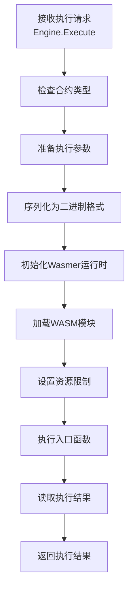
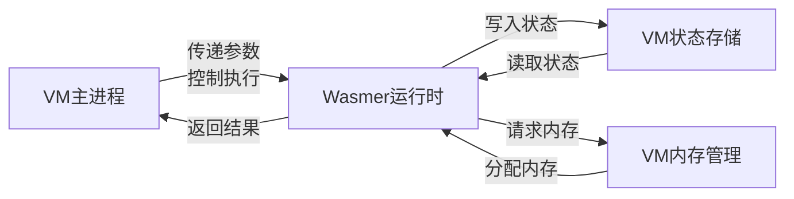

# VM 架构文档：基于 Go 语言的区块链智能合约虚拟机

## 概述

本虚拟机（VM）是一个专为区块链智能合约设计的执行环境，采用 Go 语言实现，结合了 GoVM 的一些设计理念和独特的状态管理模型。与传统的区块链虚拟机（如以太坊的 EVM）不同，本 VM 允许开发者直接使用 Go 语言编写智能合约，随后将其编译为 WebAssembly 格式执行，提供严格的安全保障和确定性执行环境。

## 核心设计理念

VM 的设计基于以下关键理念：

1. **Go 语言智能合约**：充分利用 Go 语言的类型安全、内存安全和高性能特性
2. **WebAssembly 执行**：将 Go 合约编译为 WebAssembly 模块，通过 Wasmer 运行时执行
3. **状态与逻辑分离**：采用类似 SUI 区块链的无状态合约设计，逻辑与数据分离
4. **对象化状态模型**：所有状态通过对象表示，每个对象有唯一标识符和所有者
5. **严格安全限制**：限制危险操作，确保合约执行的安全性和确定性
6. **参数编码/解码系统**：完善的参数处理机制，支持复杂数据类型
7. **跨平台兼容性**：通过 WebAssembly 支持在不同环境中运行相同合约代码
8. **精细的资源控制**：对内存、执行时间和计算资源进行严格限制

## 系统架构

VM 的架构分为三个主要层次：

### 1. 核心层 (core 包)

定义基础接口和类型：

```
contract_interface.go  # 核心接口定义：Context, Object, Address, ObjectID
```

主要接口：

- **Context**：合约执行上下文，提供区块链状态访问、合约间调用和对象管理
- **Object**：状态对象接口，提供字段存取和所有权管理
- **Address**：20 字节的地址类型，表示合约地址或用户地址
- **ObjectID**：32 字节的对象标识符

### 2. 虚拟机实现 (vm 包)

实现核心功能：

```
vm/
├── engine.go       # 主要VM实现
├── dbobject.go     # 数据库支持的状态对象
├── dbkeys.go       # 数据库键生成工具
├── engine_test.go  # 测试用例
├── api/            # 外部接口定义
├── wasi/           # WebAssembly 系统接口实现
└── runtime/        # 运行时支持
    ├── maker.go        # 合约验证、编译和实例化
    └── maker_test.go   # 测试用例
```

主要组件：

- **Engine**：VM 的主要实现，处理合约的部署和执行
- **ExecutionContext**：Context 接口的实现，提供合约执行环境
- **StateObject/DBStateObject**：Object 接口的内存和数据库实现
- **WasmEngine**：负责 WebAssembly 模块的加载和执行
- **WASI**：WebAssembly 系统接口的实现和支持

### 3. 合约示例 (contracts 包)

提供示例合约和模板：

```
contracts/
├── token.go     # 代币合约示例
└── nft.go       # NFT合约示例
```

## 执行流程

VM 使用 WebAssembly (WASI) 模式执行智能合约，整个流程如下：

### 1. 合约部署流程

合约部署通过 `engine.DeployWithOptions` 方法完成，该方法将 Go 源码转换为 WebAssembly 模块并存储在系统中。整个流程可以细分为以下八个关键步骤：

#### 1.1 源码接收与解压

首先，系统接收合约源码并检查是否使用了压缩格式：

```go
// 检查源码是否使用 GZIP 压缩
if isGzipCompressed(code) {
    code, err = decompressGzip(code)
    if err != nil {
        return core.ZeroAddress(), fmt.Errorf("failed to decompress contract code: %w", err)
    }
}
```

这一步确保系统能处理压缩后提交的合约，减少网络传输开销。

#### 1.2 源码验证

接下来，系统对合约源码进行严格验证：

```go
// 验证合约源码
if err := maker.ValidateContract(code); err != nil {
    return core.ZeroAddress(), fmt.Errorf("contract validation failed: %w", err)
}
```

验证过程包含多重检查：
- **导入检查**：确保合约只导入允许的包（如 `github.com/govm-net/vm/core`）
- **关键字检查**：禁止使用可能导致非确定性行为的 Go 关键字（如 `go`, `select`, `recover`）
- **大小限制**：确保合约代码不超过配置的最大大小
- **结构检查**：验证合约包含至少一个导出（公开）函数
- **语法检查**：确保 Go 代码语法正确，没有编译错误

#### 1.3 合约信息提取

验证通过后，系统使用 Go 的 AST（抽象语法树）分析工具提取关键信息：

```go
// 提取包名和合约结构体名称
packageName, contractName, err := maker.extractContractInfo(code)
```

该步骤会：
- 解析 Go 源码的包结构
- 确定包名（package name）
- 识别主要合约结构体（通常是第一个导出的结构体）
- 分析函数声明，建立合约接口映射

#### 1.4 WASI 包装代码生成

要让 Go 合约能够与 WebAssembly 系统接口通信，系统会生成专用的包装代码：

```go
// 生成 WASI 接口包装代码
wrapperCode := generateWASIWrapper(packageName, contractName, code)
```

包装代码提供以下功能：
- 创建与 WebAssembly 主机系统的通信桥梁
- 实现内存管理接口（分配/释放）
- 设置参数传递和结果返回机制
- 处理 WASI 环境变量和文件系统接口
- 实现错误处理和异常捕获机制

#### 1.5 编译环境准备

在执行编译前，系统会创建完整的编译环境：

```go
// 准备编译环境
tempDir, err := prepareCompilationEnvironment(code, wrapperCode)
```

这一步会：
- 创建临时目录结构
- 构建正确的 Go 模块环境
- 设置必要的依赖关系
- 配置编译参数和环境变量

#### 1.6 TinyGo 编译

准备就绪后，系统使用 TinyGo 编译器将 Go 代码编译为 WebAssembly 模块：

```go
// 使用 TinyGo 编译为 WebAssembly
wasmCode, err := compileWithTinyGo(tempDir, options.WASIOptions)
```

编译命令示例：
```bash
tinygo build -o contract.wasm -target=wasi -opt=z -no-debug -gc=leaking ./main.go
```

编译选项说明：
- `-target=wasi`: 指定编译目标为 WebAssembly 系统接口
- `-opt=z`: 优化输出大小，减小 WASM 模块体积
- `-no-debug`: 移除调试信息，进一步减小文件大小
- `-gc=leaking`: 使用简化的垃圾收集器，提高运行时性能

#### 1.7 模块优化与验证

编译后，系统会验证生成的 WebAssembly 模块并可能进行进一步优化：

```go
// 验证和优化 WebAssembly 模块
wasmCode, err = optimizeWasmModule(wasmCode)
```

这一步确保：
- WASM 模块格式正确（以魔数 `\0asm` 开头）
- 模块结构完整且有效
- 必要的导出函数存在
- 可能的性能和大小优化已应用

#### 1.8 存储与注册

最后，系统将编译好的 WebAssembly 模块存储到指定位置并注册到系统中：

```go
// 生成合约地址
contractAddr := generateContractAddress(wasmCode)

// 存储到文件系统
wasmPath := filepath.Join(config.WASIContractsDir, contractAddr.String()+".wasm")
os.WriteFile(wasmPath, wasmCode, 0644)

// 注册合约信息
engine.contracts[contractAddr] = wasmPath
```

完成这些步骤后，系统返回生成的合约地址，供后续调用使用。

#### 流程图示

```
┌─────────────────┐     ┌─────────────────┐     ┌──────────────────┐
│ 接收合约源码     │────>│ 解压缩 (如需)    │────>│ 验证合约源码       │
└─────────────────┘     └─────────────────┘     └──────────────────┘
          │                                               │
          ▼                                               ▼
┌─────────────────┐     ┌─────────────────┐     ┌──────────────────┐
│ 提取合约信息     │<────│ 分析 Go 代码结构  │<────│ 检查语法和限制     │
└─────────────────┘     └─────────────────┘     └──────────────────┘
          │
          ▼
┌─────────────────┐     ┌─────────────────┐     ┌──────────────────┐
│ 生成 WASI 包装   │────>│ 准备编译环境      │────>│ 设置模块依赖       │
└─────────────────┘     └─────────────────┘     └──────────────────┘
          │                                               │
          ▼                                               ▼
┌─────────────────┐     ┌─────────────────┐     ┌──────────────────┐
│ TinyGo 编译     │────>│ 优化 WASM 模块    │────>│ 验证模块有效性     │
└─────────────────┘     └─────────────────┘     └──────────────────┘
          │
          ▼
┌─────────────────┐     ┌─────────────────┐     ┌──────────────────┐
│ 存储 WASM 模块   │────>│ 注册合约信息      │────>│ 返回合约地址       │
└─────────────────┘     └─────────────────┘     └──────────────────┘
```

### 2. WebAssembly 执行流程

合约部署完成后，可以通过合约地址执行合约中的函数。执行流程如下：



1. **参数准备阶段**：将参数序列化为适合 WebAssembly 的格式
2. **初始化阶段**：设置 Wasmer 运行时环境和模块
3. **资源控制**：设置内存限制、执行时间限制和指令计数限制
4. **执行阶段**：在受限的 WebAssembly 沙箱环境中执行合约
5. **结果处理阶段**：从 WebAssembly 内存中读取执行结果并反序列化

### 3. 内存和状态交互



WebAssembly 模块通过导入函数与 VM 系统交互：
- **内存管理函数**：分配、读取和写入 WASM 内存
- **状态读写函数**：访问和修改区块链状态
- **上下文信息函数**：获取发送方地址、区块高度等上下文信息

## 状态管理模型

VM 支持两种类型的状态对象：

1. **内存状态对象 (StateObject)**：
   - 数据存储在内存中
   - 适用于临时状态或测试

2. **数据库状态对象 (DBStateObject)**：
   - 数据持久化在数据库中
   - 支持按所有者索引和查询
   - 使用前缀键系统组织数据

### 数据库状态键结构

```
对象元数据：'o' + 合约地址 + 对象ID -> 对象元数据(ID, 类型, 所有者)
字段值：'f' + 合约地址 + 对象ID + 字段名 -> 字段值
所有者索引：'i' + 合约地址 + 所有者地址 + 对象ID -> 空值(用于查找)
```

## 参数编码/解码系统

VM 提供了完整的参数编码和解码系统，用于在主进程和 WebAssembly 模块之间传递数据：

### 编码系统 (EncodeParam)

- 支持基本类型（字符串、数字、布尔值）
- 支持特殊类型（ObjectID、Address）
- 支持实现了 Encoder 接口的自定义类型
- 使用二进制格式提高效率

### 解码系统 (DecodeParam)

- 根据目标类型解析输入字节
- 支持从 WASM 内存读取数据
- 优雅处理空值和类型转换
- 提供适当的错误信息

## 安全机制

VM 实现了多层安全机制：

1. **代码验证**：
   - 检查禁止的导入包
   - 限制危险关键字使用（go、select、range等）
   - 验证合约大小

2. **WebAssembly 沙箱**：
   - WASM 提供的内存安全和沙箱执行环境
   - 禁止直接访问文件系统和网络
   - 内存隔离，防止内存泄露和溢出攻击

3. **资源限制**：
   - 内存使用限制
   - 执行时间限制
   - 指令计数限制（fuel）
   - 调用堆栈深度限制

4. **类型安全**：
   - 严格参数类型检查
   - 安全的编码/解码机制

## 与 GoVM 的比较

本 VM 借鉴了 GoVM 的一些设计概念，但有一些关键区别：

### 相似点
- 基于 Go 语言实现
- 支持 Go 编写的智能合约
- 强调安全性和确定性执行

### 区别
- **代码执行方式**：
  - GoVM 主要依赖独立进程执行
  - 本 VM 使用 WebAssembly 执行，提供更好的跨平台性和安全性
  
- **状态模型**：
  - GoVM 使用键值存储管理状态
  - 本 VM 采用无状态合约和对象化状态，类似 SUI 区块链
  
- **能量/资源系统**：
  - GoVM 有更完善的能量系统，在编译时注入计费代码
  - 本 VM 使用 WebAssembly 内置的资源控制机制，更加灵活和可靠
  
- **通信机制**：
  - GoVM 通过数据库进行合约间通信
  - 本 VM 使用 WASI 导入函数和内存映射传递参数和结果
  
- **错误处理**：
  - GoVM 使用 Panic 机制处理合约错误
  - 本 VM 使用错误返回值和 WebAssembly 错误码处理错误

## 合约开发指南

### 合约结构示例

```go
package mycontract

import (
    "github.com/govm-net/vm/core"
)

// 合约结构体 - 无状态设计
type MyContract struct{}

// 常量定义
const (
    DATA_OBJECT_TYPE = "Data"
)

// 初始化函数 - 部署时调用
func (c *MyContract) Initialize(ctx core.Context, initialValue string) (core.ObjectID, error) {
    // 创建一个数据对象
    dataObj, err := ctx.CreateObject()
    if err != nil {
        return core.ObjectID{}, err
    }
    
    // 设置初始值
    err = dataObj.Set("value", initialValue)
    if err != nil {
        return core.ObjectID{}, err
    }
    
    // 返回对象ID供后续使用
    return dataObj.ID(), nil
}

// 公共函数 - 读取值
func (c *MyContract) GetValue(ctx core.Context, dataObjectID core.ObjectID) (string, error) {
    // 获取数据对象
    dataObj, err := ctx.GetObject(dataObjectID)
    if err != nil {
        return "", err
    }
    
    // 读取值
    value, err := dataObj.Get("value")
    if err != nil {
        return "", err
    }
    
    return value.(string), nil
}

// 公共函数 - 设置值
func (c *MyContract) SetValue(ctx core.Context, dataObjectID core.ObjectID, newValue string) (bool, error) {
    // 获取数据对象
    dataObj, err := ctx.GetObject(dataObjectID)
    if err != nil {
        return false, err
    }
    
    // 验证所有权
    if dataObj.Owner() != ctx.Sender() {
        return false, core.ErrUnauthorized
    }
    
    // 更新值
    err = dataObj.Set("value", newValue)
    if err != nil {
        return false, err
    }
    
    // 记录事件
    ctx.Log("ValueChanged", dataObjectID, newValue)
    
    return true, nil
}
```

### 最佳实践

1. **无状态设计**：合约不应存储状态，而是操作外部对象
2. **权限检查**：验证调用者是否有权执行操作
3. **错误处理**：提供明确的错误信息
4. **事件记录**：使用 Log 方法记录重要操作
5. **类型安全**：利用 Go 的类型系统确保正确性
6. **考虑 TinyGo 兼容性**：注意 TinyGo 编译器的限制，避免使用不支持的功能
7. **内存效率**：优化内存使用，避免大量临时对象创建

## 未来发展方向

1. **增强的资源计费系统**：实现更精细的资源使用计量和限制
2. **更多预定义合约模板**：提供更多常用合约类型
3. **改进部署流程**：增强合约代码的验证和安全检查
4. **支持复杂数据类型**：扩展参数编码/解码系统
5. **状态管理优化**：改进数据库索引和查询效率
6. **WebAssembly 优化**：改进 WASI 模块的性能和大小
7. **跨平台兼容性**：增强在各种环境中的部署选项
8. **形式化验证**：提供合约行为的形式化验证工具

## 总结

VM 提供了一个高效、安全且跨平台的智能合约执行环境，通过将 Go 语言智能合约编译为 WebAssembly 模块并使用 Wasmer 运行时执行，实现了理想的性能和安全平衡。无状态合约设计和对象化状态管理方式让智能合约开发既灵活又高效，适合各种区块链应用场景。WebAssembly 执行模式的采用进一步增强了跨平台兼容性和资源控制能力，使 VM 成为构建下一代区块链应用的理想平台。 