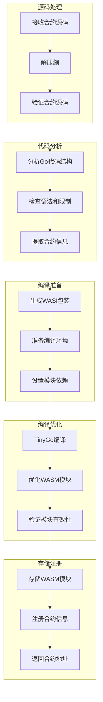
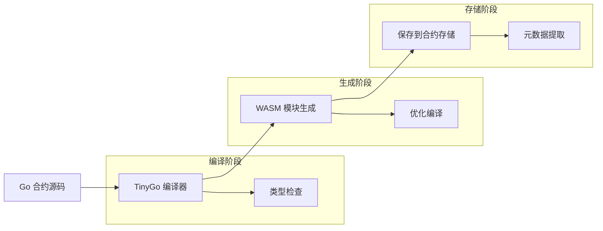
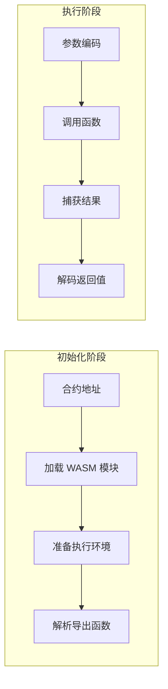
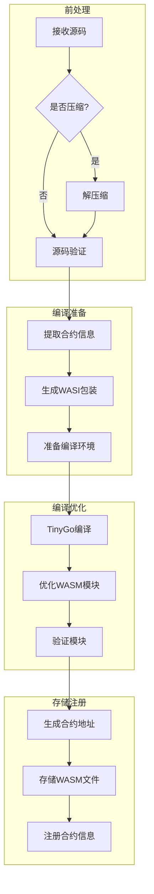
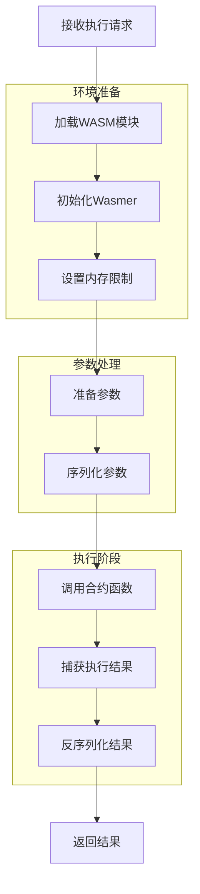

# WebAssembly 智能合约

本文档详细介绍了 VM 项目中的 WebAssembly (WASI) 合约执行模式，该模式通过 TinyGo 将 Go 代码编译为 WebAssembly 模块，并使用 Wasmer 运行时执行。

## WebAssembly 执行模式概述

VM 项目采用 WebAssembly 作为合约执行的核心技术，通过以下步骤实现：

1. 使用 TinyGo 将 Go 合约代码编译为符合 WASI 规范的 WebAssembly 模块
2. 由 Wasmer 运行时加载和执行这些 WebAssembly 模块
3. 通过 WASI 接口在合约与 VM 环境之间实现安全通信
4. 确保合约在沙箱环境中执行，且能被精确控制资源使用

## 合约示例

下面是一个简单的代币合约示例，展示了如何编写标准的智能合约：

```go
package token

import (
    "fmt"
    "github.com/govm-net/vm"
)

// Initialize 初始化代币合约，创建初始供应量
func Initialize(ctx vm.Context, totalSupply uint64) (vm.ObjectID, error) {
    // 创建代币发行者的余额对象
    balanceObj, err := ctx.CreateObject()
    if err != nil {
        return vm.ObjectID{}, fmt.Errorf("failed to create balance object: %w", err)
    }

    // 设置发行者的初始余额
    if err := balanceObj.Set("amount", totalSupply); err != nil {
        return vm.ObjectID{}, fmt.Errorf("failed to set initial balance: %w", err)
    }

    // 设置对象所有者为合约部署者
    balanceObj.SetOwner(ctx.Sender())

    // 记录初始化事件
    ctx.Log("Initialize", "total_supply", totalSupply, "owner", ctx.Sender())

    return balanceObj.ID(), nil
}

// Transfer 在账户之间转移代币
func Transfer(ctx vm.Context, to vm.Address, amount uint64) error {
    // 获取发送方余额对象
    fromBalance, err := ctx.GetObjectWithOwner(ctx.Sender())
    if err != nil {
        return fmt.Errorf("failed to get sender balance: %w", err)
    }

    // 获取接收方余额对象
    toBalance, err := ctx.CreateObject()
    if err != nil {
        return fmt.Errorf("failed to get receiver balance: %w", err)
    }

    // 读取当前余额
    var fromAmount uint64
    err := fromBalance.Get("amount",&fromAmount)
    if err != nil {
        return fmt.Errorf("failed to get sender amount: %w", err)
    }

    // 检查余额是否充足
    if fromAmount < amount {
        return fmt.Errorf("insufficient balance: %d < %d", fromAmount, amount)
    }

    // 更新双方余额
    if err := fromBalance.Set("amount", fromAmount-amount); err != nil {
        return fmt.Errorf("failed to update sender balance: %w", err)
    }

    if err := toBalance.Set("amount", amount); err != nil {
        return fmt.Errorf("failed to update receiver balance: %w", err)
    }
    toBalance.SetOwner(to)

    // 记录转账事件
    ctx.Log("Transfer", 
        "from", fromBalance.Owner(),
        "to", toBalance.Owner(),
        "amount", amount)

    return nil
}

// GetBalance 查询账户余额
func GetBalance(ctx vm.Context, balanceID vm.ObjectID) (uint64, error) {
    // 获取余额对象
    balanceObj, err := ctx.GetObject(balanceID)
    if err != nil {
        return 0, fmt.Errorf("failed to get balance object: %w", err)
    }

    // 读取余额
    var amount uint64
    err := balanceObj.Get("amount",&amount)
    if err != nil {
        return 0, fmt.Errorf("failed to get amount: %w", err)
    }

    return amount, nil
}

// CreateAccount 为新用户创建账户
func CreateAccount(ctx vm.Context, owner vm.Address) (vm.ObjectID, error) {
    // 创建新的余额对象
    balanceObj, err := ctx.CreateObject()
    if err != nil {
        return vm.ObjectID{}, fmt.Errorf("failed to create balance object: %w", err)
    }

    // 设置初始余额为0
    if err := balanceObj.Set("amount", uint64(0)); err != nil {
        return vm.ObjectID{}, fmt.Errorf("failed to set initial balance: %w", err)
    }

    // 设置对象所有者
    balanceObj.SetOwner(owner)

    // 记录账户创建事件
    ctx.Log("CreateAccount", "owner", owner)

    return balanceObj.ID(), nil
}
```

这个示例展示了一个基本的代币合约，包含以下特点：

1. **包级别函数**：所有函数都是包级别的，无需定义结构体
2. **无状态设计**：所有状态都存储在外部对象中
3. **所有权控制**：通过对象所有权实现访问控制
4. **事件记录**：使用 `ctx.Log` 记录重要操作
5. **错误处理**：提供清晰的错误信息
6. **类型安全**：使用强类型确保数据安全
7. **公开接口**：所有公共函数首字母大写，自动导出为 WebAssembly 函数

使用示例：

```go
// 部署合约
code, _ := os.ReadFile("token.go")
contractAddr, _ := engine.DeployWithOptions(code, deployOptions)

// 初始化合约，发行 1000000 代币
initResult, _ := engine.ExecuteWithArgs(contractAddr, "Initialize", uint64(1000000))
ownerBalanceID := initResult.(vm.ObjectID)

// 转账 1000 代币给 Alice
_ = engine.ExecuteWithArgs(contractAddr, "Transfer", aliceAddr, uint64(1000))

// 查询 Alice 的余额
balance, _ := engine.ExecuteWithArgs(contractAddr, "GetBalance", aliceBalanceID)
fmt.Printf("Alice's balance: %d\n", balance.(uint64))
```

## Go 智能合约编译为 WebAssembly 的内部流程

本节详细介绍了 `engine.DeployWithOptions` 方法如何将 Go 源码转换为 WebAssembly 模块的内部实现细节。整个流程分为以下几个关键步骤：

### 1. 源码接收与解压

```go
func (e *Engine) DeployWithOptions(code []byte, options DeployOptions) (vm.Address, error) {
    // 检查源码是否被压缩（GZIP 格式）
    if isGzipCompressed(code) {
        var err error
        code, err = decompressGzip(code)
        if err != nil {
            return vm.ZeroAddress(), fmt.Errorf("failed to decompress contract code: %w", err)
        }
    }
    
    // 继续处理解压后的代码...
}
```

**实现细节**:
- 检测 GZIP 头部特征（以 `0x1f 0x8b` 开头的字节序列）
- 使用 `compress/gzip` 包解压缩代码
- 处理可能的解压错误，如格式不正确或损坏的压缩数据

### 2. 源码验证

合约源码必须通过严格的验证流程，以确保其安全性和与平台的兼容性：

```go
func (e *Engine) DeployWithOptions(code []byte, options DeployOptions) (vm.Address, error) {
    // ... 解压代码后
    
    // 验证合约源码
    if err := e.maker.ValidateContract(code); err != nil {
        return vm.ZeroAddress(), fmt.Errorf("contract validation failed: %w", err)
    }
    
    // 继续处理验证通过的代码...
}
```

**验证过程包括**:
- **导入检查**: 确保合约只导入允许的包（例如 `github.com/govm-net/vm/core`）
- **关键字检查**: 禁止使用可能导致非确定性行为的关键字（如 `go`, `select`, `recover`）
- **大小检查**: 确保合约代码不超过配置的最大大小限制
- **结构检查**: 验证合约包含至少一个导出（公开）函数
- **语法检查**: 确保 Go 代码语法正确，没有编译错误

### 3. 提取合约信息

从验证通过的源码中提取关键信息：

```go
func (e *Engine) extractContractInfo(code []byte) (packageName string, exportedFuncs []FunctionInfo, error) {
    // 解析 Go 源码
    fset := token.NewFileSet()
    file, err := parser.ParseFile(fset, "", code, parser.ParseComments)
    if err != nil {
        return "", nil, fmt.Errorf("failed to parse Go code: %w", err)
    }
    
    // 获取包名
    packageName = file.Name.Name
    
    // 查找导出的包级别函数
    exportedFuncs = make([]FunctionInfo, 0)
    
    ast.Inspect(file, func(n ast.Node) bool {
        switch x := n.(type) {
        case *ast.FuncDecl:
            // 检查是否为包级别函数（没有接收者）且首字母大写（导出）
            if x.Recv == nil && x.Name.IsExported() {
                // 提取函数信息
                params := make([]ParamInfo, 0)
                for _, p := range x.Type.Params.List {
                    paramType := types.ExprString(p.Type)
                    for _, name := range p.Names {
                        params = append(params, ParamInfo{
                            Name: name.Name,
                            Type: paramType,
                        })
                    }
                }
                
                // 提取返回值信息
                returns := make([]string, 0)
                if x.Type.Results != nil {
                    for _, r := range x.Type.Results.List {
                        returns = append(returns, types.ExprString(r.Type))
                    }
                }
                
                exportedFuncs = append(exportedFuncs, FunctionInfo{
                    Name:       x.Name.Name,
                    Params:     params,
                    Returns:    returns,
                    IsExported: true,
                })
            }
        }
        return true
    })
    
    if len(exportedFuncs) == 0 {
        return "", nil, errors.New("no exported functions found")
    }
    
    return packageName, exportedFuncs, nil
}
```

### 4. 添加 WASI 包装代码

为了使合约能够与 WebAssembly 系统接口通信，需要生成包装代码（包装代码将和合约代码在相同目录下）：

```go
func (e *Engine) generateWASIWrapper(packageName string, exportedFuncs []FunctionInfo) ([]byte, error) {
    // 基于原始合约代码和提取的信息生成 WASI 接口包装
    wrapperTemplate := `
package main

import (
    "encoding/binary"
    "unsafe"
)

// WebAssembly 内存接口
//export vm_alloc
func vm_alloc(size uint32) uint32

//export vm_free
func vm_free(ptr uint32)

// 其他适配代码

// 为每个导出函数生成包装器
%s

func main() {
    // WASI 模块需要 main 函数
}
`
    // 生成所有导出函数的包装代码
    var functionWrappers strings.Builder
    for _, fn := range exportedFuncs {
        wrapper := generateFunctionWrapper(fn)
        functionWrappers.WriteString(wrapper)
        functionWrappers.WriteString("\n")
    }
    
    return []byte(fmt.Sprintf(wrapperTemplate, 
        packageName,
        functionWrappers.String())), nil
}

// 生成单个函数的包装代码
func generateFunctionWrapper(fn FunctionInfo) string {
    // 生成参数声明
    params := make([]string, len(fn.Params))
    for i, p := range fn.Params {
        params[i] = fmt.Sprintf("%s %s", p.Name, p.Type)
    }
    
    // 生成返回值声明
    returns := strings.Join(fn.Returns, ", ")
    if returns != "" {
        returns = "(" + returns + ")"
    }
    
    return fmt.Sprintf(`
//export %s
func %s(%s) %s {
    // 调用合约函数
    return %s(%s)
}`, fn.Name, fn.Name, strings.Join(params, ", "), returns, fn.Name, strings.Join(paramNames(fn.Params), ", "))
}

// 辅助函数：提取参数名列表
func paramNames(params []ParamInfo) []string {
    names := make([]string, len(params))
    for i, p := range params {
        names[i] = p.Name
    }
    return names
}

// 参数信息结构
type ParamInfo struct {
    Name string
    Type string
}

// 函数信息结构
type FunctionInfo struct {
    Name       string
    Params     []ParamInfo
    Returns    []string
    IsExported bool
}
```

**包装代码的作用**:
- 提供 WebAssembly 模块的入口点
- 实现内存管理接口（分配/释放）
- 设置参数传递和结果返回的机制
- 处理 WASI 环境变量和文件系统接口
- 处理错误和异常

### 5. 准备编译环境

在编译之前，需要准备适当的环境：

```go
func (e *Engine) prepareCompilationEnvironment(code []byte, wrapperCode []byte) (string, error) {
    // 创建临时目录
    tempDir, err := os.MkdirTemp("", "wasm-compile-*")
    if err != nil {
        return "", fmt.Errorf("failed to create temp directory: %w", err)
    }
    
    // 创建目录结构
    // - 主模块目录
    // - 合约代码目录
    // - go.mod 文件
    
    // 写入原始合约代码
    // 写入包装代码
    // 创建 go.mod 指定依赖关系
    
    return tempDir, nil
}
```

**环境准备工作**:
- 创建临时目录结构
- 设置 Go 模块环境（go.mod）
- 写入原始合约代码
- 写入生成的包装代码
- 确保依赖关系正确配置

### 6. 使用 TinyGo 编译为 WebAssembly

执行 TinyGo 编译过程：

```go
func (e *Engine) compileWithTinyGo(dir string, options DeployOptions) ([]byte, error) {
    // 构建 TinyGo 命令行
    tinygoPath := e.config.TinyGoPath
    wasmOutputPath := filepath.Join(dir, "contract.wasm")
    
    args := []string{
        "build",
        "-o", wasmOutputPath,
        "-target=wasi",
        "-opt=z", // 优化大小
        "-no-debug",
        "-gc=leaking", // 简化的垃圾回收
        "./main.go",
    }
    
    // 执行 TinyGo 命令
    cmd := exec.Command(tinygoPath, args...)
    cmd.Dir = dir
    output, err := cmd.CombinedOutput()
    if err != nil {
        return nil, fmt.Errorf("TinyGo compilation failed: %s\n%s", err, output)
    }
    
    // 读取生成的 WASM 文件
    wasmCode, err := os.ReadFile(wasmOutputPath)
    if err != nil {
        return nil, fmt.Errorf("failed to read compiled WASM: %w", err)
    }
    
    return wasmCode, nil
}
```

**编译选项说明**:
- `-target=wasi`: 指定目标为 WebAssembly 系统接口
- `-opt=z`: 优化编译结果，减小 WASM 模块大小
- `-no-debug`: 删除调试信息，减小文件体积
- `-gc=leaking`: 使用简化的垃圾回收机制，提高性能

### 7. 优化和验证 WASM 模块

编译完成后，还需进行验证和优化：

```go
func (e *Engine) optimizeWasmModule(wasmCode []byte) ([]byte, error) {
    // 可选：使用 wasm-opt 工具进一步优化
    // 这一步可以通过执行外部命令实现
    
    // 验证 WASM 模块格式
    if !isValidWasmModule(wasmCode) {
        return nil, errors.New("invalid WebAssembly module format")
    }
    
    return wasmCode, nil
}
```

**验证与优化内容**:
- 检查 WASM 模块头部（魔数 `\0asm`）
- 验证模块结构完整性
- 检查必要的导出函数存在
- 可选：应用大小和性能优化

### 8. 存储编译结果

最后，将编译好的 WebAssembly 模块存储在指定位置：

```go
func (e *Engine) storeWasmContract(wasmCode []byte, options DeployOptions) (vm.Address, error) {
    // 生成合约地址
    contractAddr := generateContractAddress(wasmCode)
    
    // 创建存储目录（如果不存在）
    wasmDir := e.config.WASIContractsDir
    if err := os.MkdirAll(wasmDir, 0755); err != nil {
        return vm.ZeroAddress(), fmt.Errorf("failed to create WASI contracts directory: %w", err)
    }
    
    // 保存 WASM 模块到文件
    wasmFilePath := filepath.Join(wasmDir, contractAddr.String()+".wasm")
    if err := os.WriteFile(wasmFilePath, wasmCode, 0644); err != nil {
        return vm.ZeroAddress(), fmt.Errorf("failed to save WASM module: %w", err)
    }
    
    // 记录合约信息到内部存储
    e.contractsLock.Lock()
    e.contracts[contractAddr] = []byte(wasmFilePath) // 存储路径而非代码本身
    e.contractsLock.Unlock()
    
    return contractAddr, nil
}
```

**存储步骤**:
- 生成合约唯一地址
- 确保存储目录存在
- 保存 WASM 模块到文件系统
- 记录合约元数据（地址、路径等）

### 完整流程示意图

下面是 Go 智能合约编译为 WebAssembly 的完整流程图：



## WebAssembly 的优势

采用 WebAssembly 执行模式提供了以下显著优势：

### 1. 安全性

- **内存安全**：WebAssembly 提供内存安全保障，防止访问未授权内存区域
- **沙箱隔离**：合约在隔离环境中执行，无法直接访问主机系统
- **权限控制**：通过 WASI 精确控制合约可访问的系统资源
- **确定性执行**：保证相同输入产生相同结果，避免不确定性行为

### 2. 性能

- **接近原生速度**：WebAssembly 执行速度接近原生代码，远超解释执行
- **高效内存模型**：线性内存模型减少间接访问开销
- **优化编译**：支持多级优化，包括 JIT 编译和 AOT 编译
- **低开销调用**：函数调用和参数传递开销小

### 3. 可移植性

- **跨平台兼容**：在任何支持 WebAssembly 的环境中执行，无需重新编译
- **环境独立**：不依赖特定操作系统或硬件架构
- **版本稳定**：WebAssembly 规范稳定，避免兼容性问题
- **广泛支持**：主流编程语言和平台均支持 WebAssembly

### 4. 资源控制

- **内存限制**：精确限制合约可使用的内存量
- **执行时间控制**：设置最大执行时间，防止无限循环
- **指令计数限制**：通过燃料（fuel）系统限制执行指令数量
- **细粒度控制**：可以控制堆栈大小、表大小等细节参数

## 实现原理

VM 通过以下组件和流程实现 WebAssembly 合约执行：

### 合约编译流程

1. **合约分析**：解析 Go 源码，检查合约结构和导入
2. **TinyGo 编译**：使用 TinyGo 将 Go 代码编译为 WASI 兼容的 WebAssembly 模块
3. **元数据生成**：提取公共函数信息，创建函数映射表
4. **模块优化**：应用 WebAssembly 优化，减少模块大小
5. **沙箱配置**：设置 WASI 环境参数和访问权限

### 执行机制

1. **模块加载**：Wasmer 运行时加载 WebAssembly 模块
2. **环境准备**：设置 WASI 环境变量和目录映射
3. **函数解析**：映射合约导出函数与对应参数
4. **参数编码**：将 Go 类型参数编码为 WebAssembly 兼容格式
5. **函数调用**：调用指定函数，并捕获返回值
6. **结果解码**：将 WebAssembly 返回值解码为 Go 类型
7. **资源释放**：回收临时资源和内存

## 配置与使用

要使用 WebAssembly 合约功能，需进行以下设置：

### 基本配置

```go
// 创建支持 WASI 合约的配置
config := api.DefaultContractConfig()
config.EnableWASIContracts = true                     // 启用 WASI 合约支持
config.WASIContractsDir = filepath.Join(".", "wasi_modules") // 存储 WASM 模块的目录
config.TinyGoPath = "/usr/local/bin/tinygo"           // TinyGo 可执行文件路径（根据实际安装路径调整）

// 确保目录存在
os.MkdirAll(config.WASIContractsDir, 0755)

// 创建虚拟机实例
engine := vm.NewEngine(config)
```

### 部署 WebAssembly 合约

```go
// 读取合约代码
code, err := os.ReadFile("mycontract.go")
if err != nil {
    return err
}

// 部署为 WASI 合约
deployOptions := vm.DeployOptions{
    AsWASI: true,
    WASIOptions: vm.WASIOptions{
        MemoryLimit: 64 * 1024 * 1024, // 64MB 内存限制
        Timeout:     5000,             // 5秒超时
        TableSize:   1024,             // 函数表大小
        StackSize:   65536,            // 栈大小 (64KB)
    },
}
contractAddr, err := engine.DeployWithOptions(code, deployOptions)
if err != nil {
    return err
}
fmt.Printf("WebAssembly contract deployed at: %s\n", contractAddr.String())
```

### 执行 WebAssembly 合约函数

```go
// 执行初始化函数
result, err := engine.ExecuteWithArgs(contractAddr, "Initialize", "param1", 123)
if err != nil {
    return err
}

// 解码结果
var myResult MyType
if err := vm.DecodeResult(result, &myResult); err != nil {
    return err
}
```

## 资源控制详解

WebAssembly 执行模式提供精细的资源控制机制：

### 内存限制

```go
// 设置内存限制
WASIOptions: vm.WASIOptions{
    MemoryLimit: 64 * 1024 * 1024, // 64MB 内存限制
}
```

### 执行时间限制

```go
// 设置执行超时
WASIOptions: vm.WASIOptions{
    Timeout: 5000, // 5秒超时 (毫秒)
}
```

### 指令计数限制 (Fuel)

```go
// 设置指令限制
WASIOptions: vm.WASIOptions{
    FuelLimit: 10000000, // 限制指令执行数量
}
```

### 高级配置

```go
// 完整的 WASI 配置选项
WASIOptions: vm.WASIOptions{
    MemoryLimit:   64 * 1024 * 1024, // 内存限制
    TableSize:     1024,             // 函数表大小
    Timeout:       5000,             // 执行超时 (毫秒)
    FuelLimit:     10000000,         // 指令限制
    StackSize:     65536,            // 栈大小
    EnableSIMD:    false,            // 禁用 SIMD 指令
    EnableThreads: false,            // 禁用线程
    EnableBulkMemory: false,         // 禁用批量内存操作
    PrecompiledCache: true,          // 启用预编译缓存
}
```

## TinyGo 兼容性注意事项

使用 TinyGo 编译 WebAssembly 合约时，需注意以下兼容性问题：

### 1. 不支持的标准库包

- 大型标准库包（如 `image`, `net`, `database`）
- 反射包（`reflect`）
- 不安全包（`unsafe`）
- 并发相关包（`sync`）

### 2. 内存管理限制

- 不支持完整的垃圾回收
- 需要避免大量小内存分配
- 应合理设计对象生命周期

### 3. 类型系统限制

- 不支持复杂的接口类型断言
- 使用接口时性能开销较大
- 某些类型转换可能不被支持

### 4. 代码优化建议

- 使用简单的数据结构
- 避免复杂的泛型和反射
- 减少字符串操作和内存分配
- 使用 `//go:export` 注释导出函数

## 调试技术

调试 WebAssembly 合约时，可以使用以下方法：

### 日志调试

合约中添加详细日志：

```go
func (c *Counter) Increment(ctx vm.Context, id vm.ObjectID) (uint64, error) {
    ctx.Log("Debug", "Processing increment for object", id.String())
    // ... 其余代码 ...
}
```

### 检查生成的 WASM 模块

```bash
# 列出 WASM 模块目录
ls -la wasi_modules/

# 检查模块结构
wasm-objdump -x wasi_modules/your_contract.wasm

# 检查导出函数
wasm-objdump -j Export -x wasi_modules/your_contract.wasm
```

### 独立运行 WASM 模块

```bash
# 使用 wasmer 直接运行模块
wasmer run --mapdir=/tmp:/tmp wasi_modules/your_contract.wasm -- -debug
```

### 启用 Trace 日志

```go
// 设置 Wasmer 跟踪日志级别
config.WASIOptions.LogLevel = "trace"
```

## 性能优化

要优化 WebAssembly 合约性能，可采用以下策略：

### 编译优化

使用 TinyGo 优化参数：

```bash
tinygo build -o contract.wasm -target=wasi -opt=z -no-debug -gc=leaking contract.go
```

### 内存优化

减少内存分配和垃圾回收：

```go
// 不推荐：重复分配
for i := 0; i < 1000; i++ {
    data := make([]byte, 1024)
    // 使用 data...
}

// 推荐：重用缓冲区
buffer := make([]byte, 1024)
for i := 0; i < 1000; i++ {
    // 使用 buffer...
}
```

### 启用预编译缓存

```go
// 启用预编译缓存，提高二次加载速度
config.WASIOptions.PrecompiledCache = true
config.WASIOptions.CacheDir = "./wasm_cache"
```

## 最佳实践

### 合约设计

- **遵循无状态模式**：合约逻辑不依赖内部状态，而是操作外部状态对象
- **使用基础类型**：偏好使用基本类型和简单结构体
- **减少内存分配**：尽可能重用缓冲区
- **避免复杂迭代**：简化循环和递归操作
- **拆分大合约**：将复杂合约拆分为多个小合约

### 资源控制

- **根据合约复杂度设置适当内存限制**
- **为繁重操作分配足够超时时间**
- **在生产环境中禁用不必要功能**（SIMD, 线程等）
- **定期监控资源使用，调整限制参数**

### 安全考虑

- **验证所有输入**：不信任外部输入
- **检查对象权限**：确保调用者有权操作对象
- **记录重要操作**：使用日志记录关键操作
- **实现访问控制**：限制敏感功能的访问

## 总结

WebAssembly 合约执行模式是 VM 项目的核心功能，它将 Go 编写的智能合约编译为 WASI 兼容的 WebAssembly 模块，并通过 Wasmer 运行时执行。这种模式提供了安全隔离、接近原生的性能、跨平台兼容性以及精确的资源控制。

WebAssembly 合约特别适合：

- 高安全要求的应用场景
- 需要跨平台部署的环境
- 对性能和资源控制有严格要求的系统
- 区块链和分布式系统环境

## 附录：WebAssembly 合约部署与执行流程图

### 部署流程



### 执行流程



### 内存和状态交互流程


### 合约部署详细流程



### WebAssembly 执行详细流程

