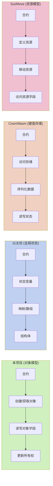

# WebAssembly 智能合约对比分析与最佳实践

本文档对比分析了基于 WebAssembly (WASI) 的 Go 智能合约与其他主流区块链智能合约系统，并提供了一系列最佳实践建议。

## 1. 智能合约系统对比

下表对比了本项目的 WebAssembly 智能合约系统与其他主流系统的关键特性：

| 特性 | Go+WebAssembly (本项目) | Solidity (以太坊) | CosmWasm (Cosmos) | Move (Sui/Aptos) |
|------|----------------------|-----------------|-----------------|----------------|
| **编程语言** | Go | Solidity | Rust | Move |
| **执行环境** | WebAssembly (WASI) | EVM | WebAssembly | MoveVM |
| **类型系统** | 静态类型，强类型 | 静态类型 | 静态类型，强类型 | 静态类型，资源类型 |
| **内存安全** | 高（Go+WASM沙箱） | 中（EVM限制） | 高（Rust+WASM） | 高（内置资源类型） |
| **开发便捷性** | 高（熟悉Go开发者） | 中（特定语言） | 中（Rust学习曲线） | 低（新语言学习） |
| **执行效率** | 高 | 中 | 高 | 高 |
| **状态模型** | 对象模型 | 全局状态 | 键值存储 | 资源模型 |
| **并行执行** | 支持（状态分离） | 不支持 | 支持（状态分离） | 支持（内置） |
| **跨平台兼容性** | 高（WebAssembly） | 低（EVM专用） | 高（WebAssembly） | 低（特定VM） |
| **社区生态** | 新兴 | 成熟 | 成长中 | 成长中 |

## 2. 关键差异分析

### 2.1 执行模型比较

### 2.2 状态管理模型比较

本项目采用的对象模型与传统合约系统有显著区别：

### 2.3 安全性对比

不同智能合约系统采用不同的安全机制：

| 安全机制 | Go+WebAssembly (本项目) | Solidity (以太坊) | CosmWasm (Cosmos) | Move (Sui/Aptos) |
|---------|----------------------|-----------------|-----------------|----------------|
| **内存安全** | Go语言+WASM沙箱 | EVM内存模型 | Rust所有权+WASM | 资源所有权系统 |
| **类型安全** | 强类型系统 | 类型系统 | 强类型系统 | 强类型+资源类型 |
| **沙箱隔离** | WebAssembly沙箱 | EVM沙箱 | WebAssembly沙箱 | MoveVM沙箱 |
| **资源控制** | 内存限制+时间限制 | Gas系统 | Gas系统 | Gas系统 |
| **代码验证** | 语法检查+禁止指令 | 编译时检查 | 编译时检查 | 形式化验证 |
| **安全漏洞** | 较少（Go类型安全） | 常见（重入等） | 较少（Rust安全） | 较少（资源安全） |

### 2.4 开发体验对比

各系统的开发体验差异：

| 开发体验 | Go+WebAssembly (本项目) | Solidity (以太坊) | CosmWasm (Cosmos) | Move (Sui/Aptos) |
|---------|----------------------|-----------------|-----------------|----------------|
| **语言普及度** | 高（Go广泛使用） | 中（特定领域） | 中（Rust成长中） | 低（新语言） |
| **学习曲线** | 低（熟悉Go开发者） | 中 | 高（Rust陡峭） | 高（新概念） |
| **工具支持** | IDE集成、调试支持 | 成熟工具链 | 成长中工具链 | 新兴工具链 |
| **测试支持** | Go测试框架 | 特定测试框架 | Rust测试+模拟 | 特定测试框架 |
| **库生态** | 丰富（Go生态） | 中等（特定生态） | 成长中 | 有限 |
| **文档质量** | 详细（本项目+Go） | 详细 | 详细 | 成长中 |

## 3. WebAssembly 智能合约优势

### 3.1 性能优势

WebAssembly 合约相比传统智能合约系统具有以下性能优势：

- **接近原生执行速度**：WebAssembly 被设计为"接近机器码"的格式，执行效率接近原生代码
- **优化的内存模型**：线性内存模型减少了内存访问开销
- **JIT 编译支持**：运行时可以使用 JIT 编译进一步提高性能
- **并行执行潜力**：对象模型的状态隔离支持合约并行执行

### 3.2 开发优势

使用 Go 语言开发 WebAssembly 智能合约的显著优势：

- **熟悉的开发环境**：使用标准 Go 开发工具和环境
- **强大的标准库**：利用 Go 丰富的标准库功能（受限但实用）
- **类型安全**：Go 的类型系统可以在编译时捕获许多错误
- **可读性**：Go 代码简洁易读，提高可维护性
- **并发支持**：虽然在合约中受限，但 Go 的并发模型有助于编写清晰代码
- **测试友好**：利用 Go 强大的测试框架进行合约测试

### 3.3 安全优势

WebAssembly 和 Go 的组合提供了卓越的安全特性：

- **内存安全**：WebAssembly 提供内存安全保障，Go 有垃圾回收
- **确定性执行**：WebAssembly 设计确保执行结果确定性
- **资源限制**：精确控制内存使用和执行时间
- **沙箱隔离**：合约在安全沙箱中执行，无法访问宿主系统资源
- **类型安全**：Go 的类型系统减少运行时错误

## 4. 最佳实践

### 4.1 合约设计最佳实践

设计 WebAssembly 智能合约的关键建议：

1. **使用对象模型**：充分利用对象模型管理状态，避免全局状态依赖
2. **清晰的函数边界**：定义明确的合约接口和公共函数
3. **权限验证**：始终检查调用者对关键操作的权限
4. **错误处理**：全面处理可能的错误情况，返回有意义的错误消息
5. **事件记录**：使用 Log 函数记录关键操作和状态变更
6. **状态验证**：在修改状态前验证数据有效性和一致性
7. **无状态设计**：将核心逻辑与状态分离，提高可测试性

### 4.2 性能优化最佳实践

优化 WebAssembly 智能合约性能的关键建议：

1. **减少跨边界调用**：减少合约和主机环境之间的调用频率
2. **批量操作**：合并多个相关操作为一个批量操作
3. **使用适当的数据结构**：选择适合操作模式的数据结构
4. **避免字符串处理**：字符串操作成本高，尽量使用二进制数据或数值
5. **预分配内存**：避免频繁分配小块内存
6. **缓存计算结果**：避免重复计算相同结果
7. **优化序列化**：使用高效的序列化方式传递复杂数据

### 4.3 安全最佳实践

确保 WebAssembly 智能合约安全的关键建议：

1. **输入验证**：始终验证所有外部输入的有效性
2. **权限检查**：对敏感操作执行严格的权限检查
3. **避免递归调用**：谨慎处理跨合约调用，避免递归漏洞
4. **资源限制**：注意内存使用和计算复杂度
5. **数据验证**：验证所有获取的对象数据的有效性
6. **错误处理**：不要忽略错误，合理处理所有异常情况
7. **状态一致性**：确保任何操作失败时状态保持一致
8. **避免复杂业务逻辑**：尽量保持合约逻辑简洁明了

### 4.4 测试最佳实践

全面测试 WebAssembly 智能合约的关键建议：

1. **单元测试**：为每个合约函数编写全面的单元测试
2. **模拟环境**：使用模拟的区块链环境测试合约行为
3. **边界条件**：测试所有参数的边界条件和异常值
4. **权限测试**：测试不同权限情况下的行为
5. **状态一致性测试**：验证各种条件下状态一致性
6. **故障注入**：模拟各种错误和异常情况
7. **模糊测试**：对合约输入进行模糊测试
8. **集成测试**：测试合约与其他合约的交互

## 5. 迁移指南

### 5.1 从 Solidity/EVM 迁移

针对 Solidity 开发者的迁移建议：

1. **概念转换**：理解对象模型与全局状态模型的区别
2. **状态隔离**：使用对象替代全局状态变量和映射
3. **错误处理**：使用返回错误而非 revert/require
4. **权限模型**：适应基于对象所有权的权限模型
5. **事件记录**：使用 Log 函数替代 Solidity 的 events
6. **Go 语法学习**：熟悉 Go 语法和 WebAssembly 特性

### 5.2 从 CosmWasm 迁移

针对 CosmWasm (Rust) 开发者的迁移建议：

1. **语言转换**：从 Rust 到 Go 的语法和模式转换
2. **错误处理**：适应 Go 的错误处理方式
3. **存储模型**：从键值存储转换到对象模型
4. **消息系统**：理解不同的合约间通信方式
5. **执行上下文**：理解 Context 接口与 Deps 的区别

## 6. 发展趋势与前景

WebAssembly 智能合约的未来发展方向：

1. **性能优化**：进一步优化 WebAssembly 执行效率和内存使用
2. **标准化接口**：建立更统一的合约接口标准
3. **跨链兼容性**：增强与其他区块链系统的互操作性
4. **开发工具链**：完善开发、测试和调试工具
5. **形式化验证**：引入合约行为的形式化验证
6. **模块复用**：促进合约组件的模块化和复用
7. **生态系统发展**：建立更丰富的库和框架生态

## 7. 总结

WebAssembly 智能合约结合 Go 语言为区块链开发提供了一个强大的替代方案。与传统的智能合约平台相比，它提供了更好的性能、安全性和开发体验。对象模型的状态管理方式使合约更加模块化和可扩展，同时 WebAssembly 的沙箱特性确保了执行环境的安全性。

通过遵循本文档中的最佳实践，开发者可以充分利用这一系统的优势，创建高效、安全且可维护的智能合约。随着生态系统的不断发展，WebAssembly 智能合约有望成为区块链开发的重要范式。 