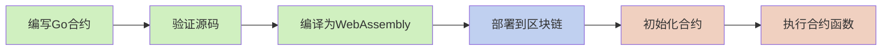
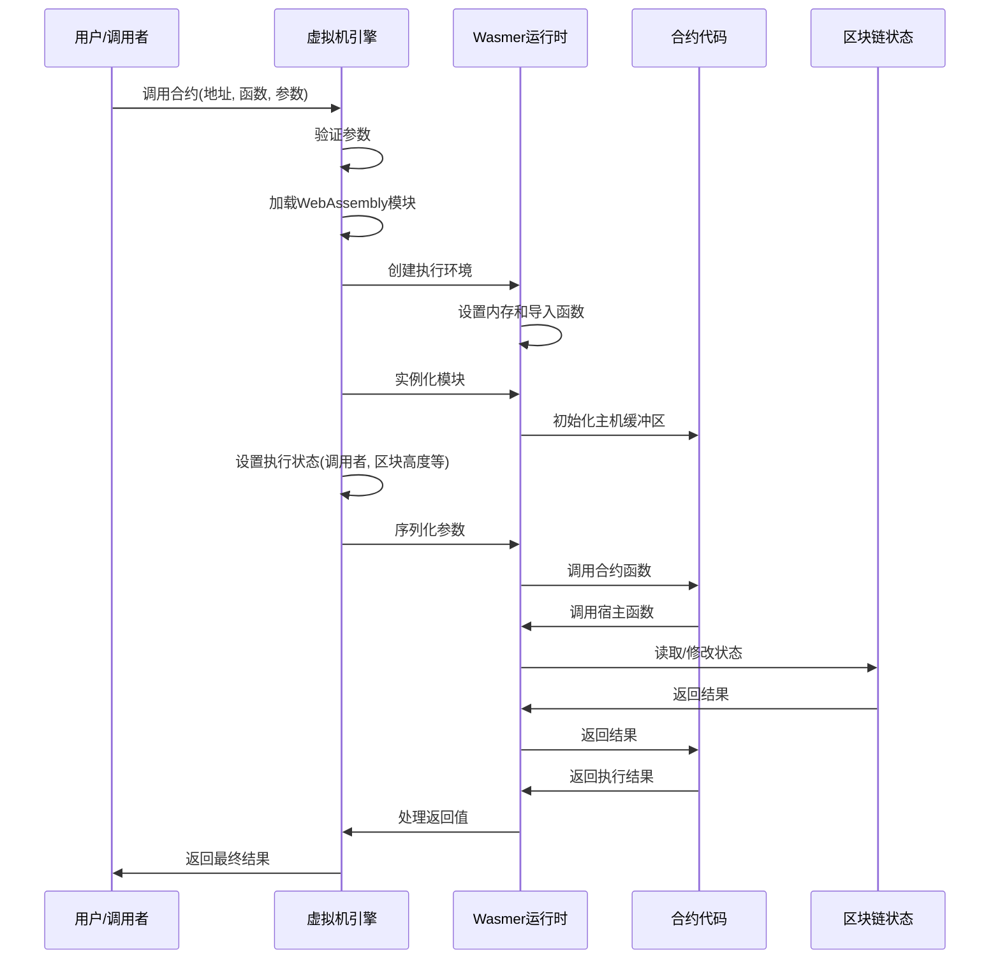
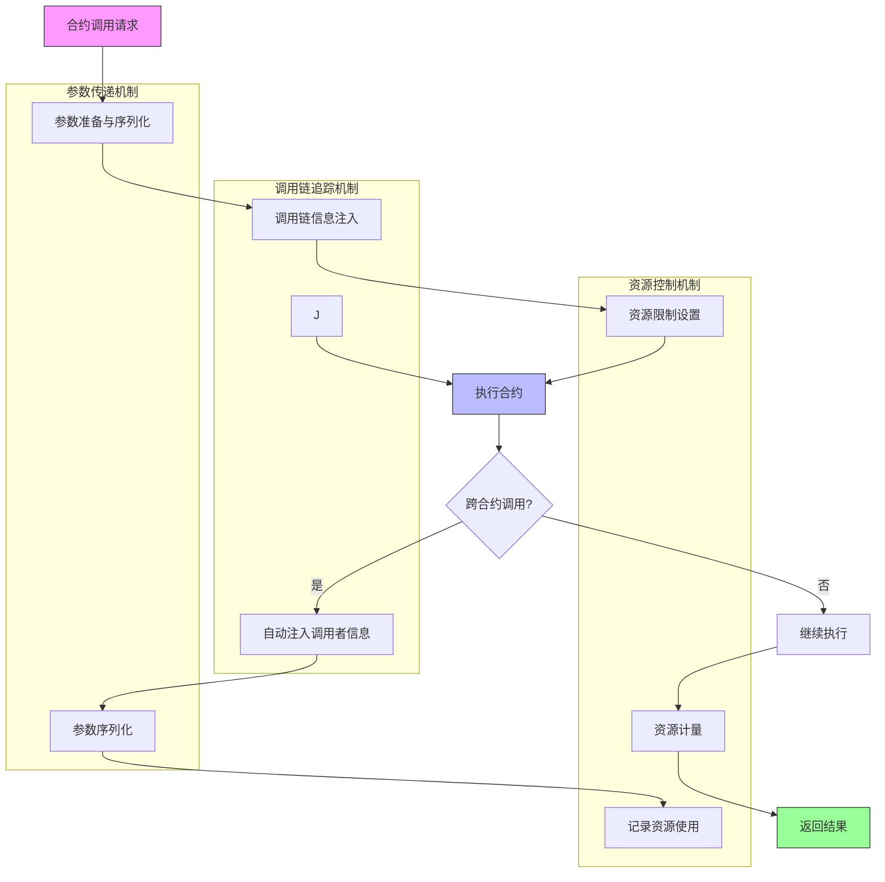
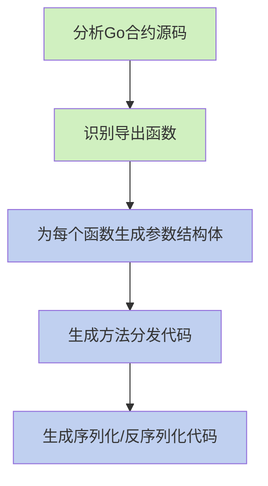

# WebAssembly 智能合约执行流程

本文档详细说明 VM 项目中 WebAssembly 智能合约的编译、部署和执行流程，包括从 Go 源代码到 WebAssembly 模块执行的完整生命周期。

## 1. 合约生命周期概述

WebAssembly 智能合约的完整生命周期包括以下阶段：



## 2. 合约编译流程

Go 语言智能合约编译为 WebAssembly 的详细流程：

### 2.1 源码接收与解压

系统首先接收合约源码并检查是否使用了压缩格式：

```go
// 检查源码是否使用 GZIP 压缩
if isGzipCompressed(code) {
    code, err = decompressGzip(code)
    if err != nil {
        return nil, fmt.Errorf("failed to decompress contract code: %w", err)
    }
}
```

### 2.2 源码验证

接下来，系统对合约源码进行严格验证：

```go
// 验证合约源码
if err := maker.ValidateContract(code); err != nil {
    return nil, fmt.Errorf("contract validation failed: %w", err)
}
```

验证过程包含多重检查：
- **导入检查**：确保合约只导入允许的包
- **关键字检查**：禁止使用可能导致非确定性行为的 Go 关键字
- **大小限制**：确保合约代码不超过配置的最大大小
- **结构检查**：验证合约包含至少一个导出（公开）函数
- **语法检查**：确保 Go 代码语法正确

### 2.3 合约信息提取

验证通过后，系统使用 Go 的 AST（抽象语法树）分析工具提取关键信息：

```go
// 提取包名和合约对外函数列表
packageName, functions, err := maker.extractContractInfo(code)
```

该步骤会：
- 解析 Go 源码的包结构
- 确定包名（package name）
- 识别所有大写字母开头的函数作为导出函数
- 自动收集所有导出函数的接口信息，无需开发者添加特殊注释

系统会自动按照 Go 语言的公共/私有规则识别导出函数：
- 大写字母开头的函数自动被视为导出函数（对外可调用）
- 小写字母开头的函数为私有函数（仅内部使用）
- 无需开发者手动添加 `//export` 标记

### 2.4 WASI 包装代码生成

系统会生成专用的包装代码，使 Go 合约能够与 WebAssembly 系统接口通信：

```go
// 生成 WASI 接口包装代码
wrapperCode := generateWASIWrapper(packageName, functions, code)
```

包装代码提供：
- 与 WebAssembly 主机系统的通信桥梁
- 内存管理接口
- 参数传递和结果返回机制

### 2.5 编译环境准备

在执行编译前，系统会创建完整的编译环境：

```go
// 准备编译环境
tempDir, err := prepareCompilationEnvironment(code, wrapperCode)
```

这一步会：
- 创建临时目录结构
- 构建正确的 Go 模块环境
- 设置必要的依赖关系
- 配置编译参数和环境变量

### 2.6 TinyGo 编译

准备就绪后，系统使用 TinyGo 编译器将 Go 代码编译为 WebAssembly 模块：

```go
// 使用 TinyGo 编译为 WebAssembly
wasmCode, err := compileWithTinyGo(tempDir, options.WASIOptions)
```

编译命令示例：
```bash
tinygo build -o contract.wasm -target=wasi -opt=z -no-debug -gc=leaking ./main.go
```

编译选项说明：
- `-target=wasi`: 指定编译目标为 WebAssembly 系统接口
- `-opt=z`: 优化输出大小，减小 WASM 模块体积
- `-no-debug`: 移除调试信息，进一步减小文件大小
- `-gc=leaking`: 使用简化的垃圾收集器，提高运行时性能

### 2.7 模块优化与验证

编译后，系统会验证生成的 WebAssembly 模块并可能进行进一步优化：

```go
// 验证和优化 WebAssembly 模块
wasmCode, err = optimizeWasmModule(wasmCode)
```

这一步确保：
- WASM 模块格式正确
- 模块结构完整且有效
- 必要的导出函数存在
- 可能的性能和大小优化已应用

### 2.8 存储与注册

最后，系统将编译好的 WebAssembly 模块存储到指定位置并注册到系统中：

```go
// 生成合约地址
contractAddr := generateContractAddress(wasmCode)

// 存储到文件系统
wasmPath := filepath.Join(config.WASIContractsDir, contractAddr.String()+".wasm")
os.WriteFile(wasmPath, wasmCode, 0644)

// 注册合约信息
engine.contracts[contractAddr] = wasmPath
```

## 3. 合约部署流程

### 3.1 部署请求处理

当系统接收到合约部署请求时，首先会处理源代码并检查部署选项：

```go
// 处理合约部署请求
func (e *Engine) DeployWithOptions(code []byte, options DeployOptions) (vm.Address, error) {
    // 验证部署选项
    if err := validateDeployOptions(options); err != nil {
        return vm.ZeroAddress(), err
    }
    
    // 根据合约类型选择处理方式
    switch options.ContractType {
    case ContractTypeWASI:
        return e.deployWASIContract(code, options)
    default:
        return vm.ZeroAddress(), errors.New("unsupported contract type")
    }
}
```

### 3.2 合约地址生成

系统根据 WebAssembly 模块内容生成唯一的合约地址：

```go
// 生成合约地址
func generateContractAddress(wasmCode []byte) vm.Address {
    hash := sha256.Sum256(wasmCode)
    var addr vm.Address
    copy(addr[:], hash[:20]) // 使用哈希的前20字节作为地址
    return addr
}
```

### 3.3 元数据存储

系统存储合约元数据，包括版本、发布者、ABI接口和权限信息：

```go
// 存储合约元数据
func (e *Engine) storeContractMetadata(addr vm.Address, metadata ContractMetadata) error {
    // 序列化元数据
    metadataBytes, err := json.Marshal(metadata)
    if err != nil {
        return err
    }
    
    // 构造元数据键
    key := fmt.Sprintf("contract:%s:metadata", addr.String())
    
    // 存储到数据库
    return e.db.Put([]byte(key), metadataBytes)
}
```

## 4. 合约执行流程

### 4.1 加载 WebAssembly 模块

执行合约第一步是加载 WebAssembly 模块：

```go
// 加载 WebAssembly 模块
func (e *Engine) loadWasmModule(contractAddr vm.Address) (*wasmer.Module, error) {
    // 获取合约路径
    e.contractsLock.RLock()
    wasmPath, exists := e.contracts[contractAddr]
    e.contractsLock.RUnlock()
    
    if !exists {
        return nil, fmt.Errorf("contract not found: %s", contractAddr)
    }
    
    // 读取WASM文件
    wasmBytes, err := os.ReadFile(string(wasmPath))
    if err != nil {
        return nil, fmt.Errorf("failed to read WASM module: %w", err)
    }
    
    // 编译WebAssembly模块
    engine := wasmer.NewEngine()
    store := wasmer.NewStore(engine)
    module, err := wasmer.NewModule(store, wasmBytes)
    if err != nil {
        return nil, fmt.Errorf("failed to compile WASM module: %w", err)
    }
    
    return module, nil
}
```

### 4.2 创建执行环境

为 WebAssembly 模块创建执行环境，包括内存和导入函数：

```go
// 创建执行环境
func (e *Engine) createExecutionEnvironment(module *wasmer.Module) (*ExecutionEnvironment, error) {
    // 创建存储和引擎
    engine := wasmer.NewEngine()
    store := wasmer.NewStore(engine)
    
    // 创建WASI环境
    wasiEnv, err := wasmer.NewWasiStateBuilder("wasi-program").
        Argument("--verbose").
        MapDirectory(".", ".").
        CaptureStdout().
        CaptureStderr().
        Finalize()
    if err != nil {
        return nil, err
    }
    
    // 生成WASI导入对象
    wasiImports, err := wasiEnv.GenerateImportObject(store, module)
    if err != nil {
        return nil, err
    }
    
    // 创建内存
    limits, _ := wasmer.NewLimits(16, 128)
    memoryType := wasmer.NewMemoryType(limits)
    memory := wasmer.NewMemory(store, memoryType)
    
    // 添加宿主函数到导入对象
    wasiImports.Register("env", map[string]wasmer.IntoExtern{
        "memory": memory,
        "call_host_set": wasmer.NewFunction(...),
        "call_host_get_buffer": wasmer.NewFunction(...),
        "get_block_height": wasmer.NewFunction(...),
        "get_block_time": wasmer.NewFunction(...),
        "get_balance": wasmer.NewFunction(...),
        // ...其他宿主函数
    })
    
    return &ExecutionEnvironment{
        Store:    store,
        Imports:  wasiImports,
        Memory:   memory,
        Module:   module,
    }, nil
}
```

### 4.3 实例化 WebAssembly 模块

使用创建的执行环境实例化 WebAssembly 模块：

```go
// 实例化WebAssembly模块
func (e *Engine) instantiateModule(env *ExecutionEnvironment) (*wasmer.Instance, error) {
    // 创建实例
    instance, err := wasmer.NewInstance(env.Module, env.Imports)
    if err != nil {
        return nil, fmt.Errorf("failed to instantiate WASM module: %w", err)
    }
    
    // 初始化主机缓冲区
    if err := initHostBuffer(instance, env.Memory); err != nil {
        return nil, fmt.Errorf("failed to initialize host buffer: %w", err)
    }
    
    return instance, nil
}
```

### 4.4 设置执行状态

在调用合约函数前，设置执行状态：

```go
// 设置执行状态
func (e *Engine) setupExecutionState(addr vm.Address, sender vm.Address) {
    // 设置当前交易信息
    e.state.CurrentSender = sender
    e.state.ContractAddress = addr
    e.state.CurrentBlock = e.blockchain.GetLatestHeight()
    e.state.CurrentTime = e.blockchain.GetLatestBlockTime()
}
```

### 4.5 调用合约函数

最后，调用指定的合约函数：

```go
// 调用合约函数
func (e *Engine) callContractFunction(instance *wasmer.Instance, functionName string, args ...interface{}) (interface{}, error) {
    // 获取导出函数
    function, err := instance.Exports.GetFunction(functionName)
    if err != nil {
        return nil, fmt.Errorf("function not found: %s", functionName)
    }
    
    // 准备参数
    wasmArgs, err := e.prepareArguments(instance, args...)
    if err != nil {
        return nil, fmt.Errorf("failed to prepare arguments: %w", err)
    }
    
    // 执行函数
    result, err := function(wasmArgs...)
    if err != nil {
        return nil, fmt.Errorf("execution failed: %w", err)
    }
    
    // 处理结果
    return e.processResult(instance, result)
}
```

## 5. 参数传递与结果获取

### 5.1 统一参数传递机制

VM系统采用统一的参数传递机制，确保类型安全和调用链信息传递：

```go
// 准备参数
func (e *Engine) prepareArguments(instance *wasmer.Instance, args ...interface{}) ([]interface{}, error) {
    memory := instance.Exports.GetMemory("memory")
    if memory == nil {
        return nil, errors.New("memory not exported")
    }
    
    var wasmArgs []interface{}
    
    for _, arg := range args {
        switch v := arg.(type) {
        case int, int32, int64, uint, uint32, uint64, float32, float64, bool:
            // 基本类型直接传递
            wasmArgs = append(wasmArgs, v)
        default:
            // 复杂类型需要序列化，并保留类型信息
            typedValue := CreateTypedValue(v)
            data, err := serializeWithType(typedValue)
            if err != nil {
                return nil, err
            }
            
            // 分配内存
            allocate, err := instance.Exports.GetFunction("allocate")
            if err != nil {
                return nil, err
            }
            
            ptrRaw, err := allocate(int32(len(data)))
            if err != nil {
                return nil, err
            }
            ptr := ptrRaw.(int32)
            
            // 复制数据到WebAssembly内存
            copy(memory.Data()[ptr:ptr+int32(len(data))], data)
            
            // 添加指针和长度参数
            wasmArgs = append(wasmArgs, ptr, int32(len(data)))
        }
    }
    
    return wasmArgs, nil
}

// 带类型信息的值
type TypedValue struct {
    Type  string      `json:"type"`  // 类型标识符
    Value interface{} `json:"value"` // 实际值
}

// 创建带类型信息的值
func CreateTypedValue(v interface{}) TypedValue {
    var typeName string
    
    // 根据值的类型设置类型标识符
    switch v.(type) {
    case int8:
        typeName = "int8"
    case int16:
        typeName = "int16" 
    case int32:
        typeName = "int32"
    case int64:
        typeName = "int64"
    case int:
        typeName = "int"
    // ... 其他基本类型
    default:
        // 复杂结构体使用反射获取类型名
        t := reflect.TypeOf(v)
        if t.Kind() == reflect.Ptr {
            t = t.Elem()
        }
        typeName = t.String()
    }
    
    return TypedValue{
        Type:  typeName,
        Value: v,
    }
}

// 序列化带类型信息的数据
func serializeWithType(v interface{}) ([]byte, error) {
    return json.Marshal(v)
}
```

### 5.2 类型安全的结果处理

执行完成后，系统以类型安全的方式处理返回结果：

```go
// 处理结果
func (e *Engine) processResult(instance *wasmer.Instance, result interface{}) (interface{}, error) {
    memory := instance.Exports.GetMemory("memory")
    if memory == nil {
        return nil, errors.New("memory not exported")
    }
    
    switch v := result.(type) {
    case int32:
        // 检查是否为错误码
        if v < 0 {
            return nil, fmt.Errorf("contract returned error code: %d", v)
        }
        
        // 检查是否为内存指针
        if v > 0 {
            // 尝试读取指针位置的长度
            if v+4 <= int32(len(memory.Data())) {
                length := binary.LittleEndian.Uint32(memory.Data()[v:v+4])
                if v+4+int32(length) <= int32(len(memory.Data())) {
                    // 读取数据
                    data := make([]byte, length)
                    copy(data, memory.Data()[v+4:v+4+int32(length)])
                    
                    // 尝试解析为带类型信息的数据
                    var result interface{}
                    if err := deserializeWithType(data, &result); err == nil {
                        return result, nil
                    }
                    
                    // 如果不是带类型信息的JSON，返回原始数据
                    return data, nil
                }
            }
        }
        
        // 简单返回值
        return v, nil
    // 处理其他类型的返回值...
    default:
        return v, nil
    }
}

// 反序列化带类型信息的数据
func deserializeWithType(data []byte, target interface{}) error {
    // 首先解析为通用结构
    var jsonData interface{}
    if err := json.Unmarshal(data, &jsonData); err != nil {
        return err
    }
    
    // 递归处理所有类型标记
    processedData := processTypedValues(jsonData)
    
    // 使用类型反射将处理后的数据设置到目标接口
    v := reflect.ValueOf(target).Elem()
    v.Set(reflect.ValueOf(processedData))
    
    return nil
}

// 递归处理类型标记
func processTypedValues(data interface{}) interface{} {
    switch v := data.(type) {
    case map[string]interface{}:
        // 检查是否是 TypedValue
        if typeStr, hasType := v["type"].(string); hasType {
            if val, hasVal := v["value"]; hasVal {
                return convertToType(val, typeStr)
            }
        }
        
        // 处理普通对象
        for k, val := range v {
            v[k] = processTypedValues(val)
        }
    case []interface{}:
        // 处理数组
        for i, val := range v {
            v[i] = processTypedValues(val)
        }
    }
    
    return data
}
```

### 5.3 调用链信息传递

系统自动在跨合约调用中注入和传递调用链信息：

```go
// 在合约调用中注入调用链信息
func (e *Engine) injectCallInfo(sender, target vm.Address, function string) *CallInfo {
    callInfo := &CallInfo{
        CallerContract: sender,
        CallerFunction: e.currentFunction,
        CallChain:      append([]CallFrame{}, e.callChain...),
    }
    
    // 将当前调用添加到调用链
    e.callChain = append(e.callChain, CallFrame{
        Contract: sender,
        Function: e.currentFunction,
    })
    
    return callInfo
}

// 执行跨合约调用
func (e *Engine) executeContractCall(sender, target vm.Address, function string, args ...interface{}) (interface{}, error) {
    // 注入调用链信息
    callInfo := e.injectCallInfo(sender, target, function)
    
    // 添加调用信息到参数
    enhancedArgs := append([]interface{}{callInfo}, args...)
    
    // 执行实际调用
    result, err := e.callContractFunction(target, function, enhancedArgs...)
    
    // 恢复调用链
    if len(e.callChain) > 0 {
        e.callChain = e.callChain[:len(e.callChain)-1]
    }
    
    return result, err
}
```

## 6. 执行流程图

以下是合约执行流程的详细图示：



## 7. 综合流程图示

以下流程图展示了合约执行过程中调用链追踪、参数传递和资源控制三大机制的关系与交互：



### 7.1 三大机制统一模型

在合约执行的整个生命周期中，系统的三大核心机制紧密配合：

1. **调用链追踪**：
   - 在合约调用的入口点注入调用链信息
   - 在跨合约调用点自动添加调用者信息
   - 维护完整的调用栈和合约间关系
   - 通过 mock 钩子记录函数进入和退出事件

2. **参数传递**：
   - 使用 TypedValue 结构确保类型安全的序列化和反序列化
   - 自动生成合约接口的参数结构体
   - 在跨合约调用中保留调用链信息
   - 支持复杂结构和嵌套对象的处理

3. **资源控制**：
   - 设置内存使用限制和执行时间上限
   - 实现燃料系统计量指令执行
   - 在跨合约调用中累计资源使用
   - 触发资源耗尽时安全中止执行

这三个机制的统一实现确保了 WebAssembly 智能合约的安全性、可追踪性和性能可控性。

## 8. 资源控制

为确保合约执行的安全性和确定性，系统实现了统一的资源控制机制：

### 8.1 内存限制

限制WebAssembly模块可使用的最大内存：

```go
// 创建内存限制
limits, err := wasmer.NewLimits(16, 128) // 初始16页(1MB)，最大128页(8MB)
memoryType := wasmer.NewMemoryType(limits)
memory := wasmer.NewMemory(store, memoryType)
```

系统的内存管理策略包括：
- 使用 TinyGo 的 `-gc=leaking` 简化垃圾收集机制提高性能
- 合约代码应尽量重用缓冲区而非频繁分配内存
- WebAssembly 模块限制最大内存使用（默认上限为 128 MB）
- 内存管理包括 WebAssembly 线性内存和共享的主机缓冲区两部分

### 8.2 执行时间限制

通过超时机制限制合约执行时间：

```go
// 设置执行超时
ctx, cancel := context.WithTimeout(context.Background(), time.Duration(e.config.ExecutionTimeout)*time.Millisecond)
defer cancel()

// 在单独的goroutine中执行
resultCh := make(chan execResult, 1)
go func() {
    result, err := function(wasmArgs...)
    resultCh <- execResult{result, err}
}()

// 等待结果或超时
select {
case res := <-resultCh:
    return res.result, res.err
case <-ctx.Done():
    // 强制终止执行
    e.terminateExecution(instance)
    return nil, errors.New("execution timeout")
}
```

### 8.3 统一的燃料计量系统

系统实现了完整的燃料计量系统来限制指令执行数量：

```go
// 燃料计量配置
type FuelConfig struct {
    InitialFuel uint64       // 初始燃料量
    CostTable   map[string]uint64 // 操作燃料消耗表
}

// 燃料消耗示例
var defaultCostTable = map[string]uint64{
    "call":         500,   // 跨合约调用基础成本
    "transfer":     200,   // 转账操作成本
    "storage_read": 100,   // 存储读取成本
    "storage_write": 200,  // 存储写入成本
    "memory_grow":  50,    // 内存扩展成本/页
    "log":          50,    // 日志记录成本
    "computation":  1,     // 基本计算指令成本
}

// 在合约执行中实现燃料计量
func (e *Engine) withFuelLimit(instance *wasmer.Instance, fuelLimit uint64, fn func() (interface{}, error)) (interface{}, error) {
    // 设置初始燃料
    e.remainingFuel = fuelLimit
    
    // 注入燃料消耗中间件
    originalCallHost := instance.Exports.GetFunction("call_host_set")
    // 替换为计量版本...
    
    // 安装燃料消耗计数器
    e.installFuelCounter(instance)
    
    // 执行函数
    return fn()
}

// 燃料消耗检查
func (e *Engine) consumeFuel(amount uint64) error {
    if e.remainingFuel < amount {
        return errors.New("out of fuel")
    }
    e.remainingFuel -= amount
    return nil
}
```

### 8.4 资源限制配置模型

系统提供了统一的资源限制配置模型：

```go
// 执行资源配置
type ExecutionResources struct {
    MemoryLimit     uint64 // 最大内存限制 (字节)
    StackSize       uint32 // 栈大小限制 (字节)
    TableSize       uint32 // 函数表大小
    FuelLimit       uint64 // 燃料限制
    ExecutionTimeout int64 // 执行超时 (毫秒)
    
    // 功能开关
    EnableSIMD       bool  // 启用SIMD指令
    EnableThreads    bool  // 启用线程支持
    EnableBulkMemory bool  // 启用批量内存操作
}

// 默认资源配置
var DefaultResources = ExecutionResources{
    MemoryLimit:     64 * 1024 * 1024, // 64MB
    StackSize:       64 * 1024,        // 64KB
    TableSize:       1024,             // 1K函数表项
    FuelLimit:       10_000_000,       // 1千万燃料单位
    ExecutionTimeout: 5000,            // 5秒
    EnableSIMD:      false,
    EnableThreads:   false,
    EnableBulkMemory: true,
}
```

## 9. 错误处理

WebAssembly合约执行过程中的错误处理：

### 9.1 合约内错误

合约内部错误通过返回约定的错误码或错误结构处理：

```go
// 在合约中返回错误
if err != nil {
    // 设置错误标志并返回错误码
    ctx.SetError(err.Error())
    return -1
}
```

### 9.2 执行环境错误

执行环境错误包括：内存分配失败、函数不存在、参数类型错误等：

```go
// 处理执行环境错误
if err != nil {
    switch {
    case strings.Contains(err.Error(), "out of memory"):
        return nil, vm.NewExecutionError(vm.ErrOutOfMemory, err.Error())
    case strings.Contains(err.Error(), "function not found"):
        return nil, vm.NewExecutionError(vm.ErrFunctionNotFound, err.Error())
    case strings.Contains(err.Error(), "invalid argument type"):
        return nil, vm.NewExecutionError(vm.ErrInvalidArgument, err.Error())
    default:
        return nil, vm.NewExecutionError(vm.ErrExecutionFailed, err.Error())
    }
}
```

## 10. 总结

WebAssembly智能合约的编译、部署和执行流程是一个复杂但结构清晰的过程。从Go源代码到WebAssembly模块的编译过程确保了合约的安全性和可执行性，而执行环境则提供了资源控制和状态访问机制，确保合约在可控的环境中安全执行。

通过这种设计，系统实现了以下目标：
1. 安全且可确定的合约执行环境
2. 高效的编译和执行流程
3. 精确的资源控制和限制
4. 灵活的参数传递和结果处理机制
5. 完善的错误处理和状态管理 

## 11. RPC风格的合约接口调用机制

为了提高合约接口调用的类型安全性和开发便捷性，系统可以采用类似Go标准库`net/rpc`的设计模式，实现自动化的参数反序列化和方法调用。

### 11.1 Go RPC模型概述

Go的RPC模型具有以下特点：

```go
// 服务定义
type MathService struct{}

// RPC方法 - 必须满足特定签名模式
func (s *MathService) Add(args *Args, reply *int) error {
    *reply = args.A + args.B
    return nil
}

// 参数结构体
type Args struct {
    A, B int
}
```

关键特性：
- 方法必须是导出的（首字母大写）
- 方法接收两个参数：请求和响应（指针类型）
- 方法返回一个error类型
- 参数和响应必须是可序列化的类型

### 11.2 WebAssembly合约的RPC风格接口

在合约编译阶段，系统可以自动为导出函数生成RPC风格的包装代码：



### 11.3 自动生成的参数结构体

系统会为每个导出函数自动生成对应的参数结构体：

```go
// 原始合约函数
//export transfer
func transfer(to Address, amount uint64) error {
    // 实现转账逻辑
}

// 自动生成的参数结构体
type TransferParams struct {
    CallInfo *CallInfo `json:"call_info"` // 自动注入的调用链信息
    To       Address   `json:"to"`        // 第一个参数
    Amount   uint64    `json:"amount"`    // 第二个参数
}

// 自动生成的返回值结构体
type TransferResult struct {
    Error string `json:"error,omitempty"` // 错误信息（如果有）
}
```

### 11.4 方法分发与反射

系统在合约包装代码中生成统一的方法分发机制：

```go
// 自动生成的方法分发表
var methodMap = map[string]func([]byte) []byte{
    "transfer": wrapTransfer,
    "approve": wrapApprove,
    "balanceOf": wrapBalanceOf,
    // ...其他方法
}

// 主分发函数
func dispatchMethod(name string, paramsJSON []byte) []byte {
    handler, exists := methodMap[name]
    if !exists {
        errorResult := &ErrorResult{Error: "method not found: " + name}
        resultJSON, _ := json.Marshal(errorResult)
        return resultJSON
    }
    
    return handler(paramsJSON)
}

// 函数包装示例
func wrapTransfer(paramsJSON []byte) []byte {
    // 1. 反序列化参数
    var params TransferParams
    if err := json.Unmarshal(paramsJSON, &params); err != nil {
        errorResult := &ErrorResult{Error: "failed to parse parameters: " + err.Error()}
        resultJSON, _ := json.Marshal(errorResult)
        return resultJSON
    }
    
    // 2. 调用实际函数
    err := transfer(params.To, params.Amount)
    
    // 3. 封装结果
    result := &TransferResult{}
    if err != nil {
        result.Error = err.Error()
    }
    
    // 4. 序列化返回结果
    resultJSON, _ := json.Marshal(result)
    return resultJSON
}
```

### 11.5 类型安全的自动注册系统

为了解决类型安全问题，系统可以实现反射型的类型注册与映射：

```go
// 类型注册表 - 用于复杂结构体的反序列化
var typeRegistry = map[string]reflect.Type{
    "Address": reflect.TypeOf(Address{}),
    "ObjectID": reflect.TypeOf(ObjectID{}),
    "TransferParams": reflect.TypeOf(TransferParams{}),
    // ...其他类型
}

// 类型安全的反序列化
func unmarshalWithType(data []byte, typeStr string) (interface{}, error) {
    t, exists := typeRegistry[typeStr]
    if !exists {
        return nil, fmt.Errorf("unknown type: %s", typeStr)
    }
    
    // 创建正确类型的新实例
    v := reflect.New(t).Interface()
    
    // 反序列化到正确类型的实例
    if err := json.Unmarshal(data, v); err != nil {
        return nil, err
    }
    
    return v, nil
}
```

### 11.6 集成到编译流程

这种RPC风格的接口处理会在合约编译阶段自动集成：

```go
func generateWASIWrapper(packageName string, functions []FunctionInfo, code []byte) string {
    // 生成基础包装代码
    wrapperTemplate := `
package main

import (
    "encoding/json"
    "reflect"
    "{{ .PackageName }}"
)

// ...基础代码

// 为每个函数生成参数和结果结构体
{{ range .Functions }}
type {{ .Name }}Params struct {
    CallInfo *CallInfo {{ .ParamsFields }}
}

type {{ .Name }}Result struct {
    {{ .ResultFields }}
    Error string `json:"error,omitempty"`
}
{{ end }}

// 生成方法分发代码
var methodMap = map[string]func([]byte) []byte{
{{ range .Functions }}
    "{{ .Name }}": wrap{{ .Name }},
{{ end }}
}

// 生成包装函数
{{ range .Functions }}
func wrap{{ .Name }}(paramsJSON []byte) []byte {
    var params {{ .Name }}Params
    if err := json.Unmarshal(paramsJSON, &params); err != nil {
        // 错误处理
    }
    
    // 调用实际函数
    {{ .CallCode }}
    
    // 返回结果
    {{ .ResultCode }}
}
{{ end }}

// ...其他代码
`
    // 填充模板...
}
```

### 11.7 优势与性能考虑

这种基于Go RPC模型的实现提供了多项优势：

1. **类型安全**：
   - 严格保留参数类型信息
   - 避免JSON反序列化默认将数字转为float64的问题
   - 支持复杂嵌套结构体

2. **开发便捷性**：
   - 合约开发者无需手动处理序列化/反序列化
   - 自动化的参数验证和错误处理
   - 与标准Go编程模型一致

3. **统一的调用模式**：
   - 所有合约函数使用一致的调用模式
   - 简化客户端调用代码
   - 支持版本变更和接口升级

4. **性能优化空间**：
   - 预编译的反射路径减少运行时开销
   - 缓存类型信息避免重复反射
   - 可选的二进制序列化格式（如Protocol Buffers）支持
