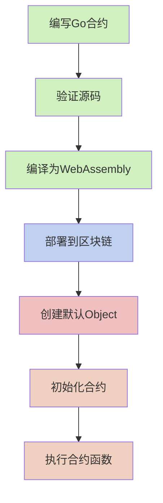
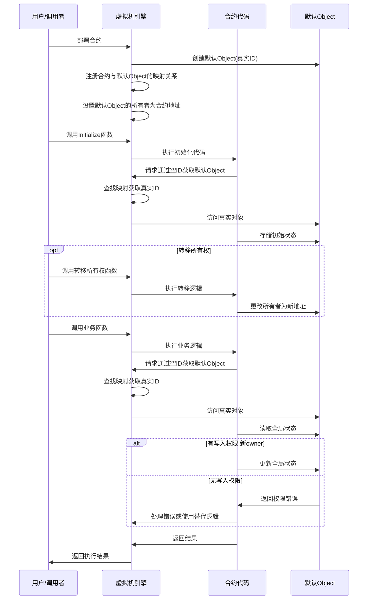
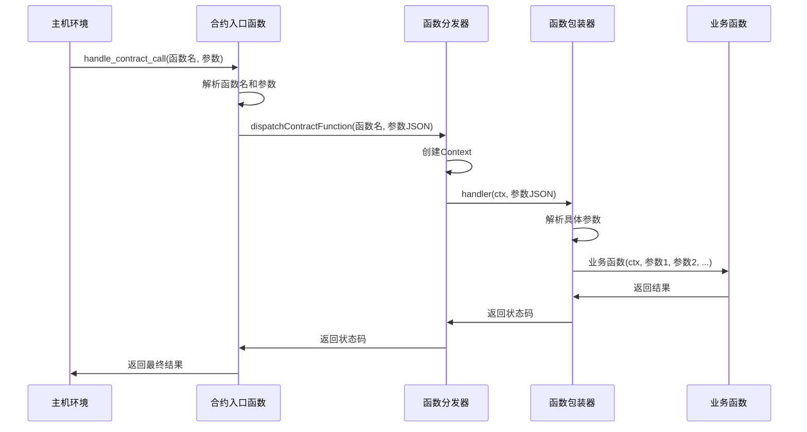
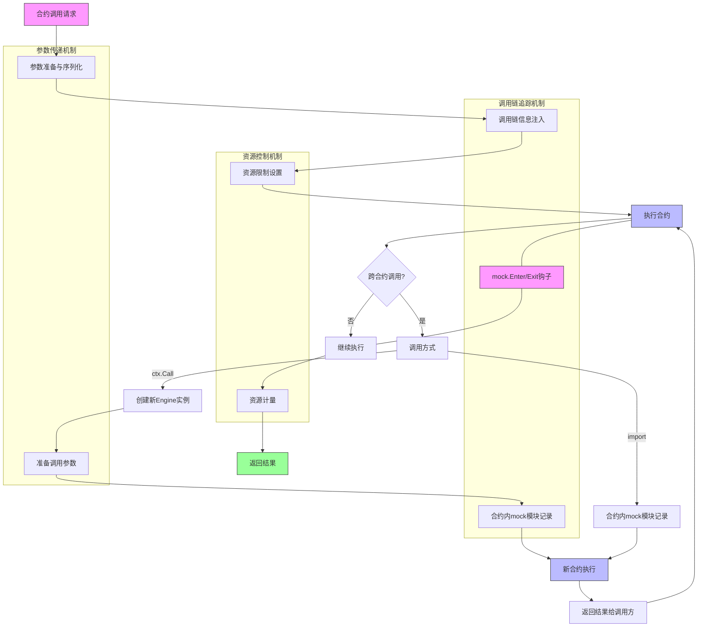
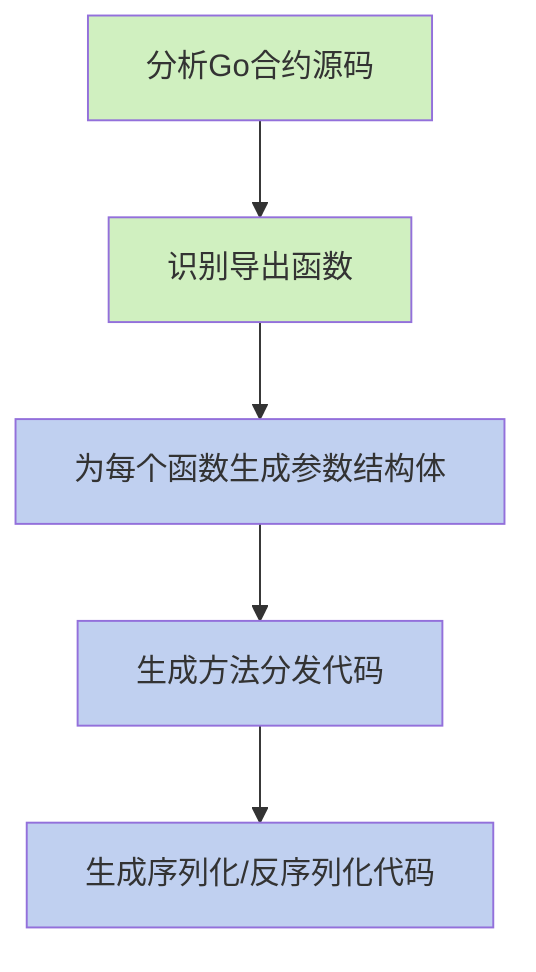

# WebAssembly 智能合约执行流程

本文档详细说明 VM 项目中 WebAssembly 智能合约的编译、部署和执行流程，包括从 Go 源代码到 WebAssembly 模块执行的完整生命周期。

## 1. 合约生命周期概述

WebAssembly 智能合约的完整生命周期包括以下阶段：



## 2. 合约编译流程

Go 语言智能合约编译为 WebAssembly 的详细流程：

### 2.1 源码接收与解压

系统首先接收合约源码并检查是否使用了压缩格式：

```go
// 检查源码是否使用 GZIP 压缩
if isGzipCompressed(code) {
    code, err = decompressGzip(code)
    if err != nil {
        return nil, fmt.Errorf("failed to decompress contract code: %w", err)
    }
}
```

### 2.2 源码验证

接下来，系统对合约源码进行严格验证：

```go
// 验证合约源码
if err := maker.ValidateContract(code); err != nil {
    return nil, fmt.Errorf("contract validation failed: %w", err)
}
```

验证过程包含多重检查：
- **导入检查**：确保合约只导入允许的包
- **关键字检查**：禁止使用可能导致非确定性行为的 Go 关键字
- **大小限制**：确保合约代码不超过配置的最大大小
- **结构检查**：验证合约包含至少一个导出（公开）函数
- **语法检查**：确保 Go 代码语法正确

### 2.3 合约信息提取

验证通过后，系统使用 Go 的 AST（抽象语法树）分析工具提取关键信息：

```go
// 提取包名和合约对外函数列表
packageName, functions, err := maker.extractContractInfo(code)
```

该步骤会：
- 解析 Go 源码的包结构
- 确定包名（package name）
- 识别所有大写字母开头的函数作为导出函数
- 自动收集所有导出函数的接口信息，无需开发者添加特殊注释

系统会自动按照 Go 语言的公共/私有规则识别导出函数：
- 大写字母开头的函数自动被视为导出函数（对外可调用）
- 小写字母开头的函数为私有函数（仅内部使用）
- 无需开发者手动添加 `//export` 标记

### 2.4 WASI 包装代码生成

系统会生成专用的包装代码，使 Go 合约能够与 WebAssembly 系统接口通信：

```go
// 生成 WASI 接口包装代码
wrapperCode := generateWASIWrapper(packageName, functions, code)
```

包装代码提供：
- 与 WebAssembly 主机系统的通信桥梁
- 内存管理接口
- 参数传递和结果返回机制

### 2.5 编译环境准备

在执行编译前，系统会创建完整的编译环境：

```go
// 准备编译环境
tempDir, err := prepareCompilationEnvironment(code, wrapperCode)
```

这一步会：
- 创建临时目录结构
- 构建正确的 Go 模块环境
- 设置必要的依赖关系
- 配置编译参数和环境变量

### 2.6 TinyGo 编译

准备就绪后，系统使用 TinyGo 编译器将 Go 代码编译为 WebAssembly 模块：

```go
// 使用 TinyGo 编译为 WebAssembly
wasmCode, err := compileWithTinyGo(tempDir, options.WASIOptions)
```

编译命令示例：
```bash
tinygo build -o contract.wasm -target=wasi -opt=z -no-debug ./main.go
```

编译选项说明：
- `-target=wasi`: 指定编译目标为 WebAssembly 系统接口
- `-opt=z`: 优化输出大小，减小 WASM 模块体积
- `-no-debug`: 移除调试信息，进一步减小文件大小

### 2.7 模块优化与验证

编译后，系统会验证生成的 WebAssembly 模块并可能进行进一步优化：

```go
// 验证和优化 WebAssembly 模块
wasmCode, err = optimizeWasmModule(wasmCode)
```

这一步确保：
- WASM 模块格式正确
- 模块结构完整且有效
- 必要的导出函数存在
- 可能的性能和大小优化已应用

### 2.8 存储与注册

最后，系统将编译好的 WebAssembly 模块存储到指定位置并注册到系统中：

```go
// 生成合约地址
contractAddr := generateContractAddress(wasmCode)

// 存储到文件系统
wasmPath := filepath.Join(config.WASIContractsDir, contractAddr.String()+".wasm")
os.WriteFile(wasmPath, wasmCode, 0644)

// 注册合约信息
engine.contracts[contractAddr] = wasmPath
```

## 3. 合约部署流程

### 3.1 部署请求处理

当系统接收到合约部署请求时，首先会处理源代码并检查部署选项：

```go
// 处理合约部署请求
func (e *Engine) DeployWithOptions(code []byte, options DeployOptions) (vm.Address, error) {
    // 验证部署选项
    if err := validateDeployOptions(options); err != nil {
        return vm.ZeroAddress(), err
    }
    
    // 根据合约类型选择处理方式
    switch options.ContractType {
    case ContractTypeWASI:
        return e.deployWASIContract(code, options)
    default:
        return vm.ZeroAddress(), errors.New("unsupported contract type")
    }
}
```

### 3.2 合约地址生成

系统根据 WebAssembly 模块内容生成唯一的合约地址：

```go
// 生成合约地址
func generateContractAddress(wasmCode []byte) vm.Address {
    hash := sha256.Sum256(wasmCode)
    var addr vm.Address
    copy(addr[:], hash[:20]) // 使用哈希的前20字节作为地址
    return addr
}
```

### 3.3 元数据存储

系统存储合约元数据，包括版本、发布者、ABI接口和权限信息：

```go
// 存储合约元数据
func (e *Engine) storeContractMetadata(addr vm.Address, metadata ContractMetadata) error {
    // 序列化元数据
    metadataBytes, err := json.Marshal(metadata)
    if err != nil {
        return err
    }
    
    // 构造元数据键
    key := fmt.Sprintf("contract:%s:metadata", addr.String())
    
    // 存储到数据库
    return e.db.Put([]byte(key), metadataBytes)
}
```

### 3.4 默认Object的创建

系统会在合约部署时自动为合约创建一个默认的存储对象，该对象有真实的唯一ID，但可以通过空ObjectID访问：

```go
// 为合约创建默认存储对象
func (e *Engine) createDefaultObject(contractAddr vm.Address) error {
    // 创建一个具有真实唯一ID的对象
    objID := cover2objectID(contractAddr)
    
    defaultObject := &vm.Object{
        ID:    objID,           // 真实的唯一ID
        Owner: contractAddr,    // 所有者为合约地址
    }
    
    // 将默认对象添加到状态管理器
    err := e.state.StoreObject(defaultObject)
    if err != nil {
        return fmt.Errorf("failed to create default object: %w", err)
    }
    
    // 记录创建事件
    e.eventEmitter.Emit("default_object_created", 
        "contract", contractAddr.String(),
        "object_id", objID.String())
    
    return nil
}
```

这个默认Object具有以下特性：
- 具有真实的唯一ID，但系统会注册特殊映射，使其可通过空ObjectID访问，默认是直接使用合约地址转换而成
- 初始所有者设置为合约地址本身
- 可以像其他对象一样转移所有权
- 部署后立即可用，无需合约显式创建
- 与合约生命周期绑定，在合约存在期间始终可访问

合约代码通过空ObjectID访问默认Object：

```go
// 在合约代码中
defaultObj, err := ctx.GetObject(ObjectID{}) // 传入空ObjectID
```

## 4. 合约执行流程

### 4.1 加载 WebAssembly 模块

执行合约第一步是加载 WebAssembly 模块：

```go
// 加载 WebAssembly 模块
func (e *Engine) loadWasmModule(contractAddr vm.Address) (*wazero.Module, error) {
    // 获取合约路径
    e.contractsLock.RLock()
    wasmPath, exists := e.contracts[contractAddr]
    e.contractsLock.RUnlock()
    
    if !exists {
        return nil, fmt.Errorf("contract not found: %s", contractAddr)
    }
    
    // 读取WASM文件
    wasmBytes, err := os.ReadFile(string(wasmPath))
    if err != nil {
        return nil, fmt.Errorf("failed to read WASM module: %w", err)
    }
    
    // 编译WebAssembly模块
    engine := wazero.NewEngine()
    store := wazero.NewStore(engine)
    module, err := wazero.NewModule(store, wasmBytes)
    if err != nil {
        return nil, fmt.Errorf("failed to compile WASM module: %w", err)
    }
    
    return module, nil
}
```

### 4.2 创建执行环境

为 WebAssembly 模块创建执行环境，包括内存和导入函数：

```go
// 创建执行环境
func (e *Engine) createExecutionEnvironment(module *wazero.Module) (*ExecutionEnvironment, error) {
    // 创建存储和引擎
    engine := wazero.NewEngine()
    store := wazero.NewStore(engine)
    
    // 创建WASI环境
    wasiEnv, err := wazero.NewWasiStateBuilder("wasi-program").
        Argument("--verbose").
        MapDirectory(".", ".").
        CaptureStdout().
        CaptureStderr().
        Finalize()
    if err != nil {
        return nil, err
    }
    
    // 生成WASI导入对象
    wasiImports, err := wasiEnv.GenerateImportObject(store, module)
    if err != nil {
        return nil, err
    }
    
    // 创建内存
    limits, _ := wazero.NewLimits(16, 128)
    memoryType := wazero.NewMemoryType(limits)
    memory := wazero.NewMemory(store, memoryType)
    
    // 添加宿主函数到导入对象
    wasiImports.Register("env", map[string]wazero.IntoExtern{
        "memory": memory,
        "call_host_set": wazero.NewFunction(...),
        "call_host_get_buffer": wazero.NewFunction(...),
        "get_block_height": wazero.NewFunction(...),
        "get_block_time": wazero.NewFunction(...),
        "get_balance": wazero.NewFunction(...),
        // ...其他宿主函数
    })
    
    return &ExecutionEnvironment{
        Store:    store,
        Imports:  wasiImports,
        Memory:   memory,
        Module:   module,
    }, nil
}
```

### 4.3 实例化 WebAssembly 模块

使用创建的执行环境实例化 WebAssembly 模块：

```go
// 实例化WebAssembly模块
func (e *Engine) instantiateModule(env *ExecutionEnvironment) (*wazero.Instance, error) {
    // 创建实例
    instance, err := wazero.NewInstance(env.Module, env.Imports)
    if err != nil {
        return nil, fmt.Errorf("failed to instantiate WASM module: %w", err)
    }
    
    // 初始化合约
    if err := initializeContract(instance, env.Memory); err != nil {
        return nil, fmt.Errorf("failed to initialize host buffer: %w", err)
    }
    
    return instance, nil
}
```

### 4.4 调用合约函数

执行环境准备好后，系统通过统一的入口点调用合约函数：

```go
// 调用合约函数
func (e *Engine) callContractFunction(instance *wazero.Instance, functionName string, args ...interface{}) (interface{}, error) {
    // 获取统一入口函数
    handleContractCall, err := instance.Exports.GetFunction("handle_contract_call")
    if err != nil {
        return nil, fmt.Errorf("合约入口函数未找到: %w", err)
    }
    
    // 准备函数名
    functionNameBytes := []byte(functionName)
    functionNamePtr, err := allocateWasmMemory(instance, int32(len(functionNameBytes)))
    if err != nil {
        return nil, fmt.Errorf("内存分配失败: %w", err)
    }
    copyToWasmMemory(instance, functionNamePtr, functionNameBytes)
    
    // 序列化参数为JSON
    paramsJSON, err := json.Marshal(args)
    if err != nil {
        return nil, fmt.Errorf("参数序列化失败: %w", err)
    }
    
    // 分配参数内存
    paramsPtr, err := allocateWasmMemory(instance, int32(len(paramsJSON)))
    if err != nil {
        return nil, fmt.Errorf("参数内存分配失败: %w", err)
    }
    copyToWasmMemory(instance, paramsPtr, paramsJSON)
    
    // 调用统一入口函数
    result, err := handleContractCall(
        functionNamePtr, int32(len(functionNameBytes)),
        paramsPtr, int32(len(paramsJSON)),
    )
    if err != nil {
        return nil, fmt.Errorf("合约执行失败: %w", err)
    }
    
    // 处理结果
    return e.processResult(instance, result)
}

// 分配WebAssembly内存辅助函数
func allocateWasmMemory(instance *wazero.Instance, size int32) (int32, error) {
    allocate, err := instance.Exports.GetFunction("allocate")
    if err != nil {
        return 0, err
    }
    
    ptrRaw, err := allocate(size)
    if err != nil {
        return 0, err
    }
    
    return ptrRaw.(int32), nil
}

// 复制数据到WebAssembly内存
func copyToWasmMemory(instance *wazero.Instance, ptr int32, data []byte) error {
    memory := instance.Exports.GetMemory("memory")
    if memory == nil {
        return errors.New("memory not exported")
    }
    
    // 检查内存边界
    if ptr < 0 || int(ptr)+len(data) > len(memory.Data()) {
        return errors.New("内存范围超出限制")
    }
    
    // 复制数据
    copy(memory.Data()[ptr:ptr+int32(len(data))], data)
    return nil
}
```

#### 4.5.1 跨合约调用上下文管理

当进行跨合约调用时，系统采用简化的上下文管理方式，主要依靠合约内的 mock 模块进行调用链管理：

```go
// 处理跨合约调用，FuncCall
func (e *Engine) handleCrossContractCall(sender Address, targetContract Address, function string, args ...interface{}) (interface{}, error) {
    // 创建新的Engine实例处理合约调用
    // 这种方式避免了复杂的上下文保存/恢复
    callEngine := NewEngine(e.blockchain, e.stateManager)
    
    // 设置基本执行参数
    callEngine.setupExecutionState(targetContract, sender)
    
    // 加载目标合约
    instance, err := callEngine.loadContractInstance(targetContract)
    if err != nil {
        return nil, fmt.Errorf("加载目标合约失败: %w", err)
    }
    
    // 直接执行目标合约的函数
    // 调用链信息由合约内的mock模块维护
    return callEngine.callContractFunction(instance, function, args...)
}
```

跨合约调用上下文管理的关键点：

1. **简化的主机设计**：
   - 主机环境不负责维护复杂的调用链状态
   - 每次跨合约调用创建新的执行引擎实例，职责边界清晰
   - 避免了状态保存和恢复的复杂性

2. **合约内调用链管理**：
   - 调用链信息由合约内的 mock 模块自动维护
   - 合约代码通过 Context 接口发起 Call 请求
   - Mock 模块在编译期注入的代码自动记录调用信息

3. **调用者信息传递**：
   - 被调用合约可通过 ctx.Sender() 获取调用者身份
   - 系统确保正确传递调用者信息，支持精确的权限控制

4. **统一追踪机制**：
   - 所有调用过程通过 mock 模块统一追踪
   - 记录完整的函数调用出入口信息
   - 支持性能分析、调试和审计

这种设计将职责分离，主机环境只负责基本的合约调用机制，而复杂的调用链管理完全由合约内的 mock 模块处理，大大简化了系统设计，提高了可维护性和可靠性。

### 4.6 初始化与默认Object的访问

系统保证合约始终可以通过空ObjectID访问其默认Object，这对于合约状态管理至关重要

#### 4.6.1 默认Object所有权和权限管理

当合约转移默认Object的所有权时，需要谨慎处理权限问题：

```go
// 转移默认Object所有权示例
func TransferDefaultObjectOwnership(ctx core.Context, to Address) bool {
    // 获取默认Object
    defaultObj := ctx.GetObject(ObjectID{})
    
    // 转移所有权，平台会验证object的owner是否为contract或sender
    defaultObj.SetOwner(to)
    
    return true
}
```

如果合约转移了默认Object的所有权，将导致合约无法再修改该Object，除非新所有者通过交易修改。这可用于实现高级的权限控制或升级机制。

默认Object在整个合约生命周期中的使用流程：



### 4.7 统一合约入口函数

每个 WebAssembly 合约都提供一个统一的入口函数，接收来自主机环境的函数调用请求，负责创建执行上下文、反序列化参数、调用具体的合约函数并返回结果：

```go
// 统一合约入口函数
//export handle_contract_call
func handle_contract_call(funcNamePtr, funcNameLen, paramsPtr, paramsLen int32) int32 {
    // 读取函数名
    funcNameBytes := readMemory(funcNamePtr, funcNameLen)
    funcName := string(funcNameBytes)
    
    // 读取参数JSON
    paramsJSON := readMemory(paramsPtr, paramsLen)
    
    // 创建上下文
    ctx := createContext()
    
    // 查找函数处理器
    handler, found := dispatchTable[funcName]
    if !found {
        setErrorMessage(fmt.Sprintf("未知函数: %s", funcName))
        return ErrorCodeNotFound
    }
    
    // 调用函数处理器（会自动反序列化参数并使用mock模块进行跟踪）
    return handler(ctx, paramsJSON)
}
```

这个统一入口函数是主机环境与合约代码之间的桥梁，提供了标准化的接口供主机调用。合约入口函数与 mock 模块紧密集成，确保每个函数调用都被正确追踪和监控：

```go
// 函数处理器示例（自动生成的代码）
func handleTransfer(ctx *Context, paramsJSON []byte) int32 {
    // 解析参数
    var params struct {
        To     Address `json:"to"`
        Amount uint64  `json:"amount"`
    }
    json.Unmarshal(paramsJSON, &params)
    
    // 调用实际业务函数
    result := Transfer(ctx, params.To, params.Amount)
    
    return result
}
```

统一合约入口函数设计的主要优势：

1. **标准化主机交互**：提供一致的接口用于主机与合约间通信
2. **自动化上下文管理**：统一创建和管理执行上下文，确保所有函数调用都使用相同的上下文实例
3. **统一参数处理**：集中处理参数解析和类型转换
4. **跨合约调用优化**：合约内函数可以直接调用，避免序列化开销

通过这种设计，系统提供了一个清晰的合约执行模型。

### 4.8 自动生成的分发代码

系统在编译阶段会为每个导出函数生成相应的包装器和分发代码：

```go
// 自动生成的分发表 - 在编译阶段创建
var dispatchTable = map[string]func(*Context, []byte) int32{
    "Transfer": handleTransfer,
    "BalanceOf": handleBalanceOf,
    "Mint": handleMint,
    // ...其他函数
}

// 优化的分发函数
func dispatchContractFunction(functionName string, paramsJSON []byte) int32 {
    // 创建上下文
    ctx := createContextFromHostInfo()
    
    // 查找处理函数
    handler, exists := dispatchTable[functionName]
    if !exists {
        setErrorMessage(fmt.Sprintf("未知函数: %s", functionName))
        return -1
    }
    
    // 调用处理函数
    return handler(ctx, paramsJSON)
}

// 创建上下文对象的辅助函数
func createContext() *Context {
    // 从主机环境获取信息
    senderPtr, senderLen, _ := callHost(FuncGetSender, nil)
    senderBytes := readMemory(senderPtr, senderLen)
    
    blockHeightPtr, blockHeightLen, _ := callHost(FuncGetBlockHeight, nil)
    blockHeightBytes := readMemory(blockHeightPtr, blockHeightLen)
    
    // ... 获取其他上下文信息
    
    // 创建Context对象
    ctx := &Context{
        sender: bytesToAddress(senderBytes),
        blockHeight: binary.LittleEndian.Uint64(blockHeightBytes),
        // ... 设置其他字段
    }
    
    return ctx
}
```

通过这种设计，系统创建了一个从主机调用到合约函数的标准化流程：



这种架构确保了合约函数之间的一致性，并为智能合约开发者提供了简洁的编程模型，使他们可以专注于业务逻辑而非底层通信细节。

### 4.9 Mock模块与合约调用管理

Mock 模块是合约内部的组件，负责自主管理合约执行上下文和调用链信息，主机环境不需要维护复杂的调用链状态。

#### 4.9.1 Mock模块的职责

mock 模块主要负责以下职责：

1. **函数调用追踪**：记录合约函数的进入和退出
2. **调用链管理**：维护完整的嵌套调用关系
3. **跨合约调用识别**：识别并记录跨合约调用的来源和目标

在处理合约代码的时候，自动注入到合约的所有的Public function里

```go
// mock 模块核心接口
package mock

// 函数调用进入时的钩子
func Enter(contractAddress Address, functionName string) {
    // 维护调用栈信息
}

// 函数调用退出时的钩子
func Exit(contractAddress Address, functionName string) {
    // 清理调用栈
}
```

#### 4.9.3 跨合约调用上下文传递

在跨合约调用中，mock 模块通过传递上下文信息确保调用者能被正确识别：

```go
// 在合约内部处理跨合约调用
func (ctx *Context) Call(contract Address, function string, args ...interface{}) ([]byte, error) {
    // 记录调用信息 - 供mock模块管理调用链
    mock.RecordCrossContractCall(ctx.ContractAddress(), getCurrentFunction(), contract, function)
    
    // 准备调用参数 - 只传递必要信息
    callData := struct {
        Sender   Address  `json:"sender"`   // 作为调用者标识
        Function string   `json:"function"` // 函数名
        Args     []any    `json:"args"`     // 原始参数
    }{
        Sender:   ctx.ContractAddress(),    // 当前合约地址作为发送者
        Function: function,
        Args:     args,
    }
    
    // 序列化调用数据
    serializedData, err := json.Marshal(callData)
    if err != nil {
        return nil, fmt.Errorf("参数序列化失败: %w", err)
    }
    
    // 通过主机环境调用目标合约
    // 主机环境会创建新的Engine实例处理请求
    ptr, size, errCode := callHost(FuncCall, serializedData)
    if errCode != 0 {
        return nil, fmt.Errorf("合约调用失败，错误码: %d", errCode)
    }
    
    // 返回结果
    return readMemory(ptr, size), nil
}

// 主机环境处理跨合约调用请求
func (e *Engine) executeContractCall(request []byte) (interface{}, error) {
    // 解析调用请求
    var callData struct {
        Sender   vm.Address `json:"sender"`
        Function string     `json:"function"`
        Args     []any      `json:"args"`
    }
    
    if err := json.Unmarshal(request, &callData); err != nil {
        return nil, fmt.Errorf("解析调用请求失败: %w", err)
    }
    
    // 创建新的引擎实例处理目标合约调用
    targetEngine := NewEngine(e.blockchain, e.stateManager)
    
    // 设置执行环境，传递发送者信息
    targetEngine.setupCallContext(callData.Sender, callData.Function)
    
    // 执行目标合约
    return targetEngine.callContractDirect(callData.Function, callData.Args...)
}
```

这种设计的核心优势：

1. **简化主机实现**：
   - 主机不需维护复杂的调用链状态
   - 每个合约调用由独立的引擎实例处理
   - 避免了状态保存和恢复的复杂性

2. **清晰的职责边界**：
   - 主机环境只负责创建执行环境和传递基本信息
   - 调用链追踪由合约内的 mock 模块管理
   - 参数序列化和反序列化由各自的合约环境处理

3. **完整的调用者识别**：
   - 被调用合约通过 Context.Sender() 获取调用者信息
   - 调用者信息通过参数中的 Sender 字段传递
   - 不需要复杂的调用链信息传递机制

4. **高性能设计**：
   - 减少了数据序列化和传递的开销
   - 避免了不必要的状态管理操作
   - 每个合约实例独立执行，利于并行化

这种方法使得跨合约调用更加清晰和可维护，同时 mock 模块仍能在合约内部维护完整的调用链信息。

#### 4.9.4 轻量级事件记录

mock 模块采用轻量级设计，只记录必要的执行信息：

```
[ENTER] Contract: 0x1234... Function: Transfer Time: 1630000000000
  [ENTER] Contract: 0x1234... Function: checkBalance Time: 1630000000010
  [EXIT]  Contract: 0x1234... Function: checkBalance Time: 1630000000020 Duration: 10ms
  [CALL]  From: 0x1234... Func: Transfer To: 0x5678... Func: BalanceOf Time: 1630000000025
  [ENTER] Contract: 0x1234... Function: updateBalance Time: 1630000000030
  [EXIT]  Contract: 0x1234... Function: updateBalance Time: 1630000000040 Duration: 10ms
[EXIT]  Contract: 0x1234... Function: Transfer Time: 1630000000050 Duration: 50ms
```

#### 4.9.5 与主机环境的分工

在这种设计中，主机环境和 mock 模块有明确的分工：

1. **主机环境职责**：
   - 创建独立的引擎实例处理合约调用
   - 管理合约执行资源和限制
   - 提供基础的合约互操作接口
   - 确保调用者信息的正确传递

2. **Mock模块职责**：
   - 自主管理wasi内调用链信息
   - 记录函数执行开始和结束
   - 维护嵌套调用的调用栈

这种职责分离使得系统架构更加清晰，减少了主机环境的复杂性。

## 5. 参数传递与结果获取

### 5.1 调用链信息传递

在跨合约调用中，系统使用调用者信息传递机制：
1. ctx.Call：host通过创建新的执行环境engine，wasi->host传递sender(合约地址)、contract.function(args)
2. package.function: 通过import的方式，直接引用了目标合约的代码，会被编译到同一个“.wasm”执行文件里，这种是通过在public function里注入mock.Enter/Exit的方式记录

```go
// 在合约内实现的跨合约调用
func (ctx *Context) Call(contract Address, function string, args ...interface{}) ([]byte, error) {
    // 准备调用参数 - 只传递必要信息
    callData := struct {
        Sender   Address  `json:"sender"`   // 作为调用者标识
        Function string   `json:"function"` // 函数名
        Args     []any    `json:"args"`     // 原始参数
    }{
        Sender:   ctx.ContractAddress(),    // 当前合约地址作为发送者
        Function: function,
        Args:     args,
    }
    
    // 序列化调用数据
    serializedData, err := json.Marshal(callData)
    if err != nil {
        return nil, fmt.Errorf("参数序列化失败: %w", err)
    }
    
    // 通过主机环境调用目标合约
    // 主机环境会创建新的Engine实例处理请求
    ptr, size, errCode := callHost(FuncCall, serializedData)
    if errCode != 0 {
        return nil, fmt.Errorf("合约调用失败，错误码: %d", errCode)
    }
    
    // 返回结果
    return readMemory(ptr, size), nil
}

// 主机环境处理跨合约调用请求
func (e *Engine) executeContractCall(request []byte) (interface{}, error) {
    // 解析调用请求
    var callData struct {
        Sender   vm.Address `json:"sender"`
        Function string     `json:"function"`
        Args     []any      `json:"args"`
    }
    
    if err := json.Unmarshal(request, &callData); err != nil {
        return nil, fmt.Errorf("解析调用请求失败: %w", err)
    }
    
    // 创建新的引擎实例处理目标合约调用
    targetEngine := NewEngine(e.blockchain, e.stateManager)
    
    // 设置执行环境，传递发送者信息
    targetEngine.setupCallContext(callData.Sender, callData.Function)
    
    // 执行目标合约
    return targetEngine.callContractDirect(callData.Function, callData.Args...)
}
```

这种设计的核心优势：

1. **简化主机实现**：
   - 主机不需维护复杂的调用链状态
   - 每个合约调用由独立的引擎实例处理
   - 避免了状态保存和恢复的复杂性

2. **清晰的职责边界**：
   - 主机环境只负责创建执行环境和传递基本信息
   - 调用链追踪由合约内的 mock 模块管理
   - 参数序列化和反序列化由各自的合约环境处理

3. **完整的调用者识别**：
   - 被调用合约通过 Context.Sender() 获取调用者信息
   - 调用者信息通过参数中的 Sender 字段传递
   - 不需要复杂的调用链信息传递机制

4. **高性能设计**：
   - 减少了数据序列化和传递的开销
   - 避免了不必要的状态管理操作
   - 每个合约实例独立执行，利于并行化

这种方法使得跨合约调用更加清晰和可维护，同时 mock 模块仍能在合约内部维护完整的调用链信息用于审计和调试。

## 6. 执行流程图

以下是合约执行流程的详细图示：

```mermaid
sequenceDiagram
    participant User as 用户/调用者
    participant VM as 虚拟机引擎
    participant WasmRuntime as wazero运行时
    participant Contract as 合约代码1
    participant Contract2 as 合约代码2
    participant State as 区块链状态
    
    User->>VM: 调用合约(地址, 函数, 参数)
    VM->>VM: 验证参数
    VM->>VM: 加载WebAssembly模块
    VM->>WasmRuntime: 创建执行环境
    
    WasmRuntime->>WasmRuntime: 设置内存和导入函数
    VM->>WasmRuntime: 实例化模块
    
    WasmRuntime->>Contract: 初始化主机缓冲区
    
    VM->>VM: 设置执行状态(调用者, 区块高度等)
    VM->>WasmRuntime: 序列化参数
    
    WasmRuntime->>Contract: 调用合约函数
    
    rect rgb(74, 71, 78)
    Note right of Contract: 合约调用方式1
    Contract->>WasmRuntime: 调用宿主函数Call
    WasmRuntime->>Contract2: 执行合约逻辑
    Contract2->>State: 读取/修改状态
    State->>Contract2: 返回结果
    Contract2->>WasmRuntime: 返回结果
    WasmRuntime->>Contract: 返回结果
    end
    
    rect rgb(66, 56, 77)
    Note right of Contract: 合约调用方式2
    Contract->>Contract2: 调用其他合约函数
    Contract2->>State: 读取/修改状态
    State->>Contract2: 返回结果
    Contract2->>Contract: 返回结果
    end
    
    Contract->>WasmRuntime: 返回执行结果
    WasmRuntime->>VM: 处理返回值
    VM->>User: 返回最终结果
```



## 7. 综合流程图示

以下流程图展示了合约执行过程中调用链追踪、参数传递和资源控制三大机制的关系与交互：



### 7.1 三大机制统一模型

在合约执行的整个生命周期中，系统的三大核心机制紧密配合：

1. **调用链追踪**：
   - 在合约调用的入口点注入调用链信息
   - 跨合约调用创建新的引擎实例执行
   - 通过合约内的 mock 模块自动维护调用链信息
     - 合约的公共函数入口通过 mock.Enter 和 mock.Exit 记录

2. **参数传递**：
   - 使用直接JSON序列化确保高效的数据传递
   - 自动生成合约接口的参数结构体
   - 在跨合约调用中正确传递调用者信息
   - 支持复杂结构和嵌套对象的处理

3. **资源控制**：
   - 设置内存使用限制和执行时间上限
   - 实现燃料系统计量指令执行
   - 每个合约实例独立计量资源使用
   - 触发资源耗尽时安全中止执行

这三个机制的职责分离与协作确保了 WebAssembly 智能合约的安全性、可追踪性和性能可控性。通过将复杂的调用链管理委托给合约内的 mock 模块，系统架构更加简洁清晰，主机环境只需负责基本的合约调用和资源控制。

## 8. 资源控制

为确保合约执行的安全性和确定性，系统实现了统一的资源控制机制：

### 8.1 内存限制

限制WebAssembly模块可使用的最大内存：

```go
// 创建内存限制
limits, err := wazero.NewLimits(16, 128) // 初始16页(1MB)，最大128页(8MB)
memoryType := wazero.NewMemoryType(limits)
memory := wazero.NewMemory(store, memoryType)
```

系统的内存管理策略包括：
- 合约代码应尽量重用缓冲区而非频繁分配内存
- WebAssembly 模块限制最大内存使用（默认上限为 128 MB）
- 内存管理包括 WebAssembly 线性内存和共享的主机缓冲区两部分

### 8.2 执行时间限制

通过超时机制限制合约执行时间：

```go
// 设置执行超时
ctx, cancel := context.WithTimeout(context.Background(), time.Duration(e.config.ExecutionTimeout)*time.Millisecond)
defer cancel()

// 在单独的goroutine中执行
resultCh := make(chan execResult, 1)
go func() {
    result, err := function(wasmArgs...)
    resultCh <- execResult{result, err}
}()

// 等待结果或超时
select {
case res := <-resultCh:
    return res.result, res.err
case <-ctx.Done():
    // 强制终止执行
    e.terminateExecution(instance)
    return nil, errors.New("execution timeout")
}
```

### 8.3 统一的燃料计量系统

系统实现了完整的燃料计量系统来限制指令执行数量：

```go
// 燃料计量配置
type FuelConfig struct {
    InitialFuel uint64       // 初始燃料量
    CostTable   map[string]uint64 // 操作燃料消耗表
}

// 燃料消耗示例
var defaultCostTable = map[string]uint64{
    "call":         500,   // 跨合约调用基础成本
    "transfer":     200,   // 转账操作成本
    "storage_read": 100,   // 存储读取成本
    "storage_write": 200,  // 存储写入成本
    "memory_grow":  50,    // 内存扩展成本/页
    "log":          50,    // 日志记录成本
    "computation":  1,     // 基本计算指令成本
}

// 在合约执行中实现燃料计量
func (e *Engine) withFuelLimit(instance *wazero.Instance, fuelLimit uint64, fn func() (interface{}, error)) (interface{}, error) {
    // 设置初始燃料
    e.remainingFuel = fuelLimit
    
    // 注入燃料消耗中间件
    originalCallHost := instance.Exports.GetFunction("call_host_set")
    // 替换为计量版本...
    
    // 安装燃料消耗计数器
    e.installFuelCounter(instance)
    
    // 执行函数
    return fn()
}

// 燃料消耗检查
func (e *Engine) consumeFuel(amount uint64) error {
    if e.remainingFuel < amount {
        return errors.New("out of fuel")
    }
    e.remainingFuel -= amount
    return nil
}
```

### 8.4 资源限制配置模型

系统提供了统一的资源限制配置模型：

```go
// 执行资源配置
type ExecutionResources struct {
    MemoryLimit     uint64 // 最大内存限制 (字节)
    StackSize       uint32 // 栈大小限制 (字节)
    TableSize       uint32 // 函数表大小
    FuelLimit       uint64 // 燃料限制
    ExecutionTimeout int64 // 执行超时 (毫秒)
}

// 默认资源配置
var DefaultResources = ExecutionResources{
    MemoryLimit:     64 * 1024 * 1024, // 64MB
    StackSize:       64 * 1024,        // 64KB
    TableSize:       1024,             // 1K函数表项
    FuelLimit:       10_000_000,       // 1千万燃料单位
    ExecutionTimeout: 5000,            // 5秒
}
```

## 9. 错误处理

WebAssembly合约执行过程中的错误处理：

### 9.1 合约内错误

合约内部错误通过返回约定的错误码或错误结构处理，如果是严重错误直接使用panic：

```go
// 在合约中返回错误
if err != nil {
    // 设置错误标志并返回错误码
    ctx.SetError(err.Error())
    return -1
}

// 在合约中不允许错误
if err != nil {
    panic(err)
}
```

### 9.2 执行环境错误

执行环境错误包括：内存分配失败、函数不存在、参数类型错误等：

```go
// 处理执行环境错误
if err != nil {
    switch {
    case strings.Contains(err.Error(), "out of memory"):
        return nil, vm.NewExecutionError(vm.ErrOutOfMemory, err.Error())
    case strings.Contains(err.Error(), "function not found"):
        return nil, vm.NewExecutionError(vm.ErrFunctionNotFound, err.Error())
    case strings.Contains(err.Error(), "invalid argument type"):
        return nil, vm.NewExecutionError(vm.ErrInvalidArgument, err.Error())
    default:
        return nil, vm.NewExecutionError(vm.ErrExecutionFailed, err.Error())
    }
}
```

## 10. 总结

WebAssembly智能合约的编译、部署和执行流程是一个复杂但结构清晰的过程。从Go源代码到WebAssembly模块的编译过程确保了合约的安全性和可执行性，而执行环境则提供了资源控制和状态访问机制，确保合约在可控的环境中安全执行。

通过这种设计，系统实现了以下目标：
1. 安全且可确定的合约执行环境
2. 高效的编译和执行流程
3. 精确的资源控制和限制
4. 灵活的参数传递和结果处理机制
5. 完善的错误处理和状态管理 

## 11. RPC风格的合约接口调用机制

为了提高合约接口调用的类型安全性和开发便捷性，系统可以采用类似Go标准库`net/rpc`的设计模式，实现自动化的参数反序列化和方法调用。

### 11.1 Go RPC模型概述

Go的RPC模型具有以下特点：

```go
// 服务定义
type MathService struct{}

// RPC方法 - 必须满足特定签名模式
func (s *MathService) Add(args *Args, reply *int) error {
    *reply = args.A + args.B
    return nil
}

// 参数结构体
type Args struct {
    A, B int
}
```

关键特性：
- 方法必须是导出的（首字母大写）
- 方法接收两个参数：请求和响应（指针类型）
- 方法返回一个error类型
- 参数和响应必须是可序列化的类型

### 11.2 WebAssembly合约的RPC风格接口

在合约编译阶段，系统可以自动为导出函数生成RPC风格的包装代码：



### 11.3 自动生成的参数结构体

系统会为每个导出函数自动生成对应的参数结构体：

```go
// 原始合约函数
func Transfer(ctx core.Context, to Address, amount uint64) error {
    // 实现转账逻辑
}

// 自动生成的参数结构体
type TransferParams struct {
    To       Address   `json:"to"`        // 第一个参数
    Amount   uint64    `json:"amount"`    // 第二个参数
}
```

### 11.4 方法分发与反射

系统在合约包装代码中生成统一的方法分发机制：

```go
// 自动生成的方法分发表
var methodMap = map[string]func([]byte) []byte{
    "transfer": wrapTransfer,
    "approve": wrapApprove,
    "balanceOf": wrapBalanceOf,
    // ...其他方法
}

// 主分发函数
func dispatchMethod(name string, paramsJSON []byte) []byte {
    handler, exists := methodMap[name]
    if !exists {
        errorResult := &ErrorResult{Error: "method not found: " + name}
        resultJSON, _ := json.Marshal(errorResult)
        return resultJSON
    }
    
    return handler(paramsJSON)
}

// 函数包装示例
func wrapTransfer(ctx core.Context, paramsJSON []byte) []byte {
    // 1. 反序列化参数
    var params TransferParams
    if err := json.Unmarshal(paramsJSON, &params); err != nil {
        errorResult := &ErrorResult{Error: "failed to parse parameters: " + err.Error()}
        resultJSON, _ := json.Marshal(errorResult)
        return resultJSON
    }
    
    // 2. 调用实际函数
    err := Transfer(ctx, params.To, params.Amount)
    
    // 3. 封装结果
    result := &TransferResult{}
    if err != nil {
        result.Error = err.Error()
    }
    
    // 4. 序列化返回结果
    resultJSON, _ := json.Marshal(result)
    return resultJSON
}
```

### 11.5 类型安全的自动注册系统

为了解决类型安全问题，系统可以实现反射型的类型注册与映射：

```go
// 类型注册表 - 用于复杂结构体的反序列化
var typeRegistry = map[string]reflect.Type{
    "Address": reflect.TypeOf(Address{}),
    "ObjectID": reflect.TypeOf(ObjectID{}),
    "TransferParams": reflect.TypeOf(TransferParams{}),
    // ...其他类型
}

// 类型安全的反序列化
func unmarshalWithType(data []byte, typeStr string) (interface{}, error) {
    t, exists := typeRegistry[typeStr]
    if !exists {
        return nil, fmt.Errorf("unknown type: %s", typeStr)
    }
    
    // 创建正确类型的新实例
    v := reflect.New(t).Interface()
    
    // 反序列化到正确类型的实例
    if err := json.Unmarshal(data, v); err != nil {
        return nil, err
    }
    
    return v, nil
}
```

### 11.6 集成到编译流程

这种RPC风格的接口处理会在合约编译阶段自动集成：

```go
func generateWASIWrapper(packageName string, functions []FunctionInfo, code []byte) string {
    // 生成基础包装代码
    wrapperTemplate := `
package main

import (
    "encoding/json"
    "reflect"
    "{{ .PackageName }}"
)

// ...基础代码

// 为每个函数生成参数和结果结构体
{{ range .Functions }}
type {{ .Name }}Params struct {
    {{ .ParamsFields }}
}

type {{ .Name }}Result struct {
    {{ .ResultFields }}
    Error string `json:"error,omitempty"`
}
{{ end }}

// 生成方法分发代码
var methodMap = map[string]func([]byte) []byte{
{{ range .Functions }}
    "{{ .Name }}": wrap{{ .Name }},
{{ end }}
}

// 生成包装函数
{{ range .Functions }}
func wrap{{ .Name }}(paramsJSON []byte) []byte {
    var params {{ .Name }}Params
    if err := json.Unmarshal(paramsJSON, &params); err != nil {
        // 错误处理
    }
    
    // 调用实际函数
    {{ .CallCode }}
    
    // 返回结果
    {{ .ResultCode }}
}
{{ end }}

// ...其他代码
`
    // 填充模板...
}
```

### 11.7 优势与性能考虑

这种基于Go RPC模型的实现提供了多项优势：

1. **类型安全**：
   - 严格保留参数类型信息
   - 避免JSON反序列化默认将数字转为float64的问题
   - 支持复杂嵌套结构体

2. **开发便捷性**：
   - 合约开发者无需手动处理序列化/反序列化
   - 自动化的参数验证和错误处理
   - 与标准Go编程模型一致

3. **统一的调用模式**：
   - 所有合约函数使用一致的调用模式
   - 简化客户端调用代码
   - 支持版本变更和接口升级

4. **性能优化空间**：
   - 预编译的反射路径减少运行时开销
   - 缓存类型信息避免重复反射
   - 可选的二进制序列化格式（如Protocol Buffers）支持
