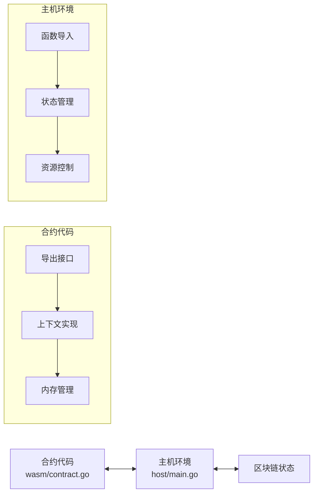
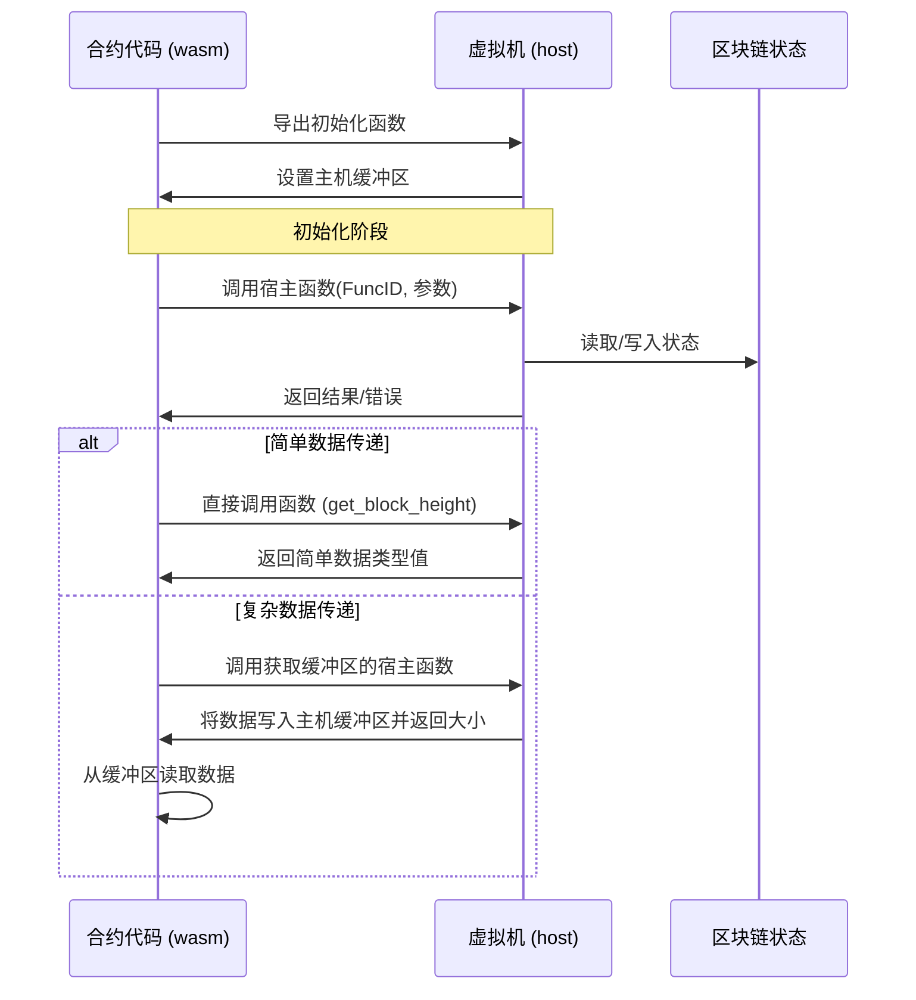

# WebAssembly 智能合约接口系统

本文档详细介绍了 VM 项目中 WebAssembly 智能合约接口系统的设计和实现。该系统通过 wasm/contract.go 和 host/main.go 组件实现了合约代码与区块链环境之间的通信桥梁。

## 1. 系统架构概述

WebAssembly 智能合约接口系统采用双向通信架构，包含两个主要组件：



- **合约侧接口 (wasm/contract.go)**: 提供面向合约开发者的 API，实现 Context 和 Object 接口
- **主机侧接口 (host/main.go)**: 实现合约调用的宿主函数，管理状态和资源

## 2. 合约侧接口详解

合约侧接口在 wasm/contract.go 中实现，作为合约代码与主机环境之间的桥梁。

### 2.1 导出函数

WebAssembly合约有两类函数会被导出：

#### 2.1.1 基础必需的导出函数

这些函数是与WebAssembly运行时交互所必需的基础函数，每个合约都必须实现：

```go
//export allocate
func allocate(size int32) int32 {
    // 内存分配函数 - 供主机环境请求分配内存时使用
    buffer := make([]byte, size)
    return int32(uintptr(unsafe.Pointer(&buffer[0])))
}

//export deallocate
func deallocate(ptr int32, size int32) {
    // 内存释放函数 (由Go垃圾收集器管理)
    // 在WebAssembly中，这个函数可能是空实现
}

//export set_host_buffer
func set_host_buffer(ptr int32) {
    // 设置主机缓冲区地址 - 用于高效数据传递
    hostBufferPtr = ptr
}
```

注意：这些系统基础函数仍需使用 `//export` 注释标记，因为它们是框架内部使用的特殊函数。

#### 2.1.2 合约自定义的对外函数

这些函数是合约自身的业务逻辑函数，由开发者根据需求定义：

```go
// 公开函数 - 自动导出
func Hello() int32 {
    // 合约示例函数
    ctx := &Context{}
    ctx.Log("hello", "world")
    return 1
}

// 公开函数 - 自动导出
func ProcessData(dataPtr int32, dataLen int32) int32 {
    // 处理数据的示例函数
    data := readMemory(dataPtr, dataLen)
    // 业务逻辑处理
    return sum
}

// 公开函数 - 自动导出
func TransferToken(toPtr int32, amount int64) int32 {
    // 转账示例函数
    // ...
}

// 私有函数 - 不导出
func verifyTransaction(from, to Address, amount int64) bool {
    // 验证逻辑
    return true
}
```

合约的对外函数由开发者自行定义，这些函数构成了合约的公共API，可以被区块链交易调用。系统会自动识别所有大写字母开头的函数作为导出函数，无需开发者手动添加 `//export` 标记。导出规则遵循Go语言的公共/私有规范：
- 大写字母开头的函数自动被视为公开函数，会被导出供外部调用
- 小写字母开头的函数为私有函数，只能在合约内部使用

### 2.2 核心常量与宿主函数

合约使用一系列预定义的函数ID与主机环境通信：

```go
// 函数ID常量定义
const (
    FuncGetSender          int32 = iota + 1 // 1
    FuncGetBlockHeight                      // 2
    FuncGetBlockTime                        // 3
    FuncGetContractAddress                  // 4
    FuncGetBalance                          // 5
    FuncTransfer                            // 6
    FuncCreateObject                        // 7
    FuncCall                                // 8
    FuncGetObject                           // 9
    // ...其他函数ID
)
```

通过两种主要的宿主函数调用模式与主机环境通信：

```go
//export call_host_set
func call_host_set(funcID, argPtr, argLen int32) int64

//export call_host_get_buffer
func call_host_get_buffer(funcID, argPtr, argLen int32) int32
```

### 2.3 内存管理机制

合约代码采用统一的缓冲区管理方案：

```go
// 定义全局接收数据缓冲区的大小
const HostBufferSize int32 = 2048

// 使用全局变量存储动态分配的主机缓冲区地址
var hostBufferPtr int32 = 0
```

主要内存操作函数：

```go
// 从内存读取数据
func readMemory(ptr, size int32) []byte {
    // 安全地从指定内存位置读取数据
}

// 写入数据到内存
func writeToMemory(data interface{}) (ptr int32, size int32) {
    // 将数据序列化并写入内存
}
```

### 2.4 Context 接口实现

Context 接口提供访问区块链状态和功能的标准方法：

```go
// Context 接口定义
type Context interface {
    // 区块链信息相关
    BlockHeight() uint64         // 获取当前区块高度
    BlockTime() int64            // 获取当前区块时间戳
    ContractAddress() Address    // 获取当前合约地址
    
    // 账户操作相关
    Sender() Address             // 获取交易发送者或调用合约
    Balance(addr Address) uint64 // 获取账户余额
    Transfer(to Address, amount uint64) error // 转账操作
    
    // 对象存储相关 - 基础状态操作使用panic而非返回error
    CreateObject() Object                     // 创建新对象，失败时panic
    GetObject(id ObjectID) (Object, error)    // 获取指定对象，可能返回error
    GetObjectWithOwner(owner Address) (Object, error) // 按所有者获取对象，可能返回error
    DeleteObject(id ObjectID)                 // 删除对象，失败时panic
    
    // 跨合约调用
    Call(contract Address, function string, args ...any) ([]byte, error)
    
    // 日志与事件
    Log(eventName string, keyValues ...interface{}) // 记录事件
}

// Context 实现
func (c *Context) BlockHeight() uint64 {
    // 获取当前区块高度
    ptr, size, _ := callHost(FuncGetBlockHeight, nil)
    data := readMemory(ptr, size)
    return binary.LittleEndian.Uint64(data)
}

func (c *Context) BlockTime() int64 {
    // 获取当前区块时间
    ptr, size, _ := callHost(FuncGetBlockTime, nil)
    data := readMemory(ptr, size)
    return int64(binary.LittleEndian.Uint64(data))
}

func (c *Context) ContractAddress() Address {
    // 获取当前合约地址
    ptr, size, _ := callHost(FuncGetContractAddress, nil)
    data := readMemory(ptr, size)
    var addr Address
    copy(addr[:], data)
    return addr
}

func (c *Context) Sender() Address {
    // 获取交易发送者或调用合约
    // 在跨合约调用中，返回调用者合约地址
    // 在外部交易中，返回交易发起者地址
    ptr, size, _ := callHost(FuncGetSender, nil)
    data := readMemory(ptr, size)
    var addr Address
    copy(addr[:], data)
    return addr
}

func (c *Context) Balance(addr Address) uint64 {
    // 获取账户余额
    data, err := writeToMemory(addr)
    if err != nil {
        return 0
    }
    
    ptr, size, _ := callHost(FuncGetBalance, data)
    resultData := readMemory(ptr, size)
    return binary.LittleEndian.Uint64(resultData)
}

func (c *Context) Transfer(to Address, amount uint64) error {
    // 转账操作
    transferData := struct {
        To     Address
        Amount uint64
    }{
        To:     to,
        Amount: amount,
    }
    
    data, err := writeToMemory(transferData)
    if err != nil {
        return err
    }
    
    _, _, errCode := callHost(FuncTransfer, data)
    if errCode != 0 {
        return fmt.Errorf("transfer failed with code: %d", errCode)
    }
    
    return nil
}

func (c *Context) Call(contract Address, function string, args ...any) ([]byte, error) {
    // 跨合约调用
    // 将在编译时自动注入调用链信息
    callData := struct {
        Contract Address
        Function string
        Args     []any
    }{
        Contract: contract,
        Function: function,
        Args:     args,
    }
    
    data, err := writeToMemory(callData)
    if err != nil {
        return nil, err
    }
    
    ptr, size, errCode := callHost(FuncCall, data)
    if errCode != 0 {
        return nil, fmt.Errorf("contract call failed with code: %d", errCode)
    }
    
    return readMemory(ptr, size), nil
}

func (c *Context) CreateObject() Object {
    // 创建新对象 - 基础状态操作，失败时会panic
    
    // 调用主机函数创建对象
    ptr, size, errCode := callHost(FuncCreateObject, nil)
    if errCode != 0 {
        panic(fmt.Sprintf("failed to create object with code: %d", errCode))
    }
    
    // 解析对象ID
    idData := readMemory(ptr, size)
    var id ObjectID
    copy(id[:], idData)
    
    // 返回对象包装器
    return &Object{id: id}
}

func (c *Context) DeleteObject(id ObjectID) {
    // 删除对象 - 基础状态操作，失败时会panic
    data, err := writeToMemory(id)
    if err != nil {
        panic(fmt.Sprintf("failed to serialize object ID: %v", err))
    }
    
    _, _, errCode := callHost(FuncDeleteObject, data)
    if errCode != 0 {
        panic(fmt.Sprintf("failed to delete object with code: %d", errCode))
    }
    
    // 操作成功，无需返回值
}

// ...其他 Context 方法
```

### 2.5 Object 接口实现

Object 接口提供状态对象的操作方法：

```go
// Object 接口定义
type Object interface {
    ID() ObjectID           // 获取对象ID
    Owner() Address         // 获取对象所有者
    SetOwner(addr Address)  // 设置对象所有者，失败时panic
    
    // 字段操作
    Get(field string, value any) error  // 获取字段值
    Set(field string, value any) error  // 设置字段值
}

// Object 实现
func (o *Object) ID() ObjectID {
    // 获取对象ID
    return o.id
}

func (o *Object) Owner() Address {
    // 获取对象所有者
    data, err := writeToMemory(o.id)
    if err != nil {
        return Address{}
    }
    
    ptr, size, _ := callHost(FuncGetObjectOwner, data)
    ownerData := readMemory(ptr, size)
    var owner Address
    copy(owner[:], ownerData)
    return owner
}

func (o *Object) SetOwner(owner Address) {
    // 设置对象所有者 - 基础状态操作，失败时会panic
    ownerData := struct {
        ID    ObjectID
        Owner Address
    }{
        ID:    o.id,
        Owner: owner,
    }
    
    data, err := writeToMemory(ownerData)
    if err != nil {
        panic(fmt.Sprintf("failed to serialize data: %v", err))
    }
    
    _, _, errCode := callHost(FuncSetObjectOwner, data)
    if errCode != 0 {
        panic(fmt.Sprintf("set owner failed with code: %d", errCode))
    }
    
    // 操作成功，无需返回值
}

func (o *Object) Get(field string, value any) error {
    // 获取对象字段值
    getData := struct {
        ID    ObjectID
        Field string
    }{
        ID:    o.id,
        Field: field,
    }
    
    data, err := writeToMemory(getData)
    if err != nil {
        return err
    }
    
    ptr, size, errCode := callHost(FuncGetObjectField, data)
    if errCode != 0 {
        return fmt.Errorf("get field failed with code: %d", errCode)
    }
    
    fieldData := readMemory(ptr, size)
    return deserializeWithType(fieldData, value)
}

func (o *Object) Set(field string, value any) error {
    // 设置对象字段值
    // 使用带类型标记的序列化
    typedValue := CreateTypedValue(value)
    setData := struct {
        ID    ObjectID
        Field string
        Value TypedValue
    }{
        ID:    o.id,
        Field: field,
        Value: typedValue,
    }
    
    data, err := writeToMemory(setData)
    if err != nil {
        return err
    }
    
    _, _, errCode := callHost(FuncSetObjectField, data)
    if errCode != 0 {
        return fmt.Errorf("set field failed with code: %d", errCode)
    }
    
    return nil
}
```

## 3. 主机侧接口详解

主机侧接口在 host/main.go 中实现，负责处理合约的请求并提供资源控制。

### 3.1 状态管理

主机环境维护一个包含区块链状态的结构：

```go
// Host state
type HostState struct {
    CurrentSender   Address
    CurrentBlock    uint64
    CurrentTime     int64
    ContractAddress Address
    Balances        map[Address]uint64
    Objects         map[ObjectID]Object
    ObjectsByOwner  map[Address][]ObjectID
}
```

### 3.2 导入函数实现

主机环境为合约提供两种主要的导入函数处理器：

```go
// 处理设置类操作的函数
func callHostSetHandler(memory *wasmer.Memory) func([]wasmer.Value) ([]wasmer.Value, error) {
    // 处理不需要返回复杂数据的操作
}

// 处理获取缓冲区数据的函数
func callHostGetBufferHandler(memory *wasmer.Memory) func([]wasmer.Value) ([]wasmer.Value, error) {
    // 处理需要返回复杂数据的操作
}
```

此外，还提供直接的数据获取函数：

```go
// 获取区块高度处理函数
func getBlockHeightHandler(memory *wasmer.Memory) func([]wasmer.Value) ([]wasmer.Value, error)

// 获取区块时间处理函数
func getBlockTimeHandler(memory *wasmer.Memory) func([]wasmer.Value) ([]wasmer.Value, error)

// 获取余额处理函数
func getBalanceHandler(memory *wasmer.Memory) func([]wasmer.Value) ([]wasmer.Value, error)
```

### 3.3 主机缓冲区管理

主机缓冲区用于在主机和合约之间高效传递大型或复杂数据：

```go
// 全局缓冲区大小
const HostBufferSize = 2048

// 主机缓冲区变量 - 动态分配
var hostBufferPtr int32 = 0

// 初始化主机缓冲区
func initHostBuffer(instance *wasmer.Instance, memory *wasmer.Memory) error {
    // 1. 分配缓冲区
    // 2. 清理缓冲区内存
    // 3. 通知WebAssembly模块缓冲区地址
}
```

## 4. 通信流程

合约代码与主机环境之间的通信遵循以下流程：



### 4.1 参数传递

合约与主机环境之间参数传递采用以下方式：

1. **简单类型参数**：直接通过函数参数传递
2. **复杂类型参数**：
   - 序列化为二进制数据
   - 通过内存指针和长度传递
3. **大型返回值**：
   - 使用共享的主机缓冲区
   - 返回值表示数据大小或状态码

### 4.2 错误处理

错误处理机制包括：

- 返回值状态码表示成功/失败
- 通过缓冲区返回详细错误信息
- 主机函数检查参数有效性和内存安全

## 5. 安全考虑

WebAssembly 智能合约接口系统实现了多层安全机制：

### 5.1 内存安全

- **边界检查**：对所有内存访问进行严格的边界检查
- **指针验证**：验证传递的内存指针的有效性
- **内存隔离**：合约只能访问自己的内存空间
- **内存分配控制**：通过导出的分配函数管理内存使用

示例：
```go
// 在主机环境中检查内存安全
if argPtr < 0 || argPtr >= memorySize || argPtr+argLen > memorySize {
    fmt.Printf("无效的内存访问: 指针=%d, 长度=%d, 内存大小=%d\n", argPtr, argLen, memorySize)
    return []wasmer.Value{wasmer.NewI64(0)}, fmt.Errorf("无效的内存访问")
}
```

### 5.2 资源控制

- **内存限制**：设置WebAssembly实例可使用的最大内存
- **执行时间控制**：可实现执行超时机制
- **指令计数**：可引入指令计数机制限制执行步骤

## 6. 系统调用分类

WebAssembly智能合约接口系统提供以下几类系统调用：

| 功能类别 | 描述 | 示例函数 |
|---------|------|---------|
| 上下文信息 | 获取区块链环境信息 | GetSender, GetBlockHeight, GetBlockTime |
| 账户操作 | 管理账户余额和转账 | GetBalance, Transfer |
| 对象管理 | 创建和管理状态对象 | CreateObject, GetObject, DeleteObject |
| 存储操作 | 读写持久化存储 | DbRead, DbWrite, DbDelete |
| 合约调用 | 调用其他合约 | Call |
| 日志与事件 | 记录合约执行事件 | Log |
| 内存管理 | 管理WebAssembly内存 | allocate, deallocate |

## 7. 优化技术

系统采用了多种优化技术提高性能：

### 7.1 内存优化

- **共享缓冲区**：使用预分配的共享缓冲区减少内存分配
- **内存复用**：减少内存分配和拷贝操作
- **序列化优化**：高效的二进制序列化格式
- **TinyGo内存管理**：合约使用 TinyGo 的 `-gc=leaking` 简化垃圾收集机制提高性能

## 8. 最佳实践

使用WebAssembly智能合约接口系统的最佳实践：

1. **最小化跨边界调用**：减少合约和主机环境之间的调用次数
2. **优化数据序列化**：减少不必要的数据转换和序列化
3. **合理使用缓冲区**：大数据使用缓冲区，小数据直接传递
4. **注意内存安全**：总是验证内存指针和长度的有效性
5. **错误处理**：妥善处理所有错误情况，不假设调用总是成功
6. **资源限制**：设置合理的内存和执行时间限制
7. **重用缓冲区**：为减少内存压力，合约代码应尽量重用缓冲区而非频繁分配内存
8. **正确导出函数**：使用 `//export` 标记所有需要导出的函数
9. **类型安全序列化**：使用带类型信息的序列化方法，避免数值类型转换问题

## 9. 总结

WebAssembly智能合约接口系统为Go语言编写的智能合约提供了高效、安全的执行环境。通过精心设计的通信接口，合约代码能够安全地访问区块链状态和功能，同时主机环境保持对资源使用的严格控制。

这种设计实现了以下目标：
- 安全的合约执行环境
- 高效的状态访问和操作
- 灵活的对象模型
- 可控的资源使用
- 强大的跨合约调用能力

系统的模块化设计使其易于扩展和适应不同的区块链环境，同时保持核心接口的稳定性，为智能合约开发者提供一致的开发体验。 