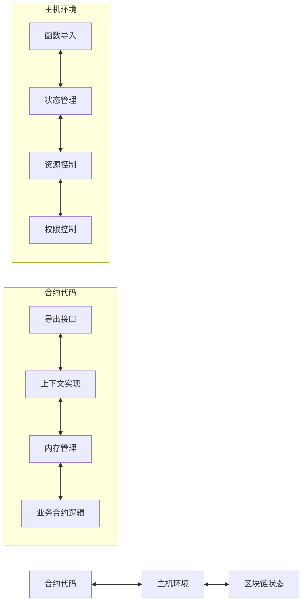
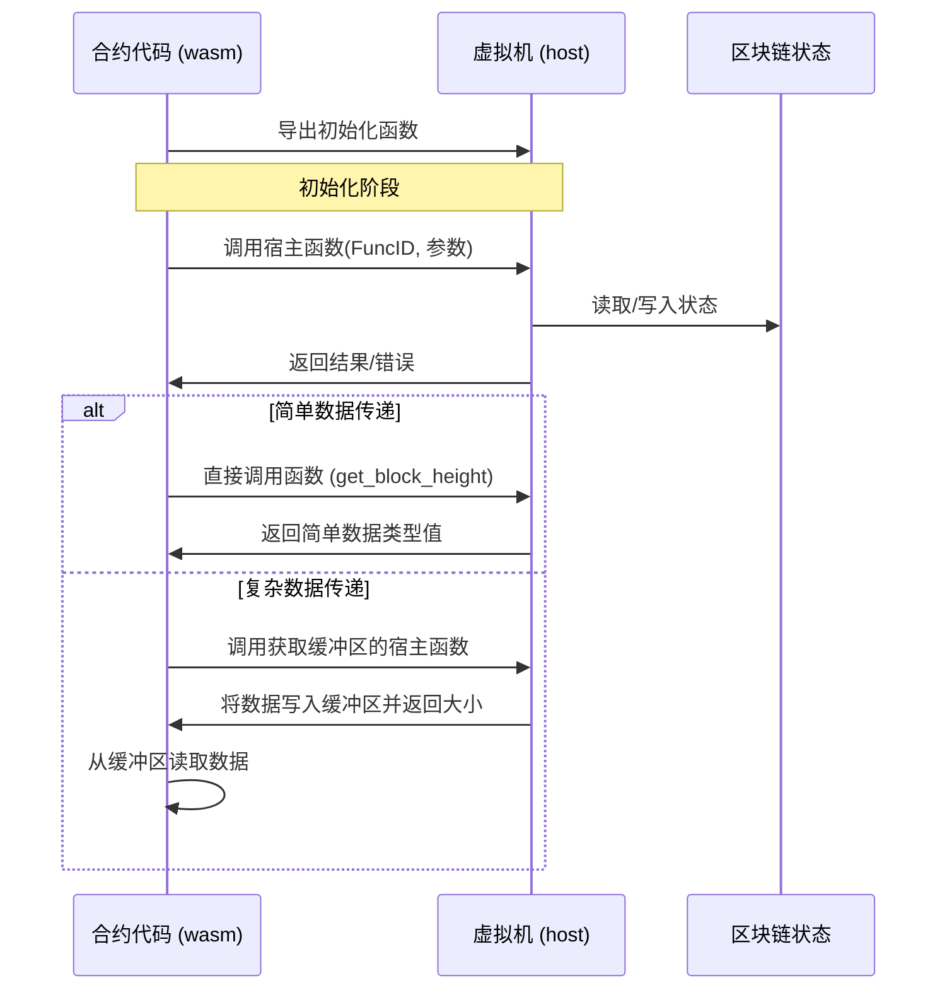

# WebAssembly 智能合约接口系统

本文档详细介绍了 VM 项目中 WebAssembly 智能合约接口系统的设计和实现。该系统通过 wasm/contract.go 和 host/main.go 组件实现了合约代码与区块链环境之间的通信桥梁。

## 1. 系统架构概述

WebAssembly 智能合约接口系统采用双向通信架构，包含两个主要组件：



- **合约侧接口 (wasm/contract.go)**: 提供面向合约开发者的 API，实现 Context 和 Object 接口
- **主机侧接口 (host/runner.go)**: 实现合约调用的宿主函数，管理状态和资源

## 2. 合约侧接口详解

合约侧接口在 wasm/contract.go 中实现，作为合约代码与主机环境之间的桥梁。

### 2.1 导出函数

WebAssembly合约有两类函数会被导出：

#### 2.1.1 基础必需的导出函数

这些函数是与WebAssembly运行时交互所必需的基础函数，每个wasi都必须实现，由框架统一提供：

```go
//export allocate
func allocate(size int32) int32 {
    // 内存分配函数 - 供主机环境请求分配内存时使用
    buffer := make([]byte, size)
    return int32(uintptr(unsafe.Pointer(&buffer[0])))
}

//export deallocate
func deallocate(ptr int32, size int32) {
    // 内存释放函数 (由Go垃圾收集器管理)
    // 在WebAssembly中，这个函数可能是空实现
}

//export handle_contract_call
func handle_contract_call(funcNamePtr, funcNameLen, paramsPtr, paramsLen int32) int32{
}
```

注意：这些系统基础函数仍需使用 `//export` 注释标记，因为它们是框架内部使用的特殊函数。

#### 2.1.2 合约自定义的对外函数

这些函数是合约自身的业务逻辑函数，由开发者根据需求定义：

```go
// 公开函数 - 自动导出
func Hello(ctx core.Context) int32 {
    ctx.Log("hello", "world")
    return 1
}

// 公开函数 - 自动导出
func ProcessData(dataPtr int32, dataLen int32) int32 {
    // 业务逻辑处理
    return 1
}

// 公开函数 - 自动导出
func TransferToken(ctx core.Context, toPtr int32, amount int64) int32 {
    // 转账示例函数
    // ...
}

// 私有函数 - 不导出
func verifyTransaction(from, to Address, amount int64) bool {
    // 验证逻辑
    return true
}
```

合约的对外函数由开发者自行定义，这些函数构成了合约的公共API，可以被区块链交易调用。系统会自动识别所有大写字母开头的函数作为导出函数，无需开发者手动添加 `//export` 标记。导出规则遵循Go语言的公共/私有规范：
- 大写字母开头的函数自动被视为公开函数，会被导出供外部调用
- 小写字母开头的函数为私有函数，只能在合约内部使用

### 2.2 核心常量与宿主函数

合约使用一系列预定义的函数ID与主机环境通信：

```go
// 函数ID常量定义
const (
    FuncGetSender          int32 = iota + 1 // 1
    FuncGetBlockHeight                      // 2
    FuncGetBlockTime                        // 3
    FuncGetContractAddress                  // 4
    FuncGetBalance                          // 5
    FuncTransfer                            // 6
    FuncCreateObject                        // 7
    FuncCall                                // 8
    FuncGetObject                           // 9
    // ...其他函数ID
)
```

通过两种主要的宿主函数调用模式与主机环境通信：

```go
//export call_host_set
func call_host_set(funcID, argPtr, argLen int32) int64

//export call_host_get_buffer
func call_host_get_buffer(funcID, argPtr, argLen int32) int32

//export get_block_height
func get_block_height() int64

//export get_block_time
func get_block_time() int64

//export get_balance
func get_balance(addrPtr int32) uint64
```

### 2.3 内存管理机制

合约代码采用统一的缓冲区管理方案：

主要内存操作函数：

```go
// 从内存读取数据
func readMemory(ptr, size int32) []byte {
    // 安全地从指定内存位置读取数据
}

// 写入数据到内存
func writeToMemory(data interface{}) (ptr int32, size int32) {
    // 将数据序列化并写入内存
}
```

### 2.4 Context 接口实现

Context 接口提供访问区块链状态和功能的标准方法：

```go
// Context 接口定义
type Context interface {
    // 区块链信息相关
    BlockHeight() uint64         // 获取当前区块高度
    BlockTime() int64            // 获取当前区块时间戳
    ContractAddress() Address    // 获取当前合约地址
    
    // 账户操作相关
    Sender() Address             // 获取交易发送者或调用合约
    Balance(addr Address) uint64 // 获取账户余额
    Transfer(to Address, amount uint64) error // 转账操作
    
    // 对象存储相关 - 基础状态操作使用panic而非返回error
    CreateObject() Object                     // 创建新对象，失败时panic
    GetObject(id ObjectID) (Object, error)    // 获取指定对象，可能返回error
    GetObjectWithOwner(owner Address) (Object, error) // 按所有者获取对象，可能返回error
    DeleteObject(id ObjectID)                 // 删除对象，失败时panic
    
    // 跨合约调用
    Call(contract Address, function string, args ...any) ([]byte, error)
    
    // 日志与事件
    Log(eventName string, keyValues ...interface{}) // 记录事件
}

// Context 实现
func (c *Context) BlockHeight() uint64 {
    return get_block_height()
}

func (c *Context) BlockTime() int64 {
    return get_block_time()
}

func (c *Context) ContractAddress() Address {
    // 获取当前合约地址
    ptr, size, _ := callHost(FuncGetContractAddress, nil)
    data := readMemory(ptr, size)
    var addr Address
    copy(addr[:], data)
    return addr
}

func (c *Context) Sender() Address {
    // 获取交易发送者或调用合约
    // 在跨合约调用中，返回调用者合约地址
    // 在外部交易中，返回交易发起者地址
    ptr, size, _ := callHost(FuncGetSender, nil)
    data := readMemory(ptr, size)
    var addr Address
    copy(addr[:], data)
    return addr
}

func (c *Context) Balance(addr Address) uint64 {
    // 获取账户余额
    data, err := writeToMemory(addr)
    if err != nil {
        return 0
    }
    
    ptr, _, _ := callHost(FuncGetBalance, data)
    return get_balance(ptr)
}

func (c *Context) Transfer(to Address, amount uint64) error {
    // 转账操作
    transferData := struct {
        To     Address
        Amount uint64
    }{
        To:     to,
        Amount: amount,
    }
    
    data, err := writeToMemory(transferData)
    if err != nil {
        return err
    }
    
    _, _, errCode := callHost(FuncTransfer, data)
    if errCode != 0 {
        return fmt.Errorf("transfer failed with code: %d", errCode)
    }
    
    return nil
}

func (c *Context) Call(contract Address, function string, args ...any) ([]byte, error) {
    // 跨合约调用
    // 将在编译时自动注入调用链信息
    callData := struct {
        Contract Address
        Function string
        Args     []any
    }{
        Contract: contract,
        Function: function,
        Args:     args,
    }
    
    data, err := writeToMemory(callData)
    if err != nil {
        return nil, err
    }
    
    ptr, size, errCode := callHost(FuncCall, data)
    if errCode != 0 {
        return nil, fmt.Errorf("contract call failed with code: %d", errCode)
    }
    
    return readMemory(ptr, size), nil
}

func (c *Context) CreateObject() Object {
    // 创建新对象 - 基础状态操作，失败时会panic
    
    // 调用主机函数创建对象
    ptr, size, errCode := callHost(FuncCreateObject, nil)
    if errCode != 0 {
        panic(fmt.Sprintf("failed to create object with code: %d", errCode))
    }
    
    // 解析对象ID
    idData := readMemory(ptr, size)
    var id ObjectID
    copy(id[:], idData)
    
    // 返回对象包装器
    return &Object{id: id}
}

func (c *Context) DeleteObject(id ObjectID) {
    // 删除对象 - 基础状态操作，失败时会panic
    data, err := writeToMemory(id)
    if err != nil {
        panic(fmt.Sprintf("failed to serialize object ID: %v", err))
    }
    
    _, _, errCode := callHost(FuncDeleteObject, data)
    if errCode != 0 {
        panic(fmt.Sprintf("failed to delete object with code: %d", errCode))
    }
    
    // 操作成功，无需返回值
}

// ...其他 Context 方法
```

### 2.5 Object 接口实现

Object 接口提供状态对象的操作方法：

1. 合约只能看到属于当前合约的Object（实现的时候有Type=ContractAddress）
2. 合约可以查看当前用户和其他用户的Object
3. 合约只能编辑Owner为Sender/Contract的Object

```go
// Object 接口定义
type Object interface {
    ID() ObjectID           // 获取对象ID
    Owner() Address         // 获取对象所有者
    SetOwner(addr Address)  // 设置对象所有者，失败时panic
    
    // 字段操作
    Get(field string, value any) error  // 获取字段值
    Set(field string, value any) error  // 设置字段值
}

// Object 实现
func (o *Object) ID() ObjectID {
    // 获取对象ID
    return o.id
}

func (o *Object) Owner() Address {
    // 获取对象所有者
    data, err := writeToMemory(o.id)
    if err != nil {
        return Address{}
    }
    
    ptr, size, _ := callHost(FuncGetObjectOwner, data)
    ownerData := readMemory(ptr, size)
    var owner Address
    copy(owner[:], ownerData)
    return owner
}

func (o *Object) SetOwner(owner Address) {
    // 设置对象所有者 - 基础状态操作，失败时会panic
    ownerData := struct {
        ID    ObjectID
        Owner Address
    }{
        ID:    o.id,
        Owner: owner,
    }
    
    data, err := writeToMemory(ownerData)
    if err != nil {
        panic(fmt.Sprintf("failed to serialize data: %v", err))
    }
    
    _, _, errCode := callHost(FuncSetObjectOwner, data)
    if errCode != 0 {
        panic(fmt.Sprintf("set owner failed with code: %d", errCode))
    }
    
    // 操作成功，无需返回值
}

func (o *Object) Get(field string, value any) error {
    // 获取对象字段值
    getData := struct {
        ID    ObjectID
        Field string
    }{
        ID:    o.id,
        Field: field,
    }
    
    data, err := writeToMemory(getData)
    if err != nil {
        return err
    }
    
    ptr, size, errCode := callHost(FuncGetObjectField, data)
    if errCode != 0 {
        return fmt.Errorf("get field failed with code: %d", errCode)
    }
    
    fieldData := readMemory(ptr, size)
    return json.Unmarshal(fieldData, value)
}

func (o *Object) Set(field string, value any) error {
    // 设置对象字段值
    setData := struct {
        ID    ObjectID
        Field string
        Value any
    }{
        ID:    o.id,
        Field: field,
        Value: value,
    }
    
    data, err := writeToMemory(setData)
    if err != nil {
        return err
    }
    
    _, _, errCode := callHost(FuncSetObjectField, data)
    if errCode != 0 {
        return fmt.Errorf("set field failed with code: %d", errCode)
    }
    
    return nil
}
```

## 3. 主机侧接口详解

主机侧接口在 host/main.go 中实现，负责处理合约的请求并提供资源控制。

### 3.1 状态管理

主机环境维护一个包含区块链状态的结构：

```go
// Host state
type HostState struct {
    CurrentSender   Address
    CurrentBlock    uint64
    CurrentTime     int64
    ContractAddress Address
    Balances        map[Address]uint64
    Objects         map[ObjectID]Object
    ObjectsByOwner  map[Address][]ObjectID
}
```

### 3.2 导入函数实现

主机环境为合约提供两种主要的导入函数处理器：

```go
// 处理设置类操作的函数
func callHostSetHandler(memory *wazero.Memory) func([]wazero.Value) ([]wazero.Value, error) {
    // 处理不需要返回复杂数据的操作
}

// 处理获取缓冲区数据的函数
func callHostGetBufferHandler(memory *wazero.Memory) func([]wazero.Value) ([]wazero.Value, error) {
    // 处理需要返回复杂数据的操作
}
```

此外，还提供直接的数据获取函数：

```go
// 获取区块高度处理函数
func getBlockHeightHandler(memory *wazero.Memory) func([]wazero.Value) ([]wazero.Value, error)

// 获取区块时间处理函数
func getBlockTimeHandler(memory *wazero.Memory) func([]wazero.Value) ([]wazero.Value, error)

// 获取余额处理函数
func getBalanceHandler(memory *wazero.Memory) func([]wazero.Value) ([]wazero.Value, error)
```

## 4. 通信流程

合约代码与主机环境之间的通信遵循以下流程：



### 4.1 参数传递

合约与主机环境之间参数传递采用以下方式：

1. **简单类型参数**：直接通过函数参数传递
2. **复杂类型参数**：
   - 序列化为二进制数据
   - 通过内存指针和长度传递

### 4.2 错误处理

错误处理机制包括：

- 返回值状态码表示成功/失败
- 通过缓冲区返回详细错误信息
- 主机函数检查参数有效性和内存安全

## 5. 安全考虑

WebAssembly 智能合约接口系统实现了多层安全机制：

### 5.1 内存安全

- **边界检查**：对所有内存访问进行严格的边界检查
- **指针验证**：验证传递的内存指针的有效性
- **内存隔离**：合约只能访问自己的内存空间
- **内存分配控制**：通过导出的分配函数管理内存使用

### 5.2 资源控制

- **内存限制**：设置WebAssembly实例可使用的最大内存
- **执行时间控制**：可实现执行超时机制
- **指令计数**：可引入指令计数机制限制执行步骤

## 6. 默认Object和状态存储

每个WebAssembly智能合约在部署时会自动获得一个默认的Object，作为合约状态的主要存储位置。这种设计提供了一个标准的状态持久化机制，避免依赖全局变量。

### 6.1 默认Object特性

- **自动创建**：每个合约在部署时系统自动创建
- **通过空ID访问**：虽然有真实的唯一ID，但可以通过空ObjectID（全为0的字节数组）访问
- **初始所有权**：默认情况下，所有者是合约地址本身
- **可转移所有权**：与其他对象一样，可以通过SetOwner方法转移所有权
- **持久化存储**：数据在合约调用间保持不变

### 6.2 访问默认Object

合约代码可以通过以下方式访问默认Object：

```go
// 获取合约的默认Object
func getDefaultObject(ctx core.Context) core.Object {
    // 使用空ObjectID获取默认对象
    emptyID := core.ObjectID{} // 全为0的ObjectID
    return ctx.GetObject(emptyID)
}
```

### 6.3 所有权管理

默认Object的所有权可以转移，这提供了灵活的权限管理机制：

```go
// 转移默认Object的所有权
func transferDefaultObjectOwnership(ctx core.Context, newOwner Address) bool {
    // 获取默认对象
    defaultObj := ctx.GetObject(ObjectID{})
    
    // 检查当前调用者是否为所有者
    currentOwner := defaultObj.Owner()
    if ctx.Sender() != currentOwner {
        ctx.Log("error", "message", "只有当前所有者可以转移所有权")
        return false
    }
    
    // 转移所有权
    defaultObj.SetOwner(newOwner)
    ctx.Log("ownership_transferred", "from", currentOwner, "to", newOwner)
    return true
}
```

需要注意的是，一旦转移了默认Object的所有权，合约本身将不再能够修改它，除非新所有者允许。这可以用于实现高级的权限控制或合约升级机制。

### 6.4 使用场景

默认Object的主要用途包括：

1. **存储合约配置**：存储合约的不可变或很少变化的配置数据
2. **保存全局状态**：替代全局变量存储合约的运行状态
3. **维护索引和引用**：保存对其他对象的引用和索引
4. **权限控制**：通过所有权转移实现管理权限的变更
5. **合约升级**：通过转移关键对象的所有权实现合约逻辑的升级

### 6.5 使用示例

以下是使用默认Object存储合约全局状态的示例：

```go
// 初始化合约
func Initialize(ctx core.Context, name string, symbol string) int32 {
    // 获取默认Object
    defaultObj := ctx.GetObject(ObjectID{})
    
    // 存储合约基本信息
    err = defaultObj.Set("name", name)
    if err != nil {
        ctx.Log("error", "message", "无法设置名称")
        return -1
    }
    
    err = defaultObj.Set("symbol", symbol)
    if err != nil {
        ctx.Log("error", "message", "无法设置符号")
        return -1
    }
    
    ctx.Log("initialize", "name", name, "symbol", symbol)
    return 0
}

// 获取合约名称
func GetName(ctx core.Context) string {
    // 获取默认Object
    defaultObj := ctx.GetObject(ObjectID{})
    
    // 读取名称
    var name string
    err = defaultObj.Get("name", &name)
    if err != nil {
        return ""
    }
    
    return name
}
```

### 6.6 状态管理方式的比较

| 状态管理方式 | 优点                               | 缺点                     |
| ------------ | ---------------------------------- | ------------------------ |
| 默认Object   | 自动创建、简单直接、无需额外ID管理 | 所有数据集中在一个对象   |
| 自定义多对象 | 数据分散存储、更好的组织结构       | 需要管理多个对象ID       |
| 全局变量     | 访问简单、无需序列化               | 状态不持久、每次执行重置 |

默认Object提供了全局变量的便捷性和区块链存储的持久性，是小型合约或简单状态管理的理想选择。

### 6.7 Context使用最佳实践

智能合约中的Context对象是连接合约代码与区块链环境的桥梁，它提供了访问区块链状态和功能的标准接口。为了确保合约状态一致性和正确的执行环境，应当遵循以下最佳实践：

#### 6.7.1 Context作为参数传递

**重要原则**: Context应该作为参数传递给合约函数，而不是在函数内部创建。

```go
// ✅ 推荐：Context作为参数传递
func Transfer(ctx core.Context, to Address, amount uint64) bool {
    // 使用传入的ctx访问区块链状态
    sender := ctx.Sender()
    // ...其他逻辑
}

// ❌ 禁止：在函数内部创建Context
func Transfer(to Address, amount uint64) bool {
    ctx := &Context{} // 不要这样做！
    // ...其他逻辑
}
```

#### 6.7.2 Context参数传递的好处

将Context作为参数传递而非在函数内部创建有以下优势：

1. **状态一致性**：确保整个交易过程中使用同一个执行上下文，保持状态一致
2. **调用链完整性**：系统可以正确跟踪并记录合约调用链，便于审计和调试
3. **资源控制**：允许系统对整个执行路径进行统一的资源计量和限制
4. **依赖注入**：便于测试，可以注入模拟的Context进行单元测试
5. **执行环境继承**：确保子调用继承父调用的执行环境特性

#### 6.7.3 辅助函数中的Context传递

在合约内部的辅助函数中，也应当保持Context参数的传递模式：

```go
// 公开的合约函数
func Mint(ctx core.Context, to Address, amount uint64) bool {
    // 验证权限
    if !isAuthorized(ctx, ctx.Sender()) {
        return false
    }
    
    // 调用辅助函数时传递Context
    return updateBalance(ctx, to, amount)
}

// 内部辅助函数
func updateBalance(ctx core.Context, account Address, amount uint64) bool {
    // 使用传入的Context进行状态访问
    // ...
}
```

#### 6.7.4 跨合约调用中的Context处理

在进行跨合约调用时，系统会自动处理Context的传递和调用链信息的维护：

```go
// 在合约A中调用合约B
func CallOtherContract(ctx core.Context, targetContract Address) {
    // 调用其他合约时，系统会自动处理Context传递
    result, err := ctx.Call(targetContract, "SomeFunction", arg1, arg2)
    // ...
}

// 在合约B中被调用的函数
func SomeFunction(ctx core.Context, arg1 string, arg2 uint64) {
    // ctx中包含了调用者信息
    caller := ctx.Sender() // 返回合约A的地址
    // ...
}
```

```go
import "github.com/.../contractB"
// 在合约A中直接调用合约B
func CallOtherContract(ctx core.Context, targetContract Address) {
    // 调用其他合约时，系统会自动处理Context传递
    contractB.SomeFunction(arg1, arg2)
    // ...
}

// 在合约B中被调用的函数
func SomeFunction(ctx core.Context, arg1 string, arg2 uint64) {
    // ctx中包含了调用者信息
    caller := ctx.Sender() // 返回合约A的地址
    // ...
}
```

智能合约开发者应当始终遵循这种Context传递模式，以确保合约执行的正确性、一致性和可维护性。

## 7. 系统调用分类

WebAssembly智能合约接口系统提供以下几类系统调用：

| 功能类别   | 描述                | 示例函数                                |
| ---------- | ------------------- | --------------------------------------- |
| 上下文信息 | 获取区块链环境信息  | GetSender, GetBlockHeight, GetBlockTime |
| 账户操作   | 管理账户余额和转账  | GetBalance, Transfer                    |
| 对象管理   | 创建和管理状态对象  | CreateObject, GetObject, DeleteObject   |
| 合约调用   | 调用其他合约        | Call                                    |
| 日志与事件 | 记录合约执行事件    | Log                                     |
| 内存管理   | 管理WebAssembly内存 | allocate, deallocate                    |

## 8. 优化技术

系统采用了多种优化技术提高性能：

### 8.1 内存优化

- **共享缓冲区**：使用预分配的共享缓冲区减少内存分配
- **内存复用**：减少内存分配和拷贝操作
- **序列化优化**：高效的二进制序列化格式
- **TinyGo内存管理**：合约使用 TinyGo 的 `-gc=leaking` 简化垃圾收集机制提高性能

## 9. 最佳实践

使用WebAssembly智能合约接口系统的最佳实践：

1. **最小化跨边界调用**：减少合约和主机环境之间的调用次数
2. **优化数据序列化**：减少不必要的数据转换和序列化
3. **合理使用缓冲区**：大数据使用缓冲区，小数据直接传递
4. **注意内存安全**：总是验证内存指针和长度的有效性
5. **错误处理**：妥善处理所有错误情况，不假设调用总是成功
6. **资源限制**：设置合理的内存和执行时间限制
7. **重用缓冲区**：为减少内存压力，合约代码应尽量重用缓冲区而非频繁分配内存
8. **类型安全序列化**：使用带类型信息的序列化方法，避免数值类型转换问题

## 10. 总结

WebAssembly智能合约接口系统为Go语言编写的智能合约提供了高效、安全的执行环境。通过精心设计的通信接口，合约代码能够安全地访问区块链状态和功能，同时主机环境保持对资源使用的严格控制。

这种设计实现了以下目标：
- 安全的合约执行环境
- 高效的状态访问和操作
- 灵活的对象模型
- 可控的资源使用
- 强大的跨合约调用能力

系统的模块化设计使其易于扩展和适应不同的区块链环境，同时保持核心接口的稳定性，为智能合约开发者提供一致的开发体验。 