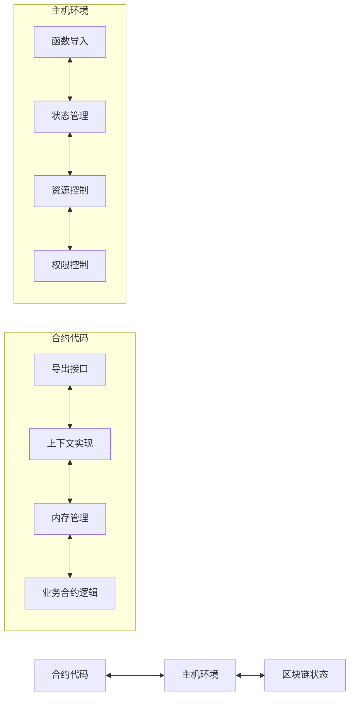
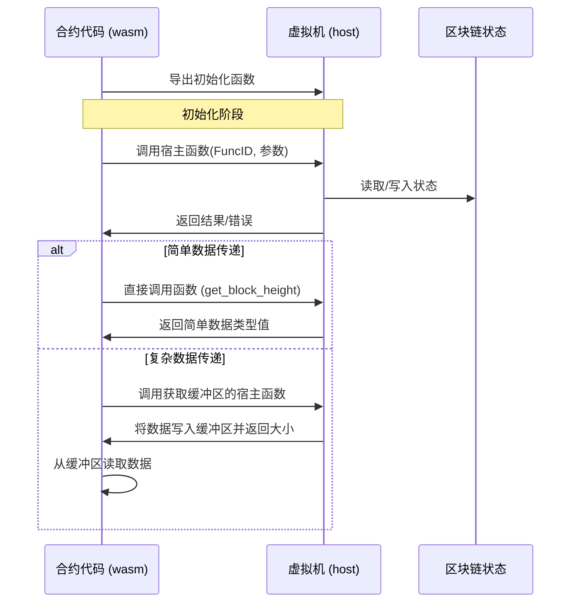

# WebAssembly 智能合约接口系统

本文档详细介绍了 VM 项目中 WebAssembly 智能合约接口系统的设计和实现。该系统通过 wasm/contract.go 和 host/main.go 组件实现了合约代码与区块链环境之间的通信桥梁。

## 1. 系统架构概述

WebAssembly 智能合约接口系统采用双向通信架构，包含两个主要组件：



- **合约侧接口 (wasm/contract.go)**: 提供面向合约开发者的 API，实现 Context 和 Object 接口
- **主机侧接口 (host/runner.go)**: 实现合约调用的宿主函数，管理状态和资源

## 2. 合约侧接口详解

合约侧接口在 wasm/contract.go 中实现，作为合约代码与主机环境之间的桥梁。

### 2.1 导出函数

WebAssembly合约有两类函数会被导出：

#### 2.1.1 基础必需的导出函数

这些函数是与WebAssembly运行时交互所必需的基础函数，每个wasi都必须实现，由框架统一提供：

```go
//export allocate
func allocate(size int32) int32 {
    // 内存分配函数 - 供主机环境请求分配内存时使用
    buffer := make([]byte, size)
    return int32(uintptr(unsafe.Pointer(&buffer[0])))
}

//export deallocate
func deallocate(ptr int32, size int32) {
    // 内存释放函数 (由Go垃圾收集器管理)
    // 在WebAssembly中，这个函数可能是空实现
}

//export handle_contract_call
func handle_contract_call(funcNamePtr, funcNameLen, paramsPtr, paramsLen int32) int32{
}
```

注意：这些系统基础函数仍需使用 `//export` 注释标记，因为它们是框架内部使用的特殊函数。

#### 2.1.2 合约自定义的对外函数

这些函数是合约自身的业务逻辑函数，由开发者根据需求定义：

```go
// 公开函数 - 自动导出
func Hello(ctx core.Context) int32 {
    ctx.Log("hello", "world")
    return 1
}

// 公开函数 - 自动导出
func ProcessData(dataPtr int32, dataLen int32) int32 {
    // 业务逻辑处理
    return 1
}

// 公开函数 - 自动导出
func TransferToken(ctx core.Context, toPtr int32, amount int64) int32 {
    // 转账示例函数
    // ...
}

// 私有函数 - 不导出
func verifyTransaction(from, to Address, amount int64) bool {
    // 验证逻辑
    return true
}
```

合约的对外函数由开发者自行定义，这些函数构成了合约的公共API，可以被区块链交易调用。系统会自动识别所有大写字母开头的函数作为导出函数，无需开发者手动添加 `//export` 标记。导出规则遵循Go语言的公共/私有规范：
- 大写字母开头的函数自动被视为公开函数，会被导出供外部调用
- 小写字母开头的函数为私有函数，只能在合约内部使用

### 2.2 核心常量与宿主函数

合约使用一系列预定义的函数ID与主机环境通信：

```go
// 函数ID常量定义
const (
    FuncGetSender          int32 = iota + 1 // 1
    FuncGetBlockHeight                      // 2
    FuncGetBlockTime                        // 3
    FuncGetContractAddress                  // 4
    FuncGetBalance                          // 5
    FuncTransfer                            // 6
    FuncCreateObject                        // 7
    FuncCall                                // 8
    FuncGetObject                           // 9
    // ...其他函数ID
)
```

通过两种主要的宿主函数调用模式与主机环境通信：

```go
//export call_host_set
func call_host_set(funcID, argPtr, argLen int32) int64

//export call_host_get_buffer
func call_host_get_buffer(funcID, argPtr, argLen int32) int32

//export get_block_height
func get_block_height() int64

//export get_block_time
func get_block_time() int64

//export get_balance
func get_balance(addrPtr int32) uint64
```

### 2.3 内存管理机制

合约代码采用统一的缓冲区管理方案：

主要内存操作函数：

```go
// 从内存读取数据
func readMemory(ptr, size int32) []byte {
    // 安全地从指定内存位置读取数据
}

// 写入数据到内存
func writeToMemory(data interface{}) (ptr int32, size int32) {
    // 将数据序列化并写入内存
}
```

### 2.4 Context 接口实现

Context 接口提供访问区块链状态和功能的标准方法：

```go
// Context 接口定义
type Context interface {
    // 区块链信息相关
    BlockHeight() uint64         // 获取当前区块高度
    BlockTime() int64            // 获取当前区块时间戳
    ContractAddress() Address    // 获取当前合约地址
    
    // 账户操作相关
    Sender() Address             // 获取交易发送者或调用合约
    Balance(addr Address) uint64 // 获取账户余额
    Transfer(to Address, amount uint64) error // 转账操作
    
    // 对象存储相关 - 基础状态操作使用panic而非返回error
    CreateObject() Object                     // 创建新对象，失败时panic
    GetObject(id ObjectID) (Object, error)    // 获取指定对象，可能返回error
    GetObjectWithOwner(owner Address) (Object, error) // 按所有者获取对象，可能返回error
    DeleteObject(id ObjectID)                 // 删除对象，失败时panic
    
    // 跨合约调用
    Call(contract Address, function string, args ...any) ([]byte, error)
    
    // 日志与事件
    Log(eventName string, keyValues ...interface{}) // 记录事件
}

// Context 实现
func (c *Context) BlockHeight() uint64 {
    return get_block_height()
}

func (c *Context) BlockTime() int64 {
    return get_block_time()
}

func (c *Context) ContractAddress() Address {
    // 获取当前合约地址
    ptr, size, _ := callHost(FuncGetContractAddress, nil)
    data := readMemory(ptr, size)
    var addr Address
    copy(addr[:], data)
    return addr
}

func (c *Context) Sender() Address {
    // 获取交易发送者或调用合约
    // 在跨合约调用中，返回调用者合约地址
    // 在外部交易中，返回交易发起者地址
    ptr, size, _ := callHost(FuncGetSender, nil)
    data := readMemory(ptr, size)
    var addr Address
    copy(addr[:], data)
    return addr
}

func (c *Context) Balance(addr Address) uint64 {
    // 获取账户余额
    data, err := writeToMemory(addr)
    if err != nil {
        return 0
    }
    
    ptr, _, _ := callHost(FuncGetBalance, data)
    return get_balance(ptr)
}

func (c *Context) Transfer(to Address, amount uint64) error {
    // 转账操作
    transferData := struct {
        To     Address
        Amount uint64
    }{
        To:     to,
        Amount: amount,
    }
    
    data, err := writeToMemory(transferData)
    if err != nil {
        return err
    }
    
    _, _, errCode := callHost(FuncTransfer, data)
    if errCode != 0 {
        return fmt.Errorf("transfer failed with code: %d", errCode)
    }
    
    return nil
}

func (c *Context) Call(contract Address, function string, args ...any) ([]byte, error) {
    // 跨合约调用
    // 将在编译时自动注入调用链信息
    callData := struct {
        Contract Address
        Function string
        Args     []any
    }{
        Contract: contract,
        Function: function,
        Args:     args,
    }
    
    data, err := writeToMemory(callData)
    if err != nil {
        return nil, err
    }
    
    ptr, size, errCode := callHost(FuncCall, data)
    if errCode != 0 {
        return nil, fmt.Errorf("call failed with code: %d", errCode)
    }
    
    return readMemory(ptr, size), nil
}
```

### 2.5 Object 接口实现

Object 接口提供统一的对象状态管理能力：

```go
// Object 接口定义
type Object interface {
    // 元数据方法
    ID() ObjectID                    // 获取对象唯一ID
    Contract() Address               // 获取所属合约地址
    Owner() Address                  // 获取所有者地址
    SetOwner(owner Address) error    // 设置所有者地址
    
    // 状态访问方法
    Get(field string, value any) error    // 获取指定字段值
    Set(field string, value any) error    // 设置指定字段值
}

// Object 实现
func (o *Object) ID() ObjectID {
    return o.id
}

func (o *Object) Contract() Address {
    ptr, size, _ := callHost(FuncGetObjectContract, o.id[:])
    data := readMemory(ptr, size)
    var addr Address
    copy(addr[:], data)
    return addr
}

func (o *Object) Owner() Address {
    ptr, size, _ := callHost(FuncGetObjectOwner, o.id[:])
    data := readMemory(ptr, size)
    var addr Address
    copy(addr[:], data)
    return addr
}

func (o *Object) SetOwner(owner Address) error {
    setOwnerData := struct {
        ID    ObjectID
        Owner Address
    }{
        ID:    o.id,
        Owner: owner,
    }
    
    data, err := writeToMemory(setOwnerData)
    if err != nil {
        return err
    }
    
    _, _, errCode := callHost(FuncSetObjectOwner, data)
    if errCode != 0 {
        return fmt.Errorf("set owner failed with code: %d", errCode)
    }
    
    return nil
}

func (o *Object) Get(field string, value any) error {
    // 获取字段值
    request := struct {
        ID    ObjectID
        Field string
    }{
        ID:    o.id,
        Field: field,
    }
    
    data, err := writeToMemory(getData)
    if err != nil {
        return err
    }
    
    ptr, size, errCode := callHost(FuncGetObjectField, data)
    if errCode != 0 {
        return fmt.Errorf("get field failed with code: %d", errCode)
    }
    
    fieldData := readMemory(ptr, size)
    return json.Unmarshal(fieldData, value)
}

func (o *Object) Set(field string, value any) error {
    // 设置对象字段值
    setData := struct {
        ID    ObjectID
        Field string
        Value any
    }{
        ID:    o.id,
        Field: field,
        Value: value,
    }
    
    data, err := writeToMemory(setData)
    if err != nil {
        return err
    }
    
    _, _, errCode := callHost(FuncSetObjectField, data)
    if errCode != 0 {
        return fmt.Errorf("set field failed with code: %d", errCode)
    }
    
    return nil
}
```

## 3. 主机侧接口详解

主机侧接口在 host/main.go 中实现，负责处理合约的请求并提供资源控制。

### 3.1 状态管理

主机环境维护一个包含区块链状态的结构：

```go
// Host state
type HostState struct {
    CurrentSender   Address
    CurrentBlock    uint64
    CurrentTime     int64
    ContractAddress Address
    Balances        map[Address]uint64
    Objects         map[ObjectID]Object
    ObjectsByOwner  map[Address][]ObjectID
}
```

### 3.2 导入函数实现

主机环境为合约提供两种主要的导入函数处理器：

```go
// 处理设置类操作的函数
func callHostSetHandler(memory *wazero.Memory) func([]wazero.Value) ([]wazero.Value, error) {
    // 处理不需要返回复杂数据的操作
}

// 处理获取缓冲区数据的函数
func callHostGetBufferHandler(memory *wazero.Memory) func([]wazero.Value) ([]wazero.Value, error) {
    // 处理需要返回复杂数据的操作
}
```

此外，还提供直接的数据获取函数：

```go
// 获取区块高度处理函数
func getBlockHeightHandler(memory *wazero.Memory) func([]wazero.Value) ([]wazero.Value, error)

// 获取区块时间处理函数
func getBlockTimeHandler(memory *wazero.Memory) func([]wazero.Value) ([]wazero.Value, error)

// 获取余额处理函数
func getBalanceHandler(memory *wazero.Memory) func([]wazero.Value) ([]wazero.Value, error)
```

## 4. 通信流程

合约代码与主机环境之间的通信遵循以下流程：



### 4.1 参数传递

合约与主机环境之间参数传递采用以下方式：

1. **简单类型参数**：直接通过函数参数传递
2. **复杂类型参数**：
   - 序列化为二进制数据
   - 通过内存指针和长度传递

### 4.2 错误处理

错误处理机制包括：

- 返回值状态码表示成功/失败
- 通过缓冲区返回详细错误信息
- 主机函数检查参数有效性和内存安全

## 5. Gas计费机制

WebAssembly智能合约使用精确的Gas计费机制来控制资源消耗，确保合约执行的安全和可预测性。

### 5.1 计费原理

Gas计费系统采用双重计费策略：

#### 5.1.1 代码行计费

在合约编译过程中，系统会自动分析Go代码的控制流结构，并在适当位置注入Gas消耗代码：

```go
// 原始合约代码
func TransferToken(ctx core.Context, to Address, amount uint64) error {
    if amount <= 0 {
        return errors.New("amount must be positive")
    }
    
    sender := ctx.Sender()
    return ctx.Transfer(to, amount)
}

// 注入Gas计费后的代码
func TransferToken(ctx core.Context, to Address, amount uint64) error {
    mock.ConsumeGas(1)  // 消耗当前语句的gas
    if amount <= 0 {
        mock.ConsumeGas(1)  // if块内的语句消耗
        return errors.New("amount must be positive")
    }
    
    mock.ConsumeGas(2)  // 后续两行代码消耗
    sender := ctx.Sender()
    return ctx.Transfer(to, amount)
}
```

系统会识别基本代码块，并在每个块的开始处注入相应的Gas消耗代码。

#### 5.1.2 接口调用计费

除了基本的代码行计费外，所有Context和Object接口的调用都会消耗额外的Gas：

```go
// Context接口计费示例
func (c *Context) Sender() Address {
    mock.ConsumeGas(10)  // Sender操作固定消耗10 gas
    // ... 实际逻辑 ...
}

func (c *Context) Transfer(to Address, amount uint64) error {
    mock.ConsumeGas(500)  // Transfer操作固定消耗500 gas
    // ... 实际逻辑 ...
}

// Object接口计费示例
func (o *Object) Set(field string, value any) error {
    mock.ConsumeGas(1000)  // Set基础操作消耗1000 gas
    // ... 序列化 ...
    bytes, err := any2bytes(request)
    // ... 
    mock.ConsumeGas(int64(len(bytes)) * 100)  // 根据数据大小额外计费
    // ... 实际逻辑 ...
}
```

### 5.2 Gas消耗值

Context和Object接口的标准Gas消耗值：

| 接口 | 操作 | Gas消耗 |
|-----|-----|---------|
| **Context** | Sender() | 10 gas |
| | BlockHeight() | 10 gas |
| | BlockTime() | 10 gas |
| | ContractAddress() | 10 gas |
| | Balance(addr) | 50 gas |
| | Transfer(to, amount) | 500 gas |
| | Call(contract, function, args...) | 10000 gas + 被调用合约消耗 |
| | CreateObject() | 50 gas |
| | GetObject(id) | 50 gas |
| | GetObjectWithOwner(owner) | 50 gas |
| | DeleteObject(id) | 500 gas |
| | Log(event, keyValues...) | 100 gas + 数据长度 |
| **Object** | ID() | 10 gas |
| | Contract() | 100 gas |
| | Owner() | 100 gas |
| | SetOwner(owner) | 500 gas |
| | Get(field, value) | 100 gas + 结果数据大小 |
| | Set(field, value) | 1000 gas + 数据大小 * 100 gas |

### 5.3 特殊计费规则

某些操作有特殊的计费规则：

#### 5.3.1 合约调用Gas预留

当使用`Call`方法调用其他合约时，系统会预留10000 gas作为基本调用费用，并将剩余gas分配给被调用合约：

```go
// Call方法的Gas处理
func (c *Context) Call(contract Address, function string, args ...any) ([]byte, error) {
    // 预留基本调用费用
    mock.ConsumeGas(10000)
    
    // 构造调用参数，分配剩余gas给被调用合约
    callData := types.CallParams{
        Contract: contract,
        Function: function,
        Args:     args,
        Caller:   c.ContractAddress(),
        GasLimit: mock.GetGas(), // 分配剩余的gas
    }
    
    // ... 调用逻辑 ...
    
    // 实际消耗 = 10000 (基本费用) + 被调用合约实际消耗
    return result, nil
}
```

#### 5.3.2 数据大小相关计费

对于涉及数据处理的操作，额外的Gas消耗与数据大小相关：

- **Object.Set()**: 基础消耗1000 gas + 数据大小 * 100 gas
- **Object.Get()**: 基础消耗100 gas + 结果数据大小 gas
- **Context.Log()**: 基础消耗100 gas + 日志数据长度 gas

### 5.4 Gas控制API

合约可以通过mock包提供的Gas控制API进行Gas管理：

```go
import "github.com/govm-net/vm/mock"

// 初始化Gas（通常由系统自动调用）
mock.InitGas(1000000)

// 获取当前剩余Gas
remainingGas := mock.GetGas()

// 获取已使用Gas
usedGas := mock.GetUsedGas()

// 手动消耗Gas（通常由自动注入的代码调用）
mock.ConsumeGas(100)

// 退还Gas（特定场景如删除存储时使用）
mock.RefundGas(50)

// 重置Gas计数（通常由系统在合约调用开始时调用）
mock.ResetGas(500000)
```

## 6. 安全考虑

WebAssembly 智能合约接口系统实现了多层安全机制：

### 6.1 内存安全

- **边界检查**：对所有内存访问进行严格的边界检查
- **指针验证**：验证传递的内存指针的有效性
- **内存隔离**：合约只能访问自己的内存空间
- **内存分配控制**：通过导出的分配函数管理内存使用

### 6.2 资源控制

- **内存限制**：设置WebAssembly实例可使用的最大内存
- **执行时间控制**：可实现执行超时机制
- **指令计数**：可引入指令计数机制限制执行步骤

## 7. 性能优化

系统采用了多种优化技术提高性能：

### 7.1 内存优化

- **共享缓冲区**：使用预分配的共享缓冲区减少内存分配
- **内存复用**：减少内存分配和拷贝操作
- **序列化优化**：高效的二进制序列化格式
- **TinyGo内存管理**：合约使用TinyGo的垃圾收集机制，通过预分配和内存复用优化性能

## 8. 接口扩展

系统提供了多种扩展接口，以满足不同业务需求：

### 8.1 日志与事件

系统提供了日志与事件接口，用于记录合约执行过程中的关键事件：

```go
// 日志接口定义
type Logger interface {
    Log(eventName string, keyValues ...interface{})
}

// 日志实现
func (c *Context) Log(eventName string, keyValues ...interface{}) {
    // 调用日志接口记录事件
}
```

### 8.2 跨合约调用

系统提供了跨合约调用接口，允许合约之间进行安全的交互：

```go
// 跨合约调用接口定义
type Caller interface {
    Call(contract Address, function string, args ...any) ([]byte, error)
}

// 跨合约调用实现
func (c *Context) Call(contract Address, function string, args ...any) ([]byte, error) {
    // 调用跨合约调用接口
}
```

## 9. 最佳实践

使用WebAssembly智能合约接口系统的最佳实践：

1. **最小化跨边界调用**：减少合约和主机环境之间的调用次数
2. **优化数据序列化**：减少不必要的数据转换和序列化
3. **合理使用缓冲区**：大数据使用缓冲区，小数据直接传递
4. **注意内存安全**：总是验证内存指针和长度的有效性
5. **错误处理**：妥善处理所有错误情况，不假设调用总是成功
6. **资源限制**：设置合理的内存和执行时间限制
7. **重用缓冲区**：为减少内存压力，合约代码应尽量重用缓冲区而非频繁分配内存
8. **类型安全序列化**：使用带类型信息的序列化方法，避免数值类型转换问题

## 10. 总结

WebAssembly智能合约接口系统为Go语言编写的智能合约提供了高效、安全的执行环境。通过精心设计的通信接口，合约代码能够安全地访问区块链状态和功能，同时主机环境保持对资源使用的严格控制。

这种设计实现了以下目标：
- 安全的合约执行环境
- 高效的状态访问和操作
- 灵活的对象模型
- 可控的资源使用
- 强大的跨合约调用能力

系统的模块化设计使其易于扩展和适应不同的区块链环境，同时保持核心接口的稳定性，为智能合约开发者提供一致的开发体验。
