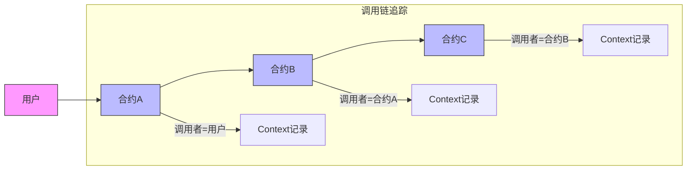
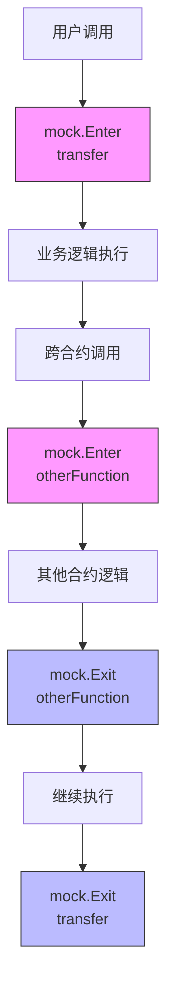
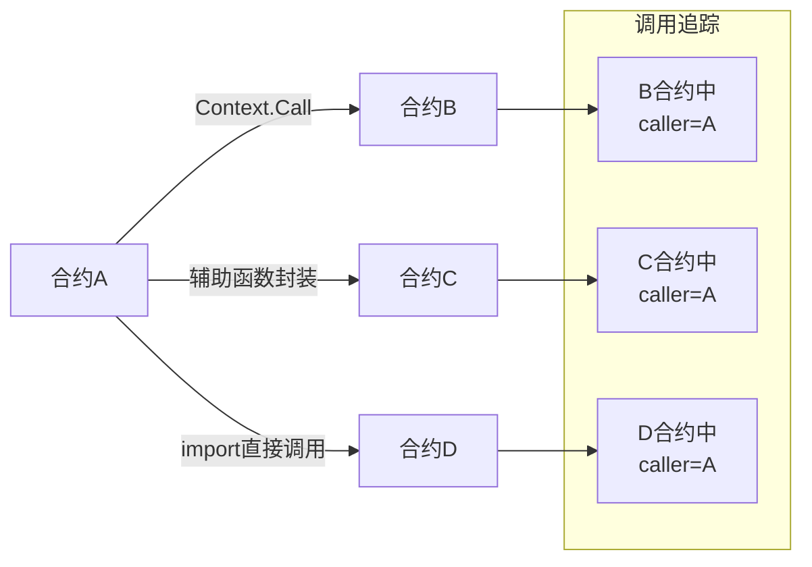
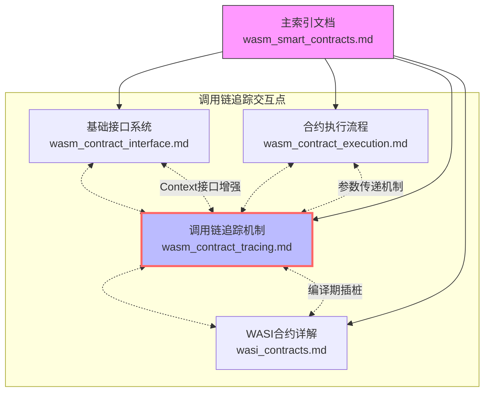

# WebAssembly 智能合约调用链追踪机制

本文档详细说明 VM 项目中 WebAssembly 智能合约的调用链追踪机制，特别是合约编译过程中的自动插桩技术，以及如何实现准确的跨合约调用者识别。

## 1. 调用链追踪概述

在复杂的智能合约系统中，合约间的相互调用非常普遍。准确识别调用者信息对于实现安全的权限控制和调试合约行为至关重要。WebAssembly 智能合约系统通过自动代码插桩实现了透明的调用链追踪。



## 2. 自动插桩机制

### 2.1 工作原理

在编译 Go 合约代码为 WebAssembly 时，系统会自动在所有跨合约调用点插入额外代码，以便追踪调用链和确保正确的合约身份识别：

1. **编译期分析**：在 TinyGo 编译合约代码前，系统会分析源代码中所有可能的跨合约调用点，包括但不限于 Context.Call 方法的使用。

2. **代码注入**：对每个跨合约调用点，自动插入以下信息：
   - 当前合约地址
   - 当前函数名称
   - 调用链路径

3. **生成包装代码**：创建 WASI 包装代码时，会添加必要的上下文传递逻辑，确保每次合约交互都能传递调用链信息。

### 2.2 插桩过程

插桩过程在 `generateWASIWrapper` 函数中实现，当生成 WASI 接口包装代码时：

```go
// 生成 WASI 接口包装代码
wrapperCode := generateWASIWrapper(packageName, functions, code)
```

系统会自动识别以下情况并进行插桩：

1. **直接跨合约调用**：通过 Context.Call 方法调用其他合约
2. **间接跨合约调用**：通过调用辅助函数间接执行跨合约调用 
3. **导入合约直接调用**：通过 import 其他合约并使用 `package.function()` 方式直接调用的情况
4. **特殊操作调用**：合约执行导致状态变更的关键操作

每个插桩点都会自动添加必要的代码以维护调用链信息，而无需开发者手动实现。

### 2.3 调用信息结构

系统使用 `CallInfo` 结构来传递调用者信息：

```go
// 调用信息结构
type CallInfo struct {
    CallerContract Address    `json:"caller_contract"`
    CallerFunction string     `json:"caller_function"`
    CallChain     []CallFrame `json:"call_chain,omitempty"`
}

type CallFrame struct {
    Contract Address `json:"contract"`
    Function string  `json:"function"`
}
```

这些信息会在每次跨合约调用时自动添加到参数中，无论调用方式如何。

### 2.3 导入合约直接调用的处理

系统对通过 import 语句导入并直接调用其他合约函数的情况也进行了特殊处理:

```go
// 合约代码中通过 import 直接使用其他合约
import (
    "github.com/example/token"  // 导入代币合约包
)

func transferTokens(to Address, amount uint64) error {
    // 直接调用导入包中的函数
    // 系统会自动对这类调用进行插桩
    return token.Transfer(to, amount)
}
```

该自动插桩机制会：

1. **识别导入关系**：在编译分析阶段识别所有导入的智能合约包
2. **函数调用分析**：检测所有对导入包中函数的调用点
3. **合约地址解析**：将包路径映射到对应的合约地址
4. **代码插桩**：在调用前插入与 Context.Call 相同的调用链信息构建代码
5. **透明重定向**：透明地将这些调用重定向为标准的跨合约调用

这使得开发者可以使用自然的导入和函数调用语法，同时系统仍能正确维护完整的调用链信息。

### 2.4 自动添加的 Mock 钩子函数

系统提供了一个专门的 mock 模块，包含"进入"和"退出"两个核心接口，用于实现更精确的调用追踪。在包装合约代码的过程中，系统会自动在所有对外暴露的函数中添加对这两个接口的调用：

```go
// mock 模块提供的钩子接口
package mock

// 函数调用进入时的钩子
func Enter(contractAddress Address, functionName string) {
    // 记录函数调用开始
    // 维护调用栈信息
    // 记录调用时间戳
}

// 函数调用退出时的钩子
func Exit(contractAddress Address, functionName string) {
    // 记录函数调用结束
    // 清理调用栈
    // 计算执行时间
    // 记录返回状态
}
```

生成的包装代码会自动将这些钩子添加到每个导出函数中：

```go
// 原始合约函数
//export transfer
func transfer(toPtr int32, amount int64) int32 {
    // 业务逻辑
    return SuccessCode
}

// 生成的包装函数
//export transfer
func transfer(toPtr int32, amount int64) int32 {
    // 自动添加的进入钩子
    mock.Enter(getCurrentContractAddress(), "transfer")
    
    // 延迟执行退出钩子，确保无论函数如何返回都会被调用
    defer func() {
        mock.Exit(getCurrentContractAddress(), "transfer")
    }()
    
    // 调用原始函数
    status := original_transfer(toPtr, amount)
    
    return status
}
```

### 2.5 钩子函数工作原理

这些自动添加的钩子函数实现了以下功能：

1. **完整的函数调用追踪**：记录每个函数的进入和退出点，包括调用参数和返回结果
2. **执行时间监控**：自动计算每个函数的执行时间
3. **异常处理**：捕获并记录函数执行过程中的异常
4. **嵌套调用关系**：维护一个函数调用栈，记录嵌套的函数调用关系
5. **资源使用情况**：跟踪函数执行过程中的资源使用情况

这种设计使得系统能够自动构建完整的调用树，无需开发者手动添加跟踪代码：



## 3. Context 接口增强

为支持调用链追踪，系统增强了合约执行环境以包含调用者信息：

### 3.1 执行上下文增强

```go
// 增强的执行上下文
type Context struct {
    contractAddr    Address     // 当前合约地址
    currentContract Address     // 当前执行上下文的合约
    currentFunction string      // 当前函数名
    callChain       []CallFrame // 调用链栈
    // ...其他原有属性
}
```

### 3.2 自动注入实现

系统对所有跨合约交互进行了增强，以自动注入和传递调用者信息：

```go
// 增强的跨合约调用实现
func (c *Context) Call(contract Address, function string, args ...any) ([]byte, error) {
    // 自动注入合约信息
    c.currentContract = c.contractAddr  // 由系统自动设置
    c.currentFunction = getFunctionNameFromCallSite()  // 通过编译期注入获取
    
    // 构建调用信息
    callInfo := &CallInfo{
        CallerContract: c.currentContract,
        CallerFunction: c.currentFunction,
        CallChain: append([]CallFrame{}, c.callChain...),  // 复制当前调用链
    }
    
    // 将当前调用推入调用链
    c.callChain = append(c.callChain, CallFrame{
        Contract: c.currentContract,
        Function: c.currentFunction,
    })
    
    // 在调用结束后恢复调用链
    defer func() {
        if len(c.callChain) > 0 {
            c.callChain = c.callChain[:len(c.callChain)-1]
        }
    }()
    
    // 将调用信息添加到参数中
    enhancedArgs := append([]any{callInfo}, args...)
    
    // 序列化参数
    serializedArgs, err := json.Marshal(enhancedArgs)
    if err != nil {
        return nil, fmt.Errorf("failed to serialize args: %v", err)
    }
    
    // 执行实际调用
    return c.originalCall(contract, function, serializedArgs)
}
```

其他可能导致跨合约交互的操作也会被类似增强，确保调用链信息在所有合约交互中保持一致。

### 3.3 Sender 方法增强

Sender 方法被增强以返回实际的调用者，而不仅仅是交易发起者：

```go
// 增强的 Sender 方法
func (c *Context) Sender() Address {
    // 如果是跨合约调用，返回调用者合约地址
    if c.isContractCall && !c.currentContract.IsZero() {
        return c.currentContract
    }
    
    // 否则返回交易原始发送者
    ptr, size, _ := callHost(FuncGetSender, nil)
    data := readMemory(ptr, size)
    var addr Address
    copy(addr[:], data)
    return addr
}
```

## 4. 合约间调用信息传递

### 4.1 自动生成的参数结构体

在包装合约代码时，平台会自动识别所有对外导出函数的接口和参数列表，并为每个函数自动生成相应的参数结构体：

```go
// 原始函数声明
//export transfer
func transfer(to Address, amount uint64) int32 { ... }

// 平台自动生成的参数结构体
type TransferParams struct {
    CallInfo *CallInfo `json:"call_info"`
    To       Address   `json:"to"`
    Amount   uint64    `json:"amount"`
}
```

这种自动生成的结构体包含了函数的所有参数，以及额外的 `CallInfo` 字段用于传递调用链信息。平台会为每个对外函数生成这样的结构体，自动处理序列化和反序列化过程，避免了手动处理参数的复杂性和类型不匹配的问题。

### 4.2 统一的参数序列化处理

VM系统采用统一的参数传递机制，确保类型安全和调用链信息的传递：

```go
// 合约调用的包装函数（由平台自动生成）
func (c *Context) Call(contract Address, function string, args ...any) ([]byte, error) {
    // 获取当前合约信息（由系统设置）
    callInfo := &CallInfo{
        CallerContract: c.contractAddr,
        CallerFunction: getFunctionNameFromCallSite(),
        CallChain:      append([]CallFrame{}, c.callChain...),
    }
    
    // 根据目标函数生成参数结构体并包含类型信息
    var params interface{}
    switch function {
    case "transfer":
        // 确保参数数量和类型正确
        if len(args) != 2 {
            return nil, fmt.Errorf("transfer expects 2 arguments, got %d", len(args))
        }
        
        // 类型安全检查
        to, ok1 := args[0].(Address)
        amount, ok2 := args[1].(uint64)
        if !ok1 || !ok2 {
            return nil, fmt.Errorf("invalid argument types for transfer")
        }
        
        // 使用自动生成的结构体
        params = &TransferParams{
            CallInfo: callInfo,
            To:       to,
            Amount:   amount,
        }
    // 为所有已知函数提供类似处理...
    default:
        // 对于未知函数，使用带类型标记的通用参数结构
        typedArgs := make([]TypedValue, len(args))
        for i, arg := range args {
            typedArgs[i] = CreateTypedValue(arg)
        }
        
        genericParams := struct {
            CallInfo *CallInfo    `json:"call_info"`
            Args     []TypedValue `json:"args"`
        }{
            CallInfo: callInfo,
            Args:     typedArgs,
        }
        params = genericParams
    }
    
    // 序列化参数结构体，保留类型信息
    serializedParams, err := serializeWithType(params)
    if err != nil {
        return nil, fmt.Errorf("failed to serialize parameters: %v", err)
    }
    
    // 执行实际调用
    return c.originalCall(contract, function, serializedParams)
}
```

### 4.3 类型安全的参数反序列化

在被调用合约一方，系统也采用统一的参数反序列化处理：

```go
// 平台生成的包装函数
//export contract_transfer
func contract_transfer(dataPtr int32, dataLen int32) int32 {
    // 进入函数钩子
    mock.Enter(getCurrentContractAddress(), "transfer")
    
    // 确保退出时调用退出钩子
    defer func() {
        mock.Exit(getCurrentContractAddress(), "transfer")
    }()
    
    // 读取输入数据
    data := readMemory(dataPtr, dataLen)
    
    // 使用自动生成的结构体直接反序列化
    var params TransferParams
    if err := deserializeWithType(data, &params); err != nil {
        return ErrorInvalidInput
    }
    
    // 提取调用信息
    callInfo := params.CallInfo
    
    // 保存调用者信息到上下文
    ctx := &Context{}
    ctx.currentContract = callInfo.CallerContract
    ctx.currentFunction = callInfo.CallerFunction
    ctx.callChain = callInfo.CallChain
    
    // 执行权限检查
    if !isAuthorized(callInfo.CallerContract, "transfer") {
        return ErrorUnauthorized
    }
    
    // 调用原始函数，传递提取的参数
    return original_transfer(params.To, params.Amount)
}
```

### 4.4 TypedValue 结构体

为确保类型信息在序列化过程中不丢失，系统使用 `TypedValue` 结构体封装值和类型信息：

```go
// 带类型信息的值
type TypedValue struct {
    Type  string      `json:"type"`  // 类型标识符
    Value interface{} `json:"value"` // 实际值
}

// 创建带类型信息的值
func CreateTypedValue(v interface{}) TypedValue {
    var typeName string
    
    // 根据值的类型设置类型标识符
    switch v.(type) {
    case int8:
        typeName = "int8"
    case int16:
        typeName = "int16" 
    case int32:
        typeName = "int32"
    case int64:
        typeName = "int64"
    case int:
        typeName = "int"
    case uint8:
        typeName = "uint8"
    case uint16:
        typeName = "uint16"
    case uint32:
        typeName = "uint32"
    case uint64:
        typeName = "uint64"
    case uint:
        typeName = "uint"
    case float32:
        typeName = "float32"
    case float64:
        typeName = "float64"
    case bool:
        typeName = "bool"
    case string:
        typeName = "string"
    case []byte:
        typeName = "bytes"
    case Address:
        typeName = "address"
    case ObjectID:
        typeName = "objectid"
    default:
        // 复杂结构体使用反射获取类型名
        t := reflect.TypeOf(v)
        if t.Kind() == reflect.Ptr {
            t = t.Elem()
        }
        typeName = t.String()
    }
    
    return TypedValue{
        Type:  typeName,
        Value: v,
    }
}

// 序列化带类型信息的数据
func serializeWithType(v interface{}) ([]byte, error) {
    // 使用标准 JSON 库序列化
    // TypedValue 结构已经内置了类型信息
    return json.Marshal(v)
}

// 反序列化带类型信息的数据
func deserializeWithType(data []byte, target interface{}) error {
    // 首先解析为通用结构
    var jsonData interface{}
    if err := json.Unmarshal(data, &jsonData); err != nil {
        return err
    }
    
    // 递归处理所有类型标记
    processTypedValues(jsonData)
    
    // 重新序列化为处理后的 JSON
    processedData, err := json.Marshal(jsonData)
    if err != nil {
        return err
    }
    
    // 反序列化到目标结构
    return json.Unmarshal(processedData, target)
}

// 递归处理类型标记
func processTypedValues(data interface{}) interface{} {
    // 实现递归逻辑，将 TypedValue 转换为正确类型
    // 对于复杂结构体，使用反射和类型注册表创建正确类型的实例
    
    // 简化版实现
    switch v := data.(type) {
    case map[string]interface{}:
        // 检查是否是 TypedValue
        if typeStr, hasType := v["type"].(string); hasType {
            if val, hasVal := v["value"]; hasVal {
                return convertToType(val, typeStr)
            }
        }
        
        // 处理普通对象
        for k, val := range v {
            v[k] = processTypedValues(val)
        }
    case []interface{}:
        // 处理数组
        for i, val := range v {
            v[i] = processTypedValues(val)
        }
    }
    
    return data
}

// 类型转换函数
func convertToType(value interface{}, typeName string) interface{} {
    switch typeName {
    case "int8":
        return int8(value.(float64))
    case "int16":
        return int16(value.(float64))
    case "int32":
        return int32(value.(float64))
    case "int64":
        return int64(value.(float64))
    case "int":
        return int(value.(float64))
    case "uint8":
        return uint8(value.(float64))
    case "uint16":
        return uint16(value.(float64))
    case "uint32":
        return uint32(value.(float64))
    case "uint64":
        return uint64(value.(float64))
    case "uint":
        return uint(value.(float64))
    case "float32":
        return float32(value.(float64))
    case "float64":
        return value.(float64)
    case "bool":
        return value.(bool)
    case "string":
        return value.(string)
    case "bytes":
        // 将 base64 字符串转回字节数组
        bytes, _ := base64.StdEncoding.DecodeString(value.(string))
        return bytes
    // 处理自定义类型...
    default:
        // 处理复杂结构体，通过类型注册表创建实例
        return value
    }
}
```

### 4.5 与合约接口系统的集成

自动参数处理机制与 `wasm_contract_interface.md` 中描述的基础接口系统无缝集成：

1. **内存传递**: 对于合约侧和主机侧之间的数据传递，仍然使用内存指针和长度。
2. **序列化层**: 在接口系统之上，添加了确保类型安全的序列化和反序列化层。
3. **自动插桩**: 编译过程中的自动插桩确保调用链信息在所有跨合约调用中保持一致。

这种设计使得合约开发者可以使用标准的 Go 类型，而系统会自动处理类型信息保留和参数传递的细节。

## 5. 实际应用场景

### 5.1 权限控制

通过准确识别调用者，合约可以实现细粒度的权限控制：

```go
// 基于调用者实现权限控制
func isAuthorized(caller Address, function string) bool {
    // 检查调用者是否在白名单中
    for _, allowed := range allowedCallers {
        if caller == allowed {
            return true
        }
    }
    
    // 检查特定函数的特殊权限
    if specialFunctionPermissions[function] != nil {
        return specialFunctionPermissions[function](caller)
    }
    
    return false
}
```

### 5.2 审计与日志

自动记录调用链信息，便于审计和问题排查：

```go
// 记录所有跨合约调用
func logContractCall(ctx *Context, callInfo *CallInfo, function string) {
    // 记录基本调用信息
    ctx.Log("contract_call",
            "caller", callInfo.CallerContract.String(),
            "caller_function", callInfo.CallerFunction,
            "target_function", function)
    
    // 如果调用链较长，记录完整调用链
    if len(callInfo.CallChain) > 1 {
        chainInfo := make([]string, len(callInfo.CallChain))
        for i, frame := range callInfo.CallChain {
            chainInfo[i] = fmt.Sprintf("%s.%s", frame.Contract.String(), frame.Function)
        }
        
        ctx.Log("call_chain", "path", strings.Join(chainInfo, " -> "))
    }
}
```

### 5.3 重入攻击防护

通过检查调用链，可以有效防止重入攻击：

```go
// 检测重入攻击
func detectReentrancy(callChain []CallFrame, currentContract Address) bool {
    // 检查调用链中是否已经包含当前合约
    for _, frame := range callChain {
        if frame.Contract == currentContract {
            return true // 发现重入
        }
    }
    return false
}
```

### 5.4 不同调用模式的对比

WebAssembly智能合约系统支持多种不同的跨合约调用模式，每种模式都会自动维护调用链信息：



| 调用方式 | 语法示例 | 优势 | 场景 |
|---------|--------|------|------|
| Context.Call | `ctx.Call(addr, "func", args...)` | 动态确定目标 | 运行时决定目标合约 |
| 辅助函数封装 | `helper.CallToken(addr, amount)` | 简化调用逻辑 | 需要预处理的复杂调用 |
| Import直接调用 | `token.Transfer(to, amount)` | 自然的代码风格 | 与固定合约紧密集成 |

无论采用何种方式，系统都会自动维护完整的调用者信息和调用链。

### 5.5 完整调用树追踪

使用自动添加的 mock 钩子函数，可以构建完整的调用树，用于监控和调试：

```go
// 在监控系统中收集完整的调用树
func buildCallTree(records []CallRecord) *CallTreeNode {
    root := &CallTreeNode{}
    stack := []*CallTreeNode{root}
    
    for _, record := range records {
        if record.Type == "Enter" {
            // 创建新节点并添加到当前栈顶节点的子节点中
            node := &CallTreeNode{
                Contract:    record.Contract,
                Function:    record.Function,
                StartTime:   record.Timestamp,
                Parameters:  record.Parameters,
            }
            
            current := stack[len(stack)-1]
            current.Children = append(current.Children, node)
            
            // 将新节点推入栈
            stack = append(stack, node)
        } else if record.Type == "Exit" {
            // 从栈中弹出节点，计算执行时间并记录结果
            if len(stack) > 1 {
                current := stack[len(stack)-1]
                current.EndTime = record.Timestamp
                current.Duration = current.EndTime - current.StartTime
                current.Status = record.Status
                current.Result = record.Result
                
                // 弹出栈
                stack = stack[:len(stack)-1]
            }
        }
    }
    
    return root
}
```

这样构建的调用树可以用于性能分析、瓶颈识别和问题排查，提供了比简单调用链更详细的执行信息。

## 6. 代码示例

### 6.1 代币合约与交易所合约交互示例

以下是一个完整的示例，展示代币合约和交易所合约之间的交互，以及调用者信息的自动传递：

```go
// 在交易所合约中
//export swap_tokens
func swap_tokens(ctx vm.Context,fromTokenPtr int32, toTokenPtr int32, amountPtr int32) int32 {
    // 解析参数
    fromTokenData := readMemory(fromTokenPtr, 20) // 地址长度为20
    toTokenData := readMemory(toTokenPtr, 20)
    amountData := readMemory(amountPtr, 8) // uint64长度为8
    
    var fromToken, toToken Address
    copy(fromToken[:], fromTokenData)
    copy(toToken[:], toTokenData)
    amount := binary.LittleEndian.Uint64(amountData)
    
    // 调用第一个代币合约 - 系统会自动注入调用者信息
    result, err := ctx.Call(fromToken, "transfer_from", ctx.Sender(), ctx.ContractAddress(), amount)
    if err != nil {
        ctx.Log("swap_failed", "step", "transfer_from", "error", err.Error())
        return ErrorFirstTransferFailed
    }
    
    // 计算兑换金额
    exchangeRate := calculateExchangeRate(fromToken, toToken)
    exchangeAmount := amount * exchangeRate / 1e8 // 使用1e8作为精度因子
    
    // 调用第二个代币合约 - 同样会自动注入调用者信息
    result, err = ctx.Call(toToken, "transfer", ctx.Sender(), exchangeAmount)
    if err != nil {
        ctx.Log("swap_failed", "step", "transfer", "error", err.Error())
        return ErrorSecondTransferFailed
    }
    
    // 记录成功的交换
    ctx.Log("swap_successful", 
            "user", ctx.Sender().String(),
            "from_token", fromToken.String(), 
            "to_token", toToken.String(),
            "from_amount", amount,
            "to_amount", exchangeAmount)
    
    return SuccessCode
}

// 在代币合约中
//export transfer
func transfer(dataPtr int32, dataLen int32) int32 {
    ctx := &Context{}
    
    // 读取和解析输入数据
    data := readMemory(dataPtr, dataLen)
    var input struct {
        CallInfo *CallInfo `json:"call_info"`
        From     Address   `json:"from"`
        To       Address   `json:"to"`
        Amount   uint64    `json:"amount"`
    }
    
    if err := json.Unmarshal(data, &input); err != nil {
        return ErrorInvalidInput
    }
    
    // 获取调用者信息
    callerContract := input.CallInfo.CallerContract
    callerFunction := input.CallInfo.CallerFunction
    
    // 检查调用者是否有权限
    if !isApprovedSpender(input.From, callerContract) {
        ctx.Log("unauthorized_transfer", 
                "caller", callerContract.String(),
                "from", input.From.String())
        return ErrorUnauthorized
    }
    
    // 检查余额
    balanceObj, err := ctx.GetObject(getBalanceObjectID(input.From))
    if err != nil {
        return ErrorBalanceNotFound
    }
    
    var balance uint64
    if err := balanceObj.Get("amount", &balance); err != nil {
        return ErrorReadBalanceFailed
    }
    
    if balance < input.Amount {
        return ErrorInsufficientBalance
    }
    
    // 执行转账
    balance -= input.Amount
    if err := balanceObj.Set("amount", balance); err != nil {
        return ErrorUpdateBalanceFailed
    }
    
    // 更新接收者余额
    recipientBalanceObj, err := ctx.GetObject(getBalanceObjectID(input.To))
    if err != nil {
        // 如果接收者没有余额对象，创建一个
        recipientBalanceObj, err = ctx.CreateObject()
        if err != nil {
            return ErrorCreateBalanceFailed
        }
        
        // 设置所有者
        if err := recipientBalanceObj.SetOwner(input.To); err != nil {
            return ErrorSetOwnerFailed
        }
    }
    
    var recipientBalance uint64
    recipientBalanceObj.Get("amount", &recipientBalance) // 忽略错误，可能是新创建的对象
    
    recipientBalance += input.Amount
    if err := recipientBalanceObj.Set("amount", recipientBalance); err != nil {
        return ErrorUpdateRecipientFailed
    }
    
    // 记录转账事件
    ctx.Log("transfer",
            "caller_contract", callerContract.String(),
            "caller_function", callerFunction,
            "from", input.From.String(),
            "to", input.To.String(),
            "amount", input.Amount)
    
    return SuccessCode
}
```

### 6.2 多级合约调用示例

以下示例展示多级合约调用中调用链的传递：

```go
// 在用户界面合约中 (DApp合约)
//export execute_complex_transaction
func execute_complex_transaction(dataPtr int32, dataLen int32) int32 {
    ctx := &Context{}
    
    // 调用业务逻辑合约
    result, err := ctx.Call(businessLogicContract, "process_transaction", ...)
    if err != nil {
        return ErrorBusinessLogicFailed
    }
    
    // ... 更多代码
}

// 在业务逻辑合约中
//export process_transaction
func process_transaction(dataPtr int32, dataLen int32) int32 {
    ctx := &Context{}
    
    // 解析数据，包含自动注入的调用信息
    data := readMemory(dataPtr, dataLen)
    var input struct {
        CallInfo *CallInfo `json:"call_info"`
        // 其他参数...
    }
    json.Unmarshal(data, &input)
    
    // 验证是否由授权的UI合约调用
    if !isAuthorizedUIContract(input.CallInfo.CallerContract) {
        return ErrorUnauthorizedCaller
    }
    
    // 调用代币合约
    result, err := ctx.Call(tokenContract, "transfer", ...)
    if err != nil {
        return ErrorTokenTransferFailed
    }
    
    // 返回成功
    return SuccessCode
}

// 在代币合约中
//export transfer
func transfer(dataPtr int32, dataLen int32) int32 {
    ctx := &Context{}
    
    // 解析数据
    data := readMemory(dataPtr, dataLen)
    var input struct {
        CallInfo *CallInfo `json:"call_info"`
        // 其他参数...
    }
    json.Unmarshal(data, &input)
    
    // 查看完整调用链
    callChain := input.CallInfo.CallChain
    
    // 打印调用链信息用于调试
    callPathStr := "CallPath: "
    for i, frame := range callChain {
        if i > 0 {
            callPathStr += " -> "
        }
        callPathStr += fmt.Sprintf("%s.%s", frame.Contract.String()[:8], frame.Function)
    }
    
    // 记录调用链
    ctx.Log("call_chain", "path", callPathStr)
    
    // 判断是否通过业务逻辑合约调用
    isViaBusinessLogic := false
    for _, frame := range callChain {
        if frame.Contract == businessLogicContract {
            isViaBusinessLogic = true
            break
        }
    }
    
    if !isViaBusinessLogic {
        ctx.Log("unauthorized_path", "reason", "not_via_business_logic")
        return ErrorUnauthorizedCallPath
    }
    
    // 执行转账逻辑...
    // ...
    
    return SuccessCode
}
```

### 6.3 通过导入直接调用示例

以下示例展示通过导入方式直接调用其他合约：

```go
// 在一个集成了多个DeFi组件的应用合约中

package dapp

import (
    "github.com/example/token"      // 代币合约
    "github.com/example/liquidity"  // 流动性池合约
    "github.com/example/oracle"     // 价格预言机合约
)

// 导入合约在执行环境中已关联到对应的链上合约地址

//export execute_swap
func execute_swap(inputTokenPtr int32, outputTokenPtr int32, amountPtr int32) int32 {
    ctx := &Context{}
    
    // 解析参数
    inputTokenBytes := readMemory(inputTokenPtr, 20)
    outputTokenBytes := readMemory(outputTokenPtr, 20)
    amountBytes := readMemory(amountPtr, 8)
    
    var inputToken, outputToken Address
    copy(inputToken[:], inputTokenBytes)
    copy(outputToken[:], outputTokenBytes)
    amount := binary.LittleEndian.Uint64(amountBytes)
    
    // 检查发送者余额 - 通过导入的合约包直接调用
    // 系统会自动插桩这个调用，注入当前合约信息
    balance, err := token.BalanceOf(ctx.Sender(), inputToken)
    if err != nil || balance < amount {
        return ErrorInsufficientBalance
    }
    
    // 获取预言机价格 - 通过导入的合约包直接调用
    // 同样会被自动插桩
    price, err := oracle.GetPrice(inputToken, outputToken)
    if err != nil {
        return ErrorPriceNotAvailable
    }
    
    // 批准流动性池合约使用代币 - 通过导入的合约包直接调用
    err = token.Approve(liquidity.PoolAddress(), inputToken, amount)
    if err != nil {
        return ErrorApprovalFailed
    }
    
    // 执行交换 - 通过导入的合约包直接调用
    receivedAmount, err := liquidity.Swap(inputToken, outputToken, amount, ctx.Sender())
    if err != nil {
        return ErrorSwapFailed
    }
    
    // 记录交换结果
    ctx.Log("swap_executed",
            "user", ctx.Sender().String(),
            "input_token", inputToken.String(),
            "output_token", outputToken.String(),
            "input_amount", amount,
            "output_amount", receivedAmount,
            "price", price)
    
    return SuccessCode
}
```

在流动性池合约中，调用者信息会被正确识别：

```go
// 在流动性池合约中
package liquidity

//export swap
func swap(dataPtr int32, dataLen int32) int32 {
    ctx := &Context{}
    
    // 解析数据，包含自动注入的调用信息
    data := readMemory(dataPtr, dataLen)
    var input struct {
        CallInfo     *CallInfo `json:"call_info"`
        InputToken   Address   `json:"input_token"`
        OutputToken  Address   `json:"output_token"`
        Amount       uint64    `json:"amount"`
        Recipient    Address   `json:"recipient"`
    }
    
    if err := json.Unmarshal(data, &input); err != nil {
        return ErrorInvalidInput
    }
    
    // 获取实际调用者 - 这里会是dapp合约地址
    callerContract := input.CallInfo.CallerContract
    
    // 检查调用者权限
    if !isAuthorizedCaller(callerContract) {
        ctx.Log("unauthorized_swap",
                "caller", callerContract.String())
        return ErrorUnauthorizedCaller
    }
    
    // 安全地执行交换...
    
    return SuccessCode
}
```

### 6.4 自动添加的钩子函数示例

以下是一个展示自动添加的 mock 钩子函数如何工作的完整示例：

```go
// 原始合约代码
package token

//export transfer
func transfer(toPtr int32, toLen int32, amountPtr int32) int32 {
    // 解析参数
    toAddrData := readMemory(toPtr, toLen)
    amountData := readMemory(amountPtr, 8)
    
    var toAddr Address
    copy(toAddr[:], toAddrData)
    amount := binary.LittleEndian.Uint64(amountData)
    
    // 执行转账逻辑
    ctx := &Context{}
    from := ctx.Sender()
    
    // 检查余额...
    // 执行转账...
    
    return SuccessCode
}

// 生成的包装代码（系统自动添加）
//export transfer
func transfer(toPtr int32, toLen int32, amountPtr int32) int32 {
    // 记录参数，用于追踪
    params := map[string]interface{}{
        "toPtr": toPtr,
        "toLen": toLen,
        "amountPtr": amountPtr,
    }
    
    // 调用进入钩子
    mock.Enter(vm.GetCurrentContract(), "transfer", params)
    
    // 无论如何都会执行退出钩子
    defer func() {
        // 捕获可能的panic
        if r := recover(); r != nil {
            mock.Exit(vm.GetCurrentContract(), "transfer")
            panic(r) // 重新抛出panic
        } else {
            // 正常退出
            result := map[string]interface{}{
                "status": status,
            }
            mock.Exit(vm.GetCurrentContract(), "transfer")
        }
    }()
    
    // 调用原始函数
    status := original_transfer(toPtr, toLen, amountPtr)
    
    return status
}
```

mock 模块会记录所有这些事件，并将它们保存到一个跟踪日志中，可以用于分析合约执行过程：

```
[ENTER] Contract: 0x1234... Function: transfer Params: {"toPtr":1024,"toLen":20,"amountPtr":1064} Time: 1630000000000
  [ENTER] Contract: 0x1234... Function: checkBalance Params: {...} Time: 1630000000010
  [EXIT]  Contract: 0x1234... Function: checkBalance Time: 1630000000020 Duration: 10ms
  [ENTER] Contract: 0x1234... Function: updateBalance Params: {...} Time: 1630000000030
  [EXIT]  Contract: 0x1234... Function: updateBalance Time: 1630000000040 Duration: 10ms
[EXIT]  Contract: 0x1234... Function: transfer Time: 1630000000050 Duration: 50ms
```

## 7. 与其他 WASM 智能合约平台对比

| 平台 | 调用者识别机制 | 调用链追踪 | 自动插桩 |
|------|--------------|-----------|---------|
| **VM项目 (Go+WASM)** | 完整支持，自动注入 | 完整支持，记录全链 | 支持，编译时自动插入 |
| **CosmWasm (Rust)** | 基本支持，仅直接调用者 | 部分支持，需手动传递 | 不支持，需手动实现 |
| **Substrate/ink!** | 基本支持，仅直接调用者 | 不直接支持 | 不支持 |
| **Ewasm (以太坊)** | 基本支持，通过 EEI | 不直接支持 | 不支持 |
| **NEAR (Rust/AS)** | 基本支持，内置函数 | 部分支持 | 不支持 |

## 8. 与统一文档体系的关系

调用链追踪机制是 VM 项目 WebAssembly 智能合约系统的核心功能之一，与整个文档体系中的其他组件密切关联：



### 8.1 与基础接口系统的关系

- **Context接口增强**：调用链追踪机制通过扩展 Context 接口实现调用者信息的获取和传递
- **Object接口交互**：在与对象交互时，调用链信息用于权限验证和审计
- **内存管理协同**：调用链追踪的实现需要考虑内存效率，避免过多开销

### 8.2 与合约执行流程的关系

- **编译阶段集成**：调用链追踪机制在编译阶段进行代码插桩
- **参数传递协同**：确保调用链信息随参数一起在合约间传递
- **资源控制结合**：调用链信息可用于更精确的资源使用追踪和限制

### 8.3 与WASI合约的关系

- **编译流程整合**：WASI 包装生成时包含调用链追踪的必要代码
- **系统接口扩展**：通过 WASI 接口传递调用链信息
- **合约示例增强**：WASI 合约示例中展示如何利用调用链信息

## 9. 总结

调用链追踪机制是 WebAssembly 智能合约系统的关键安全基础设施，它通过自动插桩和上下文增强，在不增加开发者负担的情况下，提供了精确的调用者识别和完整的调用链追踪能力。本文档详细阐述了该机制的工作原理、实现方式和实际应用场景。

通过与其他核心组件的紧密集成，调用链追踪机制构成了统一文档体系的重要部分，确保了整个 WebAssembly 智能合约生态的安全性、可追溯性和开发友好性。开发者可以利用这一机制构建更安全、更可靠的智能合约应用。 

## 10. 最佳实践

### 10.1 调用链追踪最佳实践

使用调用链追踪机制的最佳实践：

1. **权限检查**：总是在敏感操作前验证调用者权限
   ```go
   if !isAuthorized(callInfo.CallerContract, callInfo.CallerFunction) {
       return ErrorUnauthorized
   }
   ```

2. **调用链验证**：对关键操作验证完整调用链
   ```go
   // 检查调用链是否符合预期模式
   if !validateCallChain(callInfo.CallChain, expectedPattern) {
       return ErrorInvalidCallChain
   }
   ```

3. **记录关键调用**：记录重要的跨合约调用以便审计
   ```go
   ctx.Log("important_operation", 
           "caller", callInfo.CallerContract.String(),
           "caller_function", callInfo.CallerFunction,
           "call_chain_depth", len(callInfo.CallChain))
   ```

4. **防重入保护**：检查调用链防止重入攻击
   ```go
   if detectReentrancy(callInfo.CallChain, ctx.ContractAddress()) {
       return ErrorReentrancyDetected
   }
   ```

5. **调用路径控制**：限制敏感操作只能通过特定路径调用
   ```go
   if !mustCallViaPath(callInfo.CallChain, requiredPath) {
       return ErrorInvalidCallPath
   }
   ```

通过这些最佳实践，开发者可以充分利用自动插桩提供的调用链信息，构建更安全、更可维护的智能合约系统。

### 10.2 自动跟踪与性能分析

系统提供的自动钩子机制为合约执行提供了全方位的监控：

1. **函数级性能监控**：精确测量每个函数的执行时间
   ```go
   // 分析合约性能
   func analyzeFunctionPerformance(contractAddr Address, records []CallRecord) {
       functionStats := make(map[string]struct{
           CallCount int
           TotalTime int64
           MaxTime   int64
           MinTime   int64
           AvgTime   int64
       })
       
       // 处理记录...
       
       // 生成性能报告
   }
   ```

2. **热点函数识别**：识别执行时间长或调用频繁的函数
3. **资源使用优化**：根据调用树分析优化资源分配
4. **异常检测**：自动检测异常执行路径或超时函数

通过结合基于编译期插桩的跨合约调用追踪和运行时自动添加的钩子函数，VM 项目的 WebAssembly 智能合约系统实现了完整、精确的合约执行跟踪能力，为开发者提供了强大的调试和监控工具，同时保持了对开发者的透明性。 