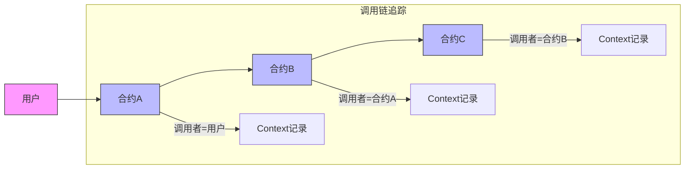
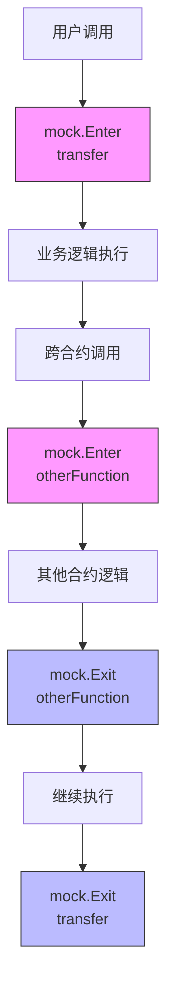
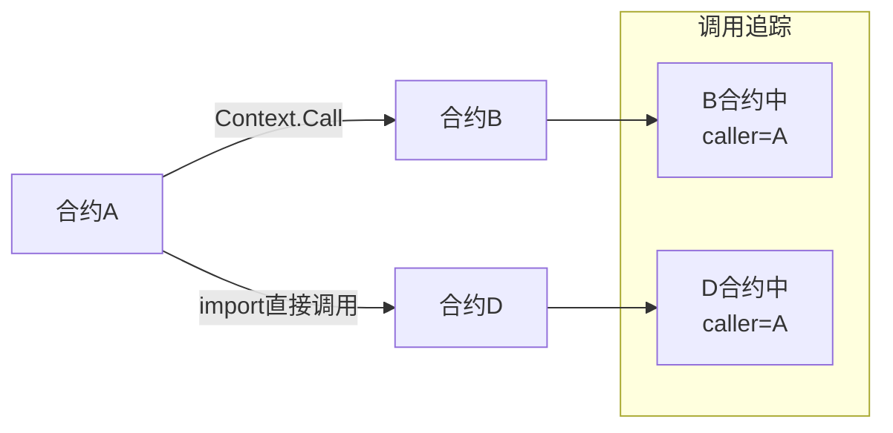
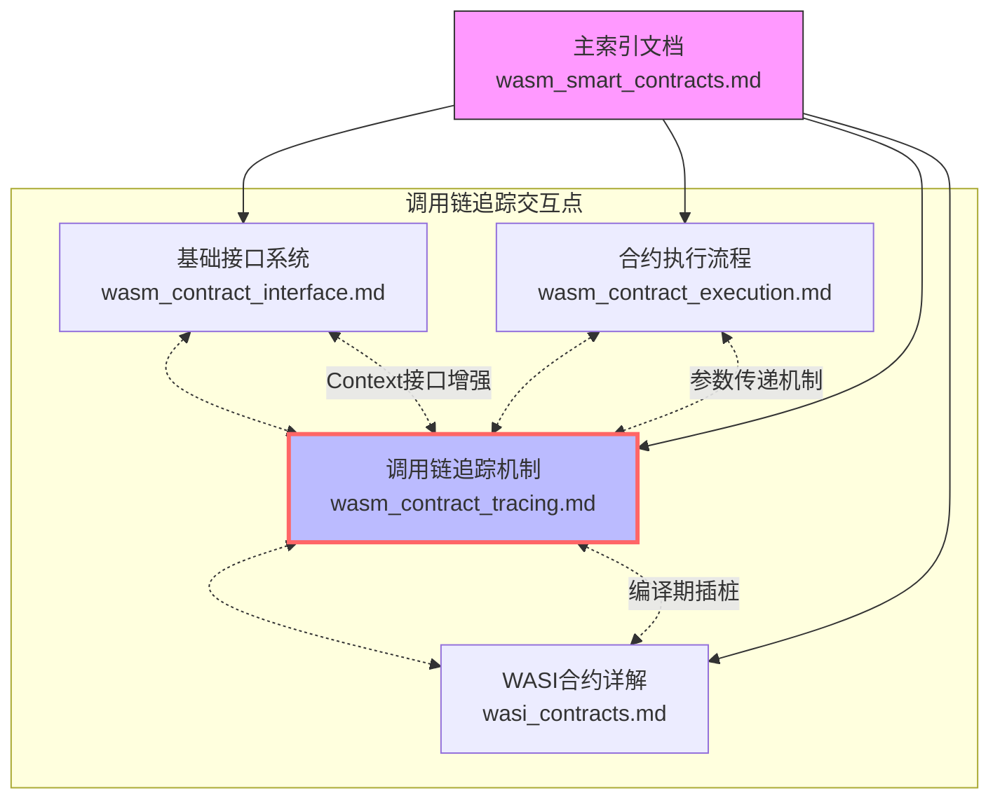

# WebAssembly 智能合约调用链追踪机制

本文档详细说明 VM 项目中 WebAssembly 智能合约的调用链追踪机制，特别是合约编译过程中的自动插桩技术，以及如何实现准确的跨合约调用者识别。

## 1. 调用链追踪概述

在复杂的智能合约系统中，合约间的相互调用非常普遍。准确识别调用者信息对于实现安全的权限控制和调试合约行为至关重要。WebAssembly 智能合约系统通过自动代码插桩实现了透明的调用链追踪。



## 2. 自动插桩机制

### 2.1 工作原理

在编译 Go 合约代码为 WebAssembly 时，系统会自动在所有跨合约调用点插入额外代码，以便追踪调用链和确保正确的合约身份识别：

1. **编译期分析**：在 TinyGo 编译合约代码前，系统会分析源代码中所有可能的跨合约调用点，包括但不限于 Context.Call/Public function。

2. **代码注入**：对每个Public Function入口，自动插入以下信息：
   - mock.Enter(当前合约地址,当前函数名称)
   - mock.Exit(当前合约地址,当前函数名称)

3. **生成包装代码**：创建 WASI 包装代码时，会添加必要的上下文传递逻辑，确保每次合约交互都能传递调用链信息。

### 2.2 插桩过程

插桩过程在 `generateWASIWrapper` 函数中实现，当生成 WASI 接口包装代码时：

```go
// 生成 WASI 接口包装代码
wrapperCode := generateWASIWrapper(packageName, functions, code)
```

系统会自动识别以下情况并进行插桩：

1. **直接跨合约调用**：通过 Context.Call 方法调用其他合约
2. **导入合约直接调用**：通过 import 其他合约并使用 `package.function()` 方式直接调用的情况
3. **特殊操作调用**：合约执行导致状态变更的关键操作

每个插桩点都会在合约包装时自动添加，而无需开发者手动实现。

### 2.3 调用信息结构

系统使用 `mock.CallInfo` 结构来维护调用者信息：

```go
// 调用信息结构
type CallInfo struct {
    CallerContract Address    `json:"caller_contract"`
    CallerFunction string     `json:"caller_function"`
    CallChain     []CallFrame `json:"call_chain,omitempty"`
}

type CallFrame struct {
    Contract Address `json:"contract"`
    Function string  `json:"function"`
}
```

这些信息会在每次跨合约调用时自动添加到参数中，无论调用方式如何。

### 2.3 导入合约直接调用的处理

系统对通过 import 语句导入并直接调用其他合约函数的情况也进行了特殊处理:

```go
// 合约代码中通过 import 直接使用其他合约
import (
    "github.com/example/token"  // 导入代币合约包
)

func transferTokens(to Address, amount uint64) error {
    // 直接调用导入包中的函数
    // 系统会自动对这类调用进行插桩
    return token.Transfer(ctx, to, amount)
}
```

该自动插桩机制会：

1. **识别导入关系**：在编译分析阶段识别所有导入的智能合约包
2. **函数调用分析**：检测所有对导入包中函数的调用点
3. **合约地址解析**：将包路径映射到对应的合约地址
4. **代码插桩**：在调用前插入与 Context.Call 相同的调用链信息构建代码
5. **透明重定向**：透明地将这些调用重定向为标准的跨合约调用

这使得开发者可以使用自然的导入和函数调用语法，同时系统仍能正确维护完整的调用链信息。

### 2.4 自动添加的 Mock 钩子函数

系统提供了一个专门的 mock 模块，包含"进入"和"退出"两个核心接口，用于实现更精确的调用追踪。为了最小化资源消耗，这些钩子函数仅记录必要的信息：

```go
// mock 模块提供的钩子接口
package mock

// 函数调用进入时的钩子
func Enter(contractAddress Address, functionName string) {
    // 记录函数调用开始
    // 维护调用栈信息
    callStack = append(callStack, contractAddress)
}

// 函数调用退出时的钩子
func Exit(contractAddress Address, functionName string) {
    // 记录函数调用结束
    // 清理调用栈
    if len(callStack) > 0 {
        callStack = callStack[:len(callStack)-1]
    }
}

// 获取当前合约地址
func GetCurrentContract() Address {
    if len(callStack) == 0 {
        return Address{}
    }
    return callStack[len(callStack)-1]
}

// 获取调用者地址
func GetCaller() Address {
    if len(callStack) < 2 {
        return Address{} // 没有调用者或顶层调用
    }

    // 获取当前合约地址
    currentContract := callStack[len(callStack)-1]

    // 从后向前遍历调用栈，找到第一个不同的地址
    // 这正确处理了合约调用自身函数的情况
    for i := len(callStack) - 2; i >= 0; i-- {
        if callStack[i] != currentContract {
            return callStack[i]
        }
    }

    // 如果到达这里，说明调用栈中所有地址都相同
    // 这意味着合约是从外部调用的（没有合约调用者）
    return Address{}
}
```

生成的包装代码会自动将这些钩子添加到每个导出函数中。系统采用统一的命名规范，所有自动生成的处理函数都以`handle`开头，后跟函数名：

```go
// 原始合约函数 - 大写字母开头的函数会被自动导出
func Transfer(to Address, amount uint64) int32 {
    mock.Enter(core.ContractAddress(), "Transfer")
    defer mock.Exit(core.ContractAddress(), "Transfer")
    // 业务逻辑
    return SuccessCode
}

// 生成的包装函数（系统自动添加）
func handleTransfer(paramsPtr int32, paramsLen int32) int32 {
    // 解析参数
    paramsBytes := readMemory(paramsPtr, paramsLen)
    var params struct {
        CallInfo *CallInfo `json:"call_info"`
        To       Address   `json:"to"`
        Amount   uint64    `json:"amount"`
    }
    json.Unmarshal(paramsBytes, &params)
    
    // 调用实际函数
    status := Transfer(params.To, params.Amount)
    
    return status
}
```

mock 模块会记录这些轻量级事件，构建调用树但不保存详细的参数和结果值，大幅减少存储和处理成本：

```
[ENTER] Contract: 0x1234... Function: Transfer Time: 1630000000000
  [ENTER] Contract: 0x1234... Function: checkBalance Time: 1630000000010
  [EXIT]  Contract: 0x1234... Function: checkBalance Time: 1630000000020 Duration: 10ms
  [ENTER] Contract: 0x1234... Function: updateBalance Time: 1630000000030
  [EXIT]  Contract: 0x1234... Function: updateBalance Time: 1630000000040 Duration: 10ms
[EXIT]  Contract: 0x1234... Function: Transfer Time: 1630000000050 Duration: 50ms
```

通过这种轻量级设计，系统能够提供调用链追踪能力，同时最小化对合约执行性能的影响。

### 2.5 钩子函数工作原理

这些自动添加的钩子函数实现了以下功能：

1. **完整的函数调用追踪**：记录每个函数的进入和退出点，包括调用参数和返回结果
2. **执行时间监控**：自动计算每个函数的执行时间
3. **异常处理**：捕获并记录函数执行过程中的异常
4. **嵌套调用关系**：维护一个函数调用栈，记录嵌套的函数调用关系
5. **资源使用情况**：跟踪函数执行过程中的资源使用情况

这种设计使得系统能够自动构建完整的调用树，无需开发者手动添加跟踪代码：



## 3. Gas 计费机制

### 3.1 计费原则

系统采用双重计费策略：

1. 基于代码行数的计费
2. 基于接口调用的计费

```go
// 代码行数计费示例
func Transfer(to Address, amount uint64) int32 {
    // 每行代码消耗 1 gas
    if amount == 0 {
        return ErrorCode
    }
    
    // 接口调用计费
    balance := core.Balance(to)  // 消耗 10 gas
    if balance < amount {
        return ErrorCode
    }
    
    // 转账操作消耗 20 gas
    core.Transfer(to, amount)
    return SuccessCode
}
```

### 3.2 标准 Gas 消耗值

| 操作类型 | Gas 消耗 | 说明 |
|---------|----------|------|
| 代码行执行 | 1 | 每行代码基础消耗 |
| Balance 查询 | 10 | 账户余额查询 |
| Transfer 转账 | 20 | 代币转账操作 |
| CreateObject | 30 | 创建新对象 |
| GetObject | 10 | 获取对象 |
| DeleteObject | 15 | 删除对象 |
| Call 跨合约调用 | 50 | 基础调用消耗 |
| Log 事件记录 | 5 | 记录事件 |

### 3.3 特殊计费规则

1. 跨合约调用
```go
// 调用其他合约的函数
func CallOtherContract(contractAddr Address, method string, args []byte) int32 {
    // 基础调用消耗 50 gas
    // 参数大小每字节额外消耗 0.1 gas
    gasCost := 50 + uint64(len(args)*10)/100
    core.ConsumeGas(gasCost)
    
    return core.Call(contractAddr, method, args)
}
```

2. 数据大小相关操作
```go
// 创建大对象
func CreateLargeObject(data []byte) int32 {
    // 基础创建消耗 30 gas
    // 数据大小每字节额外消耗 0.05 gas
    gasCost := 30 + uint64(len(data)*5)/100
    core.ConsumeGas(gasCost)
    
    return core.CreateObject(data)
}
```

### 3.4 Gas 控制 API

合约可以通过以下 API 控制 gas 消耗：

```go
// 获取剩余 gas
remainingGas := core.GetGasLimit() - core.GetGasUsed()

// 预估操作消耗
estimatedGas := core.EstimateGas(operation)

// 检查是否有足够 gas
if remainingGas < estimatedGas {
    return ErrorCode
}

// 执行操作
core.ConsumeGas(estimatedGas)
result := operation()
```

## 4. Sender 方法

为支持调用链追踪，系统增强了合约执行环境以包含调用者信息：

Sender 方法被增强以返回实际的调用者，而不仅仅是交易发起者：

```go
// 增强的 Sender 方法
func (c *Context) Sender() Address {
    callerAddr := mock.GetCaller()

    // 如果调用者地址不为空,返回调用者地址
    if !callerAddr.IsZero() {
        return callerAddr
    }
    
    // 否则返回交易原始发送者
    ptr, size, _ := callHost(FuncGetSender, nil)
    data := readMemory(ptr, size)
    var addr Address
    copy(addr[:], data)
    return addr
}
```

## 5. 合约间调用信息传递

合约之间的互相调用需要安全、可靠地传递调用者信息，系统采用统一的信息传递机制。

### 5.1 参数结构体的自动生成

对于每个合约中的导出函数，系统会在编译阶段自动生成对应的参数结构体和处理函数：

```go
// 原始合约函数 - 大写字母开头的函数会被自动导出
func Transfer(to Address, amount uint64) error {
    // 业务逻辑实现...
}

// 自动生成的参数结构体
type TransferParams struct {
    CallInfo *CallInfo `json:"call_info"` // 调用链信息
    To       Address   `json:"to"`        // 目标地址
    Amount   uint64    `json:"amount"`    // 转账金额
}

// 自动生成的处理函数
func handleTransfer(paramsJSON []byte) int32 {
    // 反序列化参数
    var params TransferParams
    json.Unmarshal(paramsJSON, &params)
    
    // 设置调用上下文
    // ...
    
    // 调用实际函数
    // ...
}
```

系统在合约编译阶段分析源代码，自动识别所有大写字母开头的函数作为导出函数，无需开发者手动添加`//export`注释。这些函数将遵循以下处理流程：

1. **函数接口分析**：系统识别函数名称、参数类型和返回值类型
2. **参数结构体生成**：为每个函数创建专用的参数结构体
3. **序列化代码生成**：生成参数打包和结果返回的包装代码
4. **调用链信息注入**：自动在参数结构体中添加调用链字段

### 5.2 参数序列化过程

在跨合约调用时，系统对参数进行序列化处理：

```go
// 在调用端（调用其他合约）
func (c *Context) Call(contract Address, function string, args ...any) ([]byte, error) {
    // 根据函数名自动识别并构建正确的参数结构体
    paramsStruct := createParamsStruct(function, args)
    
    // 注入调用信息
    setCallInfoField(paramsStruct, mock.CurrentContract())
    
    // 序列化参数结构体
    paramsJSON, err := json.Marshal(paramsStruct)
    if err != nil {
        return nil, fmt.Errorf("failed to serialize parameters: %w", err)
    }
    
    // 发送序列化数据给目标合约
    return performCall(contract, function, paramsJSON)
}
```

自动化的参数结构体构建：
- 为每个函数维护参数列表和类型信息
- 根据函数名动态创建正确的参数结构体
- 支持变长参数列表
- 保留完整的类型信息

### 5.3 参数反序列化过程

在被调用合约接收到请求时，系统自动反序列化参数：

```go
// 在接收端（被调用的合约）
//export handleExternalCall
func handleExternalCall(funcNamePtr, funcNameLen, paramsPtr, paramsLen int32) int32 {
    // 读取函数名
    funcNameBytes := readMemory(funcNamePtr, funcNameLen)
    funcName := string(funcNameBytes)
    
    // 读取参数JSON
    paramsJSON := readMemory(paramsPtr, paramsLen)
    
    // 查找函数处理器，这里使用handle+FunctionName格式的处理函数
    handlerName := "handle" + funcName
    handler, found := functionHandlers[handlerName]
    if !found {
        errorResult := &ErrorResult{Error: "function not found: " + funcName}
        resultJSON, _ := json.Marshal(errorResult)
        writeResult(resultJSON)
        return ErrorCodeNotFound
    }
    
    // 调用函数处理器（会自动反序列化参数）
    return handler(paramsJSON)
}

// Transfer函数的处理器（自动生成）
func handleTransfer(paramsJSON []byte) int32 {
    // 反序列化到正确的参数结构体
    var params TransferParams
    if err := json.Unmarshal(paramsJSON, &params); err != nil {
        errorResult := &ErrorResult{Error: "failed to parse parameters: " + err.Error()}
        resultJSON, _ := json.Marshal(errorResult)
        writeResult(resultJSON)
        return ErrorCodeInvalidParams
    }
    
    // 调用实际函数
    err := Transfer(params.To, params.Amount)
    
    // 处理返回结果
    if err != nil {
        errorResult := &ErrorResult{Error: err.Error()}
        resultJSON, _ := json.Marshal(errorResult)
        writeResult(resultJSON)
        return ErrorCodeExecutionFailed
    }
    
    // 返回成功
    writeResult([]byte("{}"))
    return SuccessCode
}
```

在这个过程中，所有的自动生成函数处理器都采用`handle+FunctionName`的命名格式，确保整个系统有一致的命名风格，便于开发者理解和使用。

### 5.4 复杂结构参数处理

对于包含自定义结构体的复杂参数，系统提供了类型注册机制：

```go
// 类型注册表
var typeRegistry = map[string]reflect.Type{
    "Address": reflect.TypeOf(Address{}),
    "ObjectID": reflect.TypeOf(ObjectID{}),
    "TransferParams": reflect.TypeOf(TransferParams{}),
    "SwapParams": reflect.TypeOf(SwapParams{}),
    // 其他类型...
}

// 反序列化复杂参数
func unmarshalToRegisteredType(typeStr string, data []byte) (interface{}, error) {
    // 查找注册的类型
    t, found := typeRegistry[typeStr]
    if !found {
        return nil, fmt.Errorf("unknown type: %s", typeStr)
    }
    
    // 创建正确类型的新实例
    v := reflect.New(t).Interface()
    
    // 反序列化到正确类型的实例
    if err := json.Unmarshal(data, v); err != nil {
        return nil, err
    }
    
    return reflect.ValueOf(v).Elem().Interface(), nil
}
```

这种机制支持递归处理嵌套结构体，确保所有复杂参数都能保持正确的类型。

### 5.4.1 基础状态操作的错误处理

系统中的基础状态操作（如`CreateObject`、`DeleteObject`和`SetOwner`等）采用 panic 机制而非返回 error：

```go
// 创建对象 - 失败时会panic
obj := core.CreateObject()

// 删除对象 - 失败时会panic
core.DeleteObject(objectID)

// 设置所有者 - 失败时会panic
obj.SetOwner(newOwner)
```

这种设计有几个重要优势：

1. **合约代码简化**：开发者不需要处理每个基础操作后的错误检查
2. **明确的失败边界**：区分业务逻辑错误和系统级错误
3. **确定性保证**：如果基础操作失败，表明有严重问题，应立即停止执行
4. **自动资源清理**：通过panic机制，确保任何延迟操作都被正确执行

与此相对，像`Get`和`Set`这样的非基础操作仍然返回error，因为它们可能因为业务逻辑原因失败（如类型不匹配），这些是合约需要处理的正常业务场景。

### 5.5 性能优化策略

为提高参数处理的性能，系统采用多种优化策略：

1. **编译期生成结构体**：避免运行时反射创建结构体
2. **静态类型表**：预编译函数参数类型信息
3. **参数缓存**：在热路径上重用参数结构体
4. **零拷贝**：尽可能减少内存复制
5. **扁平化结构**：优化参数和调用信息的内存布局

这些优化确保了即使在参数复杂的情况下，合约调用也能保持高效。

## 6. 实际应用场景

### 6.1 权限控制

通过准确识别调用者，合约可以实现细粒度的权限控制：

```go
// 基于调用者实现权限控制
func (o *Object) SetOwner(owner Address) {
    // 设置对象所有者 - 基础状态操作，失败时会panic
    owner := o.Owner()
    if owner != core.Sender() && owner != mock.CurrentAddress(){
        panic("wrong owner")
    }
    
    // 操作owner切换
    ...
}
```

### 6.2 重入攻击防护

通过检查调用链，可以有效防止重入攻击：

```go
// 检测重入攻击
func detectReentrancy(callChain []CallFrame, currentContract Address) bool {
    // 检查调用链中是否已经包含当前合约
    for _, frame := range callChain {
        if frame.Contract == currentContract {
            return true // 发现重入
        }
    }
    return false
}
```

### 6.3 不同调用模式的对比

WebAssembly智能合约系统支持两种主要的跨合约调用模式，每种模式都会自动维护调用链信息：



| 调用方式 | 语法示例 | 优势 | 场景 |
|---------|--------|------|------|
| Context.Call | `core.Call(addr, "func", args...)` | 动态确定目标 | 运行时决定目标合约 |
| Import直接调用 | `token.Transfer(to, amount)` | 自然的代码风格 | 与固定合约紧密集成 |

无论采用何种方式，系统都会自动维护完整的调用者信息和调用链。

## 7. 代码示例

### 7.1 代币合约与交易所合约交互示例

以下是一个完整的示例，展示代币合约和交易所合约之间的交互，以及调用者信息的自动传递：

```go
// 在交易所合约中
// 大写字母开头的函数会被自动导出
func SwapTokens(fromToken Address, toToken Address, amount uint64) int32 {
    // 调用第一个代币合约 - 系统会自动注入调用者信息
    result, err := core.Call(fromToken, "TransferFrom", core.Sender(), core.ContractAddress(), amount)
    if err != nil {
        core.Log("swap_failed", "step", "transfer_from", "error", err.Error())
        return ErrorFirstTransferFailed
    }
    
    // 计算兑换金额
    exchangeRate := calculateExchangeRate(fromToken, toToken)
    exchangeAmount := amount * exchangeRate / 1e8 // 使用1e8作为精度因子
    
    // 调用第二个代币合约 - 同样会自动注入调用者信息
    result, err = core.Call(toToken, "Transfer", core.Sender(), exchangeAmount)
    if err != nil {
        core.Log("swap_failed", "step", "transfer", "error", err.Error())
        return ErrorSecondTransferFailed
    }
    
    // 记录成功的交换
    core.Log("swap_successful", 
            "user", core.Sender().String(),
            "from_token", fromToken.String(), 
            "to_token", toToken.String(),
            "from_amount", amount,
            "to_amount", exchangeAmount)
    
    return SuccessCode
}

// 在代币合约中
// 大写字母开头的函数会被自动导出
func Transfer(to Address, amount uint64) int32 {
    ctx := vm.GetContext()
    
    // 检查余额
    balanceObj, err := core.GetObjectWithOwner(core.Sender())
    if err != nil {
        return ErrorBalanceNotFound
    }
    
    var balance uint64
    if err := balanceObj.Get("amount", &balance); err != nil {
        return ErrorReadBalanceFailed
    }
    
    if balance < amount {
        return ErrorInsufficientBalance
    }
    
    // 执行转账
    balance -= amount
    if err := balanceObj.Set("amount", balance); err != nil {
        panic(ErrorUpdateBalanceFailed)
    }
    
    // 如果接收者没有余额对象，创建一个
    // CreateObject是基础状态操作，失败时会panic而不是返回error
    recipientBalanceObj = core.CreateObject()
    
    if err := recipientBalanceObj.Set("amount", amount); err != nil {
        panic(ErrorUpdateRecipientFailed)
    }
    // SetOwner也是基础状态操作，失败时会panic
    recipientBalanceObj.SetOwner(to)
    
    // 记录转账事件
    core.Log("transfer",
            "from", core.Sender(),
            "to", to,
            "amount", amount)
    
    return SuccessCode
}
```

### 7.2 多级合约调用示例

以下示例展示多级合约调用中调用链的传递：

```go
// 在用户界面合约中 (DApp合约)
// 大写字母开头的函数会被自动导出
func ExecuteComplexTransaction(userData TransactionData) int32 {
    // 调用业务逻辑合约
    result, err := core.Call(businessLogicContract, "ProcessTransaction", userData)
    if err != nil {
        return ErrorBusinessLogicFailed
    }
    
    // ... 更多代码
    return SuccessCode
}

// 在业务逻辑合约中
// 大写字母开头的函数会被自动导出
func ProcessTransaction(data TransactionData) int32 {
    // 系统自动反序列化参数并提取调用信息
    
    // 验证是否由授权的UI合约调用
    if !isAuthorizedUIContract(core.CallerContract()) {
        return ErrorUnauthorizedCaller
    }
    
    // 调用代币合约
    result, err := core.Call(tokenContract, "Transfer", data.Recipient, data.Amount)
    if err != nil {
        return ErrorTokenTransferFailed
    }
    
    // 返回成功
    return SuccessCode
}

// 在流动性池合约中
package liquidity

// 大写字母开头的函数会被自动导出
func Swap(inputToken Address, outputToken Address, amount uint64, recipient Address) int32 {
    // 安全地执行交换...
    
    return SuccessCode
}
```

### 7.3 通过导入直接调用示例

以下示例展示通过导入方式直接调用其他合约：

```go
// 在一个集成了多个DeFi组件的应用合约中

package dapp

import (
    "github.com/example/token"      // 代币合约
    "github.com/example/liquidity"  // 流动性池合约
    "github.com/example/oracle"     // 价格预言机合约
)

// 导入合约在执行环境中已关联到对应的链上合约地址

// 大写字母开头的函数会被自动导出
func ExecuteSwap(inputToken Address, outputToken Address, amount uint64) int32 {
    // 检查发送者余额 - 通过导入的合约包直接调用
    // 系统会自动插桩这个调用，注入当前合约信息
    balance, err := token.BalanceOf(core.Sender(), inputToken)
    if err != nil || balance < amount {
        return ErrorInsufficientBalance
    }
    
    // 获取预言机价格 - 通过导入的合约包直接调用
    // 同样会被自动插桩
    price, err := oracle.GetPrice(inputToken, outputToken)
    if err != nil {
        return ErrorPriceNotAvailable
    }
    
    // 批准流动性池合约使用代币 - 通过导入的合约包直接调用
    err = token.Approve(liquidity.PoolAddress(), inputToken, amount)
    if err != nil {
        return ErrorApprovalFailed
    }
    
    // 执行交换 - 通过导入的合约包直接调用
    receivedAmount, err := liquidity.Swap(ctx, inputToken, outputToken, amount, core.Sender())
    if err != nil {
        return ErrorSwapFailed
    }
    
    // 记录交换结果
    core.Log("swap_executed",
            "user", core.Sender().String(),
            "input_token", inputToken.String(),
            "output_token", outputToken.String(),
            "input_amount", amount,
            "output_amount", receivedAmount,
            "price", price)
    
    return SuccessCode
}
```

在流动性池合约中，调用者信息会被正确识别：

```go
// 在流动性池合约中
package liquidity

// 大写字母开头的函数会被自动导出
func Swap(inputToken Address, outputToken Address, amount uint64, recipient Address) int32 {
    // 系统自动提取调用信息
    
    // 获取实际调用者 - 这里会是dapp合约地址
    callerContract := core.CallerContract()
    
    // 检查调用者权限
    if !isAuthorizedCaller(callerContract) {
        core.Log("unauthorized_swap",
                "caller", callerContract.String())
        return ErrorUnauthorizedCaller
    }
    
    // 安全地执行交换...
    
    return SuccessCode
}
```

### 7.4 自动添加的钩子函数示例

系统遵循明确的命名规范，所有自动生成的包装函数都采用`handle+FunctionName`的命名格式。为优化性能，钩子函数仅记录必要的调用元数据，不记录详细参数。以下是原始合约代码，开发者只需专注于业务逻辑实现：

```go
// 原始合约代码
package token

// 大写字母开头的函数会被自动导出
func Transfer(to Address, amount uint64) int32 {
    // 获取发送者
    from := core.Sender()
    
    // 检查余额...
    // 执行转账...
    
    return SuccessCode
}
```

系统会自动为其生成轻量级的包装代码，添加必要的钩子函数但避免过多资源消耗：

```go
// 生成的包装代码（系统自动添加，开发者无需编写）
func handleTransfer(paramsPtr int32, paramsLen int32) int32 {
    // 读取和解析参数
    paramsBytes := readMemory(paramsPtr, paramsLen)
    var params struct {
        CallInfo *CallInfo `json:"call_info"`
        To       Address   `json:"to"`
        Amount   uint64    `json:"amount"`
    }
    json.Unmarshal(paramsBytes, &params)
    
    // 设置当前调用上下文
    setCurrentCallInfo(params.CallInfo)
    
    // 调用进入钩子 - 只传递必要信息，不传递详细参数
    mock.Enter(vm.GetCurrentContract(), "Transfer")
    
    // 无论如何都会执行退出钩子
    defer func() {
        // 捕获可能的panic
        if r := recover(); r != nil {
            mock.Exit(vm.GetCurrentContract(), "Transfer")
            panic(r) // 重新抛出panic
        }
    }()
    
    // 调用实际函数
    status := Transfer(params.To, params.Amount)
    
    // 记录退出信息，不记录详细结果
    mock.Exit(vm.GetCurrentContract(), "Transfer")
    
    return status
}
```

为保持一致性，系统对所有导出函数都采用这种轻量级的调用追踪方法。这种设计实现了调用链追踪的核心功能，同时将性能影响降到最低。

mock 模块的轻量级记录格式示例：

```
[ENTER] Contract: 0x1234... Function: Transfer Time: 1630000000000
  [ENTER] Contract: 0x1234... Function: checkBalance Time: 1630000000010
  [EXIT]  Contract: 0x1234... Function: checkBalance Time: 1630000000020 Duration: 10ms
  [ENTER] Contract: 0x1234... Function: updateBalance Time: 1630000000030
  [EXIT]  Contract: 0x1234... Function: updateBalance Time: 1630000000040 Duration: 10ms
[EXIT]  Contract: 0x1234... Function: Transfer Time: 1630000000050 Duration: 50ms
```

## 8. 与其他 WASM 智能合约平台对比

| 平台 | 调用者识别机制 | 调用链追踪 | 自动插桩 |
|------|--------------|-----------|---------|
| **VM项目 (Go+WASM)** | 完整支持，自动注入 | 完整支持，记录全链 | 支持，编译时自动插入 |
| **CosmWasm (Rust)** | 基本支持，仅直接调用者 | 部分支持，需手动传递 | 不支持，需手动实现 |
| **Substrate/ink!** | 基本支持，仅直接调用者 | 不直接支持 | 不支持 |
| **Ewasm (以太坊)** | 基本支持，通过 EEI | 不直接支持 | 不支持 |
| **NEAR (Rust/AS)** | 基本支持，内置函数 | 部分支持 | 不支持 |

## 9. 与统一文档体系的关系

调用链追踪机制是 VM 项目 WebAssembly 智能合约系统的核心功能之一，与整个文档体系中的其他组件密切关联：



### 9.1 与基础接口系统的关系

- **Context接口增强**：调用链追踪机制通过扩展 Context 接口实现调用者信息的获取和传递
- **Object接口交互**：在与对象交互时，调用链信息用于权限验证和审计
- **内存管理协同**：调用链追踪的实现需要考虑内存效率，避免过多开销

### 9.2 与合约执行流程的关系

- **编译阶段集成**：调用链追踪机制在编译阶段进行代码插桩
- **参数传递协同**：确保调用链信息随参数一起在合约间传递
- **资源控制结合**：调用链信息可用于更精确的资源使用追踪和限制

### 9.3 与WASI合约的关系

- **编译流程整合**：WASI 包装生成时包含调用链追踪的必要代码
- **系统接口扩展**：通过 WASI 接口传递调用链信息
- **合约示例增强**：WASI 合约示例中展示如何利用调用链信息

## 10. 总结

调用链追踪机制是 WebAssembly 智能合约系统的关键安全基础设施，它通过自动插桩和上下文增强，在不增加开发者负担的情况下，提供了精确的调用者识别和完整的调用链追踪能力。本文档详细阐述了该机制的工作原理、实现方式和实际应用场景。

系统通过统一的命名规范（所有自动生成的包装函数都采用`handle+FunctionName`格式）提供了直观且一致的开发体验，使开发者能够清晰地区分原始合约函数和系统生成的包装代码。

通过与其他核心组件的紧密集成，调用链追踪机制构成了统一文档体系的重要部分，确保了整个 WebAssembly 智能合约生态的安全性、可追溯性和开发友好性。开发者可以利用这一机制构建更安全、更可靠的智能合约应用。

## 11. 最佳实践

### 11.1 调用链追踪最佳实践

使用调用链追踪机制的最佳实践：

1. **权限检查**：总是在敏感操作前验证调用者权限
   ```go
   if !isAuthorized(core.CallerContract(), core.CallerFunction()) {
       return ErrorUnauthorized
   }
   ```

2. **调用链验证**：对关键操作验证完整调用链
   ```go
   // 检查调用链是否符合预期模式
   if !validateCallChain(core.GetCallChain(), expectedPattern) {
       return ErrorInvalidCallChain
   }
   ```

3. **记录关键调用**：记录重要的跨合约调用以便审计
   ```go
   core.Log("important_operation", 
           "caller", core.CallerContract().String(),
           "caller_function", core.CallerFunction(),
           "call_chain_depth", len(core.GetCallChain()))
   ```

4. **防重入保护**：检查调用链防止重入攻击
   ```go
   if detectReentrancy(core.GetCallChain(), core.ContractAddress()) {
       return ErrorReentrancyDetected
   }
   ```

5. **调用路径控制**：限制敏感操作只能通过特定路径调用
   ```go
   if !mustCallViaPath(core.GetCallChain(), requiredPath) {
       return ErrorInvalidCallPath
   }
   ```

通过这些最佳实践，开发者可以充分利用自动插桩提供的调用链信息，构建更安全、更可维护的智能合约系统。

### 11.2 自动跟踪与性能分析

系统提供的自动钩子机制为合约执行提供了轻量级但有效的监控：

1. **函数级性能监控**：精确测量每个函数的执行时间，同时最小化开销
   ```go
   // 分析合约性能
   func analyzeFunctionPerformance(contractAddr Address, records []CallRecord) {
       functionStats := make(map[string]struct{
           CallCount int
           TotalTime int64
           MaxTime   int64
           MinTime   int64
           AvgTime   int64
       })
       
       // 处理记录...
       
       // 生成性能报告
   }
   ```

2. **热点函数识别**：识别执行时间长的函数，无需记录详细参数即可发现性能瓶颈
3. **资源使用优化**：通过记录调用时间而非完整参数，实现高效的资源分析
4. **异常检测**：检测执行路径异常或超时，无需存储完整的调用上下文

通过优化的轻量级调用追踪设计，VM 项目的 WebAssembly 智能合约系统实现了关键的调用链追踪能力，同时最小化了对合约执行性能和资源消耗的影响，使系统在保持透明性的同时更加高效。 