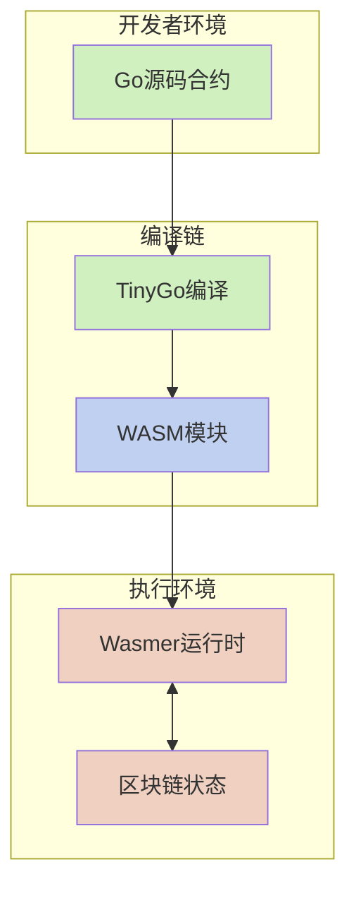

# WebAssembly 智能合约系统

本文档是 VM 项目 WebAssembly (WASM) 智能合约系统的主入口点，提供了对系统架构、核心组件和详细文档的整体导航。

## 1. 系统概述

VM 项目的 WebAssembly 智能合约系统允许开发者使用 Go 语言编写智能合约，并通过 TinyGo 编译为 WebAssembly 模块在沙箱环境中执行。该系统具有高安全性、接近原生的性能、良好的跨平台兼容性和精确的资源控制能力。



## 2. 文档导航

本系统文档按照从基础到高级的顺序组织，覆盖了合约开发、编译、部署和执行的完整生命周期：

1. **[基础接口系统](wasm_contract_interface.md)** - 介绍合约代码与区块链环境之间的通信桥梁
   * 合约侧接口 (Context, Object)
   * 主机侧接口
   * 内存管理机制
   * 系统调用分类

2. **[合约执行流程](wasm_contract_execution.md)** - 详细说明从编译到执行的完整生命周期
   * 编译流程
   * 部署流程
   * 执行流程
   * 参数传递
   * 资源控制

3. **[调用链追踪机制](wasm_contract_tracing.md)** - 解释自动插桩技术和调用链追踪
   * 自动插桩原理
   * Context接口增强
   * 合约间调用信息传递
   * 参数序列化与反序列化
   * 实际应用场景

4. **[WASI合约详解](wasi_contracts.md)** - 深入探讨基于WASI规范的合约模式
   * 合约示例
   * 编译到WebAssembly的内部流程
   * WebAssembly优势
   * 配置与使用
   * 最佳实践

## 3. 核心概念统一

为解决文档间的概念冲突和不一致，以下是核心概念的规范定义：

### 3.1 接口体系

系统提供了一套统一的接口体系，主要包括：

```go
// Context接口 - 提供访问区块链状态和功能的标准方法
type Context interface {
    // 区块链信息相关
    BlockHeight() uint64         // 获取当前区块高度
    BlockTime() int64            // 获取当前区块时间戳
    ContractAddress() Address    // 获取当前合约地址
    
    // 账户操作相关
    Sender() Address             // 获取交易发送者或调用合约
    Balance(addr Address) uint64 // 获取账户余额
    Transfer(to Address, amount uint64) error // 转账操作
    
    // 对象存储相关
    CreateObject() (Object, error)          // 创建新对象
    GetObject(id ObjectID) (Object, error)  // 获取指定对象
    DeleteObject(id ObjectID) error         // 删除对象
    
    // 跨合约调用
    Call(contract Address, function string, args ...any) ([]byte, error)
    
    // 日志与事件
    Log(eventName string, keyValues ...interface{}) // 记录事件
}

// Object接口 - 提供状态对象的操作方法
type Object interface {
    ID() ObjectID           // 获取对象ID
    Owner() Address         // 获取对象所有者
    SetOwner(addr Address) error // 设置对象所有者
    
    // 字段操作
    Get(field string, value any) error  // 获取字段值
    Set(field string, value any) error  // 设置字段值
}
```

### 3.2 统一的内存管理模型

本系统采用以下内存管理策略，在所有相关文档中保持一致：

- 使用 TinyGo 的 `-gc=leaking` 简化垃圾收集机制提高性能
- 为减少内存压力，合约代码应尽量重用缓冲区而非频繁分配内存
- WebAssembly 模块限制最大内存使用（默认上限为 128 MB）
- 内存管理包括 WebAssembly 线性内存和共享的主机缓冲区两部分

### 3.3 参数传递统一机制

为统一不同文档描述的参数传递机制，系统采用类似Go标准库RPC的工作流程：

1. **基于RPC模型的参数结构体**：
   - 自动为每个导出函数生成对应的参数结构体
   - 参数结构体包含Call Info用于传递调用链信息
   - 字段名称与原始参数名称一致

2. **自动化参数处理**：
   - 在合约编译阶段自动生成参数序列化/反序列化代码
   - 使用函数分发表实现高效调用路由
   - 支持丰富的错误处理和类型安全措施

3. **类型安全的序列化**：
   - 使用类型注册表确保类型信息保留
   - 避免JSON反序列化的数值类型问题（如将整数转为float64）
   - 支持复杂嵌套结构体的类型安全处理

```go
// 导出函数示例 - 使用大写字母开头即可，无需//export标记
func Transfer(to Address, amount uint64) error {
    // 函数实现...
}

// 自动生成的参数结构体
type TransferParams struct {
    CallInfo *CallInfo `json:"call_info"` // 自动注入的调用链信息
    To       Address   `json:"to"`        // 参数1
    Amount   uint64    `json:"amount"`    // 参数2
}

// 自动生成的方法处理器
func handleTransfer(paramsJSON []byte) int32 {
    var params TransferParams
    if err := json.Unmarshal(paramsJSON, &params); err != nil {
        // 错误处理...
        return ErrorCodeInvalidParams
    }
    
    // 设置调用上下文
    setCurrentCallInfo(params.CallInfo)
    
    // 调用实际函数
    err := Transfer(params.To, params.Amount)
    
    // 处理返回值...
}
```

这种基于Go RPC模型的参数处理机制提供了多项优势：
- 开发者只需使用标准Go函数命名规范（大写开头的函数自动导出），无需添加特殊注释
- 系统自动识别并导出所有大写开头的函数，简化开发流程
- 类型安全由系统保证，避免常见的JSON类型转换问题
- 参数验证和错误处理统一规范

### 3.4 函数导出规则简化

系统采用了Go语言规范的公共/私有标识方法，简化了合约函数的导出机制：

1. **自动导出规则**：
   - 大写字母开头的函数自动被视为导出函数，可被外部调用
   - 小写字母开头的函数为私有函数，仅合约内部可访问
   - 无需添加特殊的 `//export` 注释标记

2. **框架自动包装**：
   - 编译系统自动识别所有大写开头的函数
   - 为每个导出函数生成必要的包装代码
   - 自动注册函数，使其可被主机环境调用

3. **优势**：
   - 更符合Go语言习惯
   - 减少样板代码
   - 避免导出标记与实际导出不一致的问题
   - 简化合约开发流程

示例：
```go
// 公开函数 - 自动导出，外部可调用
func Transfer(to Address, amount uint64) error {
    return performTransfer(to, amount)
}

// 私有函数 - 不导出，仅内部使用
func performTransfer(to Address, amount uint64) error {
    // 实现转账逻辑...
}
```

### 3.5 错误处理统一框架

系统采用统一的错误处理模式：

- 合约内部使用 Go 的 error 类型返回错误
- 跨合约调用返回标准错误码和详细错误信息
- 所有错误信息可通过 Context.Log 记录
- 异常状态通过特定的返回值（通常为负数）表示

## 4. 版本与兼容性

当前文档适用于 VM 项目 v1.0.0 版本。系统保持向后兼容，但以下方面可能存在版本差异：

- TinyGo 版本：推荐使用 0.29.0 或更高版本
- Wasmer 运行时：推荐使用 2.3.0 或更高版本
- Go 语言：推荐使用 1.20 或更高版本

## 5. 文档更新计划

本文档将按照以下计划持续更新：

- **短期更新**：修复已知的文档不一致问题
- **中期增强**：添加完整的代码示例库和测试框架文档
- **长期规划**：增加合约升级机制、高级优化指南和与其他系统的互操作性文档

## 6. 扩展阅读

- [智能合约设计模式](/)（待完成）
- [合约升级与版本控制](/)（待完成）
- [合约测试与调试指南](/)（待完成）
- [安全最佳实践](/)（待完成）
- [合约性能优化](/)（待完成）

## 7. 附录：关键术语表

| 术语 | 定义 |
|------|------|
| WebAssembly | 可移植的二进制指令格式，作为智能合约执行的目标格式 |
| WASI | WebAssembly 系统接口，提供标准化的系统调用 |
| TinyGo | Go 语言的编译器，针对小内存环境优化，用于将 Go 代码编译为 WebAssembly |
| Wasmer | WebAssembly 运行时，用于执行 WebAssembly 模块 |
| 插桩 | 自动向合约代码中注入额外指令的过程，用于追踪调用链和增强功能 |
| 调用链 | 跨合约调用的执行路径，记录从起始调用到当前执行点的所有合约和函数 |
| 沙箱 | 隔离的执行环境，限制合约对外部资源的访问 |

## 8. 文档更新记录

### 2023年11月 - 统一文档体系

完成了对整个WebAssembly智能合约系统文档的全面审查和重构，解决了以下主要问题：

1. **统一接口设计**：
   - 标准化了 Context 和 Object 接口定义
   - 确保所有文档中的接口签名一致
   - 统一了 Balance 方法的返回类型为 uint64
   - 添加了对 GetObjectWithOwner 等方法的一致描述

2. **统一参数传递机制**：
   - 创建了带类型信息的参数传递机制
   - 使用 TypedValue 结构确保类型安全
   - 实现了统一的序列化和反序列化过程
   - 解决了数值类型在 JSON 中默认转为 float64 的问题

3. **统一调用链追踪**：
   - 明确了自动插桩机制与系统其他部分的关系
   - 统一了 mock 钩子函数的实现方式
   - 确保调用链信息在所有跨合约调用中一致传递
   - 统一了调用者身份识别机制

4. **统一内存管理模型**：
   - 标准化了内存限制策略
   - 统一了关于 TinyGo `-gc=leaking` 垃圾收集器的描述
   - 提供了一致的内存管理最佳实践

5. **统一资源控制策略**：
   - 创建了完整的资源限制配置模型
   - 统一了燃料计量系统的描述
   - 标准化了执行超时机制的实现
   - 提供了默认资源配置参考

6. **文档结构优化**：
   - 创建了本主索引文档作为统一入口点
   - 明确了各文档之间的关系和阅读路径
   - 按照逻辑顺序组织了整个文档集

这次更新使整个文档体系更加一致、准确和易用，为开发者提供了可靠的参考，确保他们能够有效地使用WebAssembly智能合约系统并遵循最佳实践。
