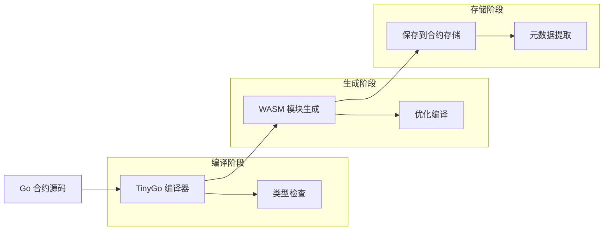
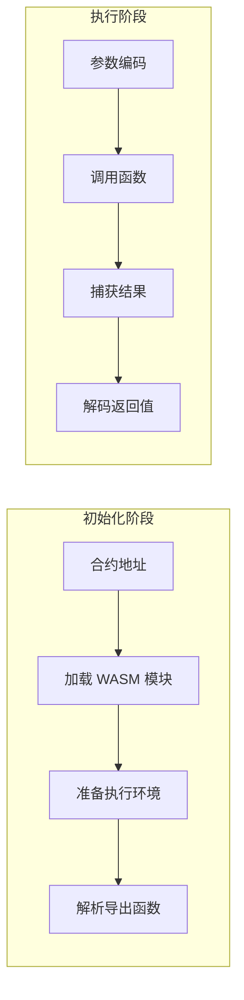
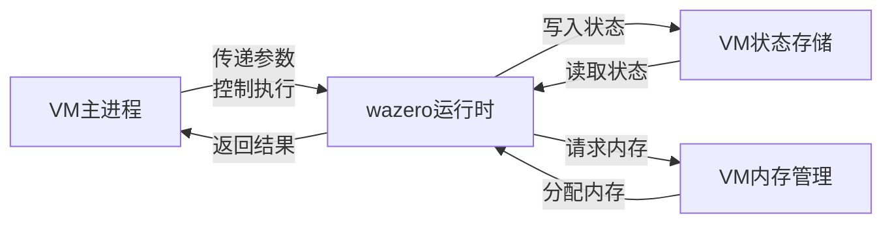
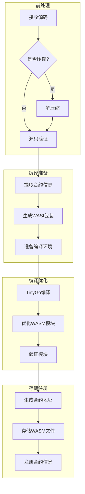
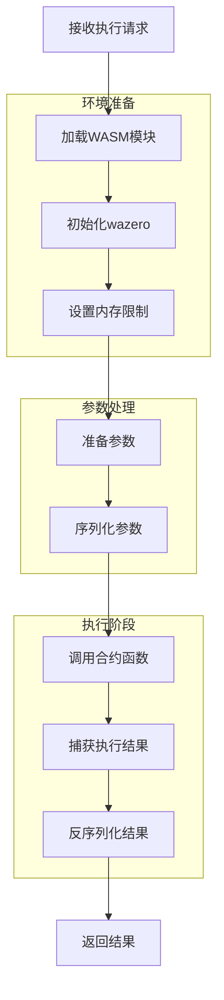

# WebAssembly 智能合约

本文档详细介绍了 VM 项目中的 WebAssembly (WASI) 合约执行模式，该模式通过 TinyGo 将 Go 代码编译为 WebAssembly 模块，并使用 wazero 运行时执行。

## WebAssembly 执行模式概述

VM 项目采用 WebAssembly 作为合约执行的核心技术，通过以下步骤实现：

1. 使用 TinyGo 将 Go 合约代码编译为符合 WASI 规范的 WebAssembly 模块
2. 由 wazero 运行时加载和执行这些 WebAssembly 模块
3. 通过 WASI 接口在合约与 VM 环境之间实现安全通信
4. 确保合约在沙箱环境中执行，且能被精确控制资源使用

## 合约示例

下面是一个简单的代币合约示例，展示了如何编写标准的智能合约：

```go
package token

import (
    "fmt"
    "github.com/govm-net/vm"
)

// Initialize 初始化代币合约，创建初始供应量
func Initialize(name string, totalSupply uint64) (core.ObjectID, error) {
    // 创建信息对象 - 基础状态操作，失败时会panic
    infoObj := core.CreateObject()
    infoObj.Set("name",name)

    // 创建代币发行者的余额对象 - 基础状态操作，失败时会panic
    balanceObj := core.CreateObject()

    balanceObj.Set("type", infoObj.ID())
    balanceObj.Set("amount", totalSupply)

    // 设置对象所有者为合约部署者 - 基础状态操作，失败时会panic
    balanceObj.SetOwner(core.Sender())

    // 记录初始化事件
    core.Log("Initialize", "total_supply", totalSupply, "owner", core.Sender())

    return balanceObj.ID(), nil
}

// Transfer 在账户之间转移代币
func Transfer(to core.Address, amount uint64) error {
    // 获取发送方余额对象
    fromBalance, err := core.GetObjectWithOwner(core.Sender())
    if err != nil {
        return fmt.Errorf("failed to get sender balance: %w", err)
    }

    // 读取当前余额
    var fromAmount uint64
    if err := fromBalance.Get("amount", &fromAmount); err != nil {
        return fmt.Errorf("failed to get sender amount: %w", err)
    }

    // 检查余额是否充足
    if fromAmount < amount {
        return fmt.Errorf("insufficient balance: %d < %d", fromAmount, amount)
    }

    // 更新发送方余额
    if err := fromBalance.Set("amount", fromAmount-amount); err != nil {
        return fmt.Errorf("failed to update sender balance: %w", err)
    }

    // 创建接收方余额对象 - 基础状态操作，失败时会panic
    toBalance := core.CreateObject()
    
    var tokenType core.ObjectID
    fromBalance.Get("type",&tokenType)
    toBalance.Set("type",tokenType)
    toBalance.Set("amount", amount)
    // 设置对象所有者 - 基础状态操作，失败时会panic
    toBalance.SetOwner(to)

    // 记录转账事件
    core.Log("Transfer", 
        "from", core.Sender(),
        "to", to,
        "amount", amount)

    return nil
}

// GetBalance 查询账户余额
func GetBalance(owner core.Address) (uint64, error) {
    // 获取余额对象
    balanceObj, err := core.GetObjectWithOwner(owner)
    if err != nil {
        return 0, fmt.Errorf("no balance for address: %w", err)
    }

    // 读取余额
    var amount uint64
    if err := balanceObj.Get("amount", &amount); err != nil {
        return 0, fmt.Errorf("failed to get amount: %w", err)
    }

    return amount, nil
}

```

这个示例展示了一个基本的代币合约，包含以下特点：

1. **包级别函数**：所有函数都是包级别的，无需定义结构体
2. **自动导出**：大写字母开头的函数会自动被导出，无需添加特殊标记
3. **无状态设计**：所有状态都存储在外部对象中
4. **所有权控制**：通过对象所有权实现访问控制
5. **事件记录**：使用 `core.Log` 记录重要操作
6. **错误处理**：提供清晰的错误信息
7. **类型安全**：使用强类型确保数据安全
8. **公开接口**：所有公共函数首字母大写，自动导出为 WebAssembly 函数

使用示例：

```go
// 部署合约
code, _ := os.ReadFile("token.go")
contractAddr, _ := engine.DeployWithOptions(code, deployOptions)

// 初始化合约，发行 1000000 代币
initResult, _ := engine.ExecuteWithArgs(contractAddr, "Initialize", uint64(1000000))
ownerBalanceID := initResult.(core.ObjectID)

// 转账 1000 代币给 Alice
_ = engine.ExecuteWithArgs(contractAddr, "Transfer", aliceAddr, uint64(1000))

// 查询 Alice 的余额
balance, _ := engine.ExecuteWithArgs(contractAddr, "GetBalance", aliceAddr)
fmt.Printf("Alice's balance: %d\n", balance.(uint64))
```

## 实现原理

VM 通过以下组件和流程实现 WebAssembly 合约执行：

### 合约编译流程

1. **合约分析**：解析 Go 源码，检查合约结构和导入
2. **TinyGo 编译**：使用 TinyGo 将 Go 代码编译为 WASI 兼容的 WebAssembly 模块
3. **元数据生成**：提取公共函数信息，创建函数映射表
4. **模块优化**：应用 WebAssembly 优化，减少模块大小
5. **沙箱配置**：设置 WASI 环境参数和访问权限

### 执行机制

1. **模块加载**：wazero 运行时加载 WebAssembly 模块
2. **环境准备**：设置 WASI 环境变量和目录映射
3. **函数解析**：映射合约导出函数与对应参数
4. **参数编码**：将 Go 类型参数编码为 WebAssembly 兼容格式
5. **函数调用**：调用指定函数，并捕获返回值
6. **结果解码**：将 WebAssembly 返回值解码为 Go 类型
7. **资源释放**：回收临时资源和内存

## 配置与使用

要使用 WebAssembly 合约功能，需进行以下设置：

### 基本配置

```go
// 创建支持 WASI 合约的配置
config := api.DefaultContractConfig()
config.EnableWASIContracts = true                     // 启用 WASI 合约支持
config.WASIContractsDir = filepath.Join(".", "wasi_modules") // 存储 WASM 模块的目录
config.TinyGoPath = "/usr/local/bin/tinygo"           // TinyGo 可执行文件路径（根据实际安装路径调整）

// 确保目录存在
os.MkdirAll(config.WASIContractsDir, 0755)

// 创建虚拟机实例
engine := vm.NewEngine(config)
```

### 部署 WebAssembly 合约

```go
// 读取合约代码
code, err := os.ReadFile("mycontract.go")
if err != nil {
    return err
}

// 部署为 WASI 合约
deployOptions := vm.DeployOptions{
    AsWASI: true,
    WASIOptions: vm.WASIOptions{
        MemoryLimit: 64 * 1024 * 1024, // 64MB 内存限制
        Timeout:     5000,             // 5秒超时
        TableSize:   1024,             // 函数表大小
        StackSize:   65536,            // 栈大小 (64KB)
    },
}
contractAddr, err := engine.DeployWithOptions(code, deployOptions)
if err != nil {
    return err
}
fmt.Printf("WebAssembly contract deployed at: %s\n", contractAddr.String())
```

### 执行 WebAssembly 合约函数

```go
// 执行初始化函数
result, err := engine.ExecuteWithArgs(contractAddr, "Initialize", "param1", 123)
if err != nil {
    return err
}

// 解码结果
var myResult MyType
if err := vm.DecodeResult(result, &myResult); err != nil {
    return err
}
```

## 资源控制详解

WebAssembly 执行模式提供精细的资源控制机制：

### 内存限制

```go
// 设置内存限制
WASIOptions: vm.WASIOptions{
    MemoryLimit: 64 * 1024 * 1024, // 64MB 内存限制
}
```

### 执行时间限制

```go
// 设置执行超时
WASIOptions: vm.WASIOptions{
    Timeout: 5000, // 5秒超时 (毫秒)
}
```

## TinyGo 兼容性注意事项

使用 TinyGo 编译 WebAssembly 合约时，需注意以下兼容性问题：

### 内存管理限制

- 需要避免大量小内存分配
- 应合理设计对象生命周期

### 代码优化建议

- 使用简单的数据结构
- 避免复杂的泛型和反射
- 减少字符串操作和内存分配

## 最佳实践

### 合约设计

- **遵循无状态模式**：合约逻辑不依赖内部状态，而是操作外部状态对象
- **使用基础类型**：偏好使用基本类型和简单结构体
- **减少内存分配**：尽可能重用缓冲区
- **避免复杂迭代**：简化循环和递归操作
- **拆分大合约**：将复杂合约拆分为多个小合约

### 资源控制

- **根据合约复杂度设置适当内存限制**
- **为繁重操作分配足够超时时间**
- **在生产环境中禁用不必要功能**（SIMD, 线程等）
- **定期监控资源使用，调整限制参数**

### 安全考虑

- **验证所有输入**：不信任外部输入
- **检查对象权限**：确保调用者有权操作对象
- **记录重要操作**：使用日志记录关键操作
- **实现访问控制**：限制敏感功能的访问

## 总结

WebAssembly 合约执行模式是 VM 项目的核心功能，它将 Go 编写的智能合约编译为 WASI 兼容的 WebAssembly 模块，并通过 wazero 运行时执行。这种模式提供了安全隔离、接近原生的性能、跨平台兼容性以及精确的资源控制。

WebAssembly 合约特别适合：

- 高安全要求的应用场景
- 需要跨平台部署的环境
- 对性能和资源控制有严格要求的系统
- 区块链和分布式系统环境

## 附录：WebAssembly 合约部署与执行流程图

### 部署流程



### 执行流程



### 内存和状态交互流程



### 合约部署详细流程



### WebAssembly 执行详细流程

