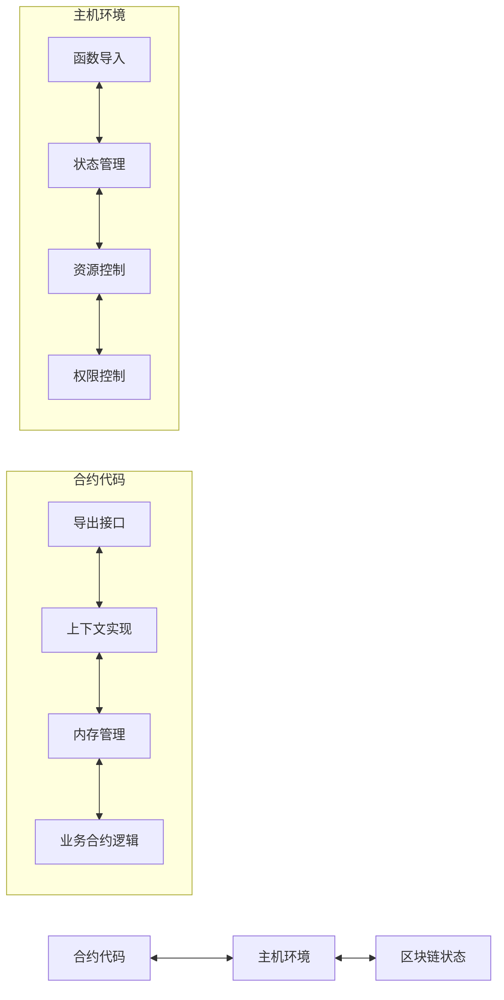
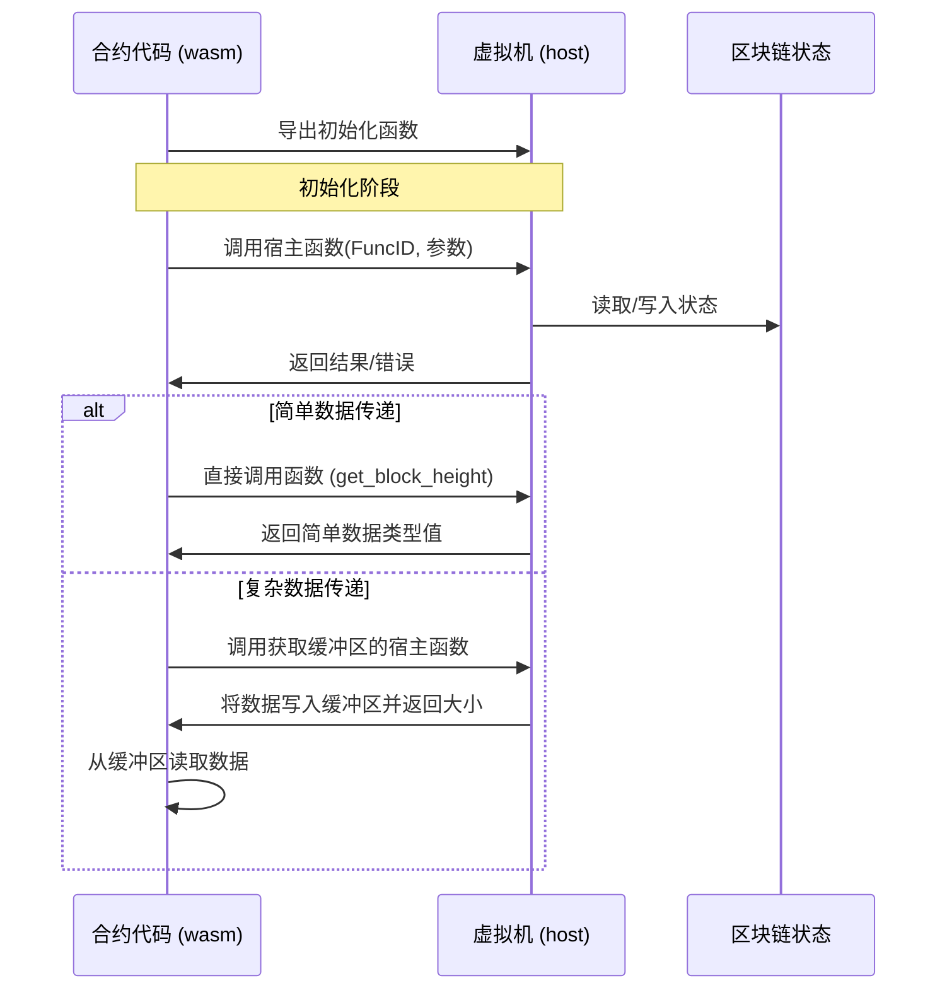

# WebAssembly 智能合约接口系统

本文档详细介绍了 VM 项目中 WebAssembly 智能合约接口系统的设计和实现。该系统通过 wasm/contract.go 和 host/main.go 组件实现了合约代码与区块链环境之间的通信桥梁。

## 1. 系统架构概述

WebAssembly 智能合约接口系统采用双向通信架构，包含两个主要组件：



- **合约侧接口 (compiler/wasm/contract.go)**: 提供面向合约开发者的 API，实现 Context 和 Object 接口
- **主机侧接口 (wasi/wazero_engine.go)**: 实现合约调用的宿主函数，管理状态和资源

## 2. 合约侧接口详解

合约侧接口在 compiler/wasm/contract.go 中实现，作为合约代码与主机环境之间的桥梁。

### 2.1 导出函数

WebAssembly合约有两类函数会被导出：

#### 2.1.1 基础必需的导出函数

这些函数是与WebAssembly运行时交互所必需的基础函数，每个wasi都必须实现，由框架统一提供：

```go
//export allocate
func allocate(size int32) int32 {
    // 内存分配函数 - 供主机环境请求分配内存时使用
    buffer := make([]byte, size)
    return int32(uintptr(unsafe.Pointer(&buffer[0])))
}

//export deallocate
func deallocate(ptr int32, size int32) {
    // 内存释放函数 (由Go垃圾收集器管理)
    // 在WebAssembly中，这个函数可能是空实现
}

//export handle_contract_call
func handle_contract_call(funcNamePtr, funcNameLen, paramsPtr, paramsLen int32) int32{
}
```

注意：这些系统基础函数仍需使用 `//export` 注释标记，因为它们是框架内部使用的特殊函数。

#### 2.1.2 合约自定义的对外函数

这些函数是合约自身的业务逻辑函数，由开发者根据需求定义：

```go
// 公开函数 - 自动导出
func Hello() int32 {
    core.Log("hello", "world")
    return 1
}

// 公开函数 - 自动导出
func ProcessData(dataPtr int32, dataLen int32) int32 {
    // 业务逻辑处理
    return 1
}

// 公开函数 - 自动导出
func TransferToken(to core.Address, amount int64) int32 {
    // 转账示例函数
    // ...
}

// 私有函数 - 不导出
func verifyTransaction(from, to Address, amount int64) bool {
    // 验证逻辑
    return true
}
```

合约的对外函数由开发者自行定义，这些函数构成了合约的公共API，可以被区块链交易调用。系统会自动识别所有大写字母开头的函数作为导出函数，无需开发者手动添加 `//export` 标记。导出规则遵循Go语言的公共/私有规范：
- 大写字母开头的函数自动被视为公开函数，会被导出供外部调用
- 小写字母开头的函数为私有函数，只能在合约内部使用

### 2.2 核心常量与宿主函数

合约使用一系列预定义的函数ID与主机环境通信：

```go
// 函数ID常量定义
const (
    FuncGetSender          int32 = iota + 1 // 1
    FuncGetBlockHeight                      // 2
    FuncGetBlockTime                        // 3
    FuncGetContractAddress                  // 4
    FuncGetBalance                          // 5
    FuncTransfer                            // 6
    FuncCreateObject                        // 7
    FuncCall                                // 8
    FuncGetObject                           // 9
    // ...其他函数ID
)
```

通过两种主要的宿主函数调用模式与主机环境通信：

```go
//export call_host_set
func call_host_set(funcID, argPtr, argLen int32) int64

//export call_host_get_buffer
func call_host_get_buffer(funcID, argPtr, argLen int32) int32

//export get_block_height
func get_block_height() int64

//export get_block_time
func get_block_time() int64

//export get_balance
func get_balance(addrPtr int32) uint64
```

### 2.3 内存管理机制

合约代码采用统一的缓冲区管理方案：

主要内存操作函数：

```go
// 从内存读取数据
func readMemory(ptr, size int32) []byte {
    // 安全地从指定内存位置读取数据
}

// 写入数据到内存
func writeToMemory(data interface{}) (ptr int32, size int32) {
    // 将数据序列化并写入内存
}
```

### 2.4 Context 接口实现

Context 接口提供访问区块链状态和功能的标准方法：

```go
// Context 接口定义
type Context interface {
    // 区块链信息相关
    BlockHeight() uint64         // 获取当前区块高度
    BlockTime() int64            // 获取当前区块时间戳
    ContractAddress() Address    // 获取当前合约地址
    
    // 账户操作相关
    Sender() Address             // 获取交易发送者或调用合约
    Balance(addr Address) uint64 // 获取账户余额
    Transfer(from, to Address, amount uint64) error // 转账操作
    
    // 对象存储相关 - 基础状态操作使用panic而非返回error
    CreateObject() Object                     // 创建新对象，失败时panic
    GetObject(id ObjectID) (Object, error)    // 获取指定对象，可能返回error
    GetObjectWithOwner(owner Address) (Object, error) // 按所有者获取对象，可能返回error
    DeleteObject(id ObjectID)                 // 删除对象，失败时panic
    
    // 跨合约调用
    Call(contract Address, function string, args ...any) ([]byte, error)
    
    // 日志与事件
    Log(eventName string, keyValues ...interface{}) // 记录事件
}
```

在合约代码中，开发者可以通过 `core` 包提供的全局函数访问这些功能：

```go
// 区块链信息相关
func BlockHeight() uint64 {
    return ctx.BlockHeight()
}

func BlockTime() int64 {
    return ctx.BlockTime()
}

func ContractAddress() Address {
    return ctx.ContractAddress()
}

// 账户操作相关
func Sender() Address {
    return ctx.Sender()
}

func Balance(addr Address) uint64 {
    return ctx.Balance(addr)
}

// 转账操作
func Receive(amount uint64) error {
    return ctx.Transfer(ctx.Sender(), ctx.ContractAddress(), amount)
}

func TransferTo(to Address, amount uint64) error {
    return ctx.Transfer(ctx.ContractAddress(), to, amount)
}

// 对象存储相关
func CreateObject() Object {
    return ctx.CreateObject()
}

func GetObject(id ObjectID) (Object, error) {
    return ctx.GetObject(id)
}

func GetObjectWithOwner(owner Address) (Object, error) {
    return ctx.GetObjectWithOwner(owner)
}

func DeleteObject(id ObjectID) {
    ctx.DeleteObject(id)
}

// 跨合约调用
func Call(contract Address, function string, args ...any) ([]byte, error) {
    return ctx.Call(contract, function, args...)
}

// 日志与事件
func Log(eventName string, keyValues ...interface{}) {
    ctx.Log(eventName, keyValues...)
}
```

### 2.5 Object 接口实现

Object 接口提供统一的对象状态管理能力：

```go
// Object 接口定义
type Object interface {
    // 元数据方法
    ID() ObjectID                    // 获取对象唯一ID
    Owner() Address                  // 获取所有者地址
    Contract() Address               // 获取所属合约地址
    SetOwner(addr Address)           // 设置所有者地址，失败时panic
    
    // 状态访问方法
    Get(field string, value any) error    // 获取指定字段值
    Set(field string, value any) error    // 设置指定字段值
}
```

## 3. 主机侧接口详解

主机侧接口在 context/memory/context.go 和 context/db/context.go 中实现，负责处理合约的请求并提供资源控制。

### 3.1 状态管理

主机环境维护一个包含区块链状态的结构：

```go
// Context 实现了区块链上下文
type Context struct {
    // 区块信息
    blockHeight uint64
    blockTime   int64
    blockHash   core.Hash

    // 交易信息
    txHash core.Hash
    sender core.Address
    to     core.Address
    value  uint64
    nonce  uint64

    // 合约信息
    contractAddr core.Address
    gasLimit     int64
    usedGas      int64

    // 状态存储
    objects map[core.ObjectID]*Object
    balances map[core.Address]uint64
}
```

### 3.2 BlockchainContext 接口

主机环境实现了 BlockchainContext 接口，提供区块链状态管理功能：

```go
// BlockchainContext 接口定义
type BlockchainContext interface {
    // 设置区块和交易信息
    SetBlockInfo(height uint64, time int64, hash core.Hash)
    SetTransactionInfo(hash core.Hash, from, to core.Address, value uint64, nonce uint64)
    
    // 区块链信息相关
    BlockHeight() uint64      // 获取当前区块高度
    BlockTime() int64         // 获取当前区块时间戳
    ContractAddress() core.Address // 获取当前合约地址
    TransactionHash() core.Hash    // 获取当前交易哈希
    SetGasLimit(limit int64)  // 设置gas限制
    GetGas() int64            // 获取已使用gas
    
    // 账户操作相关
    Sender() core.Address                                          // 获取交易发送者
    Balance(addr core.Address) uint64                              // 获取账户余额
    Transfer(contract, from, to core.Address, amount uint64) error // 转账操作

    // 对象存储相关
    CreateObject(contract core.Address) (core.Object, error)                      // 创建新对象
    CreateObjectWithID(contract core.Address, id core.ObjectID) (core.Object, error)   // 创建新对象
    GetObject(contract core.Address, id core.ObjectID) (core.Object, error)            // 获取指定对象
    GetObjectWithOwner(contract core.Address, owner core.Address) (core.Object, error) // 按所有者获取对象
    DeleteObject(contract core.Address, id core.ObjectID) error                     // 删除对象

    // 跨合约调用
    Call(caller core.Address, contract core.Address, function string, args ...any) ([]byte, error)

    // 日志与事件
    Log(contract core.Address, eventName string, keyValues ...any) // 记录事件
}
```

### 3.3 Object 接口

主机环境实现了 Object 接口，提供对象状态管理功能：

```go
// Object 接口定义
type Object interface {
    ID() core.ObjectID                                  // 获取对象ID
    Owner() core.Address                                // 获取对象所有者
    Contract() core.Address                             // 获取对象所属合约
    SetOwner(contract, sender, addr core.Address) error // 设置对象所有者

    // 字段操作
    Get(contract core.Address, field string) ([]byte, error)             // 获取字段值
    Set(contract, sender core.Address, field string, value []byte) error // 设置字段值
}
```

### 3.4 导入函数实现

主机环境为合约提供两种主要的导入函数处理器：

```go
// 处理设置类操作的函数
func (vm *WazeroVM) handleHostSet(ctx types.BlockchainContext, m api.Module, funcID uint32, argData []byte, bufferPtr uint32) int32 {
    // 处理不需要返回复杂数据的操作
    switch types.WasmFunctionID(funcID) {
    case types.FuncTransfer:
        // 处理转账
    case types.FuncCall:
        // 处理合约调用
    case types.FuncDeleteObject:
        // 处理对象删除
    case types.FuncLog:
        // 处理日志记录
    case types.FuncSetObjectOwner:
        // 处理设置对象所有者
    case types.FuncSetObjectField:
        // 处理设置对象字段
    }
}

// 处理获取缓冲区数据的函数
func (vm *WazeroVM) handleHostGetBuffer(ctx types.BlockchainContext, m api.Module, funcID uint32, argData []byte, offset uint32) int32 {
    // 处理需要返回复杂数据的操作
    switch types.WasmFunctionID(funcID) {
    case types.FuncGetSender:
        // 获取发送者
    case types.FuncGetContractAddress:
        // 获取合约地址
    case types.FuncCreateObject:
        // 创建对象
    case types.FuncGetObjectField:
        // 获取对象字段
    case types.FuncGetObject:
        // 获取对象
    case types.FuncGetObjectWithOwner:
        // 获取所有者对象
    case types.FuncGetObjectOwner:
        // 获取对象所有者
    }
}
```

## 4. 通信流程

合约代码与主机环境之间的通信遵循以下流程：



### 4.1 参数传递

合约与主机环境之间参数传递采用以下方式：

1. **简单类型参数**：直接通过函数参数传递
2. **复杂类型参数**：
   - 序列化为二进制数据
   - 通过内存指针和长度传递

### 4.2 错误处理

错误处理机制包括：

- 返回值状态码表示成功/失败
- 通过缓冲区返回详细错误信息
- 主机函数检查参数有效性和内存安全

### 4.3 函数ID常量

系统使用预定义的函数ID常量来标识不同的操作：

```go
// WasmFunctionID 定义了主机与合约通信中使用的函数ID常量
type WasmFunctionID int32

const (
    // FuncGetSender 返回当前交易的发送者地址
    FuncGetSender WasmFunctionID = iota + 1 // 1
    // FuncGetContractAddress 返回当前合约地址
    FuncGetContractAddress // 2
    // FuncTransfer 从合约向接收者转移代币
    FuncTransfer // 3
    // FuncCreateObject 创建新的状态对象
    FuncCreateObject // 4
    // FuncCall 调用另一个合约的函数
    FuncCall // 5
    // FuncGetObject 通过ID获取状态对象
    FuncGetObject // 6
    // FuncGetObjectWithOwner 获取特定地址拥有的对象
    FuncGetObjectWithOwner // 7
    // FuncDeleteObject 移除状态对象
    FuncDeleteObject // 8
    // FuncLog 向区块链的事件系统记录消息
    FuncLog // 9
    // FuncGetObjectOwner 获取状态对象的所有者
    FuncGetObjectOwner // 10
    // FuncSetObjectOwner 更改状态对象的所有者
    FuncSetObjectOwner // 11
    // FuncGetObjectField 从状态对象获取特定字段
    FuncGetObjectField // 12
    // FuncSetObjectField 更新状态对象中的特定字段
    FuncSetObjectField // 13
    // FuncGetObjectContract 获取状态对象的合约
    FuncGetObjectContract // 14
)
```

### 4.4 参数结构体

系统使用预定义的结构体来传递复杂参数：

```go
// TransferParams 转账参数
type TransferParams struct {
    Contract Address `json:"contract,omitempty"`
    From     Address `json:"from,omitempty"`
    To       Address `json:"to,omitempty"`
    Amount   uint64  `json:"amount,omitempty"`
}

// CallParams 合约调用参数
type CallParams struct {
    Caller   Address `json:"caller,omitempty"`
    Contract Address `json:"contract,omitempty"`
    Function string  `json:"function,omitempty"`
    Args     []any   `json:"args,omitempty"`
    GasLimit int64   `json:"gas_limit,omitempty"`
}

// CallResult 合约调用结果
type CallResult struct {
    Data    []byte `json:"data,omitempty"`
    GasUsed int64  `json:"gas_used,omitempty"`
}

// GetObjectParams 获取对象参数
type GetObjectParams struct {
    Contract Address  `json:"contract,omitempty"`
    ID       ObjectID `json:"id,omitempty"`
}

// GetObjectWithOwnerParams 按所有者获取对象参数
type GetObjectWithOwnerParams struct {
    Contract Address `json:"contract,omitempty"`
    Owner    Address `json:"owner,omitempty"`
}

// GetObjectFieldParams 获取对象字段参数
type GetObjectFieldParams struct {
    Contract Address  `json:"contract,omitempty"`
    ID       ObjectID `json:"id,omitempty"`
    Field    string   `json:"field,omitempty"`
}

// DeleteObjectParams 删除对象参数
type DeleteObjectParams struct {
    Contract Address  `json:"contract,omitempty"`
    ID       ObjectID `json:"id,omitempty"`
}

// SetOwnerParams 设置所有者参数
type SetOwnerParams struct {
    Contract Address  `json:"contract,omitempty"`
    Sender   Address  `json:"sender,omitempty"`
    ID       ObjectID `json:"id,omitempty"`
    Owner    Address  `json:"owner,omitempty"`
}

// SetObjectFieldParams 设置对象字段参数
type SetObjectFieldParams struct {
    Contract Address  `json:"contract,omitempty"`
    Sender   Address  `json:"sender,omitempty"`
    ID       ObjectID `json:"id,omitempty"`
    Field    string   `json:"field,omitempty"`
    Value    any      `json:"value,omitempty"`
}

// ExecutionResult 执行结果
type ExecutionResult struct {
    Success bool   `json:"success"`
    Data    any    `json:"data,omitempty"`
    Error   string `json:"error,omitempty"`
}

// LogParams 日志参数
type LogParams struct {
    Contract  Address `json:"contract,omitempty"`
    Event     string  `json:"event,omitempty"`
    KeyValues []any   `json:"key_values,omitempty"`
}

// HandleContractCallParams 处理合约调用参数
type HandleContractCallParams struct {
    Contract Address `json:"contract,omitempty"`
    Sender   Address `json:"sender,omitempty"`
    Function string  `json:"function,omitempty"`
    Args     []byte  `json:"args,omitempty"`
    GasLimit int64   `json:"gas_limit,omitempty"`
}
```

### 4.5 缓冲区大小

系统使用固定大小的缓冲区进行数据交换：

```go
// HostBufferSize 定义了主机与合约之间数据交换的缓冲区大小
const HostBufferSize int32 = 2048
```

### 4.6 类型定义

系统使用以下基本类型：

```go
// Address 表示区块链上的地址
type Address [20]byte

// ObjectID 表示状态对象的唯一标识符
type ObjectID [32]byte

// Hash 表示哈希值
type Hash [32]byte
```

这些类型提供了字符串转换方法：

```go
func (id ObjectID) String() string {
    return hex.EncodeToString(id[:])
}

func (addr Address) String() string {
    return hex.EncodeToString(addr[:])
}

func (h Hash) String() string {
    return hex.EncodeToString(h[:])
}

func HashFromString(str string) Hash {
    str = strings.TrimPrefix(str, "0x")
    h, err := hex.DecodeString(str)
    if err != nil {
        return Hash{}
    }
    var out Hash
    copy(out[:], h)
    return out
}
```

## 5. Gas计费机制

WebAssembly智能合约使用精确的Gas计费机制来控制资源消耗，确保合约执行的安全和可预测性。

### 5.1 计费原理

Gas计费系统采用双重计费策略：

#### 5.1.1 代码行计费

在合约编译过程中，系统会自动分析Go代码的控制流结构，并在适当位置注入Gas消耗代码：

```go
// 原始合约代码
func TransferToken(to Address, amount uint64) error {
    if amount <= 0 {
        return errors.New("amount must be positive")
    }
    
    sender := core.Sender()
    return core.TransferTo(to, amount)
}

// 注入Gas计费后的代码
func TransferToken(to Address, amount uint64) error {
    mock.ConsumeGas(1)  // 消耗当前语句的gas
    if amount <= 0 {
        mock.ConsumeGas(1)  // if块内的语句消耗
        return errors.New("amount must be positive")
    }
    
    mock.ConsumeGas(2)  // 后续两行代码消耗
    sender := core.Sender()
    return core.TransferTo(to, amount)
}
```

系统会识别基本代码块，并在每个块的开始处注入相应的Gas消耗代码。

#### 5.1.2 接口调用计费

除了基本的代码行计费外，所有Context和Object接口的调用都会消耗额外的Gas：

```go
// Context接口计费示例
func (c *Context) Sender() Address {
    mock.ConsumeGas(10)  // Sender操作固定消耗10 gas
    // ... 实际逻辑 ...
}

func (c *Context) Transfer(from, to Address, amount uint64) error {
    mock.ConsumeGas(500)  // Transfer操作固定消耗500 gas
    // ... 实际逻辑 ...
}

// Object接口计费示例
func (o *Object) Set(field string, value any) error {
    mock.ConsumeGas(1000)  // Set基础操作消耗1000 gas
    // ... 序列化 ...
    bytes, err := any2bytes(request)
    // ... 
    mock.ConsumeGas(int64(len(bytes)) * 100)  // 根据数据大小额外计费
    // ... 实际逻辑 ...
}
```

### 5.2 Gas消耗值

Context和Object接口的标准Gas消耗值：

| 接口 | 操作 | Gas消耗 |
|-----|-----|---------|
| **Context** | Sender() | 10 gas |
| | BlockHeight() | 10 gas |
| | BlockTime() | 10 gas |
| | ContractAddress() | 10 gas |
| | Balance(addr) | 50 gas |
| | Transfer(from, to, amount) | 500 gas |
| | Call(contract, function, args...) | 10000 gas + 被调用合约消耗 |
| | CreateObject() | 50 gas |
| | GetObject(id) | 50 gas |
| | GetObjectWithOwner(owner) | 50 gas |
| | DeleteObject(id) | 500 gas |
| | Log(event, keyValues...) | 100 gas + 数据长度 |
| **Object** | ID() | 10 gas |
| | Contract() | 100 gas |
| | Owner() | 100 gas |
| | SetOwner(addr) | 500 gas |
| | Get(field, value) | 100 gas + 结果数据大小 |
| | Set(field, value) | 1000 gas + 数据大小 * 100 gas |

### 5.3 特殊计费规则

某些操作有特殊的计费规则：

#### 5.3.1 合约调用Gas预留

当使用`Call`方法调用其他合约时，系统会预留10000 gas作为基本调用费用，并将剩余gas分配给被调用合约：

```go
// Call方法的Gas处理
func (c *Context) Call(contract Address, function string, args ...any) ([]byte, error) {
    // 预留基本调用费用
    mock.ConsumeGas(10000)
    
    // 构造调用参数，分配剩余gas给被调用合约
    callData := types.CallParams{
        Contract: contract,
        Function: function,
        Args:     args,
        Caller:   c.ContractAddress(),
        GasLimit: mock.GetGas(), // 分配剩余的gas
    }
    
    // ... 调用逻辑 ...
    
    // 实际消耗 = 10000 (基本费用) + 被调用合约实际消耗
    return result, nil
}
```

#### 5.3.2 数据大小相关计费

对于涉及数据处理的操作，额外的Gas消耗与数据大小相关：

- **Object.Set()**: 基础消耗1000 gas + 数据大小 * 100 gas
- **Object.Get()**: 基础消耗100 gas + 结果数据大小 gas
- **Context.Log()**: 基础消耗100 gas + 日志数据长度 gas

### 5.4 Gas控制API

合约可以通过mock包提供的Gas控制API进行Gas管理：

```go
import "github.com/govm-net/vm/mock"

// 初始化Gas（通常由系统自动调用）
mock.InitGas(1000000)

// 获取当前剩余Gas
remainingGas := mock.GetGas()

// 获取已使用Gas
usedGas := mock.GetUsedGas()

// 手动消耗Gas（通常由自动注入的代码调用）
mock.ConsumeGas(100)

// 退还Gas（特定场景如删除存储时使用）
mock.RefundGas(50)

// 重置Gas计数（通常由系统在合约调用开始时调用）
mock.ResetGas(500000)
```

## 6. 接口扩展

系统提供了多种扩展接口，以满足不同业务需求：

### 6.1 日志与事件

系统提供了日志与事件接口，用于记录合约执行过程中的关键事件：

```go
// 日志接口定义
type Logger interface {
    Log(eventName string, keyValues ...interface{})
}

// 日志实现
func (c *Context) Log(eventName string, keyValues ...interface{}) {
    // 调用日志接口记录事件
}
```

### 6.2 跨合约调用

系统提供了跨合约调用接口，允许合约之间进行安全的交互：

```go
// 跨合约调用接口定义
type Caller interface {
    Call(contract Address, function string, args ...any) ([]byte, error)
}

// 跨合约调用实现
func (c *Context) Call(contract Address, function string, args ...any) ([]byte, error) {
    // 调用跨合约调用接口
}
```


## 7. 总结

WebAssembly智能合约接口系统为Go语言编写的智能合约提供了高效、安全的执行环境。通过精心设计的通信接口，合约代码能够安全地访问区块链状态和功能，同时主机环境保持对资源使用的严格控制。

这种设计实现了以下目标：
- 安全的合约执行环境
- 高效的状态访问和操作
- 灵活的对象模型
- 可控的资源使用
- 强大的跨合约调用能力

系统的模块化设计使其易于扩展和适应不同的区块链环境，同时保持核心接口的稳定性，为智能合约开发者提供一致的开发体验。
