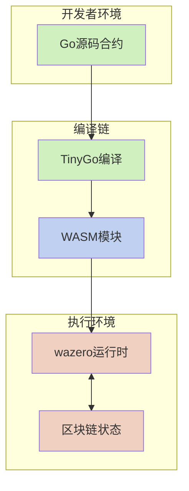

# WebAssembly 智能合约系统

本文档是 VM 项目 WebAssembly (WASM) 智能合约系统的主入口点，提供了对系统架构、核心组件和详细文档的整体导航。

## 1. 系统概述

VM 项目的 WebAssembly 智能合约系统允许开发者使用 Go 语言编写智能合约，并通过 TinyGo 编译为 WebAssembly 模块在沙箱环境中执行。该系统具有高安全性、接近原生的性能、良好的跨平台兼容性和精确的资源控制能力。



## 2. 文档导航

本系统文档按照从基础到高级的顺序组织，覆盖了合约开发、编译、部署和执行的完整生命周期：

1. **[基础接口系统](wasm_contract_interface.md)** - 介绍合约代码与区块链环境之间的通信桥梁
   * 合约侧接口 (Context, Object)
   * 主机侧接口
   * 内存管理机制
   * 系统调用分类

2. **[合约执行流程](wasm_contract_execution.md)** - 详细说明从编译到执行的完整生命周期
   * 编译流程
   * 部署流程
   * 执行流程
   * 参数传递
   * 资源控制

3. **[WASI合约详解](wasi_contracts.md)** - 深入探讨基于WASI规范的合约模式
   * 合约示例
   * 编译到WebAssembly的内部流程
   * WebAssembly优势
   * 配置与使用
   * 最佳实践

## 3. 核心概念统一

为解决文档间的概念冲突和不一致，以下是核心概念的规范定义：

### 3.1 接口体系

系统提供了一套统一的接口体系，主要包括：

```go
// 核心包函数 - 提供访问区块链状态和功能的标准方法
package core

// 区块链信息相关
func BlockHeight() uint64         // 获取当前区块高度
func BlockTime() int64            // 获取当前区块时间戳
func ContractAddress() Address    // 获取当前合约地址

// 账户操作相关
func Sender() Address             // 获取交易发送者或调用合约
func Balance(addr Address) uint64 // 获取账户余额
func Receive(amount uint64) error // 从发送者接收代币到合约
func TransferTo(to Address, amount uint64) error // 从合约转账到指定地址

// 对象存储相关 - 基础状态操作使用panic而非返回error
func CreateObject() Object                    // 创建新对象，失败时panic
func GetObject(id ObjectID) (Object, error)   // 获取指定对象，可能返回error
func GetObjectWithOwner(owner Address) (Object, error) // 按所有者获取对象，可能返回error
func DeleteObject(id ObjectID)                // 删除对象，失败时panic

// 跨合约调用
func Call(contract Address, function string, args ...any) ([]byte, error)

// 日志与事件
func Log(eventName string, keyValues ...interface{}) // 记录事件

// 辅助函数
func Assert(condition any) // 断言条件为真，否则panic
func Error(msg string) error // 创建错误
func GetHash(data []byte) Hash // 计算数据哈希
func IDFromString(str string) ObjectID // 从字符串创建对象ID
func AddressFromString(str string) Address // 从字符串创建地址
func HashFromString(str string) Hash // 从字符串创建哈希

// Object接口 - 提供状态对象的操作方法
type Object interface {
    ID() ObjectID           // 获取对象ID
    Owner() Address         // 获取对象所有者
    Contract() Address      // 获取对象所属合约
    SetOwner(addr Address)  // 设置对象所有者，失败时panic
    
    // 字段操作
    Get(field string, value any) error  // 获取字段值
    Set(field string, value any) error  // 设置字段值
}
```

### 3.2 统一的内存管理模型

本系统采用以下内存管理策略，在所有相关文档中保持一致：

- 为减少内存压力，合约代码应尽量重用缓冲区而非频繁分配内存
- WebAssembly 模块限制最大内存使用（默认上限为 128 MB）
- 内存管理包括 WebAssembly 线性内存和共享的主机缓冲区两部分

### 3.3 参数传递统一机制

为统一不同文档描述的参数传递机制，系统采用类似Go标准库RPC的工作流程：

1. **基于RPC模型的参数结构体**：
   - 自动为每个导出函数生成对应的参数结构体
   - 参数结构体包含Call Info用于传递调用链信息
   - 字段名称与原始参数名称一致

2. **自动化参数处理**：
   - 在合约编译阶段自动生成参数序列化/反序列化代码
   - 使用函数分发表实现高效调用路由
   - 支持丰富的错误处理和类型安全措施

3. **类型安全的序列化**：
   - 使用类型注册表确保类型信息保留
   - 避免JSON反序列化的数值类型问题（如将整数转为float64）
   - 支持复杂嵌套结构体的类型安全处理

```go
// 导出函数示例 - 使用大写字母开头即可，无需//export标记
func Transfer(to Address, amount uint64) error {
    // 函数实现...
}

// 自动生成的参数结构体
type TransferParams struct {
    CallInfo *CallInfo `json:"call_info"` // 自动注入的调用链信息
    To       Address   `json:"to"`        // 参数1
    Amount   uint64    `json:"amount"`    // 参数2
}

// 自动生成的方法处理器
func handleTransfer(paramsJSON []byte) int32 {
    var params TransferParams
    if err := json.Unmarshal(paramsJSON, &params); err != nil {
        // 错误处理...
        return ErrorCodeInvalidParams
    }
    
    // 设置调用上下文
    setCurrentCallInfo(params.CallInfo)
    
    // 调用实际函数
    err := Transfer(params.To, params.Amount)
    
    // 处理返回值...
}
```

这种基于Go RPC模型的参数处理机制提供了多项优势：
- 开发者只需使用标准Go函数命名规范（大写开头的函数自动导出），无需添加特殊注释
- 系统自动识别并导出所有大写开头的函数，简化开发流程
- 类型安全由系统保证，避免常见的JSON类型转换问题
- 参数验证和错误处理统一规范

### 3.4 函数导出规则简化

系统采用了Go语言规范的公共/私有标识方法，简化了合约函数的导出机制：

1. **自动导出规则**：
   - 大写字母开头的函数自动被视为导出函数，可被外部调用
   - 小写字母开头的函数为私有函数，仅合约内部可访问
   - 无需添加特殊的 `//export` 注释标记

2. **框架自动包装**：
   - 编译系统自动识别所有大写开头的函数
   - 为每个导出函数生成必要的包装代码
   - 自动注册函数，使其可被主机环境调用

3. **优势**：
   - 更符合Go语言习惯
   - 减少样板代码
   - 避免导出标记与实际导出不一致的问题
   - 简化合约开发流程

示例：
```go
// 公开函数 - 自动导出，外部可调用
func Transfer(to Address, amount uint64) error {
    return performTransfer(to, amount)
}

// 私有函数 - 不导出，仅内部使用
func performTransfer(to Address, amount uint64) error {
    // 实现转账逻辑...
}
```

### 3.5 错误处理统一框架

系统采用统一的错误处理模式：

- 合约内部使用 Go 的 error 类型返回错误
- 跨合约调用返回标准错误码和详细错误信息
- 所有错误信息可通过 Context.Log 记录
- 异常状态通过特定的返回值（通常为负数）表示

### 3.6 Gas 计费机制

系统采用双重计费策略，确保资源使用的公平性和可预测性：

1. **基于代码行数的计费**：
   - 每行代码执行消耗 1 gas
   - 自动在编译时注入计费代码

2. **基于接口调用的计费**：
   - 不同接口操作有不同的 gas 消耗值
   - 标准操作有固定的 gas 消耗

```go
// 标准 Gas 消耗值
| 操作类型 | Gas 消耗 | 说明 |
|---------|----------|------|
| 代码行执行 | 1 | 每行代码基础消耗 |
| Balance 查询 | 10 | 账户余额查询 |
| Transfer 转账 | 20 | 代币转账操作 |
| CreateObject | 30 | 创建新对象 |
| GetObject | 10 | 获取对象 |
| DeleteObject | 15 | 删除对象 |
| Call 跨合约调用 | 50 | 基础调用消耗 |
| Log 事件记录 | 5 | 记录事件 |
```

3. **特殊计费规则**：
   - 跨合约调用：基础消耗 + 参数大小相关消耗
   - 数据大小相关操作：基础消耗 + 数据大小相关消耗

4. **Gas 控制 API**：
   - 获取剩余 gas
   - 预估操作消耗
   - 检查是否有足够 gas
   - 执行操作前消耗预估 gas
