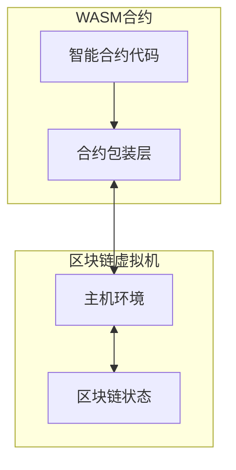

# WebAssembly 智能合约包装层

本目录包含用于开发基于WebAssembly的智能合约的包装层代码。该包装层提供了合约代码与主机环境（区块链虚拟机）之间的通信桥梁，使开发者能够方便地编写、测试和部署智能合约。

## 目录结构

```
wasm/
├── contract.go           # 核心包装层，提供与主机环境的通信接口
├── counter_contract.go   # 计数器合约示例
├── token_contract.go     # 代币合约示例
└── README.md             # 使用说明文档
```

## 包装层架构

包装层实现了区块链智能合约的标准接口，并提供了与主机环境通信的机制：



## 核心组件

包装层的核心组件包括：

1. **基本类型定义**：`Address`, `ObjectID` 等区块链基本类型
2. **Context 接口实现**：提供区块链环境信息和操作方法
3. **Object 接口实现**：提供状态对象的操作方法
4. **内存管理函数**：处理WebAssembly内存分配和数据传递
5. **主机函数调用**：包装主机环境提供的函数，处理调用参数和返回值

## 智能合约开发指南

### 1. 创建新合约

合约代码必须使用 `package main`，并包含一个空的 `main()` 函数：

```go
package main

import (
    // 导入必要的包
)

// WebAssembly要求的main函数
func main() {
    // 此函数在WebAssembly中不会被执行
}
```

### 2. 定义导出函数

所有大写字母开头的函数将被自动导出，可以在区块链上调用：

```go
// 初始化函数 - 将在合约部署时自动调用
func Initialize() int32 {
    // 初始化合约状态
    return 0
}

// 公开的业务函数
func Transfer(to Address, amount uint64) bool {
    // 实现转账逻辑
    return true
}
```

### 3. 使用Context接口

所有合约函数可以通过创建 `Context` 实例来访问区块链环境：

```go
func MyFunction() {
    ctx := &Context{}
    
    // 获取区块链信息
    height := ctx.BlockHeight()
    sender := ctx.Sender()
    
    // 记录日志
    ctx.Log("my_event", "height", height, "sender", sender)
}
```

### 4. 管理状态对象

使用 `Object` 接口管理状态数据：

```go
func StoreData(key string, value uint64) bool {
    ctx := &Context{}
    
    // 创建或获取对象
    obj := ctx.CreateObject()
    
    // 设置所有者
    obj.SetOwner(ctx.ContractAddress())
    
    // 存储数据
    err := obj.Set(key, value)
    if err != nil {
        return false
    }
    
    return true
}
```

### 5. 跨合约调用

可以使用 `Call` 方法调用其他合约的函数：

```go
func CallOtherContract(contractAddr Address) {
    ctx := &Context{}
    
    // 调用其他合约的函数
    result, err := ctx.Call(contractAddr, "SomeFunction", arg1, arg2)
    if err != nil {
        // 处理错误
    }
    
    // 处理结果
}
```

## 编译与部署

### 编译合约

使用TinyGo编译合约为WebAssembly模块：

```bash
tinygo build -o contract.wasm -target=wasi -opt=z -no-debug -gc=leaking ./my_contract.go
```

编译选项说明：
- `-target=wasi`: 指定编译目标为WebAssembly系统接口
- `-opt=z`: 优化输出大小
- `-no-debug`: 移除调试信息
- `-gc=leaking`: 使用简化的垃圾收集器，提高性能

### 部署合约

通过区块链的接口部署编译好的WebAssembly合约。

## 示例合约

### 计数器合约

`counter_contract.go` 实现了一个简单的计数器合约，包括：
- 初始化计数器
- 增加计数器值
- 获取当前计数器值
- 重置计数器

### 令牌合约

`token_contract.go` 实现了标准的ERC20风格令牌合约，包括：
- 初始化令牌信息
- 查询余额
- 转账
- 铸造令牌
- 销毁令牌

## 最佳实践

1. **内存管理**：避免过多的内存分配，尽量重用缓冲区
2. **错误处理**：总是检查返回的错误，并提供有意义的日志信息
3. **安全检查**：验证调用权限和参数有效性
4. **日志记录**：为重要操作记录事件，便于后续追踪
5. **类型安全**：使用明确的类型转换，避免类型问题

## 参考资料

- [WebAssembly官方文档](https://webassembly.org/)
- [TinyGo文档](https://tinygo.org/)
- [智能合约设计模式](https://ethereum.org/en/developers/docs/smart-contracts/anatomy/) 