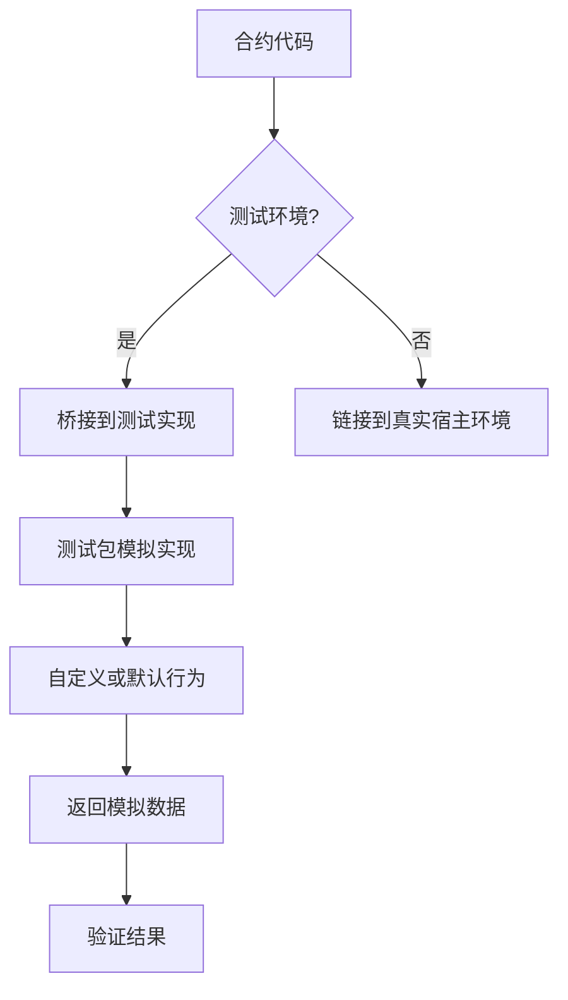

# WebAssembly 宿主函数测试框架

该测试框架提供了一种在 Go 测试环境中模拟和测试 WebAssembly 宿主函数的方法。

## 问题背景

在 WebAssembly (Wasm) 合约中，通常会声明导出函数（使用 `//export` 注释），这些函数在实际的 Wasm 环境中由宿主环境提供实现。在 Go 代码中，这些函数只有声明而没有实现，例如：

```go
//export call_host_set
func call_host_set(funcID, argPtr, argLen int32) int64
```

这使得在单元测试中直接调用这些函数会失败，因为它们没有具体实现。

## 解决方案

该测试框架通过以下方式解决这个问题：

1. 提供一套模拟实现，用于在测试环境中替代宿主环境
2. 使用桥接模式将测试中的调用重定向到模拟实现
3. 允许自定义模拟行为以测试不同场景

## 使用方法

### 1. 在你的项目中导入测试包

```go
import wasmtest "github.com/govm-net/vm/wasm/testing"
```

### 2. 创建桥接文件

在你的合约包中创建一个名为 `bridge_test.go` 的文件，内容如下：

```go
//go:build test
// +build test

package main

import (
    wasmtest "github.com/govm-net/vm/wasm/testing"
)

// 初始化测试环境
func init() {
    // 初始化测试环境，设置宿主缓冲区大小
    wasmtest.Init(HostBufferSize)
}

// 桥接宿主函数到测试实现

//export call_host_set
func call_host_set(funcID, argPtr, argLen int32) int64 {
    return wasmtest.GetMockHook().CallHostSet(funcID, argPtr, argLen)
}

//export call_host_get_buffer
func call_host_get_buffer(funcID, argPtr, argLen int32) int32 {
    return wasmtest.GetMockHook().CallHostGetBuffer(funcID, argPtr, argLen)
}

//export get_block_height
func get_block_height() int64 {
    return wasmtest.GetMockHook().GetBlockHeight()
}

//export get_block_time
func get_block_time() int64 {
    return wasmtest.GetMockHook().GetBlockTime()
}

//export get_balance
func get_balance(addrPtr int32) uint64 {
    return wasmtest.GetMockHook().GetBalance(addrPtr)
}
```

### 3. 编写测试

现在你可以正常编写测试，通过调用合约的 API 接口来间接测试宿主函数：

```go
func TestContextMethods(t *testing.T) {
    // 创建上下文
    ctx := &Context{}
    
    // 测试 BlockHeight - 内部会调用模拟的 get_block_height 函数
    height := ctx.BlockHeight()
    if height != uint64(wasmtest.MockBlockHeight) {
        t.Fatalf("Expected block height %d but got %d", wasmtest.MockBlockHeight, height)
    }
    
    // 其他测试...
}
```

### 4. 自定义模拟行为（可选）

如果需要测试特定的场景，可以自定义模拟实现：

```go
// 自定义模拟实现
type customMockImpl struct {
    wasmtest.MockHostFunctionHook // 匿名嵌入接口
}

// 重写特定方法
func (c *customMockImpl) GetBlockHeight() int64 {
    return 99999 // 自定义返回值
}

func TestCustomScenario(t *testing.T) {
    // 保存原始钩子
    originalHook := wasmtest.GetMockHook()
    defer wasmtest.SetMockHook(originalHook) // 测试完成后恢复
    
    // 设置自定义实现
    customMock := &customMockImpl{}
    wasmtest.SetMockHook(customMock)
    
    // 执行测试...
}
```

## 注意事项

1. 桥接文件使用 `//go:build test` 构建标签限制只在测试时使用
2. 宿主函数的模拟实现会记录调用信息，可用于验证正确的函数被调用
3. 模拟数据（地址、高度等）可通过修改测试包中的公共变量进行自定义

## 流程图

